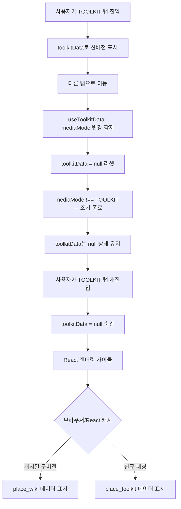

# 스마트 툴킷 간헐적 데이터 변경 - 최종 수정 계획

**날짜**: 2026-04-06  
**우선순위**: 🔥 긴급  
**상태**: 근본 원인 확정, 수정 준비 완료

---

## 🎯 근본 원인 (확정)

### DB 상태 분석
```
📦 place_wiki.essential_guide (구버전):
  - pre_travel: 1개
  - "필리핀 eTravel (이트래블) 온라인 등록..."
  - "무료 (대행 사기 사이트 주의)"

📦 place_toolkit.essential_guide (신버전):
  - pre_travel: 2개
  - "필리핀 eTravel (이트래블) 등록..."
  - "무료 (결제를 요구하는 스캠 사이트 주의)"
  - "보라카이 통합 픽업샌딩 예약..."
```

### 문제 메커니즘



### 코드 분석 결과
- ✅ ToolkitTab: toolkitData.essential_guide만 사용, fallback 없음
- ✅ 모든 컴포넌트: wikiData와 toolkitData 완전 분리
- ⚠️ **useToolkitData.js:21**: mediaMode 변경 시 무조건 null 리셋

---

## ✅ 해결 방안

### 방안 1: useToolkitData.js 수정 (필수)

**파일**: [`src/components/PlaceCard/hooks/useToolkitData.js`](../src/components/PlaceCard/hooks/useToolkitData.js:18-67)

**수정 전 (L18-27)**:
```javascript
useEffect(() => {
  if (!placeId) return;
  
  setToolkitData(null);        // ⚠️ 매번 리셋
  setIsToolkitLoading(false);
  
  if (mediaMode !== 'TOOLKIT') {
      return;
  }
  
  // ... fetchToolkitData
}, [placeId, mediaMode]);
```

**수정 후 (방법 A - 권장)**:
```javascript
// placeId 변경 시에만 리셋
useEffect(() => {
  setToolkitData(null);
  setIsToolkitLoading(false);
}, [placeId]);

// TOOLKIT 모드일 때만 데이터 로드
useEffect(() => {
  if (!placeId || mediaMode !== 'TOOLKIT') return;
  
  let isSubscribed = true;
  
  const fetchToolkitData = async () => {
    setIsToolkitLoading(true);
    
    // ... 기존 로직
  };
  
  fetchToolkitData();
  
  return () => {
    isSubscribed = false;
  };
}, [placeId, mediaMode]);
```

**수정 후 (방법 B - 더 안전)**:
```javascript
useEffect(() => {
  if (!placeId) return;
  
  // ✅ TOOLKIT 모드가 아니면 아무것도 하지 않음 (데이터 유지)
  if (mediaMode !== 'TOOLKIT') {
    return;
  }
  
  // ✅ 이미 같은 placeId의 데이터가 있으면 재로딩 안 함
  if (toolkitDataRef.current?.place_id === placeId) {
    return;
  }
  
  let isSubscribed = true;
  
  const fetchToolkitData = async () => {
    setIsToolkitLoading(true);
    
    // ... 기존 로직
  };
  
  fetchToolkitData();
  
  return () => {
    isSubscribed = false;
  };
}, [placeId, mediaMode]);
```

---

### 방안 2: place_wiki.essential_guide 정리 (권장)

**목적**: 데이터 소스 단일화, 혼동 방지

**SQL**:
```sql
-- 보라카이만 정리
UPDATE place_wiki 
SET essential_guide = NULL 
WHERE place_id = '보라카이';

-- 또는 전체 마이그레이션 (백업 후)
UPDATE place_wiki 
SET essential_guide = NULL 
WHERE essential_guide IS NOT NULL;
```

**장점**:
- 데이터 소스 단일화 (place_toolkit만 사용)
- 향후 혼동 방지
- 디버깅 용이

**단점**:
- 백업 데이터 손실
- 롤백 필요 시 복구 어려움

**권장 순서**:
1. 먼저 **방안 1** 적용하여 코드 수정
2. 테스트 완료 후 **방안 2** 실행

---

## 📋 실행 단계

### 1단계: 코드 수정 (Code 모드)
- [ ] `useToolkitData.js` 수정 (방법 A 또는 B 선택)
- [ ] 로컬 테스트
  - 보라카이 TOOLKIT 탭 진입
  - 다른 탭 이동 (5회 반복)
  - TOOLKIT 탭 재진입 (5회 반복)
  - 매번 동일한 데이터 표시 확인 ✅
- [ ] 커밋

### 2단계: DB 정리 (선택)
- [ ] Supabase Dashboard에서 SQL 실행
  ```sql
  UPDATE place_wiki 
  SET essential_guide = NULL 
  WHERE place_id = '보라카이';
  ```
- [ ] 다시 테스트

### 3단계: 검증
- [ ] 프로덕션 테스트
- [ ] 다른 장소들도 점검
- [ ] 프로젝트 로그 업데이트

---

## 🧪 테스트 시나리오

```
1. 보라카이 장소 카드 열기
2. TOOLKIT 탭 진입
   → pre_travel 2개 확인
   → "스캠 사이트 주의" + "통합 픽업샌딩" 확인
3. GALLERY 탭으로 이동
4. WIKI 탭으로 이동
5. VIDEO 탭으로 이동
6. TOOLKIT 탭으로 재진입
   → 여전히 pre_travel 2개 확인 ✅
7. 위 과정 5회 반복
   → 매번 동일한 데이터 표시 확인 ✅
```

---

## 📝 커밋 메시지

```bash
fix(toolkit): mediaMode 변경 시 데이터 리셋 방지

- placeId 변경 시에만 toolkitData 리셋하도록 useEffect 분리
- mediaMode 변경 시 데이터 유지하여 탭 전환 시 안정성 향상
- place_wiki 구버전 essential_guide와의 혼동 방지

해결된 이슈:
- 툴킷 탭 재진입 시 간헐적으로 다른 데이터 표시 (보라카이 pre_travel 1개 vs 2개)

변경 파일:
- src/components/PlaceCard/hooks/useToolkitData.js

Related: plans/2026-04-06-toolkit-fix-plan.md
```

---

## 🔍 추가 고려사항

### Gemini AI 일관성 개선 (장기)
**파일**: [`supabase/functions/update-place-toolkit/index.ts:112`](../supabase/functions/update-place-toolkit/index.ts:112)

```typescript
generationConfig: {
  responseMimeType: "application/json",
  temperature: 0.3,  // 낮을수록 일관성 ↑ (기본값 1.0)
  topP: 0.8,
  topK: 40
}
```

---

## 📊 영향 범위

- **파일**: 1개 (useToolkitData.js)
- **라인**: ~20줄 수정
- **위험도**: 낮음 (기존 로직 분리만)
- **테스트**: 필수
- **롤백**: 용이

---

**다음 단계**: Code 모드로 전환하여 수정 진행
