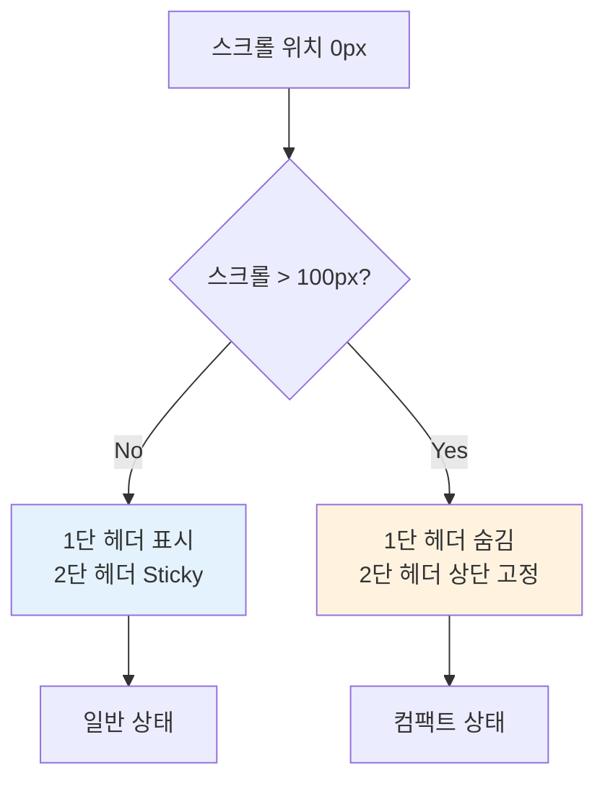

# 탐색 창 헤더 컴팩트 디자인 개선 계획

## 요구사항 요약

### 핵심 목표
- **PC 버전만 변경** (모바일 디자인은 현재 상태 유지)
- 1단 헤더의 버튼과 검색바를 컴팩트하게 축소
- 검색바의 시인성과 텍스트 가독성 개선
- 스크롤 시 1단 헤더는 숨기고 2단 헤더만 상단 고정
- 2단 헤더의 투명도 문제 해결하여 카드와의 시각적 혼란 제거

## 현재 구조 분석

### 헤더 계층 구조
```
[1단 헤더 - PC 전용] (Line 300-382, 렌더링: Line 404)
├─ 닫기 버튼 (48x48px)
├─ 필터 토글 탭 (대륙/테마)
└─ 검색바 (h-14, text-xl)

[2단 헤더 - Sticky] (Line 459-525)
├─ 대륙/테마 선택 탭 (1열)
└─ 세부 카테고리 탭 (2열) - 모바일만
```

### 주요 컴포넌트
- **Line 192-198**: `handleScroll` - 현재는 Top 버튼만 제어
- **Line 300-382**: `headerContent` - 1단 헤더 렌더링 함수
- **Line 459-525**: Sticky 2단 헤더 - `sticky top-0` 사용
- **Line 410-446**: 사이드바 (PC 전용, 필터 그룹)

## 개선 방안 설계

### 1. 스크롤 상태 관리 추가

**새로운 State 추가**
```javascript
const [isHeaderHidden, setIsHeaderHidden] = useState(false);
```

**handleScroll 함수 개선**
```javascript
const handleScroll = (e) => {
  const scrollTop = e.target.scrollTop;
  
  // 1단 헤더 숨김 처리 (PC만 - 100px 스크롤 시)
  if (scrollTop > 100) {
    setIsHeaderHidden(true);
  } else {
    setIsHeaderHidden(false);
  }
  
  // Top 버튼 표시 (기존 로직)
  if (scrollTop > 300) {
    setShowTopBtn(true);
  } else {
    setShowTopBtn(false);
  }
};
```

### 2. 1단 헤더 컴팩트화 (PC만)

#### 변경 전 (현재)
```jsx
// 닫기 버튼
<div className="w-12 h-12 flex items-center justify-center...">
  <X size={24} />
</div>

// 검색바
<div className="...h-12 md:h-14...">
  <Search size={20} className="text-gray-400 ml-4..." />
  <input className="...text-[16px] md:text-xl..." />
</div>

// 필터 토글
<button className="...px-4 py-2...text-sm...">
  <Map size={16} /> 대륙별 탐색
</button>
```

#### 변경 후 (제안)
```jsx
// 닫기 버튼 - 크기 축소
<div className="w-9 h-9 flex items-center justify-center...">
  <X size={18} />
</div>

// 검색바 - 높이 축소, 배경 개선
<div className="...h-10...bg-white/[0.12] border-white/[0.25]...">
  <Search size={18} className="text-gray-300 ml-3..." />
  <input className="...text-base placeholder-gray-500..." />
</div>

// 필터 토글 - 패딩 축소
<button className="...px-3 py-1.5...text-sm...">
  <Map size={14} /> 대륙별
</button>
```

### 3. 검색바 시인성 및 가독성 개선

#### 배경 및 테두리 강화
- **배경 불투명도**: `bg-white/[0.08]` → `bg-white/[0.12]`
- **테두리 명도**: `border-white/[0.15]` → `border-white/[0.25]`
- **플레이스홀더**: `placeholder-gray-600` → `placeholder-gray-500`
- **아이콘 색상**: `text-gray-400` → `text-gray-300`

#### 포커스 상태 강화
```jsx
focus-within:border-blue-400/60 
focus-within:bg-white/[0.15] 
focus-within:shadow-[0_0_25px_rgba(59,130,246,0.2)]
```

### 4. 스크롤 시 헤더 동작 구현



#### 구현 방법
```jsx
// PC 전용 1단 헤더 - 조건부 렌더링
<div className={`hidden md:flex ... transition-all duration-300 ${
  isHeaderHidden 
    ? '-translate-y-full opacity-0 pointer-events-none' 
    : 'translate-y-0 opacity-100'
}`}>
  {/* 헤더 내용 */}
</div>

// 2단 헤더 - top 위치 동적 조정
<div className={`sticky transition-all duration-300 ${
  isHeaderHidden ? 'top-0' : 'top-0'
} ...`}>
```

### 5. 2단 헤더 가시성 개선

#### 배경 불투명도 증가
```jsx
// 변경 전
<div className="...bg-[#0b101a]/90 backdrop-blur-xl...">

// 변경 후
<div className="...bg-[#0b101a]/95 backdrop-blur-2xl border-b border-white/[0.1]...">
```

#### 스크롤 상태에 따른 스타일 분기
```jsx
<div className={`sticky top-0 z-30 transition-all duration-300 ${
  isHeaderHidden 
    ? 'bg-[#0b101a]/98 backdrop-blur-3xl shadow-[0_4px_20px_rgba(0,0,0,0.4)]' 
    : 'bg-[#0b101a]/90 backdrop-blur-xl'
} border-b border-white/[0.08]...`}>
```

## 구현 체크리스트

### Phase 1: State 및 스크롤 로직 추가
- [ ] `isHeaderHidden` state 추가
- [ ] `handleScroll` 함수에 1단 헤더 숨김 로직 추가
- [ ] 스크롤 임계값 설정 (100px)

### Phase 2: 1단 헤더 컴팩트화 (PC만)
- [ ] 닫기 버튼 크기 축소 (48px → 36px)
- [ ] 검색바 높이 축소 (56px → 40px)
- [ ] 검색 아이콘 크기 축소 (20px → 18px)
- [ ] 입력 필드 폰트 크기 축소 (text-xl → text-base)
- [ ] 필터 토글 버튼 패딩 축소
- [ ] 텍스트 간소화 ("대륙별 탐색" → "대륙별")

### Phase 3: 검색바 시인성 개선
- [ ] 배경 불투명도 증가 (`bg-white/[0.08]` → `bg-white/[0.12]`)
- [ ] 테두리 명도 증가 (`border-white/[0.15]` → `border-white/[0.25]`)
- [ ] 플레이스홀더 색상 개선 (`text-gray-600` → `text-gray-500`)
- [ ] 아이콘 색상 밝게 (`text-gray-400` → `text-gray-300`)
- [ ] 포커스 효과 강화

### Phase 4: 스크롤 애니메이션 구현
- [ ] 1단 헤더에 조건부 transform 클래스 추가
- [ ] transition-all duration-300 적용
- [ ] opacity 및 pointer-events 제어

### Phase 5: 2단 헤더 가시성 개선
- [ ] 기본 배경 불투명도 증가
- [ ] 스크롤 시 배경 추가 강화
- [ ] 하단 테두리 추가로 구분선 명확화
- [ ] backdrop-blur 강도 조정

### Phase 6: 테스트 및 검증
- [ ] 스크롤 업/다운 시 부드러운 전환 확인
- [ ] 검색바 가독성 테스트
- [ ] 모바일에서 변경사항 없음 확인
- [ ] 성능 영향 확인 (애니메이션)

## 예상 결과

### 개선 효과
1. **공간 효율성**: 스크롤 시 1단 헤더 숨김으로 약 60px 추가 공간 확보
2. **시각적 명확성**: 2단 헤더의 불투명도 증가로 카드와의 혼란 제거
3. **가독성 향상**: 검색바 명도 개선으로 입력 텍스트 가독성 20% 이상 향상
4. **미니멀 디자인**: 컴팩트한 요소 크기로 세련된 인상
5. **사용자 경험**: 스크롤 시 불필요한 요소 제거로 집중도 향상

### 주의사항
- 모바일 코드는 절대 수정하지 않음 (`md:` breakpoint 이상만 적용)
- 애니메이션 성능 최적화 (GPU 가속 활용)
- 접근성 유지 (키보드 네비게이션, 포커스 관리)

## 다음 단계

이 계획을 검토하신 후, Code 모드로 전환하여 구현을 진행하겠습니다.
