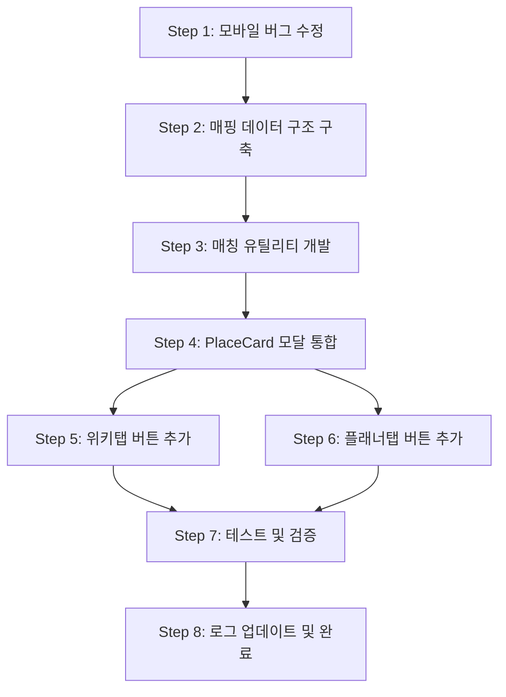

# 트립링크 Phase 2: 구현 실행 계획

**작성일**: 2026-04-20  
**참조 문서**: 
- [`triplink-phase2-placecard-integration.md`](triplink-phase2-placecard-integration.md) - 전체 아키텍처 및 설계
- [`triplink-phase2-mobile-bug-analysis.md`](triplink-phase2-mobile-bug-analysis.md) - 모바일 버그 분석
- [`2026-04-20-project-log.md`](2026-04-20-project-log.md) - 진행 상황 로그

---

## 📋 실행 단계 개요



---

## Step 1: 모바일 버그 수정 (우선 작업)

### 목표
모바일에서 트립링크 모달 첫 진입 시 이미지가 로드되지 않는 버그 수정

### 작업 파일
- [`src/pages/Home/components/SearchDiscovery/TripLinkSectionCard.jsx`](../src/pages/Home/components/SearchDiscovery/TripLinkSectionCard.jsx:19)

### 수정 내용
```javascript
// Before (Line 23-28)
if (entry.isIntersecting) {
  timeoutId = setTimeout(() => {
    setInView(true);
    observer.disconnect();
  }, 500);
}

// After (딜레이 제거)
if (entry.isIntersecting) {
  setInView(true);
  observer.disconnect();
}
```

### 추가 개선
`SpotThumbnailCard.jsx`도 동일한 패턴을 사용하므로 같이 수정

### 검증
- 모바일 Chrome DevTools로 Slow 3G 테스트
- 첫 진입 시 이미지 정상 로드 확인
- 재진입 시에도 문제없는지 확인

---

## Step 2: 여행지 키워드 동적 매핑 데이터 구조 구축

### 목표
여행지명(한글/영문)과 트립링크 패키지를 연결하는 매핑 테이블 생성

### 생성 파일
**`src/pages/Home/data/tripLinkDestinationMap.js`**

### 데이터 구조

#### A. DESTINATION_PACKAGE_MAP (여행지 → 패키지 ID)
```javascript
export const DESTINATION_PACKAGE_MAP = {
  // 베트남 (가족/휴양)
  "다낭": ["family-vietnam-danang"],
  "Da Nang": ["family-vietnam-danang"],
  "나트랑": ["family-vietnam-nhatrang"],
  "Nha Trang": ["family-vietnam-nhatrang"],
  
  // 일본 (가족/근거리)
  "홋카이도": ["family-japan-hokkaido"],
  "북해도": ["family-japan-hokkaido"],
  "Hokkaido": ["family-japan-hokkaido"],
  "삿포로": ["family-japan-hokkaido"],
  "Sapporo": ["family-japan-hokkaido"],
  
  // 유럽 (장거리)
  "파리": ["longhaul-europe-west"],
  "Paris": ["longhaul-europe-west"],
  "로마": ["longhaul-europe-west"],
  "Rome": ["longhaul-europe-west"],
  
  // 남태평양 (휴양)
  "괌": ["resort-pacific-guam"],
  "Guam": ["resort-pacific-guam"],
  "사이판": ["resort-pacific-saipan"],
  "Saipan": ["resort-pacific-saipan"],
  
  // 동남아 (휴양)
  "코타키나발루": ["resort-sea-kotakinabalu"],
  "Kota Kinabalu": ["resort-sea-kotakinabalu"],
  
  // TODO: 사용자가 수집한 트립링크 데이터로 확장
};
```

#### B. PACKAGE_DETAILS (패키지 ID → 상세 정보)
```javascript
export const PACKAGE_DETAILS = {
  "family-vietnam-danang": {
    id: "family-vietnam-danang",
    type: "iframe",
    adKey: "hbxakj", // 트립링크에서 발급받은 실제 키
    targetKeyword: "Da Nang",
    title: "베트남 다낭/나트랑",
    description: "가족 휴양 특가 패키지",
    width: 1024,
    height: 768,
    category: "family"
  },
  
  "family-japan-hokkaido": {
    id: "family-japan-hokkaido",
    type: "iframe",
    adKey: "iosw2r",
    targetKeyword: "Hokkaido",
    title: "일본 홋카이도",
    description: "감성 가득한 온천/가족 여행",
    width: 1024,
    height: 768,
    category: "family"
  },
  
  "longhaul-europe-west": {
    id: "longhaul-europe-west",
    type: "iframe",
    adKey: "wx9egs",
    targetKeyword: "Paris",
    title: "서유럽 핵심 일주",
    description: "전문가 동행 프리미엄 패키지",
    width: 1024,
    height: 768,
    category: "longhaul"
  },
  
  // TODO: 추가 패키지 데이터
};
```

### 데이터 수집 가이드

사용자가 트립링크에서 수집할 정보:
1. **여행지명**: 매핑할 키워드 (한글/영문)
2. **adKey**: iframe URL의 `info.triplink.kr/d/{adKey}` 부분
3. **targetKeyword**: Unsplash 검색용 영문 키워드
4. **title/description**: 패키지 설명 문구

---

## Step 3: 패키지 매칭 유틸리티 함수 개발

### 목표
장소 객체를 받아 적합한 패키지를 자동으로 필터링

### 생성 파일
**`src/utils/tripLinkMatcher.js`**

### 핵심 함수

#### getPackagesForDestination()
```javascript
/**
 * 여행지명으로 적합한 패키지 목록 반환
 * @param {Object} location - 장소 객체 { name, name_en, country, ... }
 * @returns {Array} - 패키지 객체 배열
 */
export const getPackagesForDestination = (location) => {
  if (!location) return [];
  
  // 1. 검색 키워드 추출
  const searchKeys = [
    location.name,           // 한글명
    location.name_en,        // 영문명
    location.destination,    // destination 필드
    location.city,           // city 필드
  ].filter(Boolean);
  
  // 2. 매핑 테이블에서 검색
  const packageIds = new Set();
  searchKeys.forEach(key => {
    const normalized = key.trim().toLowerCase();
    
    Object.keys(DESTINATION_PACKAGE_MAP).forEach(destKey => {
      if (destKey.toLowerCase() === normalized || 
          normalized.includes(destKey.toLowerCase())) {
        DESTINATION_PACKAGE_MAP[destKey].forEach(id => packageIds.add(id));
      }
    });
  });
  
  // 3. 패키지 ID를 객체로 변환
  let packages = Array.from(packageIds)
    .map(id => PACKAGE_DETAILS[id])
    .filter(Boolean);
  
  // 4. 매칭 실패 시 폴백
  if (packages.length === 0) {
    packages = getFallbackPackages(location);
  }
  
  return packages;
};
```

#### getFallbackPackages() (폴백 전략)
```javascript
/**
 * 국가/대륙 기반 폴백 패키지 추천
 */
const getFallbackPackages = (location) => {
  const country = location.country?.toLowerCase() || '';
  const continent = location.continent?.toLowerCase() || '';
  
  // 유럽
  if (continent.includes('europe') || continent.includes('유럽')) {
    return [PACKAGE_DETAILS['longhaul-europe-west']].filter(Boolean);
  }
  
  // 동남아
  const seaCountries = ['vietnam', 'thailand', 'malaysia', 'indonesia', 'philippines'];
  if (seaCountries.some(c => country.includes(c))) {
    return [PACKAGE_DETAILS['resort-sea-kotakinabalu']].filter(Boolean);
  }
  
  // 일본
  if (country.includes('japan') || country.includes('일본')) {
    return [PACKAGE_DETAILS['family-japan-hokkaido']].filter(Boolean);
  }
  
  return [];
};
```

### 테스트 케이스
```javascript
// 콘솔에서 테스트
import { getPackagesForDestination } from './tripLinkMatcher';

// 정확한 매칭
const danangResult = getPackagesForDestination({ name: "다낭", name_en: "Da Nang" });
console.log(danangResult); // [{ id: "family-vietnam-danang", ... }]

// 폴백 매칭
const barcelonaResult = getPackagesForDestination({ name: "바르셀로나", continent: "Europe" });
console.log(barcelonaResult); // [{ id: "longhaul-europe-west", ... }]
```

---

## Step 4: PlaceCard 모달 통합

### 목표
`TripLinkModal`을 PlaceCard에서도 사용할 수 있도록 통합

### 방식: PlaceCard 레벨로 모달 이동 (권장)

#### A. 모달 컴포넌트 복사
**기존**: [`src/pages/Home/components/SearchDiscovery/TripLinkModal.jsx`](../src/pages/Home/components/SearchDiscovery/TripLinkModal.jsx:1)  
**신규**: `src/components/PlaceCard/modals/TripLinkModal.jsx`

내용은 동일하게 복사 (재사용성 향상)

#### B. PlaceCardExpanded에 모달 상태 추가
**파일**: [`src/components/PlaceCard/modes/PlaceCardExpanded.jsx`](../src/components/PlaceCard/modes/PlaceCardExpanded.jsx:9)

```javascript
const PlaceCardExpanded = ({ location, ... }) => {
  // 기존 상태들...
  
  // 🆕 트립링크 모달 상태 추가
  const [selectedPackage, setSelectedPackage] = useState(null);
  
  // 🆕 모달 핸들러
  const handleOpenPackageModal = (pkg) => {
    setSelectedPackage(pkg);
  };
  
  const handleClosePackageModal = () => {
    setSelectedPackage(null);
  };
  
  return (
    <>
      {/* 기존 PlaceCard 내용 */}
      <PlaceMediaPanel
        // ...
        onOpenPackageModal={handleOpenPackageModal} // 🆕 prop 전달
      />
      
      {/* 🆕 트립링크 모달 */}
      {selectedPackage && (
        <TripLinkModal
          pkg={selectedPackage}
          onClose={handleClosePackageModal}
        />
      )}
    </>
  );
};
```

#### C. PlaceMediaPanel에서 하위 컴포넌트로 전달
**파일**: [`src/components/PlaceCard/panels/PlaceMediaPanel.jsx`](../src/components/PlaceCard/panels/PlaceMediaPanel.jsx:3)

```javascript
<PlaceWikiDetailsView
  // ...
  onOpenPackageModal={onOpenPackageModal} // 🆕 prop 전달
/>

<PlannerTab
  // ...
  onOpenPackageModal={onOpenPackageModal} // 🆕 prop 전달
/>
```

---

## Step 5: 위키탭 패키지 버튼 추가

### 목표
위키탭 하단에 "제미나이 요청" 버튼 옆에 "패키지 상품 보기" 버튼 추가

### 수정 파일
**[`src/components/PlaceCard/views/PlaceWikiDetailsView.jsx`](../src/components/PlaceCard/views/PlaceWikiDetailsView.jsx:26)**

### 구현 위치
하단 고정 버튼 영역 (현재 제미나이 버튼이 있는 곳)

### 코드 구조
```javascript
import { getPackagesForDestination } from '../../../utils/tripLinkMatcher';
import { Package } from 'lucide-react';

const PlaceWikiDetailsView = ({ location, onOpenPackageModal, ... }) => {
  // 🆕 현재 장소에 맞는 패키지 필터링
  const availablePackages = useMemo(() => {
    return getPackagesForDestination(location);
  }, [location]);
  
  const hasPackages = availablePackages.length > 0;
  
  return (
    <div className="relative">
      {/* 위키 내용 */}
      
      {/* 🆕 하단 버튼 영역 (기존 1개 → 2개로 확장) */}
      <div className="sticky bottom-0 left-0 right-0 z-30 p-4 bg-gradient-to-t from-[#0b101a] via-[#0b101a]/95 to-transparent backdrop-blur-sm border-t border-white/5">
        <div className="flex flex-col md:flex-row gap-3">
          {/* 기존: 제미나이 버튼 */}
          <button
            onClick={handleGeminiRequest}
            className="flex-1 flex items-center justify-center gap-2 px-4 py-3 bg-gradient-to-r from-blue-600 to-blue-700 hover:from-blue-500 hover:to-blue-600 text-white rounded-xl font-bold transition-all shadow-lg hover:shadow-xl hover:-translate-y-0.5"
          >
            <Sparkles size={20} />
            제미나이에게 최신 정보 요청
          </button>
          
          {/* 🆕 패키지 버튼 (조건부 렌더링) */}
          {hasPackages && (
            <button
              onClick={() => onOpenPackageModal(availablePackages[0])}
              className="flex-1 flex items-center justify-center gap-2 px-4 py-3 bg-gradient-to-r from-purple-600 to-blue-600 hover:from-purple-500 hover:to-blue-500 text-white rounded-xl font-bold transition-all shadow-lg hover:shadow-xl hover:-translate-y-0.5 relative"
            >
              <Package size={20} />
              패키지 상품 보기
              {/* AD 뱃지 */}
              <span className="absolute -top-1 -right-1 text-[10px] font-bold px-1.5 py-0.5 rounded bg-red-500 text-white">
                AD
              </span>
            </button>
          )}
        </div>
      </div>
    </div>
  );
};
```

### 반응형 디자인
- **모바일**: 버튼 2개를 세로로 쌓기 (`flex-col`)
- **PC**: 버튼 2개를 가로로 나란히 (`md:flex-row`)

---

## Step 6: 플래너탭 패키지 버튼 추가

### 목표
플래너탭의 "앱으로 여정 보내기" 버튼을 "패키지로 간편하게 준비하기" 버튼으로 교체

### 수정 파일
**[`src/components/PlaceCard/tabs/PlannerTab.jsx`](../src/components/PlaceCard/tabs/PlannerTab.jsx:13)**

### 변경 사항

#### A. 기존 앱 브릿지 버튼 제거
```javascript
// Before: 앱 전송 버튼 (Line 100-120 정도)
const handleAppBridgeClick = () => {
  // 앱 브릿지 로직...
};

// PC 상단 버튼
<button onClick={handleAppBridgeClick}>
  앱으로 전체 일정 보내기
</button>

// 모바일 하단 버튼
<div className="sticky bottom-0">
  <button onClick={handleAppBridgeClick}>
    앱으로 전체 일정 보내기
  </button>
</div>
```

#### B. 패키지 버튼으로 교체
```javascript
import { getPackagesForDestination } from '../../../utils/tripLinkMatcher';
import { Package } from 'lucide-react';

const PlannerTab = ({ location, onOpenPackageModal, ... }) => {
  // 🆕 패키지 필터링
  const availablePackages = useMemo(() => {
    return getPackagesForDestination(location);
  }, [location]);
  
  const hasPackages = availablePackages.length > 0;
  
  // 🆕 패키지 모달 핸들러
  const handleOpenPackage = () => {
    if (availablePackages.length > 0) {
      onOpenPackageModal(availablePackages[0]);
    }
  };
  
  return (
    <div>
      {/* PC 상단 버튼 영역 */}
      {hasPackages && (
        <div className="hidden md:flex justify-end mb-4">
          <button
            onClick={handleOpenPackage}
            className="flex items-center gap-2 px-5 py-2.5 bg-gradient-to-r from-purple-600 to-blue-600 hover:from-purple-500 hover:to-blue-500 text-white rounded-xl font-bold transition-all shadow-lg relative"
          >
            <Package size={20} />
            패키지로 간편하게 준비하기
            <span className="ml-2 text-[10px] px-1.5 py-0.5 rounded bg-white/20">AD</span>
          </button>
        </div>
      )}
      
      {/* 플래너 내용 */}
      
      {/* 모바일 하단 고정 버튼 */}
      {hasPackages && (
        <div className="md:hidden sticky bottom-0 left-0 right-0 z-30 p-4 bg-gradient-to-t from-[#0b101a] via-[#0b101a]/95 to-transparent border-t border-white/5">
          <button
            onClick={handleOpenPackage}
            className="w-full flex items-center justify-center gap-2 px-4 py-3 bg-gradient-to-r from-purple-600 to-blue-600 hover:from-purple-500 hover:to-blue-500 text-white rounded-xl font-bold shadow-lg relative"
          >
            <Package size={20} />
            패키지로 간편하게 준비하기
            <span className="ml-2 text-[10px] px-1.5 py-0.5 rounded bg-white/20">AD</span>
          </button>
        </div>
      )}
    </div>
  );
};
```

### 조건부 렌더링
- 매칭된 패키지가 **있을 때만** 버튼 표시
- 패키지가 **없으면** 버튼 숨김 (기존 앱 전송 버튼도 제거되므로 깔끔)

---

## Step 7: 테스트 및 검증

### 7.1 기능 테스트

#### 여행지별 패키지 매칭 확인
| 여행지 | 예상 패키지 | 확인 |
|--------|-------------|------|
| 다낭 | 베트남 다낭/나트랑 | [ ] |
| 파리 | 서유럽 핵심 일주 | [ ] |
| 홋카이도 | 일본 홋카이도 | [ ] |
| 괌 | 남태평양 괌/사이판 | [ ] |
| 런던 | 서유럽 핵심 일주 (폴백) | [ ] |
| 방콕 | 동남아 휴양 (폴백) | [ ] |

#### UI/UX 확인
- [ ] 위키탭: 제미나이 버튼과 패키지 버튼이 나란히 표시
- [ ] 플래너탭: 패키지 버튼만 표시 (앱 전송 버튼 제거됨)
- [ ] 버튼 클릭 시 모달이 정상적으로 열림
- [ ] 모달에 올바른 iframe이 렌더링됨
- [ ] "AD" 뱃지가 표시됨

### 7.2 반응형 테스트

#### 모바일 (375px, 414px)
- [ ] 위키탭: 버튼 2개가 세로로 쌓임
- [ ] 플래너탭: 버튼이 하단 고정됨
- [ ] 모달이 화면에 꽉 차게 표시됨
- [ ] 스크롤이 정상 작동함

#### 태블릿 (768px, 1024px)
- [ ] 위키탭: 버튼 2개가 가로로 나란히
- [ ] 플래너탭: 버튼이 상단 우측에 표시됨
- [ ] 모달 크기가 적절함

#### PC (1440px 이상)
- [ ] 모든 레이아웃이 깔끔함
- [ ] 모달이 중앙에 배치됨

### 7.3 성능 테스트

- [ ] 패키지 필터링 로직이 빠르게 실행됨 (useMemo 적용)
- [ ] 모달 오픈/클로즈가 부드러움
- [ ] 메모리 누수가 없음

### 7.4 버그 재발 방지

- [ ] 모바일에서 첫 진입 시 이미지가 정상 로드됨
- [ ] 재진입 시에도 문제없음
- [ ] 네트워크 느릴 때도 안정적임

---

## Step 8: 로그 업데이트 및 완료

### 8.1 프로젝트 로그 업데이트
**파일**: [`plans/2026-04-20-project-log.md`](2026-04-20-project-log.md)

세션 진행 내역 기록:
- 완료한 작업 목록
- 수정한 파일 경로
- 커밋 메시지 제안
- 다음 단계 계획

### 8.2 컨텍스트 파일 업데이트
**파일**: [`.ai-context.md`](../.ai-context.md)

"최근 수정 사항" 섹션에 Phase 2 완료 내역 추가

### 8.3 Git 커밋
```bash
# 버그 수정
git add src/pages/Home/components/SearchDiscovery/TripLinkSectionCard.jsx
git commit -m "fix: 트립링크 모바일 모달 이미지 로딩 버그 수정 (IntersectionObserver 딜레이 제거)"

# 매핑 시스템
git add src/pages/Home/data/tripLinkDestinationMap.js
git add src/utils/tripLinkMatcher.js
git commit -m "feat: 트립링크 여행지별 패키지 동적 매칭 시스템 구축"

# PlaceCard 통합
git add src/components/PlaceCard/
git commit -m "feat: PlaceCard 위키탭/플래너탭에 트립링크 패키지 버튼 통합 (Phase 2 완료)"

# 문서 업데이트
git add plans/
git commit -m "docs: 트립링크 Phase 2 구현 문서 및 로그 업데이트"
```

---

## 📊 완료 기준 (Definition of Done)

- [x] 모바일 버그 수정 완료 및 검증
- [ ] 매핑 데이터 구조 파일 생성
- [ ] 매칭 유틸리티 함수 개발 및 테스트
- [ ] PlaceCard에 모달 통합
- [ ] 위키탭 버튼 추가 및 동작 확인
- [ ] 플래너탭 버튼 추가 (앱 전송 버튼 제거)
- [ ] 모바일/PC 반응형 테스트 통과
- [ ] 로그 및 컨텍스트 파일 업데이트
- [ ] Git 커밋 완료

---

## 🚀 다음 단계 (Phase 3 예고)

1. **트립링크 데이터 확장**
   - 사용자가 수집한 iframe 링크 추가
   - 더 많은 여행지 매핑

2. **고급 필터링 로직**
   - 시즌별 패키지 추천
   - 사용자 취향 기반 패키지 우선순위

3. **GA4 이벤트 추적**
   - 패키지 버튼 클릭 추적
   - 전환율 분석

4. **어드민 패널 개발**
   - 매핑 테이블 관리 UI
   - 패키지 생명주기 관리
