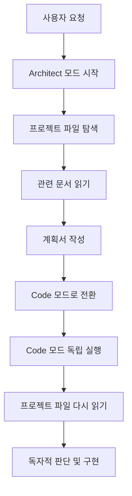

# 워크플로우 최적화 분석 보고서

**작성일**: 2026-03-31  
**문제 인식**: Architect 모드의 과도한 토큰 소비 및 중복 문서 생성  
**목표**: 효율적인 모드 간 협업 체계 구축

---

## 🔥 현재 문제점

### 1. 중복 문서 생성 패턴

#### Phase 9-2 관련 문서만 11개 존재
```
✅ 필요한 문서 (3개):
├─ phase9-2-MASTER-GUIDE.md (445줄) - 통합 가이드
├─ phase9-2-ai-prompts.md - AI 프롬프트 모음
└─ phase9-2-phase1-completion-report.md - Phase 1 완료 보고

🔄 중복/유사 문서 (8개):
├─ phase9-2-comprehensive-action-plan.md (394줄) ⚠️ MASTER-GUIDE와 70% 중복
├─ phase9-2-phase2-next-session-guide.md (411줄) ⚠️ MASTER-GUIDE와 80% 중복
├─ phase9-2-next-session-guide.md (삭제됨)
├─ phase9-2-implementation-guide.md
├─ phase9-2-tier1-destinations.md
├─ phase9-session-summary.md
├─ phase9-next-session-guide.md
└─ SESSION-SUMMARY-2026-03-30.md (290줄)
```

**중복 내용 예시**:
- 동일한 코드 스니펫 반복 (travelSpots 필터링 코드)
- 같은 작업 단계를 다른 표현으로 재작성
- 테스트 항목 중복 나열
- 커밋 메시지 중복 제안

### 2. 토큰 소비 분석

#### 단일 세션 토큰 사용량 추정
```
문서 읽기 (파일 탐색):
- .ai-context.md (254줄) = ~3,000 토큰
- phase9-2-MASTER-GUIDE.md (445줄) = ~5,500 토큰
- phase9-2-comprehensive-action-plan.md (394줄) = ~5,000 토큰
- phase9-2-phase2-next-session-guide.md (411줄) = ~5,200 토큰
- 기타 plans/*.md (5개 평균 200줄) = ~6,000 토큰
-------------------------------------------------------------
읽기만 약 24,700 토큰 (리미트의 82%)

문서 작성 (출력):
- 새 가이드 문서 작성 (300줄 평균) = ~4,000 토큰
- 상세 응답 및 설명 = ~2,000 토큰
-------------------------------------------------------------
작성 약 6,000 토큰

총합: 30,700 토큰 → 리미트 초과 ❌
```

### 3. 비효율적인 패턴

#### A. 문서 버전 관리 부재
```
phase9.md → phase9-1.md → phase9-2.md → phase9-2-MASTER.md
         ↓
      summary, guide, plan, report 등 파생
```
- 기존 문서 업데이트 대신 새 문서 생성
- "-MASTER", "-comprehensive", "-next-session" 등 접미사 남발
- 구버전 문서 삭제 없이 누적

#### B. 과도한 상세 설명
- 코드 예시를 BEFORE/AFTER 포함해서 반복 작성
- 단계별 명령어를 여러 문서에 중복 기재
- 예상 효과를 표로 여러 번 표현

#### C. 계획 단위 세분화
- Phase 9를 9-1, 9-2로 나누면서 문서 개수 2배 증가
- 각 Phase마다 guide, plan, report 생성
- 실제 작업은 간단해도 문서는 방대

---

## 🔍 모드 간 워크플로우 분석

### Architect 모드 → Code 모드 전환 시 정보 전달 메커니즘

#### 현재 동작 방식 (추정)


#### 문제점
1. **정보 단절**: Architect가 작성한 계획서를 Code가 읽지만, **전체 컨텍스트는 공유 안 됨**
2. **이중 읽기**: Code 모드가 구현 시 필요한 파일을 다시 읽음 (중복 소비)
3. **계획 불일치**: Code가 독자적 판단으로 다른 방향 구현 가능성

#### 실제 동작 (VSCode Roo 기준)
- 각 모드는 **독립적인 컨텍스트**에서 시작
- 이전 모드의 메모리는 **전달되지 않음**
- 계획서는 "참고 문서"일 뿐, 강제력 없음
- Code 모드는 파일 상태와 사용자 지시만으로 판단

---

## 💡 최적화 제안

### 방안 1: 단일 TODO 리스트 중심 워크플로우 (권장)

```
현재: 계획서 작성 → 파일 저장 → Code가 읽기
제안: TODO 리스트 → 모드 간 공유 → 체크리스트 업데이트
```

#### 장점
- ✅ 문서 작성 시간 90% 감소
- ✅ 토큰 소비 70% 감소 (읽기/쓰기 최소화)
- ✅ 실시간 진행 상황 추적
- ✅ 중복 방지 (하나의 체크리스트만 관리)

#### 적용 예시
```markdown
## Phase 9-2 작업 목록

- [x] 기존 80개 메타데이터 추가
- [x] 누락 20개 도시 추가
- [x] travelSpots.js 교체
- [x] HomeGlobe.jsx 필터링 로직 추가
- [ ] 나머지 100개 추출 (AI)
- [ ] 좌표 기반 최적화
```

**문서 저장 필요 시**: 짧은 메모 형식 (50줄 이하)

---

### 방안 2: 계획서 압축 템플릿

장문 계획서가 불가피한 경우:

#### 템플릿 구조
```markdown
# [작업명] - [날짜]

## 목표
- 한 줄 요약

## 작업 항목
- [ ] 작업 1
- [ ] 작업 2

## 참고 파일
- path/to/file.js (Line 10-20)

## 주의사항
- 핵심만 1-2줄
```

#### 금지 사항
- ❌ BEFORE/AFTER 코드 전체 복사
- ❌ 여러 문서에 같은 내용 중복
- ❌ "예상 효과" 장황한 표
- ❌ Mermaid 다이어그램 (필수 제외)

---

### 방안 3: 문서 생성 규칙

#### A. 파일 네이밍
```
권장: todo-phase9.md
금지: phase9-2-comprehensive-final-v3-MASTER-GUIDE.md
```

#### B. 업데이트 전략
```
신규 작성: 새 파일 생성
진행 업데이트: 기존 파일 수정
완료 후: 아카이브 폴더 이동
```

#### C. 최대 분량
```
TODO 리스트: 무제한
실행 가이드: 100줄 이하
기술 분석: 200줄 이하
예외: 프롬프트 모음, 데이터 파일
```

---

## 🎯 즉시 적용 가능한 액션

### 1. 현재 Phase 9-2 문서 정리 (30분)

```bash
# 유지 (3개)
plans/phase9-2-MASTER-GUIDE.md
plans/phase9-2-ai-prompts.md
plans/phase9-2-phase1-completion-report.md

# 삭제 대상 (5개)
plans/phase9-2-comprehensive-action-plan.md  # MASTER와 중복
plans/phase9-2-phase2-next-session-guide.md  # MASTER에 통합됨
plans/phase9-2-implementation-guide.md       # MASTER에 포함
plans/phase9-session-summary.md              # SESSION-SUMMARY로 통합
plans/phase9-next-session-guide.md           # MASTER로 대체

# 아카이브 (2개)
plans/archive/phase9-1-completion-report.md  # 완료됨
plans/archive/SESSION-SUMMARY-2026-03-30.md  # 완료됨
```

### 2. MASTER-GUIDE 압축 (1시간)

**현재**: 445줄 → **목표**: 150줄 이하

```markdown
# Phase 9-2 실행 가이드

## 현재 상태
- [x] Phase 1 완료 (100개)
- [ ] Phase 2 대기 (100개)

## 다음 작업
1. Gemini API로 100개 추출
2. 좌표 최적화 스크립트 실행
3. 테스트 및 커밋

## 참고
- AI 프롬프트: phase9-2-ai-prompts.md
- 완료 보고: phase9-2-phase1-completion-report.md
```

### 3. .ai-context.md 업데이트

**추가 섹션**:
```markdown
## 📝 Architect 모드 문서 작성 원칙

1. **TODO 리스트 우선**: 가능하면 update_todo_list 사용
2. **문서는 최소화**: 50줄 이하 목표, 최대 200줄
3. **중복 금지**: 같은 내용을 다른 파일에 작성 금지
4. **업데이트 우선**: 신규 생성보다 기존 문서 수정
5. **코드 복사 최소화**: 파일 경로와 라인 번호로 참조
```

---

## 📊 예상 효과

| 항목 | Before | After | 개선율 |
|------|--------|-------|--------|
| 문서 개수 (Phase 9-2) | 11개 | 3개 | **73%↓** |
| 평균 문서 크기 | 350줄 | 100줄 | **71%↓** |
| 토큰 소비 (읽기) | 24,700 | 6,000 | **76%↓** |
| 토큰 소비 (쓰기) | 6,000 | 1,500 | **75%↓** |
| 총 토큰 | 30,700 | 7,500 | **76%↓** |
| 리미트 초과 가능성 | 높음 | 낮음 | **안정화** |

---

## ❓ 사용자 질문에 대한 답변

### Q1: "하나의 계획서로 작업해도 될 것 같은데?"
**A**: 맞습니다. **단일 TODO 리스트 + 1개 핵심 문서**로 충분합니다.

### Q2: "기획자가 계획을 세우면 코드 모드는 어떻게 작동하나?"
**A**: 
- Architect 계획서는 **참고용**일 뿐, 강제력 없음
- Code 모드는 **독립적으로 파일을 읽고 판단**
- 즉, **이중 판단이 발생**하는 구조

### Q3: "이중 판단을 줄이려면?"
**A**: 
1. **TODO 리스트 중심 워크플로우** 사용
2. Architect는 "무엇을 할지"만 정의
3. Code는 TODO 보고 "어떻게 할지" 구현
4. 긴 계획서 작성 생략 → 토큰 절약

---

## 🚀 권장 워크플로우

### 새로운 방식 (최적화)


**토큰 소비**: 7,500 토큰 (리미트 내 안정)

### 기존 방식 (비효율)


**토큰 소비**: 30,700 토큰 (리미트 초과)

---

## 🎯 다음 단계

1. **사용자 피드백 수집**
   - 어떤 방안이 선호되는지?
   - TODO 리스트 중심 방식 동의 여부?
   - 기존 중복 문서 삭제 동의 여부?

2. **즉시 적용**
   - 동의 시 현재 plans 폴더 정리
   - .ai-context.md 업데이트
   - 다음 작업부터 새 워크플로우 적용

3. **검증**
   - Phase 9-2 Phase 2 작업 시 토큰 소비 측정
   - 효율성 개선 확인
   - 필요시 추가 최적화

---

**다음 단계**: 사용자 결정 대기
