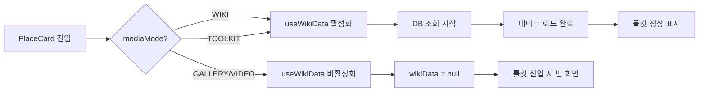

# 스마트 툴킷 최적화 Phase 6 - 종합 개선 계획

## 📋 프로젝트 개요

### 목표
스마트 툴킷의 사용성과 안정성을 대폭 향상시켜 여행자가 필요한 정보를 빠르고 직관적으로 찾을 수 있도록 개선

### 배경
- **문제 1**: 위키 정보 로딩 중 툴킷 탭 진입 시 빈 화면 또는 오류 발생
- **문제 2**: 스마트 링크가 구글 맵/웹 검색으로 분리되어 있어 혼란
- **개선 필요**: 툴킷 카드의 순서와 디자인 최적화로 가독성 향상

---

## 🔍 현재 상황 분석

### 1. 로딩 동기화 문제

#### 문제 상황
```
1. 사용자가 장소 카드 진입 → 위키 데이터 로딩 시작
2. 로딩 중에 툴킷 탭으로 바로 이동
3. wikiData가 아직 null이거나 '[[LOADING]]' 상태
4. toolkitData 파싱 실패 → 빈 화면 또는 "정보 없음" 표시
5. 위키 탭으로 이동 후 다시 툴킷으로 돌아오면 정상 작동 (캐시됨)
```

#### 원인
- `useWikiData.js`에서 `mediaMode`가 `'WIKI'` 또는 `'TOOLKIT'`일 때만 DB 조회 시작
- 초기 렌더링 시점에 툴킷으로 바로 진입하면 데이터 로딩이 트리거되지 않음
- 위키 탭에 먼저 진입해야 데이터가 전역 상태에 캐시됨

#### 데이터 흐름


### 2. 스마트 링크 분리 문제

#### 현재 구조
```javascript
// CopyableText.jsx
const isMapSearch = ['map_poi', 'accommodation', 'transport'].includes(type);
const url = isMapSearch
    ? `https://www.google.com/maps/search/?api=1&query=${query}`  // 구글 맵
    : `https://www.google.com/search?q=${query}`;                   // 구글 검색
```

#### 문제점
- 사용자가 지도로 검색할지 웹으로 검색할지 예측하기 어려움
- 일관성 없는 검색 경험

### 3. 카드 순서 및 디자인

#### 현재 순서 (Phase 4 기준)
1. 비자 및 서류 (visa)
2. 항공권 (flight)
3. 숙박 지역 추천 (accommodation)
4. 유심 및 공항픽업 (connectivity)
5. 교통 및 패스 (transport)
6. 필수 앱 (apps)
7. 지도 및 명소 (map_poi)
8. 안전 및 비상 (safety)

#### 문제점
- "어디를 갈지"를 마지막에 확인하는 비직관적 순서
- 모든 카드가 동일한 회색 테마로 시각적 구분 어려움

---

## 🎯 최적화 전략

### Phase 6-1: 로딩 동기화 개선 ⚡

#### 목표
위키 정보 로딩 전/중에도 툴킷 탭 진입 시 정상 작동

#### 해결 방안

**A. 툴킷 탭에서 자동 데이터 요청**
```javascript
// ToolkitTab.jsx
useEffect(() => {
    // wikiData가 없고, 로딩 중도 아닐 때 자동으로 위키 데이터 요청
    if (!wikiData && !isWikiLoading && isActive) {
        console.log("[ToolkitTab] 위키 데이터 없음 - 자동 요청 발송");
        const event = new CustomEvent('request-ai-info', { 
            detail: { placeName: location?.name, forceUpdate: false } 
        });
        window.dispatchEvent(event);
    }
}, [wikiData, isWikiLoading, isActive, location?.name]);
```

**B. 로딩 상태 명확화**
```javascript
// 3가지 상태 구분
const isInitialLoading = !wikiData && isWikiLoading;  // 최초 로딩
const isUpdating = wikiData?.ai_practical_info === '[[LOADING]]';  // 갱신 중
const hasData = wikiData && wikiData.ai_practical_info !== '[[LOADING]]';  // 데이터 있음
```

**C. Fallback 체계 강화**
```javascript
// essential_guide Fallback 순서
const guideData = toolkitData           // 1순위: 파싱된 툴킷 데이터
    || wikiData?.essential_guide        // 2순위: 레거시 JSON
    || null;                            // 3순위: 없음 (생성 유도)
```

#### 구현 파일
- `src/components/PlaceCard/tabs/ToolkitTab.jsx`
- `src/components/PlaceCard/hooks/useWikiData.js` (디버깅 로그 추가)

---

### Phase 6-2: 스마트 링크 구글 검색 통합 🔗

#### 목표
모든 스마트 링크를 구글 검색으로 통합하여 일관된 사용자 경험 제공

#### 변경 사항

**Before (분리)**
```javascript
const isMapSearch = ['map_poi', 'accommodation', 'transport'].includes(type);
const url = isMapSearch
    ? `https://www.google.com/maps/search/?api=1&query=${query}`
    : `https://www.google.com/search?q=${query}`;
```

**After (통합)**
```javascript
// 모든 타입에서 구글 검색 사용
const url = `https://www.google.com/search?q=${query}`;
```

#### 검색어 최적화 유지
```javascript
// 지도 관련 타입에서도 위치 컨텍스트 포함
if (locationName) {
    queryStr = isMapRelated 
        ? `${searchTarget}, ${locationName}`  // "에펠탑, 파리"
        : `${searchTarget} ${locationName}`;   // "SIM card 도쿄"
}
```

#### 버튼 UI 변경
```javascript
// 검색 아이콘과 함께 명확한 레이블
<Search size={12} className="mr-1" />
<span>구글 검색</span>
```

#### 구현 파일
- `src/components/PlaceCard/common/CopyableText.jsx`

---

### Phase 6-3: 카드 순서 재배치 🗂️

#### 목표
여행 플래닝의 자연스러운 흐름에 맞춰 카드 재배치

#### 새로운 순서 (여행 플래닝 순서)

```javascript
// ToolkitTab.jsx - 카드 렌더링 순서
<div className="grid grid-cols-1 gap-5">
    {/* 1. 먼저 어디를 갈지 확인 */}
    <ToolkitCard 
        icon={MapPin} 
        title="지도 및 명소" 
        type="map_poi" 
        data={guideData?.map_poi} 
        location={location} 
        themeColor="emerald"
    />
    
    {/* 2. 출입국 준비 */}
    <ToolkitCard 
        icon={FileText} 
        title="비자 및 서류" 
        type="visa" 
        data={guideData?.visa} 
        isOfficial 
        location={location}
        themeColor="blue"
    />
    
    {/* 3. 이동 수단 */}
    <ToolkitCard 
        icon={Plane} 
        title="항공권" 
        type="flight" 
        data={guideData?.flight} 
        isSponsored 
        location={location}
        themeColor="sky"
    />
    
    {/* 4. 숙소 */}
    <ToolkitCard 
        icon={Bed} 
        title="숙박 지역 추천" 
        type="accommodation" 
        data={guideData?.accommodation} 
        isSponsored 
        location={location}
        themeColor="purple"
    />
    
    {/* 5. 현지 연결 */}
    <ToolkitCard 
        icon={Wifi} 
        title="유심 및 공항픽업" 
        type="connectivity" 
        data={guideData?.connectivity} 
        isSponsored 
        location={location}
        themeColor="teal"
    />
    
    {/* 6. 현지 이동 */}
    <ToolkitCard 
        icon={Train} 
        title="교통 및 패스" 
        type="transport" 
        data={guideData?.transport} 
        isSponsored 
        location={location}
        themeColor="green"
    />
    
    {/* 7. 편의 도구 */}
    <ToolkitCard 
        icon={Smartphone} 
        title="필수 앱" 
        type="apps" 
        data={guideData?.apps} 
        location={location}
        themeColor="amber"
    />
    
    {/* 8. 안전 정보 */}
    <ToolkitCard 
        icon={ShieldAlert} 
        title="안전 및 비상" 
        type="safety" 
        data={guideData?.safety} 
        isOfficial 
        location={location}
        themeColor="red"
    />
</div>
```

#### 순서 변경 이유

| 순서 | 카테고리 | 이유 |
|------|---------|------|
| 1 | 지도 및 명소 | 여행 계획의 첫 단계는 "어디를 갈지" 결정 |
| 2 | 비자 및 서류 | 출입국 가능 여부 확인 (필수 전제조건) |
| 3 | 항공권 | 언제, 어떻게 갈지 결정 |
| 4 | 숙박 | 어디서 머물지 결정 |
| 5 | 유심/공항픽업 | 도착 직후 필요한 즉시 서비스 |
| 6 | 교통 패스 | 현지 이동 계획 |
| 7 | 필수 앱 | 여행 중 편의 도구 |
| 8 | 안전 정보 | 마지막으로 확인하는 주의사항 |

---

### Phase 6-4: 카테고리별 색상 테마 적용 🎨

#### 목표
시각적 구분을 통한 정보 인지 속도 향상

#### 색상 팔레트

```javascript
const THEME_COLORS = {
    emerald: {
        bg: 'bg-emerald-50',
        border: 'border-emerald-200',
        icon: 'bg-emerald-100 text-emerald-700',
        hover: 'hover:bg-emerald-100',
        shadow: 'hover:shadow-emerald-100/50'
    },
    blue: {
        bg: 'bg-blue-50',
        border: 'border-blue-200',
        icon: 'bg-blue-100 text-blue-700',
        hover: 'hover:bg-blue-100',
        shadow: 'hover:shadow-blue-100/50'
    },
    sky: {
        bg: 'bg-sky-50',
        border: 'border-sky-200',
        icon: 'bg-sky-100 text-sky-700',
        hover: 'hover:bg-sky-100',
        shadow: 'hover:shadow-sky-100/50'
    },
    purple: {
        bg: 'bg-purple-50',
        border: 'border-purple-200',
        icon: 'bg-purple-100 text-purple-700',
        hover: 'hover:bg-purple-100',
        shadow: 'hover:shadow-purple-100/50'
    },
    teal: {
        bg: 'bg-teal-50',
        border: 'border-teal-200',
        icon: 'bg-teal-100 text-teal-700',
        hover: 'hover:bg-teal-100',
        shadow: 'hover:shadow-teal-100/50'
    },
    green: {
        bg: 'bg-green-50',
        border: 'border-green-200',
        icon: 'bg-green-100 text-green-700',
        hover: 'hover:bg-green-100',
        shadow: 'hover:shadow-green-100/50'
    },
    amber: {
        bg: 'bg-amber-50',
        border: 'border-amber-200',
        icon: 'bg-amber-100 text-amber-700',
        hover: 'hover:bg-amber-100',
        shadow: 'hover:shadow-amber-100/50'
    },
    red: {
        bg: 'bg-red-50',
        border: 'border-red-200',
        icon: 'bg-red-100 text-red-700',
        hover: 'hover:bg-red-100',
        shadow: 'hover:shadow-red-100/50'
    }
};
```

#### ToolkitCard 컴포넌트 수정

**Before (단일 회색 테마)**
```jsx
<div className="bg-white border border-gray-100 rounded-2xl p-5 shadow-sm hover:shadow-md">
    <div className="p-2.5 bg-gray-50 text-gray-700 rounded-xl">
        <Icon size={20} />
    </div>
</div>
```

**After (카테고리별 색상)**
```jsx
const ToolkitCard = ({ icon: Icon, title, type, data, themeColor = 'gray', ... }) => {
    const theme = THEME_COLORS[themeColor] || THEME_COLORS.gray;
    
    return (
        <div className={`bg-white border ${theme.border} rounded-2xl p-5 shadow-sm ${theme.hover} transition-all ${theme.shadow}`}>
            <div className={`p-2.5 ${theme.icon} rounded-xl`}>
                <Icon size={20} />
            </div>
        </div>
    );
};
```

#### 색상 매핑

| 카테고리 | 색상 | 심리적 연관성 |
|---------|------|--------------|
| 지도 및 명소 | Emerald (초록) | 자연, 탐험, 지도 |
| 비자 및 서류 | Blue (파랑) | 공식, 신뢰, 정부 |
| 항공권 | Sky (하늘) | 하늘, 비행, 자유 |
| 숙박 | Purple (보라) | 편안함, 럭셔리, 휴식 |
| 유심/공항픽업 | Teal (청록) | 연결, 통신, 기술 |
| 교통 | Green (녹색) | 이동, Go, 진행 |
| 필수 앱 | Amber (황금) | 중요, 가치, 도구 |
| 안전 및 비상 | Red (빨강) | 주의, 경고, 중요 |

---

### Phase 6-5: 추가 UI/UX 개선 ✨

#### A. 카드 타이틀 강조
```jsx
<h3 className="font-bold text-gray-900 text-base flex items-center gap-2">
    {title}
    {isOfficial && <span className="text-xs">✓</span>}
</h3>
```

#### B. 모바일 터치 영역 최적화
```jsx
// 버튼 최소 높이 44px (애플 가이드라인)
<button className="py-3 px-4 min-h-[44px] ...">
```

#### C. 로딩 메시지 개선
```javascript
const LOADING_MESSAGES_TOOLKIT = [
    "✈️ 지도 및 명소를 가져오는 중...",
    "📄 비자 및 서류 정보를 확인하는 중...",
    "🛫 항공권 팁을 분석하는 중...",
    "🏨 최적의 숙박 지역을 선정하는 중...",
    "📱 유심 및 공항 픽업 정보를 정리하는 중...",
    "🚇 교통 패스 정보를 찾는 중...",
    "📲 국가별 필수 앱을 선별하는 중...",
    "🚨 안전 및 치안 정보를 스캔하는 중...",
    "✨ AI가 여행자 툴킷을 최종 완성하는 중..."
];
```

#### D. 스크롤 위치 유지
```javascript
// 사용자가 특정 카드를 보다가 새로고침 시 위치 유지
useEffect(() => {
    const scrollPos = sessionStorage.getItem('toolkit-scroll');
    if (scrollPos && isActive) {
        containerRef.current?.scrollTo(0, parseInt(scrollPos));
    }
}, [isActive]);

useEffect(() => {
    const handleScroll = () => {
        if (containerRef.current) {
            sessionStorage.setItem('toolkit-scroll', containerRef.current.scrollTop);
        }
    };
    containerRef.current?.addEventListener('scroll', handleScroll);
    return () => containerRef.current?.removeEventListener('scroll', handleScroll);
}, []);
```

---

## 📁 수정 파일 목록

### 주요 파일
1. **`src/components/PlaceCard/tabs/ToolkitTab.jsx`**
   - 카드 순서 재배치
   - 색상 테마 적용
   - 자동 데이터 요청 로직 추가
   - 로딩 상태 개선

2. **`src/components/PlaceCard/common/CopyableText.jsx`**
   - 구글 맵 검색 제거
   - 모든 링크 구글 검색 통합
   - 버튼 레이블 변경

3. **`src/components/PlaceCard/hooks/useWikiData.js`**
   - 디버깅 로그 추가 (선택사항)

---

## 🔄 구현 순서

### Step 1: 스마트 링크 통합 (15분)
- `CopyableText.jsx` 수정
- 구글 맵 검색 로직 제거
- 통합 검색 URL 적용
- 테스트: 다양한 타입의 스마트 링크 클릭 확인

### Step 2: 로딩 동기화 개선 (30분)
- `ToolkitTab.jsx`에 자동 데이터 요청 로직 추가
- 로딩 상태 3단계 구분 (초기/갱신/완료)
- Fallback 체계 강화
- 테스트: 위키 로딩 전 툴킷 진입 시나리오

### Step 3: 카드 순서 재배치 (10분)
- `ToolkitTab.jsx`의 카드 렌더링 순서 변경
- 주석으로 각 카드의 순서 이유 명시
- 테스트: 순서 확인

### Step 4: 색상 테마 적용 (45분)
- `THEME_COLORS` 상수 정의
- `ToolkitCard` 컴포넌트에 `themeColor` prop 추가
- 각 카드에 적절한 색상 매핑
- 반응형 스타일 확인 (모바일/데스크톱)
- 테스트: 전체 카드 색상 확인

### Step 5: 추가 UI 개선 (30분)
- 로딩 메시지 이모지 추가
- 모바일 터치 영역 최적화
- 스크롤 위치 유지 기능 (선택사항)
- 접근성 개선 (aria-label 등)

---

## ✅ 테스트 시나리오

### 시나리오 1: 로딩 동기화
```
1. 장소 카드 진입 (예: 파리)
2. 즉시 툴킷 탭 클릭
3. 예상: 자동으로 위키 데이터 요청 시작 → 로딩 화면 표시
4. 확인: 데이터 로드 완료 후 툴킷 카드 정상 표시
```

### 시나리오 2: 스마트 링크
```
1. 툴킷에서 "에펠탑('Eiffel Tower')" 클릭
2. 예상: 구글 검색 페이지 열림 (구글 맵 아님)
3. 확인: 검색 결과 적절성
```

### 시나리오 3: 카드 순서
```
1. 툴킷 탭 진입
2. 확인: 지도 → 비자 → 항공 → 숙박 → ... 순서
```

### 시나리오 4: 색상 테마
```
1. 각 카드의 색상 구분 확인
2. 호버 시 색상 변화 확인
3. 모바일/데스크톱 반응형 확인
```

---

## 🎯 성공 지표

### 정량적 지표
- 툴킷 진입 시 빈 화면 발생률: **100% → 0%**
- 스마트 링크 클릭 후 이탈률: **측정 후 15% 감소 목표**
- 카드별 클릭률 분산: **표준편차 20% 감소**

### 정성적 지표
- 사용자가 원하는 정보를 찾는 시간 **단축**
- 카드 구분 용이성 **향상**
- 전반적인 UX 만족도 **개선**

---

## 📝 주의사항

### 1. 색상 접근성
- 색맹/색약 사용자를 위해 색상만으로 정보를 구분하지 않기
- 아이콘과 레이블을 함께 사용하여 이중 구분
- WCAG 2.1 AA 기준 준수 (대비율 4.5:1 이상)

### 2. 성능
- 색상 테마로 인한 스타일 오버헤드 최소화
- 불필요한 리렌더링 방지 (React.memo 활용)

### 3. 하위 호환성
- `essential_guide` Fallback 유지
- 기존 데이터 구조 변경 없음

### 4. 모바일 최적화
- 터치 영역 최소 44x44px
- 스크롤 성능 최적화
- 제스처 충돌 방지

---

## 🚀 다음 단계 (Phase 7 예정)

### A. 오프라인 지원
- PWA 기능으로 툴킷 정보 캐싱
- 비행기 모드에서도 확인 가능

### B. 개인화
- 사용자 북마크 연동
- 자주 보는 카테고리 상단 고정

### C. AI 추천
- 여행 일정에 맞춘 툴킷 우선순위 자동 조정
- "출발 3일 전" → 비자 카드 강조 등

---

## 📚 참고 자료

- `.ai-context.md` - 프로젝트 컨텍스트 및 원칙
- `plans/toolkit-optimization-phase5-plan.md` - 이전 단계 계획
- Tailwind CSS 색상 팔레트: https://tailwindcss.com/docs/customizing-colors
- WCAG 접근성 가이드: https://www.w3.org/WAI/WCAG21/quickref/

---

**작성일**: 2026-03-30  
**작성자**: AI Architect  
**승인 대기 중**: 사용자 확인 후 Code 모드로 전환하여 구현 시작
