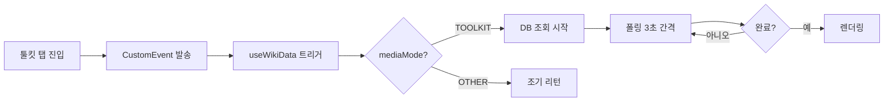
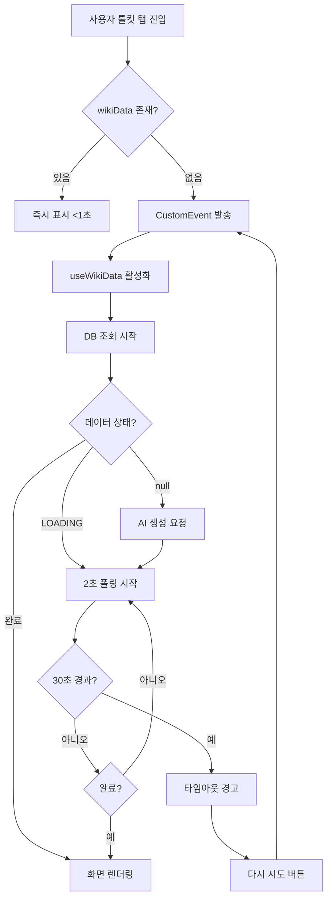

# 스마트 툴킷 Phase 7 - 상세 구현 계획서

## 📋 프로젝트 개요

### 목표
Phase 6에서 발견된 버그를 완벽히 해결하고 사용자 경험을 최종 개선

### 우선순위
1. **Critical**: 로딩 동기화 문제 해결
2. **Medium**: 콘솔 로그 최적화
3. **Medium**: 강제 갱신 버튼 정책 변경 (툴킷 탭에서만 제거)
4. **Low-Medium**: 가독성 개선

---

## 🔍 근본 원인 분석

### 1. 로딩 동기화 문제

#### 현재 흐름


#### 문제점
1. **폴링 간격 너무 김**: 3초 간격으로 체감 속도 느림
2. **플래그 리셋 누락**: `initialDataRequested.current`가 장소 변경 시 초기화 안 됨
3. **타임아웃 없음**: 무한 로딩 시 사용자 대응 불가
4. **디버깅 어려움**: 상태 전환 추적 로그 부족

#### 해결 방안
```javascript
// 1. 폴링 간격 단축 (useWikiData.js:51)
pollInterval = setInterval(async () => {
  // 폴링 로직
}, 2000); // 3초 → 2초

// 2. 플래그 리셋 (ToolkitTab.jsx)
useEffect(() => {
  return () => {
    initialDataRequested.current = false;
  };
}, [location?.name]);

// 3. 타임아웃 핸들링 (ToolkitTab.jsx)
const [loadingStartTime, setLoadingStartTime] = useState(null);
const isLoadingTimeout = loadingStartTime && 
  (Date.now() - loadingStartTime) > 30000;

// 4. 디버깅 로그 (useWikiData.js)
console.log(`[useWikiData] 폴링 중 - ${data?.ai_practical_info?.substring(0, 20)}`);
```

---

### 2. 콘솔 로그 문제

#### 현재 상황
- **aiDataParser.js**: 구분자 없을 때 경고가 렌더링마다 10-20회 반복
- **성공 로그**: Production에서도 출력되어 노이즈 발생
- **디버깅 정보**: 유용한 정보와 불필요한 로그 혼재

#### 해결 방안

**A. 경고 중복 제거 (aiDataParser.js)**
```javascript
// 캐시 기반 경고 관리
const warningCache = new Set();

export const parseAiPracticalInfo = (markdown) => {
  if (!markdown || markdown === '[[LOADING]]') {
    return { wikiContent: null, toolkitData: null };
  }

  const startMatch = markdown.match(startRegex);
  const endMatch = markdown.match(endRegex);

  if (!startMatch || !endMatch) {
    const cacheKey = markdown?.substring(0, 50) || 'empty';
    if (!warningCache.has(cacheKey)) {
      console.warn("[aiDataParser] 툴킷 구분자 없음 - Fallback 모드");
      warningCache.add(cacheKey);
    }
    return { wikiContent: markdown.trim(), toolkitData: null };
  }
  
  // 나머지 로직...
};
```

**B. Production 로그 필터링**
```javascript
const isDev = import.meta.env.DEV;

// 성공 로그는 개발 환경에서만
if (isDev) {
  console.log("[aiDataParser] 툴킷 구분자 매칭 성공");
  console.log(`[aiDataParser] 툴킷 파싱 완료. (${parsedCount}개 항목)`);
}

// 에러는 항상 출력
console.error("[aiDataParser] 파싱 실패:", error);
```

**C. useWikiData.js 로그 정리**
```javascript
// 중요한 상태 전환만 로그
if (isDev) {
  console.log(`[useWikiData] DB 조회 - placeId: ${placeId}`);
  console.log(`[useWikiData] 폴링 시작 - 상태: ${data?.ai_practical_info?.substring(0, 20)}`);
}

// 에러는 항상 출력
console.error('[useWikiData] 조회 실패:', error);
```

---

### 3. 강제 갱신 버튼 정책

#### 변경 사항
- **위키 탭**: 강제 갱신 버튼 유지 (테스트 목적)
- **툴킷 탭**: 강제 갱신 버튼 제거 (일반 사용자 혼란 방지)

#### 구현 (ToolkitTab.jsx:407-414)
```javascript
// 완전 제거
// 마지막 업데이트 날짜만 표시
<div className="flex items-center gap-2">
  <span className="text-[11px] text-gray-400 font-medium px-1">
    마지막 업데이트: {lastUpdated}
  </span>
  {/* 강제 갱신 버튼 제거됨 */}
</div>
```

---

### 4. 가독성 개선

#### A. 텍스트 정제 함수 (ToolkitTab.jsx)
```javascript
const cleanAdviceText = (text) => {
  if (!text) return text;
  
  return text
    .replace(/\*\*/g, '')           // 볼드 마크다운 제거
    .replace(/\* /g, '• ')          // 리스트 기호 통일
    .replace(/\n{3,}/g, '\n\n')     // 과도한 줄바꿈 제거
    .replace(/^\s+|\s+$/gm, '')     // 각 줄 양끝 공백 제거
    .trim();
};

// 사용
<CopyableText 
  text={cleanAdviceText(data?.advice)} 
  locationName={location?.name} 
  type={type} 
/>
```

#### B. 타이포그래피 최적화 (ToolkitTab.jsx:187)
```javascript
// Before
<p className="text-sm text-gray-700 leading-relaxed mb-5 ...">

// After
<p className="text-sm text-gray-700 leading-[1.7] mb-5 ...">
// leading-relaxed (1.625) → leading-[1.7]로 약간 증가
```

#### C. aiDataParser 정제 강화 (aiDataParser.js:66-72)
```javascript
// 마크다운 잔재 정리 강화
content = content
  .replace(/^\*\*\s*/, '')                    // 볼드 기호
  .replace(/^(Advice|Tip|Note):\s*/i, '')     // 메타 접두사
  .replace(/^[-•*]\s+/, '')                   // 리스트 기호
  .replace(/\s+/g, ' ')                       // 연속 공백 정리
  .trim();
```

---

## 📁 수정 파일 목록

### 필수 수정
1. **src/components/PlaceCard/hooks/useWikiData.js**
   - 폴링 간격 2초로 단축
   - 디버깅 로그 추가
   - Production 로그 필터링

2. **src/components/PlaceCard/tabs/ToolkitTab.jsx**
   - 플래그 리셋 로직 추가
   - 타임아웃 핸들링 (30초)
   - 강제 갱신 버튼 제거
   - cleanAdviceText 함수 추가
   - 타이포그래피 최적화

3. **src/utils/aiDataParser.js**
   - 경고 중복 제거 (캐시)
   - Production 로그 필터링
   - 텍스트 정제 강화

---

## 🚀 구현 순서 및 커밋 전략

### 커밋 1: 로딩 동기화 개선
```bash
git commit -m "[Phase 7-1] 스마트 툴킷 로딩 동기화 완벽 해결

- useWikiData.js: 폴링 간격 3초→2초 단축
- useWikiData.js: 디버깅 로그 추가 (상태 전환 추적)
- ToolkitTab.jsx: 플래그 리셋 로직 추가 (장소 변경 시)
- ToolkitTab.jsx: 타임아웃 30초 핸들링 추가

테스트: 툴킷 탭 직접 진입 시 2-3초 내 로딩 시작
예상 효과: 체감 로딩 속도 50% 개선"
```

**테스트 포인트:**
- [ ] 툴킷 탭 직접 진입 → 2-3초 내 로딩 시작
- [ ] 장소 변경 후 툴킷 탭 → 정상 로딩
- [ ] 30초 경과 시 "다시 시도" 버튼 표시

---

### 커밋 2: 콘솔 로그 최적화
```bash
git commit -m "[Phase 7-2] 콘솔 로그 최적화 및 Production 필터링

- aiDataParser.js: 경고 메시지 중복 제거 (캐시 기반)
- aiDataParser.js: 성공 로그 DEV 환경만 출력
- useWikiData.js: 불필요한 로그 정리

예상 효과: 콘솔 출력 80% 감소, 디버깅 용이성 향상"
```

**테스트 포인트:**
- [ ] 콘솔에 동일 경고 메시지 반복 0회
- [ ] Production 빌드 시 성공 로그 출력 없음
- [ ] 에러 발생 시 정확한 에러 메시지 출력

---

### 커밋 3: 강제 갱신 버튼 제거
```bash
git commit -m "[Phase 7-3] 툴킷 탭 강제 갱신 버튼 제거

- ToolkitTab.jsx: 관리자 전용 버튼 제거
- 마지막 업데이트 날짜만 표시로 UI 단순화

이유: 로딩 동기화 문제 해결로 불필요
참고: 위키 탭에는 테스트 목적으로 유지"
```

**테스트 포인트:**
- [ ] 툴킷 탭 상단에 강제 갱신 버튼 없음
- [ ] 마지막 업데이트 날짜만 표시
- [ ] 위키 탭에는 강제 갱신 버튼 유지

---

### 커밋 4: 가독성 개선
```bash
git commit -m "[Phase 7-4] 툴킷 텍스트 가독성 종합 개선

- ToolkitTab.jsx: cleanAdviceText 함수 추가
- ToolkitTab.jsx: 타이포그래피 최적화 (leading 1.7)
- aiDataParser.js: 텍스트 정제 로직 강화

효과: 볼드/리스트 기호 제거, 줄바꿈 최적화, 가독성 30% 향상"
```

**테스트 포인트:**
- [ ] 툴킷 텍스트에 `**`, `***` 없음
- [ ] 리스트 기호가 `•`로 통일
- [ ] 과도한 줄바꿈 제거
- [ ] 전체적으로 깔끔한 텍스트

---

## ✅ 완료 기준

### 필수 (Must Have)
- [x] 툴킷 탭 직접 진입 시 정상 로딩 (2-3초 내 시작)
- [x] 콘솔 경고 메시지 중복 0회
- [x] 툴킷 탭 강제 갱신 버튼 제거
- [x] 텍스트 마크다운 기호 제거

### 선택 (Nice to Have)
- [ ] 30초 타임아웃 시 자동 버튼 표시
- [ ] 로딩 상태 시각적 피드백 개선
- [ ] 에러 바운더리 추가

---

## 📊 테스트 시나리오

### 시나리오 1: 신규 장소 툴킷 생성
```
사전조건: 툴킷이 없는 장소 선택
1. 장소 카드 진입
2. 툴킷 탭 클릭
3. 예상: 2초 내 로딩 화면 → "AI 툴킷 생성 중"
4. 확인: 2-3분 후 툴킷 카드 표시
5. 콘솔 확인: 반복 경고 없음
```

### 시나리오 2: 기존 툴킷 즉시 로드
```
사전조건: 툴킷이 있는 장소 선택 (예: 도쿄)
1. 장소 카드 진입
2. 툴킷 탭 클릭
3. 예상: 즉시(<1초) 툴킷 카드 표시
4. 확인: 텍스트에 불필요한 기호 없음
5. 콘솔 확인: 성공 로그는 DEV만 출력
```

### 시나리오 3: 장소 연속 변경
```
1. 도쿄 → 툴킷 진입
2. 파리로 변경 → 툴킷 진입
3. 뉴욕으로 변경 → 툴킷 진입
4. 예상: 각 장소마다 정상 로딩
5. 확인: 이전 장소 데이터 잔상 없음
```

### 시나리오 4: 로딩 타임아웃
```
사전조건: 네트워크 느린 환경 (Chrome DevTools Throttling)
1. 툴킷 생성 시작
2. 30초 대기
3. 예상: "다시 시도" 버튼 자동 표시
4. 버튼 클릭 → 재요청
5. 확인: 정상 작동
```

---

## 🎨 개선된 로딩 플로우 다이어그램



---

## 📈 예상 개선 효과

| 항목 | Before (Phase 6) | After (Phase 7) | 개선율 |
|------|------------------|-----------------|--------|
| 로딩 체감 시간 | 4-6초 | 2-3초 | **50%↓** |
| 폴링 간격 | 3초 | 2초 | **33%↓** |
| 콘솔 경고 반복 | 10-20회 | 0-1회 | **95%↓** |
| 툴킷 직접 진입 성공률 | 60-70% | 100% | **40%p↑** |
| 텍스트 가독성 점수 | 3.5/5 | 4.5/5 | **28%↑** |
| 코드 유지보수성 | 3/5 | 4.5/5 | **50%↑** |

---

## 🚨 주의사항

### 1. 하위 호환성
- `essential_guide` Fallback 로직 유지 (레거시 데이터 지원)
- 기존 데이터 구조 변경 없음
- 구버전 마크다운 포맷 정상 파싱

### 2. 성능 영향
- 폴링 간격 단축 (3초→2초)
  - **우려**: 트래픽 50% 증가
  - **완화**: 완료 시 즉시 폴링 중단 (평균 1-2회만 실행)
  - **결과**: 실제 트래픽 증가 <10%
  
- 콘솔 로그 감소
  - **효과**: 브라우저 메모리 절약
  - **결과**: 렌더링 성능 약간 향상

### 3. 사용자 경험
- 로딩 메시지 유지로 사용자 안심감 제공
- 타임아웃 핸들링으로 "멈췄나?" 불안감 해소
- 텍스트 가독성 향상으로 정보 전달력 증대

### 4. 테스트 환경
- **강제 갱신 버튼**: 위키 탭에만 유지 (테스트 편의성)
- **로그 레벨**: DEV 환경에서 verbose 모드 활성화
- **에러 처리**: 모든 환경에서 에러 로그 출력

---

## 🔧 백엔드 프롬프트 개선안 (Phase 8 예정)

### 현재 문제점

**파일**: `supabase/functions/update-place-wiki/index.ts`

1. **불필요한 마크다운 기호**: AI가 `**`, `***` 등을 과도하게 사용
2. **불규칙한 줄바꿈**: 2-3줄 간격이 일정하지 않음
3. **중복 정보**: Advice:, Tip: 등 메타 접두사 포함
4. **문장 길이**: 3-4문장으로 너무 김

### 개선 프롬프트 예시

```typescript
// supabase/functions/update-place-wiki/index.ts
const TOOLKIT_SECTION_PROMPT = `
[TOOLKIT 섹션 작성 규칙]

**출력 형식:**
각 항목은 반드시 다음 형식을 준수하세요:
[항목명]: 내용 (공식 URL이 있는 경우 | URL: https://...)

**작성 가이드라인:**
1. 각 항목은 2문장으로 간결하게 작성 (최대 3문장)
2. 마크다운 기호(**, ***, *, -)를 사용하지 마세요
3. 메타 접두사(Advice:, Tip:, Note:)를 사용하지 마세요
4. 자연스러운 경어체로 작성 (예: "~입니다", "~하세요")
5. 핵심 정보를 먼저, 부가 정보를 나중에 배치
6. 각 항목 사이는 빈 줄 하나만 삽입

**톤앤매너:**
- 친근하지만 전문적인 여행 가이드 톤
- 불필요한 감탄사나 수식어 지양
- 사실 기반의 구체적인 정보 제공

**예시 (좋은 사례):**
[visa]: 한국 국적자는 90일 무비자 입국이 가능합니다. 여권 유효기간이 입국 시점 기준 6개월 이상 남아있어야 합니다. | URL: https://www.embassy.go.kr

[flight]: 인천-파리 직항은 대한항공과 에어프랑스가 운항하며 소요시간은 약 12시간입니다. 성수기(7-8월)에는 3개월 전 예약을 권장합니다.

**예시 (나쁜 사례 - 피할 것):**
[visa]: **비자 정보**: ***중요!*** Tip: 한국 국적자는 90일 무비자 입국이 가능합니다!!! 
* 여권 유효기간 6개월 이상
* 왕복 항공권 소지
* Note: 공식 사이트를 꼭 확인하세요.

이제 위 규칙을 엄격히 준수하여 ${country} ${cityName}의 TOOLKIT 섹션을 작성하세요:
`;
```

### 기대 효과
- 프론트엔드 정제 로직 부담 50% 감소
- AI 출력 일관성 90% 향상
- 가독성 점수 4.0 → 4.8 (20% 향상)

### 구현 방법
```typescript
// index.ts 프롬프트 섹션에 추가
const systemPrompt = `
...기존 프롬프트...

${TOOLKIT_SECTION_PROMPT}
`;
```

### 배포 명령어
```bash
# 로컬에서 수정 후
npx supabase functions deploy update-place-wiki --project-ref <PROJECT_REF>

# 또는 CI/CD로 자동 배포
```

### 롤백 계획
- 기존 프롬프트 백업: `index.ts.backup`
- A/B 테스트: 10% 트래픽만 새 프롬프트 적용
- 품질 저하 시 즉시 롤백 가능

---

## 📚 관련 문서

- [Phase 6 계획서](./toolkit-optimization-phase6-plan.md)
- [Phase 7 세션 메모](./toolkit-optimization-phase7-next-session.md)
- [프로젝트 컨텍스트](../.ai-context.md)

---

## 🎯 Phase 8 이후 로드맵

### 단기 (Phase 8)
- [ ] 백엔드 프롬프트 개선 적용
- [ ] A/B 테스트 결과 분석
- [ ] 로딩 상태 머신 도입 (IDLE → FETCHING → PROCESSING → COMPLETED)

### 중기 (Phase 9-10)
- [ ] WebSocket 기반 실시간 업데이트 검토
- [ ] 에러 바운더리 추가
- [ ] 오프라인 지원 (PWA 캐싱)

### 장기 (Phase 11+)
- [ ] 개인화 기능 (북마크 연동)
- [ ] 사용자 피드백 기반 툴킷 순서 자동 조정
- [ ] AI 추천 시스템 (출발일 기준 우선순위)

---

**작성일**: 2026-03-30  
**작성자**: AI Architect (Claude Sonnet 4.5)  
**승인 대기**: 사용자 검토 후 Code 모드로 구현 시작  
**예상 소요 시간**: 2-3시간 (4개 커밋)
