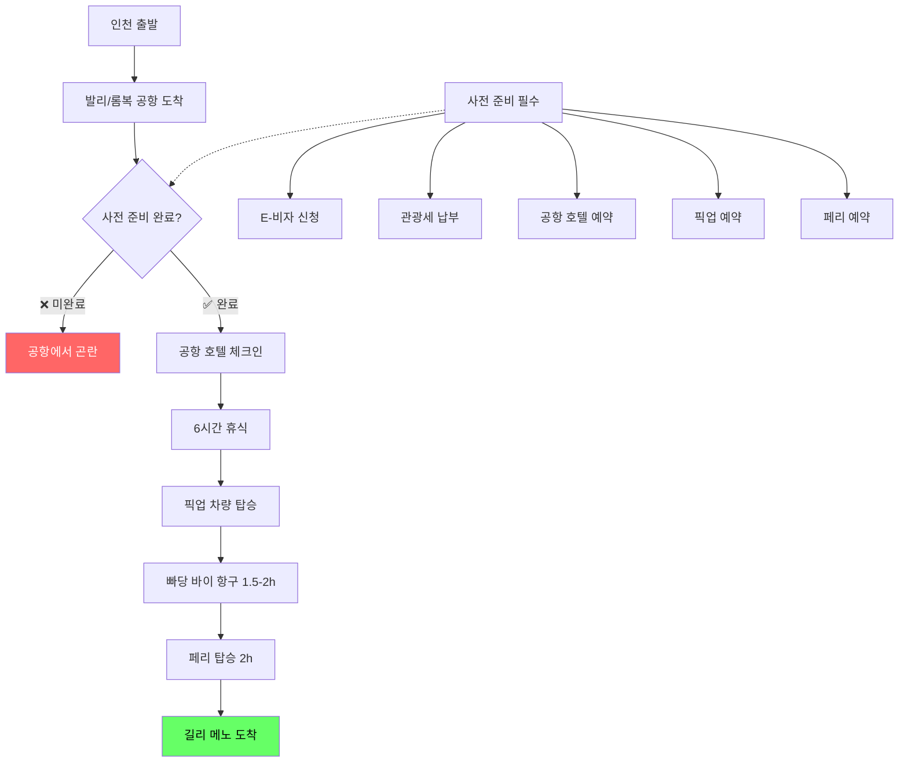
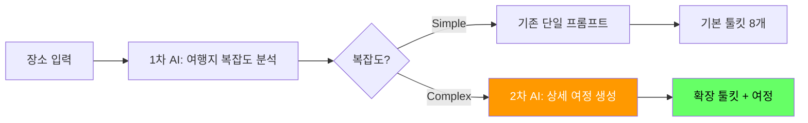

# Phase 8: 복잡한 여행지 특화 시스템 구축 계획

## 📋 현재 상황 분석

### ✅ Phase 7까지 완료된 작업
- 로딩 동기화 완벽 해결
- 콘솔 로그 최적화
- UI/UX 개선 (버튼 제거, 가독성 향상)
- 기본적인 툴킷 8개 카테고리 완성

### 🚨 발견된 핵심 문제 (길리 메노 사례)

#### 현재 툴킷의 한계
```
사용자: "픽업은 어떻게 예약해?"
현재 툴킷: "Eka Jaya나 BlueWater Express를 이용하세요" (텍스트만)
              👆 링크 없음, 예약 방법 없음

사용자: "페리 시간표는?"
현재 툴킷: "쾌속선을 이용하세요" 
              👆 시간표 없음, 예약 링크 없음

사용자: "E-비자는 어떻게 받아?"
현재 툴킷: "VOA 발급 가능" 
              👆 사전 E-비자 필요성 언급 없음
```

#### 길리 메노의 실제 여행 프로세스



---

## 🎯 Phase 8 목표: 복잡한 여행지 특화 시스템

### 비전
**"툴킷에서 모든 예약과 준비를 완료할 수 있는 End-to-End 여행 준비 시스템"**

### 핵심 개념: 2단계 AI 프롬프트 시스템



---

## 🔍 Phase 8-1: 복잡한 여행지 식별 시스템

### 1차 AI 프롬프트: 여행지 복잡도 분석

**목적:** 여행지가 "복잡한 여행지"인지 자동 감지

#### 복잡한 여행지 기준
```javascript
const COMPLEX_DESTINATION_CRITERIA = {
  // 1. 다단계 이동 (Multi-Stage Journey)
  multiStageTravel: {
    airportToDestination: '> 2시간',
    transferCount: '>= 2회',
    ferryRequired: true,
    pickupEssential: true
  },
  
  // 2. 사전 준비 필수 항목 (Pre-Travel Requirements)
  preTravelRequirements: {
    eVisa: true,           // E-비자 사전 신청
    touristTax: true,      // 관광세 사전 납부
    permits: true,         // 특별 허가 필요
    vaccinations: true     // 예방접종 필수
  },
  
  // 3. 제한적 인프라 (Limited Infrastructure)
  limitedInfra: {
    noATM: true,           // ATM 부족
    limitedWifi: true,     // Wi-Fi 불안정
    noUber: true,          // 택시/Grab 불가
    cashOnly: true         // 카드 사용 제한
  },
  
  // 4. 시간 제약 (Time Constraints)
  timeConstraints: {
    ferrySchedule: true,   // 페리 시간표 제한
    airportLayover: '> 3시간', // 공항 대기 시간
    seasonalAccess: true   // 계절 제한
  }
};
```

#### 1차 프롬프트 예시

```javascript
const COMPLEXITY_ANALYSIS_PROMPT = `
당신은 여행지 복잡도 전문 분석가입니다.
다음 장소가 "복잡한 여행지"인지 분석하고 JSON으로 응답하세요:

**장소:** ${locationName}

**분석 기준:**
1. 공항에서 최종 목적지까지 이동 시간과 환승 횟수
2. 사전 준비 필수 항목 (비자, 세금, 허가)
3. 현지 인프라 제약 (ATM, Wi-Fi, 교통수단)
4. 시간 제약 (페리, 계절, 대기시간)

**응답 형식:**
{
  "isComplex": true/false,
  "complexityScore": 0-100,
  "reasons": {
    "multiStageTravel": {
      "required": true/false,
      "stages": ["공항", "항구", "페리", "섬"],
      "totalTime": "4-5시간",
      "details": "발리 공항 → 빠당 바이 항구(1.5-2h) → 페리(2h)"
    },
    "preTravelRequirements": {
      "eVisa": { "required": true, "url": "https://..." },
      "touristTax": { "required": true, "amount": "$10", "url": "https://..." },
      "airportHotel": { "recommended": true, "reason": "페리 시간표 제약" }
    },
    "essentialBookings": [
      {
        "type": "pickup",
        "provider": "Eka Jaya",
        "url": "https://ekajayafast​boat.com/book",
        "why": "공항-항구 이동 필수"
      },
      {
        "type": "ferry",
        "provider": "BlueWater Express",
        "url": "https://www.bluewaterexpress.com/",
        "why": "본섬-길리 메노 유일한 방법"
      }
    ],
    "limitedInfra": {
      "atm": "Very Limited",
      "wifi": "Unstable",
      "cashRecommendation": "충분한 현금 필수"
    }
  },
  "journeyPlan": {
    "timeline": [
      { "step": 1, "action": "인천 출발", "duration": "7시간" },
      { "step": 2, "action": "발리 공항 도착 → 공항 호텔", "duration": "6시간 휴식" },
      { "step": 3, "action": "픽업 → 빠당 바이", "duration": "1.5-2시간" },
      { "step": 4, "action": "페리 탑승", "duration": "2시간" },
      { "step": 5, "action": "길리 메노 도착", "duration": "완료" }
    ]
  }
}
`;
```

---

## 🛠️ Phase 8-2: 확장 툴킷 시스템 설계

### 기존 툴킷 vs 확장 툴킷

#### 기존 툴킷 (Simple Destinations)
```
1. 지도 및 명소
2. 비자 및 서류
3. 항공권
4. 숙박 지역 추천
5. 유심 및 공항픽업
6. 교통 및 패스
7. 필수 앱
8. 안전 및 비상
```

#### 확장 툴킷 (Complex Destinations)
```
🆕 0. 여행 준비 체크리스트 (Pre-Travel Checklist)
   - E-비자 신청 링크
   - 관광세 납부 링크
   - 예방접종 정보
   
🆕 0.5. 상세 여정 플래너 (Journey Planner)
   - 타임라인 시각화
   - 각 단계별 소요시간
   - 대기시간 활용 팁
   
1. 지도 및 명소 (기존 유지)

2. 비자 및 서류 (기존 유지)

3. 항공권 (기존 유지)

🆕 3.5. 공항 → 목적지 이동 (Airport Transfer)
   - 픽업 예약 링크 (Eka Jaya 등)
   - 대안 이동 수단
   - 소요시간 및 비용
   
🆕 3.7. 페리 예약 (Ferry Booking)
   - 페리 예약 링크 (BlueWater Express 등)
   - 시간표
   - 요금
   - 항만세 정보
   
4. 숙박 지역 추천 (기존 유지)

🆕 4.5. 공항 호텔 (Airport Hotel)
   - 환승 대기 시 추천 호텔
   - 예약 링크
   - 픽업 서비스 연계
   
5. 유심 및 공항픽업 (기존 → 분리)
   - 유심만 유지
   - 픽업은 3.5로 이동
   
6. 교통 및 패스 (기존 유지)

7. 필수 앱 (기존 유지)

8. 안전 및 비상 (기존 유지)

🆕 9. 현지 인프라 주의사항 (Local Infrastructure)
   - ATM 위치 및 사용 팁
   - Wi-Fi 상황
   - 현금 필요 금액 추정
```

---

## 💾 데이터 구조 설계

### DB 스키마 확장 (place_wiki 테이블)

```sql
-- 기존 컬럼 유지
ai_practical_info TEXT,
essential_guide JSONB,
ai_info_updated_at TIMESTAMP,

-- 🆕 추가 컬럼
is_complex_destination BOOLEAN DEFAULT false,
complexity_score INTEGER, -- 0-100
complexity_analysis JSONB, -- 1차 AI 분석 결과
journey_plan JSONB, -- 상세 여정 플래너
extended_toolkit JSONB, -- 확장 툴킷 데이터
```

### complexity_analysis 예시

```json
{
  "isComplex": true,
  "complexityScore": 85,
  "reasons": {
    "multiStageTravel": {
      "required": true,
      "stages": ["발리 공항", "빠당 바이 항구", "페리", "길리 메노"],
      "totalTime": "4-5시간"
    },
    "preTravelRequirements": {
      "eVisa": {
        "required": true,
        "url": "https://molina.imigrasi.go.id/",
        "cost": "$35"
      },
      "touristTax": {
        "required": true,
        "url": "https://lovebali.baliprov.go.id/",
        "cost": "IDR 150,000"
      }
    },
    "essentialBookings": [
      {
        "type": "pickup",
        "provider": "Eka Jaya",
        "url": "https://ekajayafastboat.com/",
        "price": "$25-30",
        "includes": ["호텔 픽업", "빠당 바이 이동", "항만세"]
      },
      {
        "type": "ferry",
        "provider": "BlueWater Express",
        "url": "https://www.bluewaterexpress.com/",
        "price": "$35-45",
        "schedule": ["09:30", "11:00", "14:00", "16:30"]
      }
    ]
  }
}
```

---

## 🚀 구현 단계

### Phase 8-1: 백엔드 2단계 프롬프트 시스템

#### Step 1: 1차 AI 호출 (복잡도 분석)
```typescript
// supabase/functions/update-place-wiki/index.ts

async function analyzeComplexity(locationName: string) {
  const prompt = COMPLEXITY_ANALYSIS_PROMPT(locationName);
  
  const response = await fetch(`https://generativelanguage.googleapis.com/v1beta/models/gemini-2.5-pro:generateContent?key=${apiKey}`, {
    method: 'POST',
    headers: { 'Content-Type': 'application/json' },
    body: JSON.stringify({
      generationConfig: { responseMimeType: "application/json" },
      contents: [{ role: 'user', parts: [{ text: prompt }] }]
    })
  });
  
  const data = await response.json();
  return JSON.parse(data.candidates[0].content.parts[0].text);
}
```

#### Step 2: 조건부 2차 AI 호출
```typescript
const complexityData = await analyzeComplexity(locationName);

let toolkitContent;
if (complexityData.isComplex && complexityData.complexityScore > 70) {
  // 복잡한 여행지: 확장 프롬프트 사용
  toolkitContent = await generateExtendedToolkit(locationName, complexityData);
} else {
  // 일반 여행지: 기존 프롬프트 사용
  toolkitContent = await generateStandardToolkit(locationName);
}
```

#### Step 3: DB 저장
```typescript
await supabaseAdmin
  .from('place_wiki')
  .update({
    ai_practical_info: toolkitContent.markdown,
    is_complex_destination: complexityData.isComplex,
    complexity_score: complexityData.complexityScore,
    complexity_analysis: complexityData,
    journey_plan: complexityData.journeyPlan,
    ai_info_updated_at: new Date().toISOString()
  })
  .eq('place_id', placeId);
```

---

### Phase 8-2: 프론트엔드 확장 툴킷 UI

#### 새로운 컴포넌트

**1. PreTravelChecklist.jsx**
```jsx
const PreTravelChecklist = ({ requirements }) => {
  return (
    <div className="bg-amber-50 border-2 border-amber-300 rounded-2xl p-5 mb-5">
      <h3 className="font-bold text-amber-900 mb-3 flex items-center gap-2">
        <AlertCircle className="text-amber-600" />
        출발 전 필수 준비사항
      </h3>
      
      <div className="space-y-3">
        {requirements.eVisa && (
          <ChecklistItem
            icon={FileText}
            title="E-비자 신청"
            description={`비용: ${requirements.eVisa.cost}`}
            link={requirements.eVisa.url}
            linkText="신청하기"
          />
        )}
        
        {requirements.touristTax && (
          <ChecklistItem
            icon={DollarSign}
            title="관광세 사전 납부"
            description={`비용: ${requirements.touristTax.cost}`}
            link={requirements.touristTax.url}
            linkText="납부하기"
          />
        )}
      </div>
    </div>
  );
};
```

**2. JourneyTimeline.jsx**
```jsx
const JourneyTimeline = ({ timeline }) => {
  return (
    <div className="bg-blue-50 border border-blue-200 rounded-2xl p-5 mb-5">
      <h3 className="font-bold text-blue-900 mb-4">상세 여정 플래너</h3>
      
      <div className="relative">
        {timeline.map((step, idx) => (
          <TimelineStep
            key={idx}
            step={step.step}
            action={step.action}
            duration={step.duration}
            isLast={idx === timeline.length - 1}
          />
        ))}
      </div>
    </div>
  );
};
```

**3. ExtendedToolkitCard (기존 확장)**
```jsx
// 새로운 타입 추가
const EXTENDED_TYPES = {
  'pre_travel_checklist': {
    icon: Clipboard,
    title: '출발 전 체크리스트',
    themeColor: 'amber'
  },
  'journey_planner': {
    icon: MapPin,
    title: '상세 여정 플래너',
    themeColor: 'blue'
  },
  'airport_transfer': {
    icon: Car,
    title: '공항 → 목적지 이동',
    themeColor: 'indigo'
  },
  'ferry_booking': {
    icon: Ship,
    title: '페리 예약',
    themeColor: 'cyan'
  },
  'airport_hotel': {
    icon: Hotel,
    title: '공항 호텔',
    themeColor: 'purple'
  },
  'local_infra': {
    icon: AlertTriangle,
    title: '현지 인프라 주의사항',
    themeColor: 'orange'
  }
};
```

---

### Phase 8-3: 복잡한 여행지 리스트 관리

#### 수동 리스트 관리 (초기)
```javascript
// src/shared/constants.js

export const COMPLEX_DESTINATIONS = [
  {
    name: '길리 메노',
    nameEn: 'Gili Meno',
    country: '인도네시아',
    complexityScore: 85,
    reasons: ['다단계 이동', 'E-비자', '페리 필수', 'ATM 제한']
  },
  {
    name: '보라카이',
    nameEn: 'Boracay',
    country: '필리핀',
    complexityScore: 78,
    reasons: ['공항 환승', '보트 필수', 'eTravel 등록']
  },
  {
    name: '라다크',
    nameEn: 'Ladakh',
    country: '인도',
    complexityScore: 92,
    reasons: ['고산지대', 'Inner Line Permit', '계절 제한', '고산병']
  }
  // ... 더 추가
];
```

#### 자동 감지 (AI 기반)
```javascript
// 장소 입력 시 자동으로 1차 AI 호출하여 복잡도 분석
const isInComplexList = COMPLEX_DESTINATIONS.some(
  dest => dest.nameEn === location.name
);

if (isInComplexList || autoDetected) {
  // 확장 툴킷 요청
  requestExtendedToolkit();
}
```

---

## 📋 Phase 8 상세 TODO

### Phase 8-1: 백엔드 2단계 프롬프트 (2-3시간)
- [ ] 1차 AI 복잡도 분석 프롬프트 작성
- [ ] 2차 AI 확장 툴킷 프롬프트 작성
- [ ] `update-place-wiki` 함수 로직 분기 추가
- [ ] DB 스키마 확장 (새 컬럼 추가)
- [ ] 테스트 (길리 메노, 보라카이 등)
- [ ] 배포

### Phase 8-2: 프론트엔드 확장 UI (3-4시간)
- [ ] `PreTravelChecklist` 컴포넌트 생성
- [ ] `JourneyTimeline` 컴포넌트 생성
- [ ] `ExtendedToolkitCard` 타입 추가
- [ ] `ToolkitTab.jsx` 조건부 렌더링 로직
- [ ] 새로운 아이콘 import (Ship, Car, Hotel 등)
- [ ] 스타일링 및 반응형 최적화

### Phase 8-3: 복잡한 여행지 리스트 (1시간)
- [ ] `COMPLEX_DESTINATIONS` 상수 정의
- [ ] 자동 감지 로직 구현
- [ ] 테스트 케이스 작성

### Phase 8-4: 예약 링크 통합 (2시간)
- [ ] Eka Jaya, BlueWater Express 제휴 확인
- [ ] 딥링크 생성 로직
- [ ] 트래킹 파라미터 추가
- [ ] 버튼 UI 개선

### Phase 8-5: 테스트 및 검증 (1-2시간)
- [ ] 길리 메노 전체 플로우 테스트
- [ ] 보라카이 테스트
- [ ] 일반 여행지(파리, 도쿄) 정상 작동 확인
- [ ] 모바일 UX 검증

---

## 🎨 UI/UX 목업

### 복잡한 여행지 툴킷 레이아웃

```
┌────────────────────────────────────────────┐
│ 🏗️ 스마트 트래블 툴킷                      │
│ 길리 메노 여행을 위한 생존 정보              │
│                                            │
│ ⚠️ 이 여행지는 복잡한 준비가 필요합니다       │
│ 복잡도: ████████░░ 85/100                  │
└────────────────────────────────────────────┘

┌────────────────────────────────────────────┐
│ 📋 출발 전 필수 체크리스트                   │
│ ─────────────────────────────────────────  │
│ ✅ E-비자 신청 ($35)          [신청하기 →]  │
│ ✅ 관광세 납부 (IDR 150,000) [납부하기 →]  │
│ ✅ 공항 호텔 예약              [검색하기 →]  │
└────────────────────────────────────────────┘

┌────────────────────────────────────────────┐
│ 🗺️ 상세 여정 플래너 (총 소요: 약 11시간)    │
│ ─────────────────────────────────────────  │
│ 1️⃣ 인천 출발 ✈️ (7시간)                     │
│   ↓                                        │
│ 2️⃣ 발리 공항 도착 → 공항 호텔 🏨 (6시간)     │
│   ↓                                        │
│ 3️⃣ 픽업 → 빠당 바이 🚗 (1.5-2시간)          │
│   ↓                                        │
│ 4️⃣ 페리 탑승 ⛴️ (2시간)                      │
│   ↓                                        │
│ 5️⃣ 길리 메노 도착 🏝️ 완료!                   │
└────────────────────────────────────────────┘

[기존 8개 툴킷 카드]

┌────────────────────────────────────────────┐
│ 🚗 공항 → 목적지 이동                        │
│ ─────────────────────────────────────────  │
│ 발리 공항에서 빠당 바이 항구까지 픽업 서비스를│
│ 이용하세요. Eka Jaya는 호텔 픽업, 이동,     │
│ 항만세를 모두 포함합니다.                    │
│                                            │
│ [Eka Jaya 예약 →] [BlueWater 예약 →]      │
└────────────────────────────────────────────┘

┌────────────────────────────────────────────┐
│ ⛴️ 페리 예약                                 │
│ ─────────────────────────────────────────  │
│ 운항 시간: 09:30, 11:00, 14:00, 16:30      │
│ 소요시간: 약 2시간                          │
│ 요금: $35-45 (항만세 포함)                  │
│                                            │
│ [BlueWater Express →] [Eka Jaya →]        │
└────────────────────────────────────────────┘
```

---

## 🌟 최종 목표: End-to-End 여행 준비 완성

### 사용자 시나리오 (Before vs After)

#### Before (현재)
```
사용자: "길리 메노 가려는데..."
1. 툴킷 확인 → "쾌속선 이용하세요" (텍스트만)
2. 구글 검색 → "Eka Jaya 페리"
3. 공식 사이트 찾기
4. 시간표 확인
5. 예약 방법 찾기
6. 이메일로 예약...
7. E-비자? 뭐지? → 다시 검색
8. 관광세? → 또 검색
9. 공항 호텔? → 계속 검색...

👆 시간 낭비, 정보 분산, 불안감
```

#### After (Phase 8 완성)
```
사용자: "길리 메노 가려는데..."
1. 툴킷 진입 → "복잡한 여행지입니다" 알림
2. 체크리스트 확인 → E-비자 [신청하기] 클릭
3. 관광세 [납부하기] 클릭
4. 상세 여정 플래너 확인 → 전체 흐름 파악
5. 공항 호텔 [예약하기] 클릭
6. 픽업 예약 [Eka Jaya] 클릭
7. 페리 예약 [BlueWater] 클릭
8. ✅ 모든 준비 완료!

👆 한 곳에서 모든 예약 완료, 안심
```

---

## 📊 예상 개발 일정

| Phase | 작업 내용 | 예상 시간 | 우선순위 |
|-------|----------|----------|---------|
| 8-1 | 백엔드 2단계 프롬프트 | 2-3시간 | High |
| 8-2 | 프론트엔드 확장 UI | 3-4시간 | High |
| 8-3 | 복잡한 여행지 리스트 | 1시간 | Medium |
| 8-4 | 예약 링크 통합 | 2시간 | High |
| 8-5 | 테스트 및 검증 | 1-2시간 | High |
| **합계** | | **9-12시간** | |

---

## 🚀 Phase 8 이후 로드맵

### Phase 9: 개인화 및 자동화
- [ ] 사용자 여행 일정 연동
- [ ] 출발일 기준 알림 시스템
- [ ] 체크리스트 진행률 추적

### Phase 10: 모바일 앱 전환
- [ ] PWA 오프라인 지원
- [ ] 푸시 알림 (페리 시간 등)
- [ ] 위치 기반 자동 안내

### Phase 11: 커뮤니티 기능
- [ ] 실제 여행자 리뷰
- [ ] 최신 정보 업데이트
- [ ] Q&A 커뮤니티

---

## 💡 기술적 고려사항

### 1. AI 비용 최적화
```
- 1차 분석: 짧은 프롬프트 → 저비용
- 2차 확장: 복잡한 여행지만 호출 → 선택적 비용
- 캐싱: 복잡도 분석 결과 재사용
```

### 2. 데이터 정확성
```
- 예약 링크 정기 검증 (월 1회)
- 여행자 피드백 수집
- 공식 사이트 변경 모니터링
```

### 3. 확장성
```
- 복잡한 여행지 타입별 템플릿
  * 섬 여행지 (길리, 보라카이)
  * 고산 지대 (라다크, 히말라야)
  * 오지 (사하라, 아마존)
  * 비자 복잡 (러시아, 인도)
```

---

## 📝 다음 세션 시작 전 준비사항

### 사용자(개발자) 준비
1. [ ] 길리 메노 외 복잡한 여행지 리스트 작성 (5-10개)
2. [ ] 각 여행지별 필수 예약 링크 조사
3. [ ] 제휴 가능한 예약 사이트 검토 (수익화)

### AI(Architect) 준비
1. [ ] 1차 복잡도 분석 프롬프트 초안 작성
2. [ ] 2차 확장 툴킷 프롬프트 초안 작성
3. [ ] DB 스키마 변경 SQL 작성
4. [ ] 프론트엔드 컴포넌트 구조 설계

---

**작성일**: 2026-03-30  
**다음 세션 목표**: Phase 8-1, 8-2 완료 (백엔드 + 프론트엔드 기본)  
**최종 비전**: "여행 준비의 모든 것을 한 곳에서" 🌍✨
