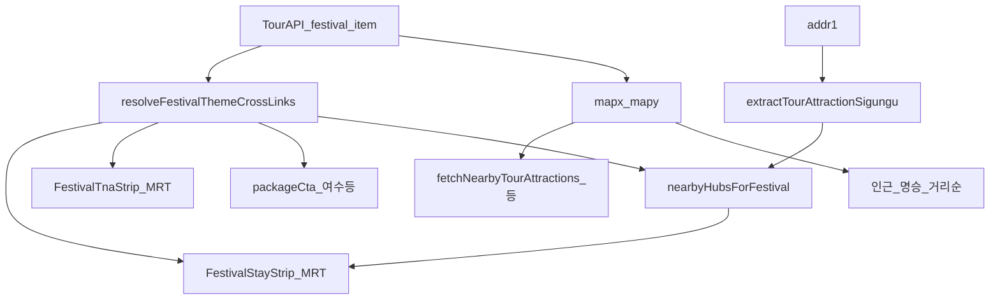

# 축제·명승·여행지 → 숙소·투어·주변 정보 1차 매칭 플랜

**상태**: P1–P2 적용 (2026-09-20) · `cursor/korea-theme` tip `16c0d166` · Preview `/qa/korea-theme`  
**제품 목표 (사용자 확인)**: 축제·명소·여행지를 고르면 **2차 검색·권역 칩 선택 없이** 숙소·투어·갤러리·주변(Tour)·코스가 **같은 여행지 앵커**로 맞물려야 한다. 행사별·지역별 **MRT 오버라이드 나열은 목표가 아님**.

**관련 SSOT**: [`korea-theme-travel-plan.md`](./korea-theme-travel-plan.md) **§2.5** · [`korea-festival-hub-plan.md`](./korea-festival-hub-plan.md) · 코드 `koreaThemeCrossLinks.js` · `nearbyFestivalHubs.js` · `koreaTourAttractionLocality.js`

---

## 1. 현재 구조 (as-built)

### 1.1 조인키 (의도 — §2.5.1)

| 순위 | 키 | 숙소·투어 | 주변 관광·맛집·레포츠 | 비고 |
|------|----|-----------|----------------------|------|
| 1 | `hubId` + `placeSlug` | 테마 모달 | local scenic 그룹 | 멤버십 인덱스 |
| 2 | `hubId` | MRT stay/tna keyword | — | `cityAttractionHubs` |
| 3 | TourAPI `areaCode` | 시도 시드·deep-link | 코스·맛집 area 필터 | `koreaAreaCodes.json` |
| 4 | `lat`/`lng` | 인근 hub 순위 | **반경 API** (8km 등) | `nearbyHubsForFestival` |
| 5 | `contentId` | — | Tour LIVE 상세 | 매칭 1차 아님 |

### 1.2 축제 상세 데이터 경로 (분리 주의)



- **주변 관광지·맛집·레포츠·문화**: 축제 **좌표** 기준 — 행사지 주변은 대체로 맞음.
- **숙소·투어·패키지 CTA**: **`festivalCross`** — `addr1`→시·군→hub·`resolveStayTnaHubId` — **여기서 어긋나면 “여수 숙소”류 노이즈**.
- **추천 숙소 권역 칩**: `buildFestivalStayAreas` — **대안 숙박 도시**용. 1차 UX를 대체하면 안 됨.

### 1.3 MRT 키워드

- 테마·축제 공통: `buildThemeSpotLocation` → `resolveMrtStayQuery` / `resolveMrtTnaQuery` (PlaceCard와 동일 래더).
- **테마 전용 키워드 SSOT 신규 금지** (§2.5.3) — 구조적 매칭 수정이 정답.

---

## 2. 목표 동작 (1차 앵커 정의)

행사·POI·테마 spot에 대해 **단일 primary hub** (또는 hub 없을 때 **시·군 parentCity**)를 정하고, 아래가 **같은 앵커**를 쓴다.

| 표면 | 기대 |
|------|------|
| 숙소 strip | check-in/out + **행사지 hub** MRT |
| 투어 strip | 동일 keyword/hub |
| 패키지 CTA | **stay hub와 package 키가 일치할 때만** (곡성 축제 → 여수 패키지 숨김) |
| 인근 hub / 명승 링크 | geo + membership (기존) |
| 주변 Tour API | geo (기존 유지) |

**권역 칩**: 인천↔강화·옹jin 등 **의도된 폴백**만 (기존 스모크: 학산·왕가의 산책·대청도). **파싱 실패로 시도 1번(여수) 강제**는 제품 목표 아님.

---

## 3. 문제 진단 (SIEAF = 대표 회귀)

**케이스**: 2026 섬진강국제실험예술제 — `전남광주통합특별시 곡성군 죽곡면 …`

| 단계 | 기대 | 실제 |
|------|------|------|
| `extractTourAttractionSigungu` | `곡성군` | `전남광주통합특별시` (오류) |
| `hubFromFestivalAddr` | `gokseong` | 실패 |
| geo 최근접 시드 (35.275,127.295) | `gokseong` (~0.8km) | 순위상 1위이나… |
| `finalizeNearby` | addr 일치 또는 geo 1위 유지 | 시·군 불일치 → **시도 시드 1번 `yeosu` 승격** |
| `resolveStayTnaHubId` + area `38` | `gokseong` | **`yeosu`** (`hubIdsForArea('38')[0]`) |
| UI | 곡성 숙소 기본 | **여수** 기본 · 칩으로만 곡성 |

**같은 addr 형식 영향 (전남, 스모크 미등록)**  
`전남광주통합특별시` + `{구례|담양|여수|곡성}군/시` → sigungu가 통합시로 잡히면 **전부 yeosu 1차** (여수시 주소만 우연히 맞음).

**근본 원인 (3층)**

1. **주소 정규화 SSOT 분열**  
   - `scripts/lib/tourapi-attraction-infer.mjs` 는 `전남광주` 인지.  
   - **`koreaTourAttractionLocality.js`** 의 `SIDO_PREFIX_RE` 는 `전남`만 매칭 → `광주통합특별시 …` 잔재 → **통합특별시를 시·군으로 오인**.  
   - `resolveKoreaDestinationFirstPass` · Mapbox first-pass도 동일 locality 의존.

2. **매처 정책: “시도 대표 hub 우선”이 파싱 실패와 결합**  
   - `nearbyFestivalHubs.finalizeNearby`: addr hub 없고 1위 geo hub가 sigungu와 이름 불일치 → **`hubIdsForArea(sido)[0]`** 승격 (전남=여수).  
   - `resolveStayTnaHubId`: non-seeded·불일치 시 **`hubIdsForArea(areaCode)[0]`** (역시 여수).

3. **검증 공백**  
   - `smoke:korea-theme-cross-links` 에 **전남광주통합 addr**·**곡성 축제** fixture 없음.  
   - `smoke:korea-festival-stay-url` 은 UI 배선·일정만, **hub 정확도 미검**.

---

## 4. “오버라이드”가 아닌 해결 방향

| 하지 않을 것 | 할 것 |
|--------------|--------|
| SIEAF·곡성만 `KO_MRT_STAY_KEYWORD_OVERRIDES` | **공통 addr 정규화** 한 곳에서 시·군 추출 |
| 축제 contentId별 hub 수동表 | **addr + geo + hub catalog** 규칙 강화 |
| 칩 UI만 기본값 변경 | **`festivalCross.stay` 1차 앵커** 수정 → strip·tna·package 자동 정합 |

---

## 5. 작업 단계 (권장 순서)

### P0 — 앵커 규칙 문서화 (§2 보완)

- [`korea-theme-travel-plan.md`](./korea-theme-travel-plan.md) §2.5.3에 **축제 1차 hub 우선순위** 1문단 추가 (아래 초안).  
- “칩 = 대안, default = 행사지 hub” 명시.

**초안 우선순위 (축제)**  
1) `addr1` 시·군·구 ↔ `cityAttractionHub` exact / alias  
2) 동일 시도 내 **geo 최근접 seeded hub** (120km)  
3) 시도 **대표 hub** — **sigungu 파싱 성공·명시적 불일치**(횡성↔평창 패턴)일 때만  
4) `stayAreas`·altKeywords — 인접 시드만

### P1 — 주소 정규화 SSOT 통합 (로직, 소범위)

- **단일 모듈** (예: `koreaTourAddrNormalize.js` 또는 infer 스크립트 공유 패키지)  
  - 접두: `전남광주통합특별시`, (향후) 기타 통합·개편 표기  
  - `전남` 단독 매칭은 **통합 접두 뒤에만** 적용  
- 소비처: `koreaTourAttractionLocality.js` · 필요 시 `festivalRegionTags` · `resolveKoreaDestinationFirstPass`  
- **VERIFY**: unit-style assert in `smoke:korea-festival-nearby` or `smoke:korea-theme-cross-links`

### P2 — `nearbyHubsForFestival` / `resolveStayTnaHubId` 정합

- **파싱 실패 휴리스틱**: sigungu가 `통합특별시|광역시` 단독·시도명만이면 **geo 1위 seeded hub** 사용, 시도 1번 승격 금지.  
- **`finalizeNearby`**: 승격 조건에 “sigungu 추출 신뢰도” 게이트.  
- **`resolveFestivalThemeCrossLinks`**: `nearestHubId` = addr hub ?? geo 1위 (same sido) — theme cross에 명시 전달.  
- **패키지**: `cross.stay.location.hubId` ≠ `packageCta` hub면 CTA 숨김 (여수 패키지 오노출).

### P3 — 회귀 fixture · 관측

| fixture | assert |
|---------|--------|
| SIEAF addr + 곡성 좌표 | `stay.location.hubId === 'gokseong'`, keyword 곡성 |
| `전남광주통합특별시 담양군 …` | `damyang`, not yeosu |
| 기존 인천·옹진·횡성 계열 | 스모크 유지 |
| `전라남도 곡성군` | 곡성 (레거시 addr) |

- (선택) `audit:festival-stay-anchor`: 캐시/롤링12 축제 샘플 N건 — addr sigungu vs cross hub 불일치율 리포트 (CI 비필수).

### P4 — UX (매처 PASS 후)

- `FestivalStayStrip` / `EventStayStrip`: 1차 placeLabel = cross (수정 후 자동).  
- 칩 순서: **primary hub 첫 칩·기본 선택** — 인접만 뒤.follow  
- 명승 모달·축제 동일 `resolveFestivalThemeCrossLinks` 경로 재확인 (로직 복제 금지).

---

## 6. 성공 기준 (이 트랙 완료)

- [ ] SIEAF(및 전남광주통합 addr) Preview: **오픈 즉시 곡성 숙소·투어**, 여수 패키지 없음.  
- [ ] 주변 관광 API는 기존처럼 행사 좌표 기준 (회귀 없음).  
- [ ] `npm run smoke:korea-theme-cross-links` · `smoke:korea-festival-nearby` PASS + 신규 fixture.  
- [ ] `/korea` 지도·칩·캐시 **리팩터 없음** (§2.5.6).

---

## 7. 금지

- 축제별 curated JSON · MRT per-event override  
- `FestivalDetailSheet` 지도/지역 칩 코어 변경  
- `hubIdsForArea('38')` 순서만 바꿔 여수↔곡성 **순서 땜질** (다른 군·시 동일 문제 잔존)

---

## 8. 다음 세션 제시어

```
축제-여행지매칭 #2, P3 회귀·Preview SIEAF
@plans/feature-handoff-index.md
@plans/festival-destination-matching-plan.md §5 P3
브랜치 cursor/korea-theme · smoke:korea-theme-cross-links · Preview /korea 에서 섬진강국제실험예술제 숙소·투어 곡성 1차
```

---

## 9. 변경 이력

| 날짜 | 내용 |
|------|------|
| 2026-09-20 | SIEAF·여수 오매칭 조사, as-built·3층 원인·P0–P4 로드맵 (분석 세션) |
| 2026-09-20 | **#1** P1 `koreaTourAddrNormalize` · P2 `nearbyFestivalHubs`·`resolveFestivalThemeCrossLinks` · SIEAF 스모크 · tip `16c0d166` |
