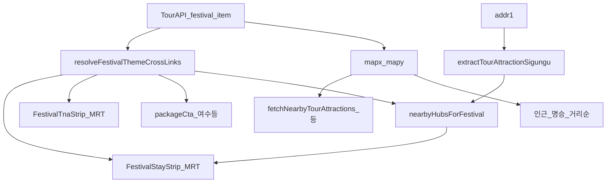

# 축제·명승·여행지 → 숙소·투어·주변 정보 1차 매칭 플랜

**상태**: P0 ✅ · P1–P2 ✅ (`cursor/korea-theme` tip `bbef2b3d`~`011f75ff`) · **다음 P3** · Preview `/qa/korea-theme`  
**제품 목표 (사용자 확인)**: 축제·명소·여행지를 고르면 **2차 검색·권역 칩 선택 없이** 숙소·투어·갤러리·주변(Tour)·코스가 **같은 여행지 앵커**로 맞물려야 한다. 행사별·지역별 **MRT 오버라이드 나열은 목표가 아님**.

**관련 SSOT**: [`korea-theme-travel-plan.md`](./korea-theme-travel-plan.md) **§2.5** · [`korea-festival-hub-plan.md`](./korea-festival-hub-plan.md) · 코드 `koreaThemeCrossLinks.js` · `nearbyFestivalHubs.js` · `koreaTourAttractionLocality.js`

---

## 1. 현재 구조 (as-built)

### 1.1 조인키 (의도 — §2.5.1)

| 순위 | 키 | 숙소·투어 | 주변 관광·맛집·레포츠 | 비고 |
|------|----|-----------|----------------------|------|
| 1 | `hubId` + `placeSlug` | 테마 모달 | local scenic 그룹 | 멤버십 인덱스 |
| 2 | `hubId` | MRT stay/tna keyword | — | `cityAttractionHubs` |
| 3 | TourAPI `areaCode` | 시도 시드·deep-link | 코스·맛집 area 필터 | `koreaAreaCodes.json` |
| 4 | `lat`/`lng` | 인근 hub 순위 | **반경 API** (8km 등) | `nearbyHubsForFestival` |
| 5 | `contentId` | — | Tour LIVE 상세 | 매칭 1차 아님 |

### 1.2 축제 상세 데이터 경로 (분리 주의)



- **주변 관광지·맛집·레포츠·문화**: 축제 **좌표** 기준 — 행사지 주변은 대체로 맞음.
- **숙소·투어·패키지 CTA**: **`festivalCross`** — `addr1`→시·군→hub·`resolveStayTnaHubId` — **여기서 어긋나면 “여수 숙소”류 노이즈**.
- **추천 숙소 권역 칩**: `buildFestivalStayAreas` — **대안 숙박 도시**용. 1차 UX를 대체하면 안 됨.

### 1.3 MRT 키워드

- 테마·축제 공통: `buildThemeSpotLocation` → `resolveMrtStayQuery` / `resolveMrtTnaQuery` (PlaceCard와 동일 래더).
- **테마 전용 키워드 SSOT 신규 금지** (§2.5.3) — 구조적 매칭 수정이 정답.

---

## 2. 목표 동작 (1차 앵커 정의)

행사·POI·테마 spot에 대해 **단일 primary hub** (또는 hub 없을 때 **시·군 parentCity**)를 정하고, 아래가 **같은 앵커**를 쓴다.

| 표면 | 기대 |
|------|------|
| 숙소 strip | check-in/out + **행사지 hub** MRT |
| 투어 strip | 동일 keyword/hub |
| 패키지 CTA | **stay hub와 package 키가 일치할 때만** (곡성 축제 → 여수 패키지 숨김) |
| 인근 hub / 명승 링크 | geo + membership (기존) |
| 주변 Tour API | geo (기존 유지) |

**권역 칩**: 인천↔강화·옹jin 등 **의도된 폴백**만 (기존 스모크: 학산·왕가의 산책·대청도). **파싱 실패로 시도 1번(여수) 강제**는 제품 목표 아님.

---

## 3. 문제 진단 (SIEAF = 대표 회귀)

**케이스**: 2026 섬진강국제실험예술제 — `전남광주통합특별시 곡성군 죽곡면 …`

| 단계 | 기대 | 실제 (수정 전) |
|------|------|----------------|
| `extractTourAttractionSigungu` | `곡성군` | `전남광주통합특별시` (오류) |
| `hubFromFestivalAddr` | `gokseong` | 실패 |
| geo 최근접 시드 (35.275,127.295) | `gokseong` (~0.8km) | 순위상 1위이나… |
| `finalizeNearby` | addr 일치 또는 geo 1위 유지 | 시·군 불일치 → **시도 시드 1번 `yeosu` 승격** |
| `resolveStayTnaHubId` + area `38` | `gokseong` | **`yeosu`** |
| UI | 곡성 숙소 기본 | **여수** 기본 · 칩으로만 곡성 |

**#1 세션(P1–P2)** 으로 addr·매처·SIEAF 스모크 반영 — Preview QA 기준 곡성 1차.

---

## 4. “오버라이드”가 아닌 해결 방향

| 하지 않을 것 | 할 것 |
|--------------|--------|
| SIEAF·곡성만 `KO_MRT_STAY_KEYWORD_OVERRIDES` | **공통 addr 정규화** 한 곳에서 시·군 추출 |
| 축제 contentId별 hub 수동表 | **addr + geo + hub catalog** 규칙 강화 |
| 칩 UI만 기본값 변경 | **`festivalCross.stay` 1차 앵커** 수정 → strip·tna·package 자동 정합 |

---

## 5. 작업 단계 (권장 순서)

**세션 `#N` = 채팅 순번** · **Px = 단계 코드** · **Px 건너뛰기 금지** (단, 초안 §8처럼 **P1–P2를 한 세션에 묶는 것**은 허용 — 그때 다음은 **P3**).

| 단계 | 내용 | 상태 (2026-09-20) | 다음 제시어 (미완일 때) |
|------|------|-------------------|-------------------------|
| **P0** | §2.5.3 축제 default hub 규칙 문서 | ✅ main | — |
| **P1** | 주소 SSOT (`전남광주통합특별시` 등) | ✅ `#1` `16c0d166` | — |
| **P2** | 매처 · 패키지 CTA 가드 | ✅ `#1` `bbef2b3d` 등 | — |
| **P3** | 회귀 fixture 정리 · (선택) audit · **사람 Preview 재확인** | ⏳ | `#3, P3` (아래 §8) |
| **P4** | UX (칩 순서·default) | ⏳ | `#4, P4` |

### P0는 언제?

**코드 PR 전** · **main docs-only** · Preview 불필요. 분석 직후 또는 P1과 같은 날 가능. §2.5.3 불릿 반영 = **P0 완료** (9/20). P1 세션 **전에** 안 했어도, 문서만이면 지금 완료로 보면 됨.

### P1만 했다고 생각했는데 P3 제시어가 나온 이유

- 일지·핸드오ff **채팅 제목**은 `P1 주소 SSOT`인데, **실제 커밋**은 P1(`16c0d166`) + **P2**(`bbef2b3d` cross-links·패키지 가드) + SIEAF 스모크까지 포함.
- 초안 §8 `@ §5 P1–P2` 가 **한 세션에 P2까지 하라**는 뜻이었고, 그래서 **다음은 P3가 맞음** (P2를 안 했다면 `#2, P2`가 맞음).

**P1만 끝난 경우 판정**: feature에 `16c0d166`만 있고 `finalizeNearby`/패키지 CTA 가드 없으면 → **다음 P2**.

### P0 — 앵커 규칙 문서화 ✅

§2.5.3 **축제 default hub** 4단 + 칩=대안 — [`korea-theme-travel-plan.md`](./korea-theme-travel-plan.md).

### P1 — 주소 정규화 ✅

`koreaTourAddrNormalize` · `koreaTourAttractionLocality` — commit `16c0d166`.

### P2 — 매처 · 패키지 ✅

`nearbyFestivalHubs` · `resolveFestivalThemeCrossLinks` — `bbef2b3d` 등.

### P3 — 회귀 fixture · 관측 ⏳

| fixture | assert |
|---------|--------|
| SIEAF addr + 곡성 좌표 | `stay.location.hubId === 'gokseong'`, keyword 곡성 |
| `전남광주통합특별시 담양군 …` | `damyang`, not yeosu |
| 기존 인천·옹진·횡성 계열 | 스모크 유지 |
| `전라남도 곡성군` | 곡성 (레거시 addr) |

- (선택) `audit:festival-stay-anchor`: 롤링12 샘플 불일치율

### P4 — UX (매cher PASS 후)

칩 순서·primary default · strip 자동 정합.

---

## 6. 성공 기준 (이 트랙 완료)

- [x] SIEAF Preview: 곡성 숙소·투어 1차 (#1 QA)
- [ ] P3: 스모크·audit 정리 · main merge 후 PROD
- [ ] `/korea` 지도·칩·캐시 **리팩터 없음**

---

## 7. 금지

- 축제별 curated JSON · MRT per-event override  
- `FestivalDetailSheet` 지도/지역 칩 코어 변경  
- `hubIdsForArea('38')` 순서만 바꿔 **순서 땜질**

---

## 8. 다음 세션 제시어

**현재 첫 ⏳ = P3** (P1–P2 feature tip 반영됨).

```
축제-여행지매칭 #3, P3 회귀·Preview SIEAF
@plans/feature-handoff-index.md
@plans/festival-destination-matching-plan.md §5 P3
브랜치 cursor/korea-theme · smoke:korea-theme-cross-links · Preview /korea 섬진강국제실험예술제
```

(P2만 미완이면 `#2, P2 매처` · P1만 미완이면 `#1, P1 주소 SSOT`.)

---

## 9. 변경 이력

| 날짜 | 내용 |
|------|------|
| 2026-09-20 | SIEAF 분석·P0–P4 로드맵 |
| 2026-09-20 | **#1** P1 `16c0d166` · P2 `bbef2b3d` · SIEAF 스모크 |
| 2026-09-20 | P0 §2.5.3 · §5 진행표 · P1–P2→P3 제시어 정정 |
