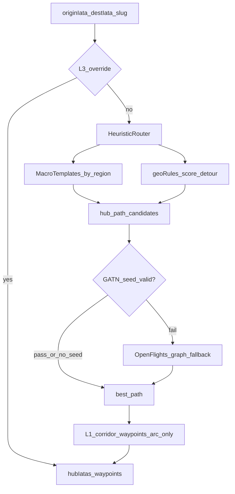

# 항공 경로 개선 플랜 — 규칙 SSOT + GATN 얇은 seed

**작성**: 2026-06-30  
**상태**: **플랜 ✅** · **dest 코퍼스·Phase 0 ✅** · **S1~S5 ✅** (`2026-07-12`) · **다음 = Phase 6 QA·릴리스**
**관련**: [`.ai-context.md`](../.ai-context.md) 6절 · [`flight-route-database-plan.md`](./flight-route-database-plan.md) · 일지 [`2026-07-12-project-log.md`](./2026-07-12-project-log.md)

## 배경·목표

**현재 문제**
- [`air_routes`](supabase/migrations/20260621130000_air_routes.sql) = OpenFlights 2014 스냅샷 → ICN→CDG 누락, graph-direct 오탐 ~78건, hub-override 76건
- 런타임 우선순위: **override → heuristic(+seed) → graph → corridor** ([`globeFlightCinema.js`](src/pages/Home/lib/globeFlightCinema.js) `resolveFlightRoutePlan`) — S4 ✅
- OpenFlights graph는 fallback · hub-override 축소는 S5

**목표 (이번 대화 합의)**
- **로컬 세션**으로 진행 (Cloud Agent 미사용)
- **Heuristic 규칙**을 1차 SSOT로 — 지형·hub tier·권역 관문·detour
- **GATN pax**에서 관문 outbound만 추출 → 연결성 **검증 seed** (전체 graph 교체 아님)
- 271 slug **전수 audit** → override 점진 축소, 플래너 탭 샘플 QA

**비목표**
- 실제 항공사 스케줄·운임 정확도
- FlightAirMap 도입
- `travelSpotAirports.json` / `travelSpots.js` 직접 편집

---

## 목표 아키텍처



**런타임 우선순위 (변경 후)**

| 순위 | 소스 | 역할 |
|------|------|------|
| L3 | [`travel-spot-airport-overrides.mjs`](scripts/data/travel-spot-airport-overrides.mjs) | 섬·다공항·uiPlace 등 **진짜 예외만** |
| L1 | Heuristic Router + Macro Templates | **1차 hub chain 결정** |
| L0.5 | GATN thin seed | **lookup only** — leg별 `ICN→CDG` edge 존재 yes/no (BFS 없음) |
| L2 | OpenFlights graph (기존) | seed·heuristic 모두 실패 시 **fallback** |
| L1b | [`flightRouteCorridors.js`](src/pages/Home/lib/flightRouteCorridors.js) | arc waypoint만 (Bar semantic 분리 유지) |

---

## Phase 0 — Baseline 전수 audit (로컬, 코드 변경 없음)

**목적**: 개선 전 스냅샷 고정

```powershell
cd c:\dev\days
npm run audit:flight-route-gaps
npm run generate:graph-direct-review
npm run audit:flight-routes
npm run audit:flight-route-detours
npm run smoke:flight-route-baseline
npm run smoke:flight-origin-gateway
npm run audit:flight-arcs
```

**산출물**
- [`scripts/outputs/flight-route-gap-report.json`](scripts/outputs/flight-route-gap-report.json) — 271 slug `routeKind` 분류
- [`scripts/outputs/graph-direct-review-list.md`](scripts/outputs/graph-direct-review-list.md) — graph-direct 검수 리스트
- hub-override **76** · graph-precompute **112** · unresolved **10** 기준선 기록 → [`plans/YYYY-MM-DD-project-log.md`](plans/README.md) 2~5줄

**플래너 브라우저 QA (수동, region 샘플)**
- tier·continent별 **20~30 slug**: Bar(직항/경유·~Nh), arc 모양, 「항공 경로」버튼
- 우선: graph-direct 78건 중 `1-africa` · `2-pacific-remote` · `3-latam-remote` · 비-ICN(BDA) 회귀

---

## Phase 1 — Heuristic Router 프로토타입

**상태**: ✅ S1 (`2026-07-12`) — 런타임 `resolveFlightRoutePlan` 미연결 (S4)

**신규 SSOT 모듈**
- [`src/pages/Home/lib/flightRouteHeuristic.js`](src/pages/Home/lib/flightRouteHeuristic.js) — 런타임·스크립트 공용
- [`src/pages/Home/lib/flightRouteMacroTemplates.js`](src/pages/Home/lib/flightRouteMacroTemplates.js) — origin×region macro
- [`scripts/lib/flight-route-heuristic.mjs`](scripts/lib/flight-route-heuristic.mjs) — audit 래퍼 + region-gateway seed
- `npm run smoke:flight-route-heuristic` — **12/12**

**재사용 (중복 금지)**
- [`flightRouteGeoRules.js`](src/pages/Home/lib/flightRouteGeoRules.js): `TIER_1_TRANSIT_HUBS`, `PREFERRED_HUBS_BY_REGION`, `scoreFlightPathV2`, `filterCandidatesByDetourRatio`, `isMajorTransitHub`
- [`globeFlightCinema.js`](src/pages/Home/lib/globeFlightCinema.js): `estimateFlightHours`, `getAirportHubCoords`, `MAX_FLIGHT_LEG_HOURS`

**Heuristic Router 로직 (graph BFS 없음)**
1. `resolveDestRegion(destIata, airportMeta)` 로 목적지 권역 결정
2. `originIata × destRegion` → **ordered hub candidates** (tier-1 ∪ regional, 1~2 hop 조합 생성)
3. `scoreFlightPathV2` + detour ≤ 1.35 로 최적 path 선택
4. direct leg: detour·legHours·small-airport 필터 ([`filterSuspiciousGraphDirect`](src/pages/Home/lib/flightRouteGeoRules.js) 로직 재활용, adjacency optional)
5. 반환: `{ hubIatas, path, source: 'heuristic', rationale }`

**Macro Templates** — [`flightRouteMacroTemplates.js`](src/pages/Home/lib/flightRouteMacroTemplates.js) ✅

| 매크로 | 예시 |
|--------|------|
| ICN→northEurope | DXB / HEL·CPH 후보 (직항 허용) |
| ICN→southEurope | 직항 또는 FRA·IST |
| ICN→oceania_remote | NRT→PPT→… |
| ICN→africa | ADD·DOH·DXB |
| ICN→americas | LAX·SEA + gateway |
| nonICN→* | americas\|europe(BDA→JFK) · southeast_asia\|europe(MNL→HKG) |

기존 corridor waypoint 규칙(ICN Pacific `[135,35]`, DXB Mediterranean gate)은 **arc 전용**으로 유지 — Bar hub chain과 분리 ([`flight-route-non-icn-routing-plan.md`](./flight-route-non-icn-routing-plan.md) S2 arc fix 준수).

---

## Phase 2 — Heuristic vs Graph diff audit

**상태**: ✅ S2 (`2026-07-12`)

**스크립트**: `scripts/audit-flight-route-heuristic-diff.mjs`  
**npm**: `audit:flight-route-heuristic-diff`  
**산출**: [`scripts/outputs/heuristic-graph-diff.json`](../scripts/outputs/heuristic-graph-diff.json) · [`.md`](../scripts/outputs/heuristic-graph-diff.md)

271 slug × ICN(및 `--with-smoke-origins` BDA·MNL·PVG)에 대해:

| 판정 | 의미 | 후속 |
|------|------|------|
| `agree` | hub chain 동일 | override 후보 제거 |
| `heuristic_wins` | graph 오탐, heuristic 합리 | graph 의존 제거 |
| `graph_wins` | heuristic 실패 | macro/seed 보강 |
| `both_bad` | 수동 L3 또는 QA | overrides.mjs |

**ICN 결과**: agree **81** · heuristic_wins **138** · graph_wins **52** · both_bad **0**  
**합격**: agree+heuristic_wins **80.8%** ✅ · both_bad ≤15 ✅ · conflict 55 수동 큐 유지 (timeline bake 금지)

---

## Phase 3 — GATN thin seed (검증용)

### GATN seed vs Graph BFS — 무엇을 쓰고 안 쓰는가

**맞습니다. GATN은 그래프 탐색 로직(BFS·adjacency·2hop 추론)을 쓰지 않고, 연결 정보만 추출해 lookup 테이블로 씁니다.**

| | OpenFlights (현재 L2) | GATN thin seed (계획 L0.5) | Heuristic Router (계획 L1) |
|---|---|---|---|
| **데이터 형태** | 전역 adjacency (~37k pair) | 관문별 outbound Set (~수백 edge) | 규칙·매크로·geoScore |
| **런타임 연산** | BFS 1~2 hop (`collectGraphRouteCandidates`) | `Set.has(dest)` **yes/no 조회만** | hub 후보 조합 + detour 점수 |
| **경로 결정** | graph가 **주 추론** | graph **아님** — heuristic 후보 **검증** | **주 추론** |
| **GATN npz/CSV graph** | — | 빌드 시 1회 파싱 후 JSON 저장 | 사용 안 함 |

**빌드 타임 (주 1회 또는 수동 `generate:flight-route-seed`)**
1. GATN `global-air-pax-network.csv` 다운로드
2. ICN·NRT·DXB 등 **관문 row만** 필터
3. `"ALA AMS … CDG …"` outlinks 문자열 → `{ "ICN": ["ALA","AMS",…,"CDG",…], "NRT": […], … }` 형태 JSON 저장
4. GATN 원본·adjacency matrix·BFS 코드는 **런타임에 로드하지 않음**

**런타임 (lookup only)**
```javascript
// 예시 — BFS 없음
function seedHasDirectEdge(gatewayIata, destIata, seed) {
  return seed[gatewayIata]?.includes(destIata) ?? false;
}
// Heuristic이 ICN→CDG 직항을 제안 → seedHasDirectEdge('ICN','CDG') === true → 직항 확정
// seed에 없으면 → heuristic 1hop으로 강등 (OpenFlights graph 호출 전)
```

**하지 않는 것**
- GATN adjacency matrix (`.npz`) 로드
- GATN 위에서 `resolveGraphFlightRoute` / BFS
- GATN으로 hub chain **추론** (NRT→PPT→RAR 같은 연쇄는 **Heuristic macro**가 담당)
- Supabase `air_routes` 교체

**하는 것**
- 「ICN에서 CDG로 **스케줄상 연결 existed** (Wikipedia 기준)」 같은 **사실 확인**
- OpenFlights 2014 graph-direct 오탐·누락 보정용 **얇은 화이트리스트**

---

**데이터**: [wikipediaGATN `global-air-pax-network.csv`](https://github.com/julien-arino/wikipediaGATN/blob/main/data/public/global-air-pax-network.csv)  
**라이선스**: GPL v3 + Wikipedia CC BY-SA — gateo.kr **출처 표기** 필요 (Footer/데이터 페이지 초안)

**신규 모듈**
- [`scripts/lib/gat-network.mjs`](scripts/lib/gat-network.mjs) — CSV → gateway outbound Set (빌드 전용 파서)
- [`scripts/data/flight-route-gateway-seed.json`](scripts/data/flight-route-gateway-seed.json) — lookup SSOT (git 추적)
- [`src/pages/Home/lib/flightRouteGatewaySeed.js`](src/pages/Home/lib/flightRouteGatewaySeed.js) — 런타임 `Set` lookup (선택)

**추출 범위 (관문 only)**
```
ICN, NRT, HND, KIX, PVG, PEK, HKG, SIN, BKK, KUL,
DXB, DOH, IST, FRA, CDG, AMS, LHR, LAX, JFK, SYD, AKL, PPT, RAR, NAN …
```
- 각 관문 **outbound IATA 배열/Set**만 (~20관문 × ~50~140 dest)
- import 시 `MagicMock` 등 파싱 오류 row 필터

**검증 흐름 (경로는 Heuristic, seed는 확인만)**
1. Heuristic이 hub path 후보 생성 (예: ICN→CDG 직항, 또는 ICN→DXB→CDG)
2. 각 leg에 대해 `seedHasDirectEdge(from, to)` — **전 leg pass**면 확정
3. leg fail → 해당 hop을 heuristic이 다른 hub로 교체 (BFS 없음)
4. seed·heuristic 모두 실패 시에만 **OpenFlights graph fallback** (기존 L2)

**npm**: `generate:flight-route-seed` (GATN download + gateway filter + JSON)

---

## Phase 4 — 런타임·precompute 통합

**상태**: ✅ S4 (`2026-07-12`)

**변경 파일 (핵심)**
- [`scripts/lib/flight-route-resolver.mjs`](scripts/lib/flight-route-resolver.mjs) — `resolveFlightRoutePreferHeuristic()` · seed re-export
- [`scripts/generate-flight-routes.mjs`](scripts/generate-flight-routes.mjs) — precompute: heuristic + seed 우선, graph fallback
- [`src/pages/Home/lib/globeFlightCinema.js`](src/pages/Home/lib/globeFlightCinema.js) — `resolveFlightRoutePlan` 우선순위 변경
- [`src/utils/resolveFlightRouteEdge.js`](src/utils/resolveFlightRouteEdge.js) — cinema Edge 경로도 heuristic 우선 (Deno Edge 배포 불필요)

**우선순위 변경**
```
override > heuristic(+seed) > graph > corridor
```

**seed 정책 (명시)**: confirm-only / **fail-open** — seed miss로 경로 reject 금지. seed 확정 후보가 있으면 그 pool만, 없으면 heuristic 전체 유지.

**회귀**
- `smoke:flight-route-baseline` **15/15** (S4 plan BDA→CDG 추가) + heuristic **12/12** + seed **8/8**
- `audit:flight-arcs` **0** · `audit:airports` **none:0**
- precompute: heuristic **37** · heuristic-seed **148** · graph fallback **0** (heuristic always resolves) · override skip **87**
- Edge Deno sync **생략** — client heuristic이 non-ICN cinema를 커버, graph Edge는 fallback만

---

## Phase 5 — Override 축소·전수 정리

**상태**: ✅ S5 (`2026-07-12`)

**입력**: Phase 2 diff + graph-direct-review 78건 + hub-override 76건

**작업**
1. `heuristic_wins` slug — overrides `flightRouteHubIatas` **제거** (macro/heuristic으로 대체) ✅ ~60건
2. graph-direct 오탐 패턴 → macro/heuristic 위임 (africa conflict 55는 **수동 큐**, bake 금지) ✅
3. **L3 유지**: 남태평양 연쇄 · uiPlace/Trip 분리 · explicitDirect · moscow IST · 원격 특수 ✅

**결과**: JSON spots hub-override **25** · explicit-direct **3** · smoke **15/15**

**금지**: JSON `graphFlightRouteHubIatas`만 단독 수정 — [`overrides.mjs`](scripts/data/travel-spot-airport-overrides.mjs) → `generate:airports` 절차 준수

---

## Phase 6 — QA·문서·릴리스

- **브라우저 QA**: Phase 0 샘플 재검 + `both_bad` 전건
- **문서**: [`flight-route-database-plan.md`](./flight-route-database-plan.md) handoff 갱신 (아키텍처 다이어그램·npm 추가)
- **`.ai-context.md` 6절**: npm 1~2줄·미완 1줄만 (5절 이력 누적 금지)
- **릴리스 노트**: 사용자 합의 후 [`releaseNotes.js`](src/data/releaseNotes.js) — 「항공 경로 추정 방식 개선(규칙 기반)」

**선택 후속** (기존 일지 잔여)
- Bar 구간 시간 tooltip (F)
- `import:routes` / OpenFlights — seed+heuristic 안정화 후 **deprecated** 표시 (즉시 삭제 X)

---

## 로컬 세션 분할 (권장)

| 세션 | 내용 | 산출 |
|------|------|------|
| **S0** | Phase 0 baseline audit + 브라우저 샘플 QA | gap JSON·일지 | ✅ |
| **S1** | Phase 1 Heuristic Router + macro templates | unit smoke 확장 | ✅ 12/12 |
| **S2** | Phase 2 diff audit | diff MD·우선순위 slug 목록 | ✅ 80.8% |
| **S3** | Phase 3 GATN seed + `generate:flight-route-seed` | gateway-seed.json | ✅ 37·5660 |
| **S4** | Phase 4 runtime/precompute 통합 | smoke 15/15 · Edge client fallback | ✅ |
| **S5** | Phase 5 override 축소 + Phase 6 QA | overrides ~25·릴리스 노트 초안 | Phase 5 ✅ · Phase 6 ← 다음 |

---

## GATN seed 사용 방식 — 문제 없는가?

**결론: gateo.kr 용도(시각화·추정 경로)에는 이 방식이 타당하고, OpenFlights BFS를 대체하는 것보다 리스크가 적습니다.** 다만 아래 한계는 알고 설계해야 합니다.

### 문제 없는 이유 (기술·아키텍처)

- **lookup-only**는 흔한 패턴입니다 — 전역 graph BFS 대신 「허용 edge 화이트리스트」로 오탐을 줄입니다.
- **경로 결정은 Heuristic**이 하므로, seed가 틀려도 macro·detour·override가 상쇄할 여지가 있습니다.
- **관문 outbound만** 쓰면 데이터량·갱신·디버깅이 단순합니다 (~20관문, 수천 edge 미만).
- OpenFlights 2014보다 **ICN→CDG 등 최신 연결** 반영 가능 (Wikipedia 갱신 시 `generate:flight-route-seed` 재실행).

### 알아둘 한계 (데이터)

| 한계 | 영향 | 완화 |
|------|------|------|
| Wikipedia 커버리지 불균형 | 희귀 섬·소형공항 edge 누락 | Heuristic macro + L3 override 유지 |
| seed에 edge **없음** ≠ 실제 취항 없음 | 직항 후보가 1hop으로 강등될 수 있음 | **fail-open**: seed miss 시 heuristic 그대로 진행 (reject-only 옵션은 피함) |
| seed에 edge **있음** ≠ 최선 hub | CDG 직항 가능해도 DXB 경유가 더 자연스러울 수 있음 | detour·regional score가 **최종 hub** 결정, seed는 leg **가능성**만 확인 |
| GATN 파싱 오류 (`MagicMock` 등) | 잘못된 IATA 코드 | import 필터 + `isValidIata` + audit |
| 갱신 지연 | Wikipedia 반영 전 신규 취항 미반영 | 주기적 `generate:flight-route-seed` (월 1회 등) |

**중요 설계 원칙 (플랜 반영)**
- seed는 **reject-only 금지** — `seed miss`일 때 경로를 막지 않고 heuristic·fallback으로 진행
- seed는 **confirm-only** — heuristic 직항 후보가 seed와 **일치할 때만** 「연결 확인됨」으로 confidence 상승 (선택) 또는 OpenFlights graph-direct 오탐만 차단

### 라이선스 (상업 서비스 gateo.kr)

| 소스 | 라이선스 | thin seed 사용 시 |
|------|----------|-------------------|
| GATN 코드/저장소 | GPL v3 | **GATN 코드를 앱에 포함하지 않음** — 빌드 스크립트에서 CSV만 읽고 JSON 생성 |
| Wikipedia route 데이터 | CC BY-SA | **출처·링크 표기** 필요 (Footer 또는 데이터 페이지) |
| 생성 JSON | 파생 DB | ODbL/CC BY-SA 조건 — **seed JSON을 공개 repo에 두는 경우** share-alike 고려 |

OpenFlights(ODbL)만 쓸 때보다 **출처 표기 의무는 늘어납니다.** 문제가 되려면:
- GATN 전체를 번들링하거나
- 출처 없이 상업 배포하거나
- GPL 코드를 서버/runtime에 링크하는 경우

**권장**: `flight-route-gateway-seed.json` 상단에 `sources`, `generatedAt`, `licenseNote` 메타 필드 + UI 한 줄 attribution.

### OpenFlights fallback과의 관계

- seed lookup 방식 자체는 **fallback과 충돌 없음**
- seed가 ICN→CDG **있음** + OpenFlights **없음** → heuristic+seed가 graph 오류를 **덮어씀** (의도한 개선)
- seed **없음** + heuristic 직항 → fail-open으로 heuristic 유지 또는 graph fallback (Phase 4에서 정책 명시)

---

## 리스크·완화

| 리스크 | 완화 |
|--------|------|
| Heuristic이 MNL→CDG 등 「그럴듯하지만 다른 hub」 선택 | detour + regional pref + seed 검증 |
| GATN seed miss가 직항을 막음 | **fail-open** — seed는 confirm/boost만, reject-only 금지 |
| GATN GPL/CC BY-SA | 빌드 타임 추출만 · JSON meta · UI 출처 1줄 |
| Edge·로컬 resolver 불일치 | `flightRouteGraph.ts` 동기 + deploy 체크리스트 |
| 규칙 충돌 | `rationale` 필드 + diff audit로 결정 추적 |
| OpenFlights fallback 잔존 | Phase 2에서 `graph_wins` 비율 모니터 — 10% 미만이면 fallback 제거 검토 |

---

## 성공 기준 (전체 완료)

- 271 slug ICN 기준: heuristic+seed **≥80%** graph 대비 개선 또는 동등
- hub-override **≤25**
- `smoke:flight-route-baseline` **14/14**, `audit:flight-arcs` **0**, `audit:airports` **none:0**
- 플래너 샘플 QA **Pass** (region 20~30 + both_bad 전건)
- OpenFlights는 fallback만 — **신규 취항 보정은 macro/seed로**

---

## 다음 세션 — 에이전트 핸드오프

**상태**: S5 Phase 5 override 축소 ✅ (hub-override **25**) · **다음 = Phase 6 QA·릴리스 노트**

| 읽을 것 (3) | 금지 (3) |
|-------------|----------|
| 본 플랜 Phase 6 · 일지 `2026-07-12` 「Heuristic S5」 | `travelSpots.js` 전체 · timeline cinema bake |
| `.ai-context.md` 6절 · conflict 55 | africa conflict 자동 bake · seed reject-only |
| overrides L3(태평양·Trip·moscow) | JSON `graphFlightRouteHubIatas`만 단독 수정 |

**제시어**

```
항공경로-이어하기 @plans/flight-route-heuristic-ssot-plan.md @plans/2026-07-12-project-log.md

S5 ✅ hub-override 25. 다음 = Phase 6 QA·릴리스 노트.
africa conflict 55 수동 큐 · timeline auto-bake 금지.
smoke:flight-route-baseline 15/15 · 브라우저 샘플 QA 후 releaseNotes 합의.
```
