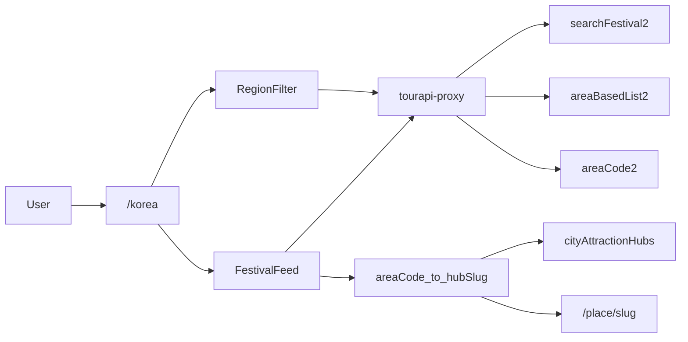
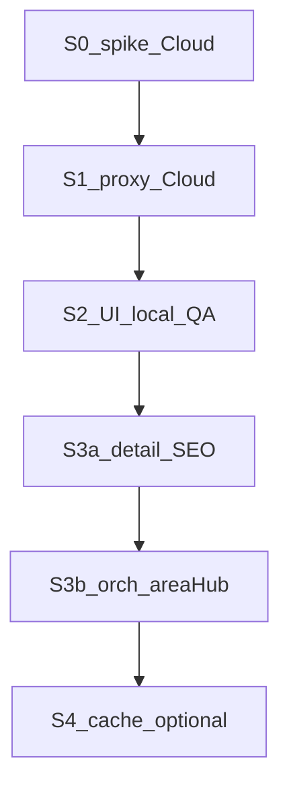

# 국내 여행지 특화 — TourAPI 축제·지역 허브 플랜

## 결론 (데이터)

**가능합니다.** 한국관광공사 TourAPI 4.0(`KorService2`)에는 지역·축제용 엔드포인트가 이미 있습니다. gateo는 지금 **사진·좌표만** 쓰고 있어 그 레이어가 비어 있을 뿐입니다.


| contentTypeId | 의미         | 국내 허브 활용                 |
| ------------- | ---------- | ------------------------ |
| 12            | 관광지        | 지역별 명소 보조 목록             |
| 14            | 문화시설       | 선택                       |
| **15**        | **축제공연행사** | **시즌·캘린더 메인**            |
| 25            | 여행코스       | 후순위                      |
| 32 / 39       | 숙박 / 음식    | 기존 MRT·제휴와 역할 분리 (1차 제외) |


핵심 API (미연동):

- `searchFestival2` — `eventStartDate`~기간, `areaCode`/`sigunguCode` 필터 → **제목·기간·주소·좌표·썸네일·contentId**
- `areaBasedList2` — 광역시도/시군구 + contentType → 지역별 POI
- `areaCode2` — 17개 시도 → 시군구 코드
- `detailIntro2` — 축제 소개(행사장소·주최·요금 등, type 15 전용 필드)
- (기존) `detailCommon2` / `detailImage2` — 상세·이미지

현재 프록시(`[supabase/functions/tourapi-proxy/index.ts](supabase/functions/tourapi-proxy/index.ts)`) action: `searchKeyword` · `detailCommon` · `detailImage` · `searchPhoto` 만.

## 제품 축 (확정)

**축제 일정이 테마 엔진**, 지역·여행지는 그 위에 얹는 구조.

- 진입: 전용 라우트 `**/korea**` (Explore 대륙/테마에 끼워 넣지 않음 — 캘린더 UX·SEO가 다름)
- 상단: **이번 달 / 다가오는 시즌 / 지역** 필터 (탭이 아니라 **필터 칩** — 축제가 기본 피드)
- 카드 클릭: 축제 디테일 시트 → **인근 gateo 국내 hub**로 이어가기 (`/place/:slug` 또는 지구본 포커스)
- 지역 드릴다운: TourAPI `areaCode` ↔ gateo `[cityAttractionHubs.json](src/pages/Home/data/cityAttractionHubs.json)` (**KR hub ≈ 210곳**, `country: 대한민국`) — `travelSpots-list` 국내는 현재 **3곳**(seoul/jeju/seogwipo)뿐이라 **1차 목적지 스파인은 hub**




## 정보 구조 (MVP)

1. **히어로**: “지금·곧 열리는 국내 축제” + 월/시즌 선택
2. **축제 피드**: 날짜순 카드 (`title`, `eventstartdate`~`end`,` addr1`,` firstimage`, 지역 뱃지)
3. **지역 칩**: 서울·부산·제주·강원… (TourAPI `areaCode` SSOT)
4. **이 지역으로 떠나기**: 필터된 지역의 gateo hub 썸네일 가로 스크롤 (hub attractions 상위)
5. **축제 상세(시트)**: `detailCommon` + `detailIntro`(15) · CTA → 가까운 hub / 지도

후순위(명시적 제외): 숙박·맛집 TourAPI 목록, 여행코스(25) 자동 플래너, UI 대규모 리디자인.

## 데이터·인프라

### A. Edge 프록시 확장

`[tourapi-proxy](supabase/functions/tourapi-proxy/index.ts)`에 action 추가:

- `searchFestival` → `searchFestival2` (필수: `eventStartDate`; 선택: `eventEndDate`, `areaCode`, `sigunguCode`, paging)
- `areaBasedList` → `areaBasedList2` (`contentTypeId`, `areaCode`…)
- `areaCode` → `areaCode2`
- `detailIntro` → `detailIntro2` (축제 상세 시)

기존과 동일: 키는 Secret만 · `VITE_` 금지 · normalize `{ ok, action, items[], rawCount }` · `smoke:tourapi` LIVE 케이스 추가.

### B. 브리지 SSOT (작음)

- `[scripts/data/korea-area-code-overrides.mjs](scripts/data/korea-area-code-overrides.mjs)` → generate → `koreaAreaCodes.json`  
  - TourAPI `areaCode` → `{ name, hubSlugs[] }` (예: 강원 → sokcho, gangneung, chuncheon, pyeongchang…)
- 축제 → hub: `areacode` 우선, 없으면 `mapy/mapx` 최근접 KR hub (기존 좌표 유틸 재사용 가능)
- **금지**: `travelSpotTourApi` / `tourapi-content-id-overrides`에 축제·지역 코드 혼용 (갤러리 SSOT와 분리 — 명소좌표 계획과 동일 원칙)

### C. 호출·캐시 전략

- 브라우저 → Edge만 (키 노출 금지)
- **월 단위 축제 목록**은 Edge 또는 빌드/크론 캐시 권장 (공공 API 쿼터·지연). MVP는 LIVE + sessionStorage(짧은 TTL), 트래픽 보이면 Supabase 테이블/`scripts/sync-korea-festivals.mjs`로 승격
- 갤러리 랭킹의 축제 **강등**(`[tourApiPhotoRank.js](src/utils/tourApiPhotoRank.js)`)과 충돌 없음 — 허브 피드는 contentType 15를 **의도적으로** 씀

## 기존 자산과의 역할


| 자산                          | 역할                               |
| --------------------------- | -------------------------------- |
| TourAPI 축제/지역               | 시즌 테마·일정·공신력 카피/이미지              |
| `cityAttractionHubs` KR 210 | “어디로 갈지” 목적지·명소 핀                |
| `travelSpots` 국내 3          | 항공·플래너 풀 카드가 있는 허브만              |
| PlaceCard `/place/:slug`    | 딥링크 도착지 (새 카드 체계 복제 금지)          |
| Explore themes              | 해외·에디터스픽 유지 · `korea` 대륙 추가하지 않음 |


## Cloud · 오케스트레이터로 돌릴 수 있나?

**전체 플랜을 한 번에 「오케스트레이터」로 돌리기는 비적합**입니다.  
[`orchestrator-method.md`](plans/orchestrator-method.md) §2 기준:

- **적합**: 동일 tip에 **append만** 하는 다배치 SSOT · 초안 병렬 + tip 직렬 머지
- **비적합**: 단일 버그픽스 · **UI 한 화면** · 서로 다른 파일을 한 feature로 묶는 일반 개발

그래서 **하이브리드**로 나눕니다.

| 구간 | Cloud? | 오케스트레이터? | 이유 |
|------|--------|-----------------|------|
| Phase 0 스파이크 | **권장** (Secrets·LIVE TourAPI) | 아니오 | 1회 검증 · tip append 아님 |
| Phase 1 프록시·smoke·fetch | Cloud 또는 로컬 1에이전트 | 아니오 | Edge/코드 feature · 워커2 배치 모델 아님 |
| Phase 2 `/korea` MVP UI | 로컬 권장 (브라우저 QA) | **금지** | UI·디자인 QA · method 비적합 · 커밋은 사람 QA 후 |
| Phase 3 **areaCode↔hub SSOT** | **Cloud 오케스트레이터 적합** | **예** | 17시도×hubSlug 다배치 append · audit 게이트 |
| Phase 3 축제 시트·SEO 코드 | 1에이전트 | 아니오 | 소량 feature |
| Phase 4 월간 축제 캐시 채움 | Cloud 가능 | **선택적 예** | 월×지역 배치 sync면 오케스트레이터형으로 승격 가능 |

### 추천 실행 순서 (요약)

1. **S0→S1** Cloud 단일 에이전트 (Secrets · LIVE · 커밋·PR)
2. **S2** 로컬 UI + 사람 QA
3. **S3a** 상세·SEO (1에이전트) → **S3b** Cloud 오케스트레이터(area↔hub)
4. **S4** 선택 (캐시·health)

상세 플레이북은 아래 **「세션별 실행 가이드」**.

**정리**: Cloud에서 **돌릴 수는 있음**. 다만 「국내 허브 전체」가 아니라 **SSOT 채움(area↔hub, 나중엔 축제 캐시)** 만 오케스트레이터로 돌리고, 프록시·UI는 일반 Cloud/로컬 feature로 분리하는 게 method에 맞습니다.

---

## Pre-S0 — Cloud가 플랜을 보게 하기 ✅

**상태**: ✅ 완료 (2026-07-24) — 본 파일이 저장소 SSOT. Cloud는 `@plans/korea-festival-hub-plan.md` 사용.

Cursor Plan(`~/.cursor/plans/…`)은 저장소 밖이라 Cloud 클론에 없음 → 이 경로로 동기화·push 함.

---

## 세션별 실행 가이드 (한 세션 = 한 단위)

원칙: **세션을 합치지 않는다** (S0+S1만 예외로 같은 Cloud 턴에 이어도 됨).  
새 채팅마다 아래 **복붙 제시어** + `@` 파일만. 전반 탐색·이전 워커 로그 전체 Read 금지.

공통 읽기(모든 세션 최소):

- [`.ai-context.md`](.ai-context.md) — 1.5.1 · TourAPI/갤러리 금지 1~2줄
- 이 플랜의 **해당 세션 절만**
- 최신 일지 `plans/YYYY-MM-DD-project-log.md` — 「국내축제」핸드오프 절만

공통 금지: `VITE_` 키 · `tourapi-content-id-overrides`에 축제 혼용 · `main` 직접 push · UI 미확정 수시 커밋 · releaseNotes 합의 전 반영



### S0 — LIVE 스파이크 (Cloud · 반나절 · 오케스트레이터 아님)

| | |
|--|--|
| **환경** | Cursor Cloud · Secrets `TOUR_API_SERVICE_KEY` (및/또는 Edge용 `VITE_SUPABASE_URL`+`ANON`) |
| **산출** | 일지 「국내축제 S0」: 필드 샘플 · resultCode · 대략 건수 · 쿼터/라이선스 메모 · **Go/No-Go** |
| **커밋** | 코드 없으면 커밋 생략 · 스모크 스크립트만 추가 시 PASS 후 커밋 OK |
| **다음** | Go면 S1 · No-Go면 사람 보고 후 정지 |

**복붙 제시어**

```
국내축제-S0-스파이크
@plans/korea-festival-hub-plan.md 「세션별 실행 가이드」S0만
@.ai-context.md

Cloud. TOUR_API_SERVICE_KEY로 KorService2 LIVE만.
searchFestival2(당월)·areaCode2·areaBasedList2(서울·contentTypeId=12) 각 1회.
키·응답 전문 로그 금지. 일지에 필드목록·건수·Go/No-Go 2~5줄.
UI·proxy 확장·커밋(코드 없으면)·오케스트레이터 금지.
```

**(Pre-S0 완료 전제)** 위 `@plans/korea-festival-hub-plan.md` 가 remote에 있어야 함.
**완료 조건**: 세 API `0000` · 축제 항목에 `eventstartdate`/`title`/`contentid` 확인 · 일지 Go.

---

### S1 — 프록시 + fetch (Cloud · 1에이전트 · S0 직후 같은 브랜치 OK)

| | |
|--|--|
| **환경** | Cloud · feature 브랜치 `cursor/korea-festival-…` |
| **산출** | `tourapi-proxy` actions · `fetchTourApiFestivals.js` / `fetchTourApiArea.js` · `smoke:tourapi` LIVE 케이스 · Edge 재배포(가능 시) |
| **VERIFY** | `TOURAPI_SMOKE_LIVE=1 npm run smoke:tourapi` PASS |
| **커밋·PR** | VERIFY PASS → 한글 커밋 · Cloud면 push·PR · 일지에 SHA·PR URL |
| **다음** | PR 머지 또는 브랜치 유지 후 S2 |

**복붙 제시어**

```
국내축제-S1-프록시
@plans/korea-festival-hub-plan.md S1만
@supabase/functions/tourapi-proxy/index.ts
@plans/tourapi-edge-proxy-plan.md §1만
@.ai-context.md

S0 Go 전제. action 추가: searchFestival·areaBasedList·areaCode·detailIntro.
normalize·smoke LIVE·클라이언트 fetch 유틸만.
UI·/korea 페이지·releaseNotes·오케스트레이터 금지.
VERIFY PASS 후 §3.4식 커밋(+Cloud push·PR)·일지 S1 핸드오프(다음=S2).
```

**완료 조건**: 신규 action smoke PASS · 브라우저에 키 없음 · PR 또는 커밋 SHA 일지.

**S0+S1 합치기**: Cloud 한 세션에서 S0 Go 직후 S1까지 진행 허용. 실패 시 S0만 남기고 보고.

---

### S2 — `/korea` MVP UI (로컬 · 사람 QA · 오케스트레이터 금지)

| | |
|--|--|
| **환경** | 데스크톱 로컬 · S1 머지/브랜치 checkout |
| **산출** | 라우트 `/korea` · 월/시즌 칩 · 축제 피드 · 지역 칩 · KR hub 가로 리스트(임시: hubId 하드맵 또는 최소 SSOT 시드 3~5개) · 진입 링크 1곳 |
| **VERIFY** | 로컬에서 피드 로드 · 지역 필터 · hub→`/place/:slug` |
| **커밋** | **사람 QA OK 후** 1회(디자인 게이트) · 조율 중 커밋 보류 |
| **다음** | S3a |

**복붙 제시어**

```
국내축제-S2-UI
@plans/korea-festival-hub-plan.md S2·정보구조만
S1 브랜치/PR 기준.

/korea MVP만. PlaceCard 톤 재사용. 새 디자인 시스템 금지.
LIVE searchFestival + 지역칩 + hub 가로(최소 시드 OK).
진입점 1곳. releaseNotes·오케스트레이터·proxy 대규모 재작성 금지.
작업 후 미리보기만 — 커밋은 내가 QA OK 할 때까지 보류.
일지에 QA 체크리스트·다음=S3a.
```

**사람 QA 체크**: 모바일/PC · 빈 달 안내 · 이미지 없는 카드 처리 · 해외 Explore 회귀 없음.

---

### S3a — 축제 상세 + SEO (1에이전트 · 로컬 또는 Cloud)

| | |
|--|--|
| **환경** | S2 QA 커밋 이후 |
| **산출** | 축제 상세 시트(`detailCommon`+`detailIntro`) · helmet/sitemap 최소 |
| **VERIFY** | contentId 1건 상세 로드 · 기존 gallery smoke 회귀 |
| **커밋** | 로직 PASS 시 OK · UI 톤 변경 있으면 사람 확인 후 |
| **다음** | S3b |

**복붙 제시어**

```
국내축제-S3a-상세SEO
@plans/korea-festival-hub-plan.md S3a만
detailIntro 시트 + SEO만. areaCode↔hub 대량 채움·오케스트레이터 금지.
스모크/회귀 후 커밋·일지(다음=S3b 오케스트레이터).
```

---

### S3b — areaCode↔hub SSOT (Cloud 오케스트레이터)

| | |
|--|--|
| **환경** | Cloud · 제시어 `오케스트레이터` + `국내축제-areaHub` |
| **사전** | overrides/generate/audit 스크립트·큐 md·빈 tip 골격은 **메인 G0에서 1회** 만든 뒤 워커2 계주 (명소 G0 패턴) |
| **tip** | `koreaAreaCodes` (또는 overrides → generate) **append only** |
| **배치** | 시도(areaCode) 단위 · 라운드당 워커A·B 각 N개 · KR hubSlug만 |
| **VERIFY** | `audit:korea-area-codes` issues 0 + 스모크(서울·강원·제주 hub 해상) |
| **커밋·PR** | method §3.4 · Cloud push·PR · 이관 §4.2 |
| **금지** | UI · releaseNotes · gallery overrides · tip 병렬 · VERIFY FAIL 커밋 |

**최초 제시어 (G0 포함)**

```
오케스트레이터 · 국내축제-areaHub
@plans/orchestrator-method.md §1·§3.0·§3.3·§3.4·§4.2
@plans/korea-festival-hub-plan.md S3b만
@.ai-context.md 1.5.1

G0(메인만): korea-area overrides·generate·audit·큐 md·npm 스크립트 골격
  + 시드 3개(서울·부산·제주) VERIFY → §3.4 커밋·PR
G1+: 워커 정확히 2 · tip 직렬 · 시도 배치표 · 후임 Task 이관
UI/releaseNotes/tourapi-content-id-overrides 금지 · main 직접 push 금지
```

**이어하기**

```
오케스트레이터 · 국내축제-areaHub-이어하기
@plans/YYYY-MM-DD-project-log.md 「국내축제 S3b」이관 절만
다음 배치표 2개로 §3.0 즉시.
```

---

### S4 — 캐시·health (선택 · MVP 이후)

| | |
|--|--|
| **환경** | 트래픽/쿼터 이슈 보일 때 |
| **산출** | 월간 sync 스크립트 또는 테이블 · health smoke에 festival action |
| **오케스트레이터** | 월×지역 대량 채움일 때만 큐 승격 |
| **복붙** | `국내축제-S4-캐시` + 이 플랜 S4 · 일지 핸드오프 |

---

## 구현 단계 (Phase ↔ 세션 매핑)

| Phase | 세션 |
|-------|------|
| 0 스파이크 | **S0** |
| 1 프록시·fetch | **S1** |
| 2 `/korea` MVP UI | **S2** |
| 3 상세·SEO | **S3a** |
| 3 area↔hub SSOT | **S3b** |
| 4 hardening | **S4** |

### Phase 상세 (참고)

**Phase 0 / S0**: `searchFestival2`·`areaCode2`·`areaBasedList2` LIVE · 일지 Go/No-Go  

**Phase 1 / S1**: proxy actions + normalize + smoke + fetch 유틸 · Edge 재배포  

**Phase 2 / S2**: `/korea` · 필터 칩 · 피드 · hub 가로 · 진입 1곳 · QA 후 커밋  

**Phase 3 / S3a+S3b**: 상세 시트·SEO(1에이전트) + areaCode↔hub 오케스트레이터  

**Phase 4 / S4**: 월간 캐시 · health · 필요 시 오케스트레이터 큐  

## 리스크·가드

- 축제 데이터가 많고 노이즈(소규모·중복) → MVP는 **이미지 있는 항목 + 기간이 오늘 이후**만, 지역 필터 필수에 가깝게
- `travelSpots` 국내 빈약 → hub 중심 유지, 무리한 spots 대량 추가 금지
- UI는 **디자인 미확정 커밋 보류**(`.ai-context` 1.5.1) · 프록시/SSOT/스모크는 검증 PASS 시 커밋 OK
- 릴리스 노트는 **허브 공개 시점**에만 1회 제안 (1.7)
- 세션 혼선 방지: 제시어에 **`국내축제-S#`** 고정 · 일지 핸드오프에 **다음 세션 ID** 필수

## 성공 기준 (MVP)

- `/korea`에서 **이번 달 축제 ≥ N건** 표시 (LIVE 또는 캐시)
- 지역 칩 1개 선택 시 피드·hub 리스트가 같이 좁혀짐
- 축제 → 인근 KR hub → 기존 `/place/...` 이동
- `smoke:tourapi`에 festival/area 케이스 PASS · 키 브라우저 미노출
- S0→S2까지 세션 핸드오프만으로 재개 가능(전반 재탐색 불필요)

