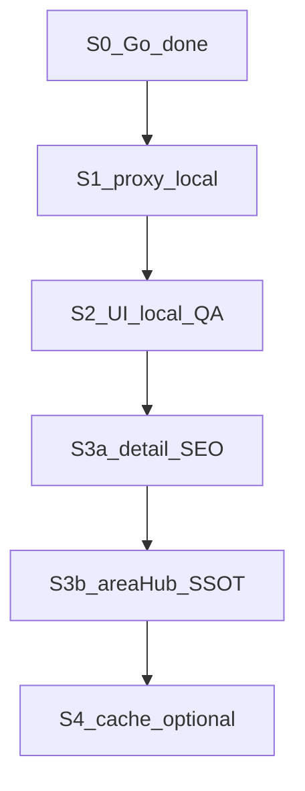

# 국내 여행지 특화 — TourAPI 축제·지역 허브 플랜

**실행 환경 (확정 · 2026-07-24)**: **로컬(데스크톱) 전용**. Cursor Cloud 트랙은 **중단** (진행 가시성 부족).  
**SSOT**: 본 파일 · 일지 [`2026-07-24-project-log.md`](./2026-07-24-project-log.md) 「국내축제」절.

| 세션 | 상태 | 다음 |
|------|------|------|
| Pre-S0 플랜 저장소 반영 | ✅ `main` `3f81a55` | — |
| S0 LIVE 스파이크 | ✅ Go (축제96 / 시도17 / 서울관광444 · `0000`) | 재실행 금지 |
| **S1** 프록시·fetch | ⬜ **지금 여기** | 로컬 새 채팅 |
| S2 `/korea` UI | ⬜ | S1 후 · 사람 QA |
| S3a 상세·SEO | ⬜ | S2 후 |
| S3b area↔hub SSOT | ⬜ | 로컬 배치(또는 나중에 오케스트레이터) |
| S4 캐시 | 선택 | MVP 이후 |

---

## 0. 로컬 재시작 규칙 (필독)

1. **Cloud 채팅·에이전트는 무시**한다. 새 작업은 **로컬 Cursor 채팅**만.
2. **진행 확인 = git**. 세션 끝나면 반드시 **커밋**(로직/SSOT·일지). UI만 조율 중일 때는 디자인 게이트(사람 QA 후 커밋).
3. **한 채팅 = 한 세션 ID** (`국내축제-S1` …). 세션을 합치지 않는다.
4. 읽을 것: 본 플랜 **해당 세션 절만** + 일지 「국내축제」최신 절 + `.ai-context` 1.5.1·TourAPI 금지 1~2줄. 전반 탐색 금지.
5. 키: 로컬 `.env.local`의 `TOUR_API_SERVICE_KEY` (또는 Edge 경유 시 Supabase URL+ANON). **`VITE_`로 Tour 키 노출 금지**.



---

## 1. 결론 (데이터)

**가능합니다.** TourAPI 4.0(`KorService2`)에 지역·축제 API가 있고, S0에서 LIVE 확인함.

| contentTypeId | 의미 | 허브 활용 |
|---------------|------|-----------|
| 12 | 관광지 | 지역 보조 목록 |
| 14 | 문화시설 | 선택 |
| **15** | **축제공연행사** | **시즌·캘린더 메인** |
| 25 / 32 / 39 | 코스·숙박·음식 | 1차 제외 (숙박은 MRT·제휴) |

미연동(→ S1): `searchFestival2` · `areaBasedList2` · `areaCode2` · `detailIntro2`  
기존 프록시: `searchKeyword` · `detailCommon` · `detailImage` · `searchPhoto` only ([`tourapi-proxy/index.ts`](../supabase/functions/tourapi-proxy/index.ts))

---

## 2. 제품 축

**축제 일정 = 테마 엔진**, 지역·여행지는 그 위.

- 라우트: **`/korea`** (Explore 대륙에 끼워 넣지 않음)
- 필터 칩: 이번 달 / 시즌 / 지역
- 카드 → 축제 시트 → 인근 KR hub → `/place/:slug`
- 목적지 스파인: [`cityAttractionHubs.json`](../src/pages/Home/data/cityAttractionHubs.json) KR ≈210 (`travelSpots` 국내는 3곳뿐)

후순위 제외: 숙박·맛집 Tour 목록, 여행코스 자동 플래너, UI 대규모 리디자인.

---

## 3. 데이터·인프라

### A. Edge 프록시 (S1)

action 추가: `searchFestival` · `areaBasedList` · `areaCode` · `detailIntro`  
Secret만 · normalize `{ ok, action, items[], rawCount }` · `smoke:tourapi` LIVE.

### B. 브리지 SSOT (S3b)

`korea-area-code-overrides.mjs` → `koreaAreaCodes.json`  
**금지**: gallery `tourapi-content-id-overrides`에 축제·지역 혼용.

### C. 캐시

MVP: LIVE + sessionStorage. 쿼터 이슈 시 S4.

---

## 4. Cloud / 오케스트레이터 (이 트랙)

| | 방침 |
|--|------|
| **Cursor Cloud** | **사용 안 함** (가시성 문제로 중단). 재개하려면 사람 명시 + 매 턴 커밋·push 필수. |
| **오케스트레이터** | S1~S3a **비적합**. S3b만 다배치면 **로컬**에서 워커2 또는 **솔로 배치**(시드→시도 순)로 충분. Cloud 오케스트레이터는 선택·나중. |

---

## 5. 세션별 실행 (로컬)

### S0 — LIVE 스파이크 ✅ (재실행 금지)

| API | resultCode | 건수 |
|-----|------------|------|
| `searchFestival2` (당월) | `0000` | 96 |
| `areaCode2` | `0000` | 17 |
| `areaBasedList2` (서울·12) | `0000` | 444 |

필드: `eventstartdate` · `title` · `contentid` 확인 · **Go**.

---

### S1 — 프록시 + fetch ⬜ (지금 · 로컬)

| | |
|--|--|
| **환경** | 로컬 · feature 브랜치 `cursor/korea-festival-proxy` (또는 동일 목적명) |
| **키** | `.env.local` `TOUR_API_SERVICE_KEY` |
| **산출** | proxy 4 action · `fetchTourApiFestivals.js` / `fetchTourApiArea.js` · smoke LIVE · 가능 시 Edge 재배포 |
| **VERIFY** | `TOURAPI_SMOKE_LIVE=1 npm run smoke:tourapi` PASS |
| **커밋** | PASS 후 **즉시** 한글 커밋 · 원하면 push/PR · **일지에 SHA** |
| **금지** | UI · `/korea` · releaseNotes · 오케스트레이터 · Cloud |

**로컬 새 채팅 제시어**

```
국내축제-S1-프록시
@plans/korea-festival-hub-plan.md 「S1」만
@plans/2026-07-24-project-log.md 「국내축제 — S0」절만
@supabase/functions/tourapi-proxy/index.ts
@plans/tourapi-edge-proxy-plan.md §1만
@.ai-context.md

로컬만. S0 Go 전제. feature 브랜치.
action: searchFestival·areaBasedList·areaCode·detailIntro.
normalize·smoke LIVE·fetch 유틸만.
UI·/korea·releaseNotes·오케스트레이터·Cloud 금지.
VERIFY PASS → 커밋(+push) · 일지 S1(다음=S2)에 SHA.
```

**완료**: smoke PASS · 키 미노출 · 일지 SHA · working tree clean(해당 파일).

---

### S2 — `/korea` MVP UI ⬜

| | |
|--|--|
| **환경** | 로컬 · S1 커밋 위 |
| **산출** | `/korea` · 월/시즌·지역 칩 · 축제 피드 · hub 가로(최소 시드 OK) · 진입 1곳 |
| **커밋** | **사람 QA OK 후** 1회 (디자인 게이트) |
| **금지** | 새 디자인 시스템 · releaseNotes · proxy 재작성 |

**제시어**

```
국내축제-S2-UI
@plans/korea-festival-hub-plan.md S2·정보구조만
로컬. /korea MVP. PlaceCard 톤. LIVE festival + 지역칩 + hub 가로.
커밋은 QA OK까지 보류. 일지에 QA 체크·다음=S3a.
```

---

### S3a — 상세 + SEO ⬜

로컬. `detailIntro` 시트 + helmet/sitemap 최소. areaHub 대량 채움 금지.  
제시어: `국내축제-S3a-상세SEO` + 본 플랜 S3a.

---

### S3b — areaCode↔hub SSOT ⬜

로컬. G0: overrides·generate·audit·시드 3(서울·부산·제주) → 커밋.  
이후 시도 배치를 **같은 로컬 채팅에서 순차** 또는 소규모 워커2. Cloud 오케스트레이터 기본 아님.  
VERIFY: `audit:korea-area-codes` + 해상 스모크.

---

### S4 — 캐시 (선택)

쿼터·지연 보일 때. `국내축제-S4-캐시`.

---

## 6. 리스크·가드

- 축제 노이즈 → MVP: 이미지 있음 + 종료일 ≥ 오늘
- `travelSpots` 국내 빈약 → hub 중심
- UI 미확정 수시 커밋 금지 · 로직/SSOT는 VERIFY 후 커밋
- 릴리스 노트: 허브 공개 시 1회만 제안
- **가시성**: “커밋 없는 세션 완료” 금지(일지라도 커밋)

---

## 7. 성공 기준 (MVP)

- `/korea` 이번 달 축제 표시
- 지역 칩 → 피드·hub 동시 축소
- 축제 → hub → `/place/...`
- `smoke:tourapi` festival/area PASS · 키 미노출
- `git log` / 일지만으로 S0→현재 세션 추적 가능
