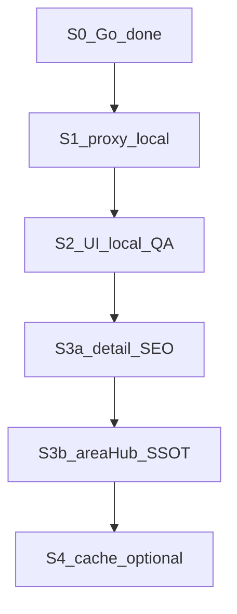

# 국내 여행지 특화 — TourAPI 축제·지역 허브 플랜

**실행 환경**: 로컬·Cloud 모두 가능. Cloud 이어하기는 [`cloud-preview-continuity.md`](./cloud-preview-continuity.md) — 세션 표기 `축제 페이지 #N, …` · **고정 브랜치·동일 Preview URL** · Preview 우측 작업 로그 · 턴 종료 Preview 링크.  
**SSOT**: 본 파일 · 일지 [`2026-07-29-project-log.md`](./2026-07-29-project-log.md) 「국내축제」절 · Cloud 규칙 [`AGENTS.md`](../AGENTS.md).

| 세션 | 상태 | 다음 |
|------|------|------|
| Pre-S0 플랜 저장소 반영 | ✅ `main` `3f81a55` | — |
| S0 LIVE 스파이크 | ✅ Go (축제96 / 시도17 / 서울관광444 · `0000`) | 재실행 금지 |
| **S1** 프록시·fetch | ✅ | S2 |
| S2 `/korea` UI | ✅ S2b | addr 도/시·시군·달력 dayRole · 다음 S3a |
| S3a 상세·SEO | ✅ `aed70b1` | 다음 S3b |
| S3b area↔hub SSOT | ✅ G0+시도 일괄 · LEGACY 비움 | areaHub QA ✅ |
| S4 캐시 | ✅ | DB `tourapi_festival_cache` · Edge `festivalWindow`/`festivalDetail` · stale-while-error |
| **S5** 지도·권역·지금/주말 | ✅ S5a+S5b 구현 | 사람 QA 후 main |

---

## 0. 세션 재시작 규칙 (필독)

1. **Cloud**로 이어갈 때는 [`cloud-preview-continuity.md`](./cloud-preview-continuity.md) — 표기 `축제 페이지 #N, …` · **고정 브랜치·동일 Preview** · 작업 로그 append · 턴 종료 Preview 링크.
2. **진행 확인 = git + Preview**. 세션 끝나면 반드시 **커밋**(로직/SSOT·일지). Cloud feature는 Preview용 push. UI만 로컬 조율 중일 때는 디자인 게이트(사람 QA 후 커밋).
3. **한 채팅 = 한 세션 표기** (`축제 페이지 #N, 단계`). 세션을 합치지 않는다.
4. 읽을 것: 본 플랜 **해당 세션 절만** + 일지 「국내축제」최신 절 + `.ai-context` 1.5.1·TourAPI 금지 1~2줄. 전반 탐색 금지.
5. 키: 로컬 `.env.local`의 `TOUR_API_SERVICE_KEY` (또는 Edge 경유 시 Supabase URL+ANON). **`VITE_`로 Tour 키 노출 금지**.


```mermaid
flowchart TD
  doneS0[S0_Go_done] --> S1[S1_proxy_local]
  S1 --> S2[S2_UI_local_QA]
  S2 --> S3a[S3a_detail_SEO]
  S3a --> S3b[S3b_areaHub_SSOT]
  S3b --> S4[S4_cache_optional]
```

---

## 1. 결론 (데이터)

**가능합니다.** TourAPI 4.0(`KorService2`)에 지역·축제 API가 있고, S0에서 LIVE 확인함.

| contentTypeId | 의미 | 허브 활용 |
|---------------|------|-----------|
| 12 | 관광지 | 지역 보조 목록 |
| 14 | 문화시설 | 선택 |
| **15** | **축제공연행사** | **시즌·캘린더 메인** |
| 25 / 32 / 39 | 코스·숙박·음식 | 1차 제외 (숙박은 MRT·제휴) |

미연동(→ S1): `searchFestival2` · `areaBasedList2` · `areaCode2` · `detailIntro2`  
기존 프록시: `searchKeyword` · `detailCommon` · `detailImage` · `searchPhoto` only ([`tourapi-proxy/index.ts`](../supabase/functions/tourapi-proxy/index.ts))

---

## 2. 제품 축

**축제 일정 = 테마 엔진**, 지역·여행지는 그 위.

- 라우트: **`/korea`** (Explore 대륙에 끼워 넣지 않음)
- 필터 칩: 이번 달 / 시즌 / 지역
- 카드 → 축제 시트 → 인근 KR hub → `/place/:slug`
- 목적지 스파인: [`cityAttractionHubs.json`](../src/pages/Home/data/cityAttractionHubs.json) KR ≈210 (`travelSpots` 국내는 3곳뿐)

후순위 제외: 숙박·맛집 Tour 목록, 여행코스 자동 플래너, UI 대규모 리디자인.

---

## 3. 데이터·인프라

### A. Edge 프록시 (S1)

action 추가: `searchFestival` · `areaBasedList` · `areaCode` · `detailIntro`  
Secret만 · normalize `{ ok, action, items[], rawCount }` · `smoke:tourapi` LIVE.

### B. 브리지 SSOT (S3b)

`korea-area-code-overrides.mjs` → `koreaAreaCodes.json`  
**금지**: gallery `tourapi-content-id-overrides`에 축제·지역 혼용.

### C. 캐시

MVP: LIVE + sessionStorage. 쿼터 이슈 시 S4.

---

## 4. Cloud / 오케스트레이터 (이 트랙)

| | 방침 |
|--|------|
| **Cursor Cloud** | **사용 안 함** (가시성 문제로 중단). 재개하려면 사람 명시 + 매 턴 커밋·push 필수. |
| **오케스트레이터** | S1~S3a **비적합**. S3b만 다배치면 **로컬**에서 워커2 또는 **솔로 배치**(시드→시도 순)로 충분. Cloud 오케스트레이터는 선택·나중. |

---

## 5. 세션별 실행 (로컬)

### S0 — LIVE 스파이크 ✅ (재실행 금지)

| API | resultCode | 건수 |
|-----|------------|------|
| `searchFestival2` (당월) | `0000` | 96 |
| `areaCode2` | `0000` | 17 |
| `areaBasedList2` (서울·12) | `0000` | 444 |

필드: `eventstartdate` · `title` · `contentid` 확인 · **Go**.

---

### S1 — 프록시 + fetch ✅

| | |
|--|--|
| **환경** | 로컬 · `cursor/korea-festival-proxy` |
| **산출** | proxy 4 action · `fetchTourApiFestivals.js` / `fetchTourApiArea.js` · smoke LIVE · Edge 재배포 |
| **VERIFY** | `TOURAPI_SMOKE_LIVE=1 npm run smoke:tourapi` PASS |
| **다음** | S2 `/korea` UI (사람 QA 후 커밋) |

---

### S2 — `/korea` MVP UI ✅ (S2b 포함)

| | |
|--|--|
| **환경** | 로컬 · `cursor/korea-festival-proxy` |
| **산출** | `/korea` · 목록/달력 · 내 주변 · 도/시군 칩 · dayRole · hub · 홈「국내」 |
| **S2b** | 월간 무지역 fetch → `addr1` 필터 · 시/군 · 내 주변 시군 · 달력↑칩↓ |
| **보류** | 국내 전용 지도/지구본 KR (#5) — **S3a 이후 별 트랙** (로딩 비교 후 A/B) |
| **금지** | 새 디자인 시스템 · releaseNotes · proxy 전면 재작성 |

**제시어**

```
국내축제-S2-UI
@plans/korea-festival-hub-plan.md S2·정보구조만
로컬. /korea MVP. PlaceCard 톤. LIVE festival + 지역칩 + hub 가로.
커밋은 QA OK까지 보류. 일지에 QA 체크·다음=S3a.
```

---

### S3a — 상세 + SEO ✅

| | |
|--|--|
| **환경** | 로컬 · `cursor/korea-festival-proxy` · **SHA** `aed70b1` |
| **산출** | `FestivalDetailSheet` · `detailIntro` · `/korea` Helmet · sitemap · `koreaRoutes` |
| **다음** | S3b |

**제시어**

```
국내축제-S3a-상세SEO
@plans/korea-festival-hub-plan.md S3a만
로컬. detailIntro 시트 + SEO 최소. areaHub 대량 금지. 지도 보류.
QA 후 커밋.
```

---

### S3b — areaCode↔hub SSOT ✅ G0

| | |
|--|--|
| **환경** | 로컬 · `cursor/korea-festival-proxy` |
| **산출** | `korea-area-code-overrides.mjs` → `koreaAreaCodes.json` · `generate`/`audit`/`smoke:korea-area-codes` · 시드 3(서울1·부산6·제주39) · `koreaHubSeeds` SSOT 우선+LEGACY 폴백 |
| **VERIFY** | `audit:korea-area-codes` · `smoke:korea-area-codes` · `smoke:tourapi`(해상) PASS |
| **다음** | LEGACY→SSOT 배치. **같은 채팅 순차 권장**(맥락 유지). 새 채팅이면 일지 핸드오프 표+제시어 블록 필수. Cloud 오케 기본 아님 |

---

### S4 — 캐시 ✅

쿼터·지연 대응. `국내축제-S4-캐시`.

| | |
|--|--|
| **테이블** | `tourapi_festival_cache` (anon SELECT · service_role write) |
| **Edge** | `festivalWindow` (롤링12 merge) · `festivalDetail` (intro/common/info) |
| **TTL** | 목록 fresh 12h / stale 7d · 상세 fresh 7d / stale 30d |
| **클라** | sessionStorage L1 유지 · `fetchKoreaFestivalsRolling12` → 1 invoke |
| **VERIFY** | migration · `TOURAPI_SMOKE_LIVE=1 npm run smoke:tourapi` · Edge 재배포 |

---

### S5 — 지도·클러스터 · 비전 A~E ✅ (A·B 코드 · B+ 보강)

| | |
|--|--|
| **환경** | `cursor/korea-festival-proxy` |
| **현재 코드** | **A** 풀맵 셸 · **B** 테마·지역 색인 · **C** 즐겨찾기·본 항목·검색·지역 그룹 · leaves→리스트 · 시트 |
| **권역** | corridor 칩 폐기 · 지역 색인=`addr1` 시도→시/군 (`festivalRegionTags`) |
| **테마** | title 키워드 ≥2 (`festivalTasteTags` · 빙어·썸머·도자기·술 등) |
| **데이터** | 롤링 12개월 LIVE · `fetchKoreaFestivalsRolling12` · sessionStorage `gateo:korea-festivals:v1:rolling12` |
| **개인** | localStorage `gateo:korea-festivals:v1:favorites` · `…:viewed` (`festivalPersonalStore`) |
| **금지** | D~E(다음) · releaseNotes · hub 신설 · 본격 S4 · corridor 부활 |

**B+ 리스트·연관 플랩 (구현됨)**

| | |
|--|--|
| **제목** | 색인 활성 시 `시도 · 시군 · 테마` (지도 클러스터 선택은 `선택`/`{hub} 주변`) |
| **플랩 하위** | 현재 시도의 `cityChips`(≥1) |
| **플랩 인근** | `SIDO_NEIGHBORS` ∩ 현재 `sidoChips` (정적 인접 · 제주 빈배열) |
| **플랩 테마** | 현재 `tasteChips` 중 미선택 |
| **모바일** | 시트 상단 가로 칩 행 · PC는 리스트 좌측 세로 플랩 |

**후속 (문서만 · 이번 미구현)**

- 시·군 단위 인근(좌표/centroid) · 축제 좌표 그래프 인근
- 플랩 접기/애니메이션 · hub 연동 인근
- **헤더 corridor 칩 부활 금지** (벨트는 아래 별도 트랙)

#### 벨트 · 축제로드 (문서만 · C 이후 후보)

사람 관찰(2026-07-27): 「지금」 지점이 **서울 중심 역C 벨트**, **동해안→내륙 C자 벨트**처럼 재미있는 형상을 이룸.

| | |
|--|--|
| **제품** | 한쪽 **벨트 목록**(이름·짧은 설명) · 선택 시 해당 축제 **점·선 지도**(또는 실루엣 이미지) + 그 벨트 축제 리스트 |
| **재미** | 단순 선 연결이 아니라 **패턴(형상)을 찾아 이름 붙임** — 비엔나식 축제 로드 / 여행 동선 후보 |
| **데이터** | 시간탭 결과의 축제 좌표 그래프 → 군집·호(arc)·해안 정렬 등 **형상 후보 추출**(수동 시드 가능) |
| **≠ corridor** | 헤더 고정 bbox 권역 칩 **아님**. 벨트는 **패턴 발견 UI**(목록+맵 오버레이). 행정 색인 칩과 병행 |
| **D와 연결** | D의 출발/도착·즐겨찾기 **도로 루트**에 벨트 경유를 넣으면 「축제로드 1개 선택」으로 이어질 수 있음 |
| **지금** | 구현 금지(C 우선). 알고리즘·카피·목록 UX 미합의 |

**비전 단계 (합의 · 순서 강제)**

| 단계 | 범위 |
|------|------|
| **A** | 전체화면 지도 셸 · 시간·내 주변 · 선택 N→좌측 리스트 · 시트 · 뒤로 ✅ QA |
| **B** | 테마·지역 색인 클릭 칩 ✅ · B+ 제목·연관 플랩 ✅ · 사람 QA |
| **C** | 즐겨찾기·본 항목 · 지역 그룹 · 검색 ✅ 코드 · 닫기/가림 픽스 ✅ · Preview 잔여 QA |
| **D** | 출발/도착 + 즐겨찾기 경유 **도로 루트** · 경로 리스트에서 **1개 선택** · (후보) 벨트·축제로드 |
| **E** | 시트 안 숙소·투어 (지도 마커 금지) |

**C 구현**

| | |
|--|--|
| 즐겨찾기 | 리스트·상세 ★ 토글 · localStorage · 상한 80 |
| 본 항목 | 상세 오픈 시 적재 · 상한 40 · 최신 앞 |
| 지역 그룹 | 내 목록을 시도별로 묶어 표시 |
| 검색 | 헤더 돋보기 · title/addr1 · 지도·리스트 교집합 |
| VERIFY | `npm run smoke:korea-festival-personal` |

**제시어 (이어하기 · C 잔여 QA / OK 후 D)**

```
국내축제-S5-C-이어하기
@plans/korea-festival-hub-plan.md S5만
@plans/2026-07-27-project-log.md 「국내축제 — S5 C」절만
브랜치 cursor/korea-festival-proxy · PR #29 · tip 70973fa.
C Preview 테스트·수정 이어가기. A·B 회귀 금지. D는 C QA OK 후. releaseNotes 금지.
```

---

## 6. 리스크·가드

- 축제 노이즈 → MVP: 이미지 있음 + 종료일 ≥ 오늘
- `travelSpots` 국내 빈약 → hub 중심
- UI 미확정 수시 커밋 금지 · 로직/SSOT는 VERIFY 후 커밋
- 릴리스 노트: 허브 공개 시 1회만 제안
- **가시성**: “커밋 없는 세션 완료” 금지(일지라도 커밋)

---

## 7. 성공 기준 (MVP)

- `/korea` 이번 달 축제 표시
- 지역 칩 → 피드·hub 동시 축소
- 축제 → hub → `/place/...`
- `smoke:tourapi` festival/area PASS · 키 미노출
- `git log` / 일지만으로 S0→현재 세션 추적 가능
