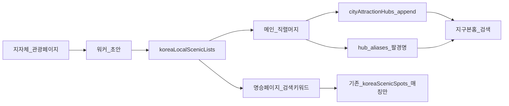

# 지자체 팔경·구경 → 도시 명소 SSOT (오케스트레이터)

**상태**: 📋 P0 ✅ · **I#1** ✅ · **F R01–R03** ✅ 2026-09-02 · **I#2 검토** ✅  
**주제 표기**: `지자체 팔경 #{N}, {단계}`  
**고정 브랜치**(착수 시 1회): `cursor/palgyeong`  
**방법**: [`orchestrator-method.md`](./orchestrator-method.md) **§5.6** · 본 플랜  
**큐**: [`korea-local-scenic-lists-queue.md`](./korea-local-scenic-lists-queue.md)

---

## 0. 결정 (사람 · 2026-09-01)

| # | 결정 |
|---|------|
| 1 | **단위 = 기초지자체(시·군·구)** — 홍천팔경·양구구경 등. 관동팔경 같은 광역 리스트는 **1차 범위 밖**(멤버가 시군에 걸치면 각 hub에만 링크, 광역 컬렉션 SSOT는 후속). |
| 2 | **기존 hub 명소 유지** + 지자체 선정분만 **append·멤버십**. 교체·삭제·리디자인 **금지**. |
| 3 | **명소 리스트 UI 변경 없음** — 칩·섹션·레이아웃 손대지 않음. 검색 키워드 매칭만 보강. |
| 4 | `koreaScenicSpots` **자동 승격 금지**. 명승 큐레이션 편입은 **별도 선별 세션**(합의 후). |

**의도**: 지자체 관리 명소는 인프라·홍보가 갖춰진 경우가 많아, 기존 에이전트 선발 목록에 **품질 앵커를 덧붙인다**.

---

## 1. 가능 여부 · 데이터 흐름

**가능.** 기존 인프라에 얹는다.



| 레이어 | 파일 | 역할 |
|--------|------|------|
| **컬렉션 SSOT** | `src/pages/Home/data/koreaLocalScenicLists.json` | 리스트 메타·멤버십·출처 URL |
| **도시 명소 tip** | `cityAttractionHubs.json` | 없는 멤버만 **attractions append** · 리스트명을 **hub.aliases**에 추가 |
| **명승 큐레이션** | `koreaScenicSpots.json` | **이번 주제에서 쓰기 금지**(자동 승격 X) |
| **검색** | `cityAttractionHubs.js` · `scenicSearch.js` · `searchSuggestions.js` | 팔경/구경 **키워드 → hub·멤버·기존 큐레이션 매칭** |

---

## 2. 스키마 (확정)

### 2.1 `koreaLocalScenicLists.json` (루트 배열)

```json
{
  "listId": "hongcheon-palgyeong",
  "hubId": "hongcheon",
  "title": "홍천팔경",
  "title_en": "Hongcheon Eight Views",
  "listKind": "palgyeong",
  "memberCountClaimed": 8,
  "aliases": ["홍천 팔경", "홍천군 팔경"],
  "sourceUrl": "https://…",
  "sourceOrg": "홍천군",
  "sourceFetchedAt": "2026-09-01",
  "status": "verified",
  "members": [
    {
      "attractionName": "가령폭포",
      "name_en": "Garyeong Falls",
      "kind": "viewpoint",
      "lat": 37.7,
      "lng": 128.1,
      "mapboxId": null,
      "linkStatus": "appended",
      "note": null
    }
  ]
}
```

| 필드 | 규칙 |
|------|------|
| `listId` | kebab · 전역 unique · `{hubId}-{listKind}` 기본 (`hongcheon-palgyeong`) |
| `hubId` | tip에 **이미 있는** KR hub만 (없으면 큐 **스킵** · 새 hub 생성은 별도 합의) |
| `listKind` | `palgyeong` \| `gugyeong` \| `sipgyeong` \| `gugok` \| `other` |
| `memberCountClaimed` | 공식 표기 개수(팔=8 등). 실제 `members.length`와 달라도 됨 → audit **WARN** |
| `sourceUrl` | **필수**(verified). 검색·스크랩 실패면 `status: skip_no_source` |
| `members[].attractionName` | tip `attractions[].name`과 **exact** (normalize 후 링크) |
| `linkStatus` | `linked`(기존) · `appended`(신규) · `pending_coord` · `skipped_conflict` |
| `status` | `draft` \| `verified` \| `skip_no_source` \| `skip_ambiguous` |

### 2.2 hub 병합 규칙 (메인만)

1. 멤버명 normalize → tip 기존 attraction과 일치하면 **`linked`만** · 필드 덮어쓰기 **금지**(좌표 공백이면 좌표만 채움 OK).  
2. 없으면 attractions **append** (`name`/`name_en`/`kind`/`lat`/`lng`) · `linkStatus: appended`.  
3. hub `aliases`에 `title` + `aliases[]` **추가**(이미 있으면 스킵).  
4. 전역 명소명 충돌 → 접두(`홍천 …`) 1회 → 불가 시 그 멤버만 `skipped_conflict`.  
5. 시드 hub(`sokcho` 등)도 **append만** 허용 · 기존 명소 삭제 금지.  
6. **UI·releaseNotes·koreaScenicSpots overrides 금지.**

### 2.3 kind 매핑

공식 설명 → 기존 enum만: `viewpoint|landmark|park|temple|beach|museum|market|neighborhood|shrine`.  
애매하면 `landmark`. KR `shrine` 남용 금지(기존 명소 규칙 유지).

---

## 3. 수집 방법 (워커)

| 우선 | 소스 | 사용 |
|------|------|------|
| **1** | 시·군·구 **공식 관광/문화** 페이지(또는 공식 PDF) | 리스트 제목·멤버명·`sourceUrl` |
| **2** | 광역 관광공사·문화관광 해설에 **시군 단위로 명시**된 경우 | 1 부재 시만 · URL 필수 |
| **3** | 좌표 | Mapbox / Nominatim / (후속) TourAPI HIT — **hub 중심 추정 금지** |
| ❌ | 블로그·위키만으로 `verified` 확정 | 참고만 · 공식 URL 없으면 `skip_no_source` |
| ❌ | LLM 기억만으로 멤버 확정 | 출처 없는 8경 날조 금지 |

**워커 출력 최소**

```
역할: koreaLocalScenicLists 워커. 배정 listId/hubId만.
출력: JSON 조각(리스트 1~N) + 멤버별 link 후보 + sourceUrl + 스모크 쿼리(리스트명·대표 명소 1).
금지: tip append, hub 삭제/교체, koreaScenicSpots, UI, releaseNotes, 이관서.
좌표: 지명 매칭 feature만 · 추정 금지 · NO_HIT면 pending_coord.
```

---

## 4. 세션 유형 · 분량 (토큰 절약)

연속 작업이므로 **세션 종류를 고정**한다. 에이전트는 해당 종류 핸드오프만 읽는다.

| 종류 | 채팅명 예 | 한 세션 분량 | 하는 일 | 읽기(최대) |
|------|-----------|--------------|---------|------------|
| **S0 스키마** | `지자체 팔경 #1, 스키마·검색` | 코드 1회 | JSON 시드·audit·검색 브리지·스모크 | 본 플랜 §2·§7·§9 |
| **P 파일럿** | `지자체 팔경 #2, 파일럿 3건` | **리스트 3** | 홍천·양구·(+큐 1) 수집→머지→VERIFY | 플랜 §2.2·§3 · 큐 P0 |
| **I 무결성** | `지자체 팔경 #3, 무결성` | **쓰기 0** | audit+스모크+샘플 exact · 큐/일지 대조 | 플랜 §6 · tip SHA |
| **F 채우기** | `지자체 팔경 #N, 채우기 Rxx` | **라운드 1~2** = 리스트 **6~12** | 오케 워커2 → 직렬 머지 → VERIFY → §3.4 | 오케 §3.0·§3.3·§5.6 · 큐 다음 ⬜ |
| **I-주기** | `지자체 팔경 #N, 무결성` | 쓰기 0 | **F 라운드 누적 3회마다** 또는 권역 끝날 때 | §6 |

### 4.1 오케 라운드 분량 (F)

| | 값 |
|--|-----|
| 워커당 | **리스트 3** (조사 비용↑ · hub 10보다 작게) |
| 라운드 | 워커A **3** + 워커B **3** = **6 리스트** |
| 같은 메인 세대 | 라운드 **1~2** 후 이관(§4.2) |
| 한 Cloud 세션 상한 | **F 라운드 2** 또는 **리스트 ~12** · 그 다음 I 또는 이관 |

파일럿·무결성 세션은 **워커 오케 생략**(메인 솔로 OK). F만 워커2 필수.

### 4.2 이어하기 — 토큰 최소화 (필수)

**첫 메시지에 세션 표기 + index + 일지 + 본 플랜 §9만.**

| Read OK | Read 금지 |
|---------|-----------|
| `.ai-context` **1·3절만** | tip JSON **전문** 스캔 |
| `feature-handoff-index` **본 행** | `travelSpots.js` · 해외 hub 큐 |
| 본 플랜 **§9** (+ F면 오케 §3.0·§3.3·§5.6) | `koreaScenicSpots` overrides 전체 |
| 큐 **다음 ⬜ 구간만** | 닫힌 일지·무관 플랜 |
| 대상 hub **grep 단건** | 광역 codebase 탐색 |

---

## 5. 검색 (UI 변경 없이)

### 5.1 지구본 홈

1. hub `aliases`에 리스트 title/aliases → `resolveCityAttractionHub("홍천팔경")`  
2. 멤버 `attractionName` → 기존 `resolveHubAttraction` / prefix  
3. (S0) `resolveLocalScenicList(q)` — exact면 제안 행에 hub + 멤버 요약(기존 suggestion 패턴 재사용 · **새 페이지 UI 금지**)

### 5.2 한국의 명승 페이지

1. `scenicSearch`에 컬렉션 title/aliases exact·includes  
2. 매칭 시 **이미 curated인** 멤버 spot만 결과(목록 구조 동일)  
3. curated에 없는 신규 hub 멤버는 **명승 리스트에 안 뜸**(의도) · 지구본/place 검색으로만 도달  
4. 키워드 「홍천팔경」→ 홍천 관련 curated 멤버가 있으면 노출

---

## 6. 무결성 · 정지 규칙

### 6.1 매 F 라운드 VERIFY (필수)

```bash
npm run audit:city-attraction-hubs
npm run audit:korea-local-scenic-lists   # S0에서 추가
# 스모크: 리스트명 exact + 회귀 속초/낙산사 + 이번 R 대표 1~2
```

issues **0** · 스모크 PASS 전에 커밋·이관·다음 R **금지**.

### 6.2 정지·escalate (사람 보고 후 대기)

오케 [`§3.3`](./orchestrator-method.md)에 더해:

| 조건 | 조치 |
|------|------|
| 동일 listId/hub **FAIL 2회** | 추가 라운드 금지 · 보고 |
| 공식 출처 URL **없음**이 한 라운드 **≥3** | 소스 전략 재검토 · 사람 |
| `memberCountClaimed` 대비 확보율 **&lt;50%**가 연속 2 리스트 | 스킵 정책 확인 · 사람 |
| tip 롤백 후에도 audit ≠ 0 | §3.3 E |
| 시드/대량 손상 의심 | 즉시 정지 |
| UI·명승 자동승격이 필요해 보임 | **구현 금지** · 사람에게 범위 확인 |
| 광역 팔경(관동팔경 등)을 큐에 넣고 싶음 | 1차 범위 밖 · 사람 합의 전 금지 |

**묻지 않고 진행**: EXISTS 스킵 · `skip_no_source` · 명소 접두 1회 · 워커 1회 재시도 · VERIFY PASS A-only · §3.4 커밋.

### 6.3 I(무결성) 세션 체크리스트

1. `audit:city-attraction-hubs` · `audit:korea-local-scenic-lists` → 0  
2. tip hub 수·list 수 = 일지/큐  
3. 샘플 exact: 파일럿 3 + 최근 R 2 — 지구본 resolve · 명승 scenicSearch  
4. `_tmp*` 잔여 없음 · 미VERIFY ⬜ 정리  
5. PASS면 큐에 `I✅` 날짜 · FAIL이면 §6.2

---

## 7. 단계 로드맵

| Phase | 세션 | 산출 | 게이트 |
|-------|------|------|--------|
| **0** | S0 스키마·검색 | 빈/시드 JSON · lib · audit · smoke · 검색 브리지 | audit 0 · build |
| **1** | P 파일럿 3 | 홍천·양구·큐1 verified | VERIFY + I |
| **2** | I 무결성 #1 | 보고서 줄만 | §6.3 PASS |
| **3+** | F 채우기 (강원→전국) | 라운드당 6 리스트 | 매 R VERIFY · **3R마다 I** |
| **후속(합의)** | 명승 선별 승격 | overrides 일부 | 별 주제 · 본 플랜 범위 밖 |
| **후속(합의)** | 광역 팔경 컬렉션 | 별 SSOT | 본 플랜 범위 밖 |

권역 우선: **강원 시·군** → 충북·경북 관광 시군 → 나머지. 큐 순서만 따름(임의 지명 금지).

---

## 8. Git · Cloud

| | |
|--|--|
| 코드·SSOT | feature `cursor/palgyeong` · 매 턴 push · PR 1개 |
| 핸드오프 문서 | **main** docs-only · 세션 종료 시 push |
| feature에 `plans/**` 커밋 | **금지** |
| 최소 검증 | 해당 audit + 스모크 · 없으면 `build` |

---

## 9. 핸드오프 (에이전트 · 매 세션 갱신)

| | |
|--|--|
| **지금** | **#7 무결성 I#2** ✅ — lists 14 · members 123 · 강원 F 완료 · 충북·경북 큐 R04–R09 확장 |
| **다음 세션** | **#8 채우기 R04** — 충북 6 · 오케 워커2 |
| **브랜치** | `cursor/palgyeong` · tip `abed4013` · PR [#172](https://github.com/catgeot/Days/pull/172) |
| **금지** | UI 변경 · scenic 자동승격 · 광역 팔경 큐 · tip 전면 rewrite · 출처 없는 verified |
| **VERIFY** | `audit:korea-local-scenic-lists` · `audit:city-attraction-hubs` · `smoke:korea-local-scenic-lists` · `build` |

### §1.2 다음 제시어

```
지자체 팔경 #8, 채우기 R04
@plans/feature-handoff-index.md
@plans/2026-09-01-project-log.md
@plans/korea-local-scenic-lists-plan.md
@plans/korea-local-scenic-lists-queue.md
브랜치 cursor/palgyeong · PR #172 · 큐 R04 ⬜
금지: UI 변경 · koreaScenicSpots 승격 · 광역 팔경 · feature에 plans 커밋
작업: 오케 워커2 · R04 단양·제천·충주·청주·보은·괴산 · VERIFY
```
