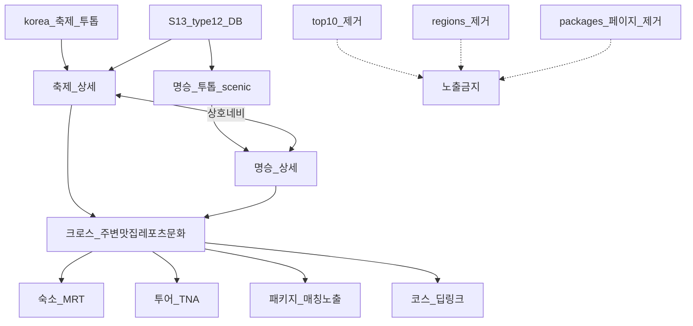
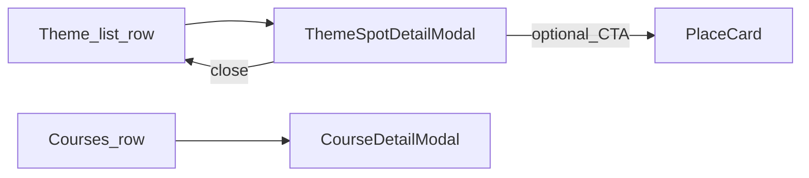
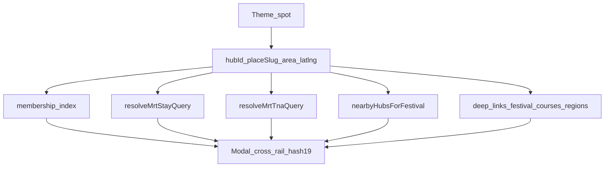

# 한국의 명승 · 축제 투톱 — 세션별 실행 플랜

**제품명**: **한국의 명승** (구「테마여행」·`/korea/theme`) + **한국의 축제**(`/korea`) = **투톱**  
**세션 표기**: `테마여행 #N, {단계}` — 순번 연속(주제 접두 유지 · 제품 카피는 명승) ([`cloud-preview-continuity.md`](./cloud-preview-continuity.md))  
**고정 브랜치 (구현)**: `cursor/korea-theme`  
**공유 slug**: `/qa/korea-theme` → Preview `/korea/theme` · `/korea/theme/scenic`  
**관련 기존 트랙**: [`korea-festival-hub-plan.md`](./korea-festival-hub-plan.md) (`/korea` 축제 · **지도·칩 코어 리팩터 금지** · 상세 크로스·네비만)  
**Cloud 연속성**: [`cloud-preview-continuity.md`](./cloud-preview-continuity.md) · [`AGENTS.md`](../AGENTS.md)

### 채팅명 복붙 (Cursor 새 채팅 제목)

Cloud 규칙 SSOT: [`cloud-preview-continuity.md`](./cloud-preview-continuity.md) **§1.1** · [`AGENTS.md`](../AGENTS.md) Cloud「채팅명 제시어」.  
형식: **`테마여행 #{N}, {단계}`** — `#N`은 Cloud 세션 순번(플랜 S번호와 별개).  
아래 **한 줄만** 채팅 제목/런칭에 붙여넣기. 본문 첫 메시지 **1행**도 동일 문자열.

| #N | 플랜 | 채팅명 (복붙) | 상태 |
|----|------|---------------|------|
| 1 | Pre-S0·S0 | `테마여행 #1, 플랜·S0 합의` | ✅ |
| 2 | S1 | `테마여행 #2, 셸 라우트` | ✅ |
| 3 | S2 | `테마여행 #3, 모듈 SSOT` | ✅ |
| 4 | S3 | `테마여행 #4, 10대 절경` | ✅ Preview QA |
| 5 | S4 | `테마여행 #5, 명승지` | ✅ Preview QA |
| 6 | (핫픽스) | `테마여행 #6, 뒤로복귀` | ✅ Preview QA |
| 7 | S5 | `테마여행 #7, 방방곡곡` | ✅ Preview QA |
| 8 | S6 | `테마여행 #8, 패키지` | ✅ Preview QA |
| 9 | S7 | `테마여행 #9, 축제 연결` | ⏳ Preview QA |
| 10 | S8 | `테마여행 #10, SEO·QA링크` | ✅ Preview QA |
| 11 | (리서치) | `테마여행 #11, 투어 API` | ✅ |
| 12 | S10 | `테마여행 #12, 여행코스·명승확장` | ⏳ Preview QA |
| 13 | (보강) | `테마여행 #13, 여행코스 보강` | ⏳ Preview QA |
| 14 | (코스 모달·칩) | `테마여행 #14, 코스 상세 모달` 등 | ✅ Preview QA |
| 15 | S11 | `테마여행 #15, 테마 상세 모달` | ⏳ Preview QA |
| 16 | (SSOT) | `테마여행 #16, 명승 contentId 보강` | ✅ Preview QA |
| 17 | (SSOT) | `테마여행 #17, 상세 정보 전수보강` | ⏳ Preview QA |
| 18 | S12 전략 | `테마여행 #18, 테마 연결` | ✅ Preview QA |
| 19 | S12 UI | `테마여행 #19, 크로스 레일` | ⏳ Preview QA |
| 20 | (핫픽스) | `테마여행 #20, 본문 가독성 개선` | ⏳ Preview QA |
| 21 | (핫픽스) | `테마여행 #21, 테마간 이동 개선` | ⏳ Preview QA |
| 22 | (리서치) | `테마여행 #22, 명승지 위치 정보` | ✅ LIVE 프로브 |
| 23 | S13 | `테마여행 #23, 국내여행지 DB` | ⏳ Preview QA |
| 24 | S9 | `테마여행 #24, 폴리시·릴리스` | ⏳ (본선 후) |
| 25 | (제품) | `테마여행 #25, 제품 흐름 재잠금` | ✅ 본 절 |
| 26 | (축제) | `테마여행 #26, 축제 주변 관광지` | ⏳ Preview QA |
| 28 | (맛집) | `테마여행 #28, 맛집 주변 API` | ⏳ Preview QA |
| 29 | (축제) | `테마여행 #29, 축제 본문 인근 여행지` | ⏳ Preview QA |
| 30 | (주변) | `테마여행 #30, 레포츠·문화 주변` | ⏳ Preview QA |
| 31 | (코스) | `테마여행 #31, 코스↔축제` | ⏳ Preview QA |
| 32 | (MRT) | `테마여행 #32, MRT 상품지` | ⏳ Preview QA |
| 33 | (IA) | `테마여행 #33, 페이지 정리` | ✅ 본 절 · 투톱 잠금 |
| 34 | (네비) | `테마여행 #34, 투톱 크로스 네비` | ✅ Preview QA |
| 75 | (빈 hub) | `테마여행 #75, 빈 hub 선정 칩 숨김` | ✅ main |
| 76 | (핫픽스) | `테마여행 #76, 상세 가로 스크롤` | ⏳ Preview QA |
| 77 | (SSOT) | `테마여행 #77, 명소 보강` | ⏳ Preview QA |

이어하기·핫픽스만 할 때: `테마여행 #N, {짧은 수정}` (`N` = 그 주제의 **다음** 순번). 세션마다 새 `#1` 금지.

| 세션 | 상태 | 산출 | 다음 |
|------|------|------|------|
| **Pre-S0** 플랜 저장소 반영 | ✅ | IA·세션표·가드 | S0 |
| **S0** 제품·IA 합의 | ✅ 2026-08-03 | 경로·홈·모듈페이지·패키지·브랜치 | S1 |
| **S1** 셸·라우트·홈 진입 | ✅ | `/korea/theme` MVP 껍데기 | S2 |
| **S2** 테마 카탈로그 SSOT | ✅ | modules + 랜딩 타일(`order` 가변) | S3 |
| **S3** 10대 절경 페이지 | ✅ Preview QA | 조사→SSOT→`/korea/theme/top10` | S4 |
| **S4** 명승지 페이지 | ✅ Preview QA | curated 20 → `/korea/theme/scenic` | #6 뒤로복귀 |
| **#6** PlaceCard 뒤로복귀 | ✅ Preview QA | `navigate(returnTo)` · TypeError 가드 | S5 |
| **S5** 방방곡곡 페이지 | ✅ Preview QA | 시도·hub → `/korea/theme/regions` | S6 |
| **S6** 패키지 페이지 | ✅ Preview QA | MRT CTA(제주·홈·경주) → `/korea/theme/packages` | S7 |
| **S7** 축제 연결 다듬기 | ⏳ Preview QA | `/korea?from=theme` · 복귀 한 줄 | S8 |
| **S8** SEO·sitemap·QA | ✅ Preview QA | Helmet·sitemap·`/qa/korea-theme` | S10 |
| **#11** TourAPI 리서치 | ✅ | type 25 코스·12 검증 가능 확인 | S10 |
| **S10** 여행코스·명승 확장 | ⏳ Preview QA | `/korea/theme/courses` · 명승 34 | #13 코스 보강 |
| **#13~#14** 코스 사진·모달·칩 | ✅ Preview QA | 목록↔모달 분리 · 0건 칩 숨김 | S11 |
| **S11** 테마 상세 모달 | ⏳ Preview QA | top10·scenic·regions 클릭→모달(축제/코스 벤치) | #16 contentId |
| **#16** 명승 contentId 보강 | ✅ Preview QA | scenic 34/34 contentId | #17 |
| **#17** 상세 정보 전수보강 | ⏳ Preview QA | top10 10/10 · regions Tour SSOT · 빈모달 가드 | S12 |
| **S12** 테마 크로스 연결 | ⏳ Preview QA | §2.5+#18 매처 · #19 모달 레일·area 수신 | #20 가독성 |
| **#20** 상세 본문 가독성 | ⏳ Preview QA | DetailRow 세로 배치(소제목↓본문) | S9 |
| **#21** 테마간 이전 복귀 | ⏳ Preview QA | 크로스 이동 후 「이전」·?spot= 모달 복원 | #22 명승 리서치 |
| **#22** 명승·Tour 규모 리서치 | ✅ | type12≈7294·좌표·쿼터·DB 방향 | #25 |
| **#25** 제품 흐름 재잠금 | ✅ 2026-08-05 | §1.0 · top10/regions 보류 · 명승=본선 | S13=#23 |
| **S13** 국내여행지 DB | ⏳ Preview QA | `tourapi_attraction` active≈7294 · scenic DB 목록 · nearby 훅 | #26 ✅ 축제 연결 |
| **#26** 축제 주변 관광지 | ⏳ Preview QA | 축제 상세 INFO · nearby DB · ThemeSpotDetailModal | #28 |
| **#28** 맛집 주변 API | ⏳ Preview QA | locationBasedList type39 · 축제/명소 주변 맛집 | #30 |
| **#30** 레포츠·문화 주변 | ⏳ Preview QA | locationBasedList type28/14 · 축제/명소 주변 | #31 |
| **#31** 코스↔축제 | ⏳ Preview QA | 축제→인근 코스 · 코스→인근 축제 · deep-link | #32 |
| **#32** MRT 상품지 | ⏳ Preview QA | LIVE 확인 국내 목적지 큐레이션 · 경주/부산 제외 | #33 |
| **#33** 페이지 정리 · 투톱 IA | ✅ 2026-08-05 | §1.0 재잠금 · top10/방방곡곡/패키지 **탑레벨 제거** · 축제↔명승 | #34 |
| **#34** 투톱 크로스 네비 | ✅ Preview QA | 상세 내 주변·맛집·레포츠·문화·패키지·숙소·투어·복귀 네비 정합 | S9 |
| **S9** 폴리시·릴리스 | ⏳ | 사람 QA → releaseNotes 1회 제안 (#24) | main 병합 |

---

## 0. 실행 규칙 (필독)

1. **한 채팅 = 한 세션 표기** (`테마여행 #N, …`). 세션을 합치지 않는다.
2. **읽을 것 (이어하기)**: 본 플랜 **해당 세션 절만** + 일지 「테마여행」최신 절 + `.ai-context` 1.5.1·§4.1 UI 금지 1~2줄. 전반 탐색·`travelSpots.js` 전체 스캔 금지.
3. **투톱 · 축제 코어 보호**: 축제 지도·칩·캐시 코어 **리팩터/리디자인 금지**. 명승↔축제는 **상세 크로스·헤더 네비·복귀**로 연결. **경로 `/korea` 유지**(축제 자리).
4. **브랜치**: 구현은 **짧은** `cursor/korea-theme` 한 번 생성 후 재사용. 플랜 문서 PR 브랜치(`cursor/korea-theme-plan-4160`)와 구현 브랜치를 섞지 않는다.
5. **Cloud feature**: 매 턴 최소 검증 PASS → 커밋·push · PR 유지 · 턴 종료에 `/qa/korea-theme` + git Preview URL.
6. **로컬 UI 조율**: 합의된 톤 조율은 커밋 보류 → 사람 QA 후. 「커밋 보류」≠ 리디자인 허가.
7. **UI 임의 변경 금지**: 홈·PlaceCard·`/korea` 기존 비주얼을 뜯지 않음. 테마 페이지는 신규이되 톤은 조화.
8. **릴리스 노트**: 공개 직전 **1회만** 초안 제안. 세션마다 금지.
9. **키 노출 금지**: Tour 키 `VITE_` 금지. 패키지는 기존 affiliate 빌더만.
10. **오류 루프**: 동일 FAIL 2회 → 중단·보고.



---

## 1. 제품 결론

### 1.0 투톱 IA 재잠금 (#33 · 2026-08-05) — **현재 SSOT**

**#25를 대체한다.** (#25의 DB·맛집 API·MRT 큐레이션 기술 방향은 유지 · **페이지 IA만 교체**)

사람이 잠근 방향:

1. **「테마여행」제품명 → 「한국의 명승」**
2. **투톱**: **축제 페이지**(`/korea`) · **명승 페이지**(`/korea/theme/scenic`, 랜딩 `/korea/theme`은 명승으로 정리)
3. **탑레벨 항목 제거**: **10대 절경** · **방방곡곡** · **패키지**(별도 모듈 페이지)
4. **각 페이지(축제·명승) 상세 안에서** 상호 크로스 체크·노출:
   - 주변 관광지
   - 맛집 정보
   - 레포츠 · 문화 정보
   - 패키지 **매칭** 노출 (페이지가 아니라 CTA)
   - 숙소 · 투어 정보 노출
   - 상세 페이지(모달) 구성
5. **길을 잃지 않는 네비**: 축제↔명승 상호 링크 · 상세→목록 복귀 · 크로스 이동 시 `ThemeNavBack`/`returnTo` · 이전 상세 복원

| 축 | 역할 (#33) |
|----|------------|
| **축제 `/korea`** | 투톱 A · 일정·지도·상세 · 주변/맛집/레포츠/문화/코스·패키지·숙소·투어 **상세 내** |
| **명승 `/korea/theme/scenic`** | 투톱 B · Tour DB type12 본선 · 동일 상세 크로스 구성 |
| 패키지 | **별도 페이지 제거** · hub/지역 매칭 시 상세 CTA만 (#32 큐레이션 재사용) |
| 여행코스 | **탑레벨 타일 제거** · 상세 deep-link(`/courses`)·모달 유지 |
| 10대 · 방방곡곡 | **탑레벨 제거** · 라우트/SSOT 코드는 삭제하지 않음(`enabled:false`) · 신규 노출·확장 금지 |
| 숙소·투어 | Place/MRT 기존 resolver · 상세 레일만 |

**기술 유지 (#25~#32)**: type12 Supabase 주1회 · 맛집39/레포츠28/문화14는 LIVE API · MRT 상품지 큐레이션 · 축제 지도·칩 코어 리팩터 금지.

### 1.1 한 줄

**「한국의 축제」+「한국의 명승」투톱.**  
주변·맛집·레포츠·문화·패키지·숙소·투어는 **각 상세에서 크로스**하고, 10대·방방곡곡·패키지 **모듈 페이지는 제거**.

### 1.2 라우트

| 경로 | 역할 | #33 |
|------|------|-----|
| **`/korea`** | **투톱 A · 축제** | ✅ |
| **`/korea/theme/scenic`** | **투톱 B · 명승** | ✅ |
| **`/korea/theme`** | 랜딩 → **명승으로 정리**(리다이렉트 또는 타일 최소화: 축제·명승만) | ✅ 정리 |
| `/korea/theme/courses` | 코스 모달·deep-link 수신 | 유지 · **탑레벨 비노출** |
| `/korea/theme/packages` | 레거시 | ❌ **탑레벨 제거** · 리다이렉트(명승) 또는 비노출 |
| `/korea/theme/top10` | 레거시 | ❌ **제거(비노출)** |
| `/korea/theme/regions` | 레거시 | ❌ **제거(비노출)** |
| `/place/:slug` | Place 2차 | 유지 |

**라우팅 가드**: `/korea` 축제 컴포넌트를 명승 셸로 바꾸지 않음. 제거 모듈은 **코드 삭제보다 `enabled:false`+네비 숨김** 우선(되돌리기·deep-link 안전).

### 1.3 홈 진입 (#33)

- 「국내」/축제 → `/korea` **유지**
- 구「테마여행」라벨 → **「한국의 명승」** → `/korea/theme`(→명승) 또는 `/korea/theme/scenic`
- 홈에 10대·방방곡곡·패키지 진입 **추가 금지**
- 기존 버튼 **리디자인 금지**(라벨·링크 목표만 교체)

### 1.4 모듈 · 순서 (#33)

| id | 라벨 | 경로 | enabled | 비고 |
|----|------|------|---------|------|
| `festivals` | 한국의 축제 | `/korea` | ✅ | 투톱 A (랜딩에 둘 때만) |
| `scenic` | **한국의 명승** | `/korea/theme/scenic` | ✅ | 투톱 B |
| `courses` | 여행코스 | `/korea/theme/courses` | ❌ 타일 | deep-link만 |
| `packages` | 패키지 상품 | `/korea/theme/packages` | ❌ | 상세 매칭만 |
| `top10` | 10대 절경 | `/korea/theme/top10` | ❌ | 제거 |
| `regions` | 방방곡곡 | `/korea/theme/regions` | ❌ | 제거 |

### 1.5 비범위 (#33)

- `/korea` 축제 **지도·칩 코어** 리팩터/리디자인
- top10·regions·packages **탑레벨 부활** · 신규 확장
- 맛집/레포츠/문화/코스 **전량 DB**
- 패키지 **가짜 상품 카드 목록** · `q=부산`/`q=경주` CTA
- `travelSpots.js` 전체 스캔 · 지구본 hub 전면 교체
- 홈·PlaceCard **임의 리디자인**
- 오케 다배치(기본 솔로 · 사람 명시 시만)

### 1.6 상세 크로스 · 네비 (목표 · #34에서 정합)

축제 상세 · 명승 상세가 **같은 정보 축**을 공유하고 서로 넘나든다.

| 표면 | 축제 상세 | 명승 상세 | 네비 가드 |
|------|-----------|-----------|-----------|
| 주변 관광지 | DB nearby (#26) | DB/목록·nearby | 클릭→모달 · 닫기=목록/시트 |
| 맛집 | type39 API (#28) | 동일 | 맛집→주변 관광지 크로스 |
| 레포츠·문화 | type28/14 (#30) | 동일 | 상세→관광지 크로스 |
| 여행코스 | 인근 코스 (#31) | 코스 deep-link | 모달 · 이전 복귀 |
| 패키지 | 권역/hub 매칭 시 CTA | 동일 (#32 키) | 새 탭 · 페이지 진입 아님 |
| 숙소·투어 | MRT stay/TNA | 동일 | 키워드 없으면 숨김 |
| 상대 투톱 | 「명승」더보기/`scenic?region=` | 「축제」`/korea?…` | from/return 유지 |
| 상세 구성 | FestivalDetailSheet | ThemeSpotDetailModal | 1차=모달/시트 · Place=2차 |

**길을 잃지 않기**: `koreaThemeNavBack` · `placeReturnTo` · `?from=` · 「이전」복원(#21) · 헤더에 **축제|명승** 상호 칩.

## 2. 정보구조 · UX

### 2.1 랜딩 `/korea/theme` (#33)

| 구역 | 내용 | 가드 |
|------|------|------|
| 헤더 | 홈 · **축제** 바로가기 · 타이틀「**한국의 명승**」 | 구「테마여행」카피 폐기 · 히어로 통계 금지 |
| 본문 | **명승으로 정리** — scenic 리다이렉트 **또는** 타일 최대 2(축제·명승) | top10/regions/packages/courses 타일 **금지** |
| 상호 | 축제 헤더↔명승 헤더 칩 | 길을 잃지 않게 from/return |

### 2.2 테마 페이지 공통

- 뒤로 → `/korea/theme`
- **목록 1차 클릭 = 상세 모달**(S11) — 지구본·`/place` 직행 금지(1차 CTA)
- place는 모달 안 **2차 CTA**만 (`setPlaceReturnTo` + `navigate`) — 예약·갤러리 등 PlaceCard가 필요할 때
- 모바일 1열 / PC는 기존 패턴

### 2.3 홈

- `placeReturnTo` ALLOWED에 `/korea/theme` 및 모듈 path 추가(또는 prefix 허용 검토 — **최소는 exact path 목록**).

### 2.4 테마 상세 모달 (S11 · 제품 피벗) ✅ 방향 잠금 2026-08-04

**한 줄**: 여행코스(`CourseDetailModal`)·축제(`FestivalDetailSheet`)처럼, **테마 목록에서 항목을 누르면 모달 본문에 기본 정보를 모두 나열**한다. 목록 스크롤이 place/지구본으로 끊기지 않게 한다.

| | 현재 (변경 전) | 목표 (S11) |
|--|----------------|------------|
| **10대 절경** `/top10` | 행 클릭 → `/place/:slug` | 행 클릭 → **모달** (SSOT+Tour type12) |
| **명승지** `/scenic` | 행 클릭 → `/place/:slug` | 행 클릭 → **모달** |
| **방방곡곡** `/regions` | 시도 칩=필터 · 명소 행 → `/place` | 칩=필터 유지 · 명소 행 → **모달** |
| **여행코스** `/courses` | 이미 모달 (#14) | **유지** · 크롬 패턴 재사용 |
| **패키지·축제** | 외부/기존 | 비범위 |

**벤치마크 (복사·리팩터 금지 · 패턴만)**

| 참조 | 가져올 것 | 가져오지 말 것 |
|------|-----------|----------------|
| `FestivalDetailSheet` | 모달 본문에 개요·주소·전화·이용·홈페이지·사진 나열 · Esc/배경 닫기 · 위로 | 축제 탭/즐겨찾기/동영상/지도 로직 이식 · `/korea` 코드 수정 |
| `CoursesPage` `CourseDetailModal` | 전면 모달 크롬(사방 패딩·상단 X·하단 위로/닫기) · 목록↔상세 분리 | type25 구간(ol) 강제 · accordion 부활 |

**모달 본문 필드 (명소·명승 공통 · type12 기준)**

| 구역 | 출처 | 비고 |
|------|------|------|
| 제목 · 권역/시도 | SSOT / hub | 즉시 표시 |
| GATEO 한 줄(blurb) | SSOT | contentId 없어도 표시 |
| 히어로·갤러리 | Tour `detailCommon`/`detailImage` · 없으면 플레이스홀더 | https 정규화 |
| 개요 | `detailCommon.overview` | stripHtml |
| 주소 · 전화 · 홈페이지 | common | 전화 `tel:` · 홈페이지 새 탭 |
| 이용·휴무·주차 등 | `detailIntro`(contentTypeId **12**) | 빈 필드 숨김 |
| 부가 설명 | `detailInfo` 행 | 중복 개요 스킵(축제와 동일 휴리스틱 OK) |
| **장소 카드 보기**(2차) | `placeSlug` 있을 때만 | `returnTo` = 현재 모듈 path |

**데이터 전략**

| 모듈 | 1차(즉시) | 2차(LIVE) | contentId 없을 때 |
|------|-----------|-----------|-------------------|
| top10 | rank·name·region·blurb·hub | Tour type12 detail(있으면) | SSOT만 · 「Tour 상세 없음」한 줄 |
| scenic | name·region·blurb·hub | 동일 | SSOT만 · **contentId 보강 = #16** (§S11.1) |
| regions | name·kind·hub·nameEn | hub attraction에 contentId 있으면 LIVE · 없으면 SSOT/hub 필드만 | 대량 searchKeyword **금지** |
| courses | (기존) | type25 detail | 유지 |

**공유 컴포넌트 (안)**

- `src/pages/KoreaTheme/ThemeSpotDetailModal.jsx` — 크롬은 Courses 모달과 동일 계열
- `src/utils/fetchTourApiAttractionDetail.js` (또는 courses 파일 옆) — `detailCommon`+`detailIntro(12)`+`detailInfo`+`detailImage` 병렬 · 축제 `festivalDetail` 액션 **재사용 가능하면** 읽기만, `/korea` UI 수정 금지
- top10/scenic/regions는 `selectedId` + open/close만 · Place 직행 `openSpot` 제거(1차)

**가드**

- 지구본 홈·`navigate('/')`를 목록 클릭에 연결 **금지**
- PlaceCard 1차 진입 **금지** (2차 CTA만)
- `FestivalDetailSheet`·축제 칩/지도 **리팩터 금지**
- Tour 키 `VITE_` 금지 · 라이브 대량 목록 UI 금지
- UI 임의 리디자인 금지 — 기존 stone/amber 톤·코스 모달 크롬 유지
- `#6` returnTo 가드는 **2차 CTA**용으로 유지



### 2.5 테마 크로스 연결 (S12 · 전략 잠금 2026-08-04)

**한 줄 (#33)**: **축제·명승 상세**에서 **주변 관광지·맛집·레포츠·문화·패키지 매칭·숙소·투어·코스**가 같은 조인키로 맞물린다. top10/방방곡곡/패키지 **페이지 멤버십 레일은 축소·비노출**. 새 거대 그래프 SSOT 금지 — **기존 hub / areaCode / placeSlug / MRT / nearby** 재사용.

#### 2.5.1 조인키 (우선순위)

| 순위 | 키 | 쓰는 곳 | 비고 |
|------|----|---------|------|
| 1 | `hubId` + `placeSlug` | top10·scenic·regions 멤버십 | 동일 명소 exact |
| 2 | `hubId` | 같은 도시 다른 명소 · 패키지(제주/경주) | `cityAttractionHubs` |
| 3 | TourAPI `areaCode` | 축제·코스·방방곡곡 deep-link | hub→`areaCodeForHubId` 우선 · 권역 라벨 폴백 |
| 4 | `lat`/`lng` | 인근 hub (haversine) | `nearbyHubsForFestival` 패턴 재사용 |
| 5 | `contentId` | Tour LIVE 상세만 | 크로스 매칭 1차가 아님 |

**금지**: `region` 한글 라벨만으로 축제/코스를 매칭(권역≠시도). 라벨→area 표는 deep-link 폴백만.

#### 2.5.2 교차 엣지 (무엇을 어디에)

| From ↓ \\ To → | 숙소(MRT) | 투어(TNA) | 축제 `/korea` | 여행코스 | 방방곡곡 | 인근 hub | 다른 테마 |
|----------------|-----------|-----------|---------------|----------|----------|----------|-----------|
| top10 / scenic / regions **모달** | ✅ stay query | ✅ tna query | ✅ `?from=theme&area=` | ✅ `?area=` | ✅ `?area=` | ✅ geo+sido | ✅ 멤버십·sameHub |
| courses 모달 | 후속(area→hub) | 후속 | 링크만 | — | `?area=` | 후속 | 후속 |
| 축제 시트 | Place 경유 유지 | Place 경유 | — | 링크만 | 기존 nearby hub | ✅ 기존 | 테마 복귀 유지 |
| packages | 외부 MRT | — | — | — | — | — | 제주/경주 키만 |

#### 2.5.3 매칭 규칙

1. **멤버십**: generate JSON을 복제하지 않음. 런타임 `buildThemeMembershipIndex()`가 top10+scenic+regions를 `placeSlug`로 합친다 → `inTop10` / `inScenic` / `inRegions`.
2. **sameHub**: 동일 `hubId`의 다른 placeSlug (자기 제외 · 기본 4).
3. **nearbyHubs**: spot lat/lng(+area) → `nearbyHubsForFestival` 재사용 · 자기 hub 제외 · 기본 4 · maxKm 120.
4. **숙소·투어**: `buildThemeSpotLocation(spot)` → 기존 `resolveMrtStayQuery` / `resolveMrtTnaQuery` (PlaceCard와 동일 키워드 래더). 테마 전용 키워드 SSOT **신규 금지**(필요 시 기존 override만).
5. **패키지**: hub `jeju`/`seogwipo`→`koreaJeju` · `gyeongju`→`koreaGyeongju` · 그 외 **CTA 숨김**(`q=부산`류 오탐 방지 · 홈 CTA는 패키지 페이지에만).
6. **deep-link**:  
   - 축제 `/korea?from=theme&area={areaCode}`  
   - 코스 `/korea/theme/courses?area=`  
   - 방방곡곡 `/korea/theme/regions?area=`  
   **#18**: 매처·URL 생성까지. **#19**: 모달 레일 UI + regions/courses/축제 `area` 쿼리 수신(최소 · 축제 칩/지도 로직 리팩터 금지).

#### 2.5.4 UI 표면 (모달 하단 레일 · #19)

`ThemeSpotDetailModal` 본문 **아래**에 섹션 단위로 붙인다(카드 남발·히어로 오버레이 금지 · 기존 stone/amber 톤).

| 섹션 | 내용 | 빈 때 |
|------|------|-------|
| 이 장소가 속한 테마 | top10/명승/방방곡곡 칩 → 해당 모듈 path | 모듈 0이면 숨김 |
| 같은 도시 명소 | sameHub 이름 링크(모달 전환 또는 모듈 deep-link) | 0이면 숨김 |
| 인근 여행지 | nearbyHubs → `/place/:hubId` (2차·returnTo 유지) | 0이면 숨김 |
| 숙소 · 투어 | Place 2차 CTA 안내 또는 기존 strip 패턴 **읽기만 연결** | keyword 없으면 숨김 |
| 축제 · 코스 | deep-link 버튼 2개 | area 없으면 from=theme만 |
| 패키지 | packageCta 있을 때만 새 탭 | 없으면 숨김 |

**1차 클릭 = 모달 유지**. 지구본 직행 금지. Place/외부는 명시 CTA만.

#### 2.5.5 코드 SSOT

| 파일 | 역할 |
|------|------|
| `src/pages/Home/lib/koreaThemeCrossLinks.js` | 조인·멤버십·deep-link·stay/tna/package 번들 |
| `npm run smoke:korea-theme-cross-links` | 오프라인 검증 |
| (후속 #19) `ThemeSpotDetailModal` 레일 | UI만 · 매처 로직 복제 금지 |

#### 2.5.6 가드

- `/korea` 축제 칩·지도·캐시 **리팩터 금지** — `area` 쿼리 **수신 1줄**만 허용(없으면 무시)
- 새 크로스 JSON 대량 curated **금지** (런타임 인덱스)
- MRT/`VITE_` 키 노출 금지 · 가짜 숙소/투어 카드 목록 금지
- relatedPlaces(태그 교집합) 를 테마 인근의 1차로 쓰지 않음
- UI 임의 리디자인 금지



---

## 3. 데이터 · SSOT

### 3.1 신규

| 파일 (안) | 역할 |
|-----------|------|
| `scripts/data/korea-theme-modules-overrides.mjs` | id·라벨·`order`·enabled·path |
| `src/pages/Home/data/koreaThemeModules.json` | generate |
| `scripts/data/korea-top10-scenic-overrides.mjs` | 순위·이름·hubId/attraction·한줄·tour contentId optional |
| `src/pages/Home/data/koreaTop10Scenic.json` | generate |
| `scripts/data/korea-scenic-spots-overrides.mjs` | 명승 12~40 (S10: 34) |
| `src/pages/Home/data/koreaScenicSpots.json` | generate |
| `scripts/data/korea-theme-package-targets-overrides.mjs` (또는 `mrtPackageThemeLinks` 확장) | 국내 MRT CTA |
| `src/pages/KoreaTheme/` | 랜딩 + 모듈 페이지 |
| `generate` / `audit:korea-theme-*` / smoke | 검증 |

JSON **직접 편집 금지** → overrides → generate → audit.

### 3.2 재사용 (읽기만)

| 기존 | 용도 |
|------|------|
| KR hub (`country: 대한민국`) ≈210 | regions·scenic·top10 연결 |
| `koreaAreaCodes` | 방방곡곡 |
| `/korea` festival stack | 축제 |
| `mrtPackageLinks` / `mrtPackageThemeLinks` | 패키지 mylink |
| PlaceCard·gallery | 상세 |

### 3.3 10대 절경 — 선정 방법 (S0 방침)

**공식 「국가 지정 10대 절경」단일 목록은 없음.**  
근거 혼합으로 GATEO curated 10을 만든다.

| 단계 | 작업 |
|------|------|
| A | 웹: 문체부·관광공사 **한국관광 100선**(2025–26) 자연·경관 축 + 언론「10대 비경」언급처 |
| B | TourAPI: `searchKeyword`/`detailCommon`(기존 proxy)로 후보명 검색 · `contentid`·좌표·이미지 확인 |
| C | 로컬 hub: `cityAttractionHubs` KR attraction exact/부분 매칭 → `/place` 연결 |
| D | 권역 균형(제주·강원·전라·경상·수도권 등) · 10개 고정 |
| E | UI 카피: **「GATEO 선정」** · 공식기관 사칭 금지 |

#### S3 착수 시드 초안 (사람 조정 OK · S3에서 확정)

hub 매칭 확인됨(2026-08-03):

| 순위(안) | 이름 | hub 힌트 |
|----------|------|----------|
| 1 | 한라산국립공원 | `jeju` > 한라산국립공원 |
| 2 | 성산일출봉 | `seogwipo` > 성산일출봉 |
| 3 | 설악산 | `sokcho` > 설악산 권금성 |
| 4 | 순천만습지·국가정원 | `suncheon` |
| 5 | 주상절리대 | `seogwipo` > 주상절리대 |
| 6 | 해운대·광안 야경 | `busan`/`suyeong` |
| 7 | 불국사·석굴암 일대 | `gyeongju` > 불국사 |
| 8 | 내장산국립공원 | `jeongeup` |
| 9 | 보성녹차밭 | `boseong` |
| 10 | 통영·한려 경관 | `tongyeong` |

**교체 후보**: 울릉 태하 해안(`ulleung`) · 마이산(`jinan`) · 정동심곡(허브 미매칭 → TourAPI/정착지 보강 후).

### 3.4 패키지 — MRT 제안 (S0 · S6에서 SSOT화)

목록 API 없음. **안정 딥링크 = `/pkc/search?q=`** (+ 기존 `mylink_id`·`utm_source=mktpartner`).

| 우선 | CTA 라벨 | 타깃 | LIVE 메모 (2026-08-05 · #32) |
|------|----------|------|------------------------------|
| ✅ | 제주 패키지 | `q=제주` | 에어텔·패키지 다수 |
| ✅ | 여수 패키지 | `q=여수` | 섬박람회·당일/1박 패키지 |
| ✅ | 울릉도 패키지 | `q=울릉도` | 포항·묵호 선박 패키지 (`q=울릉`은 0건) |
| ✅ | 강원 패키지 | `regionCategoryCode=GANGWONDO` | 삼척/동해·원주/횡성 (`q=강원`은 상주 오탐) |
| ✅ | 순천 패키지 | `q=순천` | 여수/순천 결합 |
| ✅ | 홍도·흑산 | `q=홍도` | 목포항 출발 |
| ✅ | 백령도 패키지 | `q=백령도` | 인천 출발 국내 |
| ✅ | 패키지 홈 | `kind:home` `/pkc` | 둘러보기 · UI 칩명 의존 금지 |
| ❌ | `q=경주` | — | **상주 당일여행 오탐** · 큐레이션 제외 (#32) |
| ❌ | `q=부산` | — | **출발지=부산 해외패키지** 혼입 |

SSOT: [`mrtPackageThemeLinks.js`](../src/pages/Home/data/mrtPackageThemeLinks.js) `KOREA_THEME_PACKAGE_KEYS` · hub 매핑 [`koreaThemeCrossLinks.js`](../src/pages/Home/lib/koreaThemeCrossLinks.js) · 프로브 `node scripts/probe-mrt-korea-package-destinations.mjs`.

**금지**: 단축 URL 추측 · 가짜 상품 카드 목록 · `q=부산`/`q=경주`를 국내 목적지 CTA로 표기.
### 3.5 국내 여행지 카탈로그 — type12 → Supabase (#22·#25 · S13)

| | |
|--|--|
| **소스** | TourAPI `areaBasedList2` · `contentTypeId=12` |
| **규모** | 전국 ≈**7,294** · 목록만 수 MB대 |
| **저장** | Supabase (안: `tourapi_attraction`) · contentId PK · 좌표·주소·cat·썸네일·modifiedtime · `active` |
| **갱신** | **주 1회** 배치 upsert · 목록 부재 id → `active=false` |
| **쿼터** | 개발 1000/일 · 전수 sync ≈150회/주 → 평소 LIVE 최소화 |
| **소비** | `/scenic` 본선 · `/korea` 축제 주변 관광지 · (추후) 검색·내위치 |
| **맛집 39** | **전량 DB 금지** · 반경/상세 **API 호출** |
| **레포츠 28·문화 14** | 명승 연동 시 API · 전량 DB는 2차 |
| **MRT 패키지** | 상품 LIVE 확인 후 **상품 있는 여행지만** 큐레이션 SSOT |
| **curated scenic 34** | 선택 추천 레일 · 본선은 DB |
| **변동성** | 신규 드묾·수정 다수 → 주간 sync로 충분 |

재현: [`scripts/probe-tourapi-scenic-counts.mjs`](../scripts/probe-tourapi-scenic-counts.mjs).

---

## 4. Cloud / 로컬

| | 방침 |
|--|------|
| **UI·Preview** | `cursor/korea-theme` · 매 턴 push · `/qa/korea-theme` |
| **축제 feature** | `cursor/korea-time-list-16a3` 등과 **브랜치 분리** |
| **오케** | 기본 비사용 |

---

## 5. 세션별 실행

### Pre-S0 ✅ · S0 ✅

**S0 결정표**

| # | 질문 | 결정 |
|---|------|------|
| 1 | 랜딩 경로 | **`/korea/theme`** (+ 테마별 하위 path) |
| 2 | 홈 진입 | **C** — 「테마여행」추가 · 기존 국내/축제 유지 |
| 3 | 모듈 순서 | **차후 `order`로 조정** · 각 테마=페이지 |
| 4 | 10대 | **웹+TourAPI+hub**로 S3에서 확정 · §3.3 시드 초안 |
| 5 | 패키지 | **MRT** · §3.4 P0/P1/P2 제안 |
| 6 | 구현 브랜치 | **`cursor/korea-theme`** |

---

### S1 — 셸·라우트·홈 진입 ✅

| | |
|--|--|
| **환경** | Cloud · `cursor/korea-theme` |
| **산출** | Route `/korea/theme` · 셸(헤더·타일 자리) · 홈「테마여행」링크 · `placeReturnTo` · 작업로그 · `/qa/korea-theme`+vercel redirect |
| **금지** | 축제 `/korea` 로직 수정 · 모듈 본문 · releaseNotes |
| **VERIFY** | `npm run build` · Preview `/korea/theme` · 홈→진입→뒤로 |

**채팅명**: `테마여행 #2, 셸 라우트`  
**첫 메시지**

```
테마여행 #2, 셸 라우트
@plans/korea-theme-travel-plan.md S1만
브랜치 cursor/korea-theme. /korea/theme 껍데기+홈「테마여행」+/qa/korea-theme.
축제 /korea 코드 수정 금지. build PASS 후 매 턴 push.
```

---

### S2 — 모듈 SSOT + 랜딩 타일 ✅

| | |
|--|--|
| **산출** | modules overrides(`order`)→json→audit · 타일 5 · 축제→`/korea` · 나머지→각 path(빈 페이지 OK) |
| **VERIFY** | `audit:korea-theme-modules` · build |
| **금지** | top10 본문 대량 · UI 리디자인 |

**채팅명**: `테마여행 #3, 모듈 SSOT`  
**첫 메시지**

```
테마여행 #3, 모듈 SSOT
@plans/korea-theme-travel-plan.md S2만
modules+타일+order. 축제=/korea. 다른 테마는 빈 페이지 라우트만.
```

---

### S3 — 10대 절경 페이지 ✅ Preview QA

| | |
|--|--|
| **산출** | §3.3 A–E 조사 · hub exact 10 · overrides→json · `/korea/theme/top10` · place 복귀 · 「GATEO 선정」 |
| **VERIFY** | `audit:korea-top10-scenic` · `smoke:korea-top10-scenic` · build · Preview |
| **금지** | 공식기관 사칭 · 축제 코드 수정 · 11개+ |
| **확정 10** | 한라산국립공원 · 성산일출봉 · 설악산(권금성) · 순천만습지 · 주상절리대 · 해운대·광안 · 불국사·석굴암 · 내장산국립공원 · 보성녹차밭 · 통영·한려(케이블카) |
| **후속** | PlaceCard←목록 복귀 → `#6` · **상세 모달은 S11로 피벗**(§2.4) |

**채팅명**: `테마여행 #4, 10대 절경`  
**첫 메시지**

```
테마여행 #4, 10대 절경
@plans/korea-theme-travel-plan.md S3·§3.3만
웹+TourAPI+hub로 10 확정→/korea/theme/top10. 시드 초안 조정 OK.
```

---

### S4 — 명승지 페이지 ✅ Preview QA

| | |
|--|--|
| **산출** | curated 20 · `/korea/theme/scenic` · 권역 필터 |
| **원칙** | 품질>수량 · TourAPI 라이브 대량 목록 금지 |
| **VERIFY** | `audit:korea-scenic-spots` · `smoke:korea-scenic-spots` · build |
| **S4 직후** | `#6 뒤로복귀` ✅ |

---

### #6 — PlaceCard 뒤로복귀 ✅ Preview QA

| | |
|--|--|
| **산출** | PlaceChatPanel·`leavePlaceCard` → `navigate(returnTo)` · `isKoreaPlaceReturnPath` 가드 |
| **원인** | 테마→place 직후 `prevPath` 미기록 시 `.startsWith` TypeError로 뒤로 버튼 실패 |
| **VERIFY** | `npm run build` · Preview top10/scenic→place→뒤로 |
| **금지** | 축제 `/korea` 필터 로직 수정 · (당시) 절경 전용 상세 — **철회 → S11** |

**채팅명**: `테마여행 #6, 뒤로복귀`

---

### S5 — 방방곡곡 페이지 ✅ Preview QA

| | |
|--|--|
| **산출** | `/korea/theme/regions` · areaCode→KR hub→place · 시도 칩 |
| **VERIFY** | `smoke:korea-area-codes` · `smoke:korea-theme-regions` · build |
| **금지** | 축제 지도 임베드 · hub JSON 직접 대량 편집 |

**채팅명**: `테마여행 #7, 방방곡곡`

---

### S6 — 패키지 페이지 ⏳ Preview QA

| | |
|--|--|
| **산출** | `/korea/theme/packages` · §3.4 P0+P1+P2 · `koreaJeju`/`koreaHome`/`koreaGyeongju` · 새 탭 |
| **VERIFY** | `smoke:mrt-package` · 제주·경주 LIVE 200 · mylink · build |
| **금지** | 가짜 카드 목록 · `q=부산` 국내 목적지 오표기 |

**채팅명**: `테마여행 #8, 패키지`  
**첫 메시지**

```
테마여행 #8, 패키지
@plans/korea-theme-travel-plan.md S6·§3.4만
MRT 제주 search+pkc 홈 CTA. 목록 API·q=부산 국내표기 금지.
```

---

### S7 — 축제 연결 다듬기 ⏳ Preview QA

| | |
|--|--|
| **산출** | 테마→`/korea?from=theme` · 헤더「← 테마여행으로」복귀 · 단독 `/korea` 무변화 |
| **VERIFY** | theme↔korea 왕복 · korea 단독 회귀 |
| **금지** | 축제 칩/지도/필터 로직 변경 |

**채팅명**: `테마여행 #9, 축제 연결`  
**첫 메시지**

```
테마여행 #9, 축제 연결
@plans/korea-theme-travel-plan.md S7만
복귀·카피만. 축제 칩/지도/필터 로직 변경 금지.
```

---

### S8 — SEO · sitemap · QA ✅ Preview QA

Helmet · sitemap에 `/korea/theme` 및 하위 · `/qa/korea-theme` 최종.

**채팅명**: `테마여행 #10, SEO·QA링크`  
**첫 메시지**

```
테마여행 #10, SEO·QA링크
@plans/korea-theme-travel-plan.md S8만
Helmet·sitemap·/qa/korea-theme. releaseNotes 파일 수정 금지.
```

---

### S10 — 여행코스 · 명승 확장 ⏳ Preview QA

| | |
|--|--|
| **산출** | 모듈 `courses` · `/korea/theme/courses` (TourAPI 25 라이브) · 명승 curated 34 · proxy 코스 필드 · smoke |
| **VERIFY** | `audit:korea-theme-modules` · `audit/smoke:korea-scenic-spots` · `smoke:korea-theme-courses`(+LIVE) · build |
| **주의** | 서울·제주 type25 등록 수 적음 · Edge proxy 코스 필드 배포됨(2026-08-04) |
| **금지** | 축제 `/korea` 로직 수정 · 12번 라이브 대량 목록 UI · releaseNotes 무단 반영 |

**채팅명**: `테마여행 #12, 여행코스·명승확장`

---

### #13 — 여행코스 사진 보강 ⏳ Preview QA

| | |
|--|--|
| **산출** | 코스 목록 썸네일 확대 · 펼침 히어로·갤러리·구간 `subdetailimg` · smoke LIVE 구간사진 |
| **VERIFY** | `smoke:korea-theme-courses`(+LIVE) · build |
| **주의** | TourAPI type25 **동영상 필드 없음** · YouTube 추정 검색은 범위 밖 |
| **금지** | 축제 로직 변경 · releaseNotes 무단 · 세션마다 새 Preview 브랜치 |

**채팅명**: `테마여행 #13, 여행코스 보강`

---

### S11 — 테마 상세 모달 ⏳ Preview QA (구현 = #15)

| | |
|--|--|
| **환경** | Cloud · 고정 `cursor/korea-theme` · PR #58 |
| **제품** | §2.4 — 목록 1차=모달 · Place=2차 CTA · 축제/코스 벤치 · 지구본 직행 금지 |
| **산출** | `ThemeSpotDetailModal` · attraction detail fetch(type12) · Top10/Scenic/Regions 클릭 연결 · 안내 카피(「장소 카드로」→「눌러 상세」) · smoke 최소 |
| **VERIFY** | `npm run build` · (가능 시) smoke: contentId 있는 top10 1건 LIVE detail · Preview top10/scenic/regions |
| **금지** | `/korea` 축제 로직 수정 · Place 1차 복귀 · 라이브 대량 목록 · releaseNotes 무단 · 새 Preview 브랜치 |
| **후속** | 명승 contentId 보강 = **#16** (§S11.1) · 폴리시=#17 |

**구현 순서 (한 세션 #15 권장 · 길면 A→B 분할)**

| 단계 | 작업 | Done |
|------|------|------|
| A | 공유 모달 크롬(코스와 동일) + SSOT 필드만 렌더 | ✅ top10 클릭→모달·Esc 닫기 |
| B | Tour type12 detail fetch + 개요/주소/이용/사진 | ✅ contentId 있는 항목 LIVE |
| C | scenic·regions 동일 연결 · 2차「장소 카드」CTA | ✅ place returnTo 유지 |
| D | 카피·작업로그·smoke · push | ⏳ Preview QA |

**채팅명**: `테마여행 #15, 테마 상세 모달`  
**첫 메시지**

```
테마여행 #15, 테마 상세 모달
@plans/korea-theme-travel-plan.md S11·§2.4만
브랜치 cursor/korea-theme. top10·scenic·regions 목록→모달(축제/코스 벤치).
Place 1차 금지·2차 CTA만. /korea 축제 코드 수정 금지. build PASS 후 매 턴 push.
```

---

### S11.1 — 명승 contentId 보강 ✅ Preview QA (#16)

**한 줄**: TourAPI에 없는 게 아니라 **scenic overrides의 `contentId`가 비어 있음**. 모달은 runtime `searchKeyword`를 쓰지 않음 → **overrides에 검증된 id를 채운 뒤** generate.

| | |
|--|--|
| **환경** | Cloud · `cursor/korea-theme` · PR #58 |
| **원인** | `ThemeSpotDetailModal` → spot.`contentId`만 LIVE. 34곳 중 14만 채움(20 null) → **#16에서 34/34** |
| **정식 경로** | `scripts/data/korea-scenic-spots-overrides.mjs` → `npm run generate:korea-scenic-spots` → `audit:korea-scenic-spots` |
| **보조 힌트** | `travelSpotTourApi.json`에 이미 있는 id(아래 표) — **복사 후보일 뿐** · 모달 runtime 폴백 추가 **비권장**(이번 세션) |
| **조회** | Edge `tourapi-proxy` `searchKeyword`(type12) + `detailCommon`으로 title·좌표 확인 후 overrides 기입 |
| **금지** | 목록 UI에서 대량 LIVE 검색 · JSON spots 직접 편집 · `/korea` 축제 수정 · 새 Preview 브랜치 · releaseNotes |
| **VERIFY** | `generate` · `audit:korea-scenic-spots` · `smoke:korea-theme-spot-modal` · `npm run build` · Preview `/scenic` 경복궁 등 |
| **후속** | (여유 시) top10 null 5곳 동일 패턴 · regions는 hub에 contentId 없음 → 별도 · 폴리시=#17 |

**contentId 채움 20 (#16 · searchKeyword+detailCommon 검증)**

| id | name | contentId | Tour title (확정) |
|----|------|-----------|-------------------|
| gyeongbokgung | 경복궁 | **126508** | 경복궁 |
| changdeokgung | 창덕궁 | **127642** | 창덕궁과 후원 [유네스코 세계유산] |
| suwon-hwaseong | 수원화성 | **125555** | 수원 화성 [유네스코 세계유산] |
| namhansanseong | 남한산성 | **125449** | 남한산성도립공원 [유네스코 세계유산] |
| nami-island | 남이섬 | **128019** | 남이섬 |
| gyeongpodae | 경포대 | **125790** | 강릉 경포대 |
| jeongdongjin | 정동진 | **3545967** | 정동진 |
| naksansa | 낙산사 | **125773** | 낙산사 |
| jeonju-hanok | 전주한옥마을 | **264284** | 전북 전주 한옥마을 [슬로시티] |
| juknokwon | 죽녹원 | **128834** | 죽녹원 |
| naganeupseong | 낙안읍성 | **127931** | 순천 낙안읍성 |
| chaeseokgang | 채석강 | **128982** | 채석강 (전북 서해안 국가지질공원) |
| maisan | 마이산 | **126235** | 마이산도립공원 |
| cheomseongdae | 첨성대 | **126207** | 경주 첨성대 |
| haeinsa | 해인사 | **126175** | 해인사(합천) |
| hahoe-village | 안동 하회마을 | **894027** | 안동 하회마을 [유네스코 세계유산] |
| taejongdae | 태종대 | **126658** | 태종대 |
| dodamsambong | 도담삼봉 | **125913** | 도담삼봉 |
| taean-coast | 태안해안국립공원 | **125818** | 태안해안국립공원 |
| cheonjiyeon | 천지연폭포 | **126438** | 천지연폭포 |

**절차 (에이전트)**

1. 위 표 순으로 `searchKeyword` → 후보 중 **관광지 type12·제목 일치·좌표≈hub** 고르기 · 애매하면 skip(null 유지)  
2. `detailCommon` 1회로 title 확인  
3. overrides `contentId` 기입 → `generate:korea-scenic-spots` → audit  
4. (선택) top10 null: 순천만·주상절리·내장산·보성녹차·통영 한려 — 같은 패턴  
5. Preview `/korea/theme/scenic` 경복궁·남이섬 모달 LIVE · 작업로그 · push

**채팅명**: `테마여행 #16, 명승 contentId 보강`  
**첫 메시지**

```
테마여행 #16, 명승 contentId 보강
@plans/korea-theme-travel-plan.md S11.1만
브랜치 cursor/korea-theme. scenic overrides contentId 20곳 검증·채움.
runtime searchKeyword 금지 · generate→audit→smoke→build 후 push.
```

---

### S11.2 — 상세 정보 전수보강 ⏳ Preview QA (#17)

**한 줄**: top10·scenic·regions를 전수 조사해 Tour contentId를 채우고, 없는 항목은 Place CTA·SSOT로 **빈 모달이 되지 않게** 한다.

| 모듈 | 조사 결과 (#17) | 조치 |
|------|-----------------|------|
| **scenic** | 34/34 contentId (#16) | 유지 |
| **top10** | null 5 → **10/10** | overrides 채움(순천만 `126730`·대포주상절리 `127053`·내장산 `126237`·대한다원 `127869`·통영케이블카 `533874`) · **교체 불필요** |
| **regions** | 하드코딩 `contentId:null` → SSOT 연결 | `korea-theme-region-tour-overrides` ≈149/196 · type12/14/시장38 · 허브 주소 검증 |

**빈 상세 방지**

1. contentId 있으면 Tour LIVE (type은 `detailCommon.contentTypeId` 우선)  
2. 없으면 GATEO blurb + 「장소 카드 보기」 CTA (placeSlug 필수)  
3. runtime 대량 `searchKeyword` **금지** — 오프라인 `fill:korea-theme-region-tour`만

**대안 경로 (Tour 공백·오탐 시 · 조사 메모)**

| 경로 | 용도 | 비고 |
|------|------|------|
| **TourAPI KorService2** (현재) | type12/14/25/28/38… | Edge `tourapi-proxy` · 키 `VITE_` 금지 |
| TourAPI **PhotoGallery** (`searchPhoto`) | 이미지 보강 | 개요 없음 · 갤러리 트랙과 공유 |
| **국가유산청** OpenAPI (`ccbaKdcd=15` 명승) | 지정 명승 공식 목록·해설 | **#46 본선** · `sync:cha-scenic` → `koreaHeritageScenic.json` · 현행≈141(해제 제외) · Tour type12와 별개 |
| **지자체 관광 OpenAPI**/포털 | 시·도 자체 명소 | 스키마 분절 · curated 소량만 적합 |
| **VisitKorea / 한국관광 100선** | 선정·카피 근거 | API보다 큐레이션 근거용 (10대 §3.3) |
| **PlaceCard / hub SSOT** | Tour 공백 시 상세 | 모달 2차 CTA · 갤러리·지도는 place |

**VERIFY**: `generate:korea-top10-scenic` · `generate/audit:korea-theme-region-tour` · `smoke:korea-theme-spot-modal` · `smoke:korea-theme-regions` · `npm run build`

**채팅명**: `테마여행 #17, 상세 정보 전수보강`  
**첫 메시지**

```
테마여행 #17, 상세 정보 전수보강
@plans/korea-theme-travel-plan.md S11.2만
브랜치 cursor/korea-theme. top10·regions Tour contentId 전수보강.
빈 모달 금지 · runtime 대량 searchKeyword 금지 · build 후 push.
```

---

### S12 — 테마 크로스 연결 ⏳ (#18 전략 · #19 UI)

| | |
|--|--|
| **환경** | Cloud · `cursor/korea-theme` · PR #58 |
| **제품** | §2.5 — 모달에서 숙소·투어·축제·코스·인근·테마 멤버십 교차 |
| **#18 산출** | §2.5 잠금 · `koreaThemeCrossLinks.js` · `smoke:korea-theme-cross-links` · 일지·작업로그 |
| **#19 산출** | 모달 레일 UI · regions/courses(/korea area 수신 최소) · Preview QA |
| **VERIFY (#18)** | `npm run smoke:korea-theme-cross-links` · `npm run build` |
| **VERIFY (#19)** | `smoke:korea-theme-cross-links` · `smoke:korea-theme-spot-modal` · `npm run build` |
| **금지** | 축제 필터/지도 리팩터 · 새 크로스 JSON 대량 · 가짜 상품 카드 · releaseNotes · 새 Preview 브랜치 |

**채팅명 (#18)**: `테마여행 #18, 테마 연결`  
**첫 메시지**

```
테마여행 #18, 테마 연결
@plans/korea-theme-travel-plan.md S12·§2.5만
브랜치 cursor/korea-theme. 크로스 조인키·매처·deep-link 전략 잠금+lib/smoke.
모달 UI 레일은 #19. /korea 축제 로직 수정 금지. smoke·build 후 push.
```

**채팅명 (#19 UI)**: `테마여행 #19, 크로스 레일`  
**첫 메시지**

```
테마여행 #19, 크로스 레일
@plans/korea-theme-travel-plan.md S12·§2.5.4만
ThemeSpotDetailModal에 cross-links 레일. area 쿼리 수신 최소.
축제 칩/지도 리팩터 금지. smoke·build 후 push.
```

---

### #21 — 테마간 이동 · 이전 복귀 ⏳ Preview QA

| | |
|--|--|
| **산출** | `koreaThemeNavBack` 스택 · `ThemeModuleBackButton`/힌트 · 모달 크로스 push · `?spot=` 복원 · placeReturnTo 쿼리 · 축제 from=theme 직전 상세 |
| **VERIFY** | `npm run smoke:korea-theme-nav-back` · `smoke:korea-theme-spot-modal` · `npm run build` |
| **금지** | UI 리디자인 · 축제 칩/지도 리팩터 · releaseNotes 무단 반영 |

**채팅명**: `테마여행 #21, 테마간 이동 개선`

```
테마여행 #21, 테마간 이동 개선
브랜치 cursor/korea-theme. 크로스 이동 후 이전 테마·상세 복귀.
```

### S9 — 폴리시 · QA · 릴리스 ⏳

사람 Preview OK → releaseNotes **초안만 제안** → 합의 후 반영 · main 병합.  
**순서**: 명승 TourAPI 전량(S13) Preview QA 후 권장.

**채팅명**: `테마여행 #24, 폴리시·릴리스`  
**첫 메시지**

```
테마여행 #24, 폴리시·릴리스
@plans/korea-theme-travel-plan.md S9·§7만
Preview QA·폴리시. releaseNotes는 초안만 채팅 제안(합의 전 파일 금지).
```

---

### #22 — 명승지 TourAPI·위치 리서치 ✅

**동기**: 축제처럼 탐색형 방문 — curated 34만이 아니라 TourAPI가 주는 명승·관광지를 넓게 보고 싶다.  
**프로브 일시**: 2026-08-05 · `KorService2` `areaBasedList2` · 시도 17개 합산 · `TOUR_API_SERVICE_KEY` LIVE.

| 구분 | 건수 | 비고 |
|------|------|------|
| **contentTypeId=12 관광지 전국** | **≈7,294** | 축제 롤링(~220) · 코스 type25(~49) 대비 대량 |
| cat1 `A01` 자연 | ≈2,098 | |
| cat1 `A02` 인문 | ≈5,196 | |
| cat2 `A0101` 자연관광지 | ≈1,985 | 국립공원·산·해안·섬 등 |
| cat2 `A0201` 역사관광지 | ≈2,491 | 고궁·성·사찰·유적 등 |
| cat2 휴양/체험/산업/조형 | ≈2,705 | A0202~A0205 |
| 현재 curated scenic SSOT | **34** | contentId·lat/lng 전수 |

**위치 정보**: 목록 응답에 `mapx`/`mapy`(경·위도)·`addr1`·`areacode`·`sigungucode`가 **기본 포함**. 서울 샘플 100/100 좌표 있음 · 이미지 `firstimage` 대부분. 상세는 기존 `detailCommon`/`detailIntro`(type12)와 동일.

**cat1 (type12)**: `A01` 자연 · `A02` 인문.  
**cat2**: `A0101` 자연관광지 · `A0102` 관광자원 · `A0201` 역사 · `A0202` 휴양 · `A0203` 체험 · `A0204` 산업 · `A0205` 건축/조형물.

**제품 잠금 (#22→#25로 승격)**: type12는 **Supabase 저장 + 주1회 sync**가 본선. curated 34는 추천 레일(선택). 라이브 시도 단위 fetch만으로 끝내지 않음(#25).

재현: `node scripts/probe-tourapi-scenic-counts.mjs` (키 있을 때 LIVE).

---

### #25 — 제품 흐름 재잠금 ✅ (기술 · **IA는 #33이 대체**)

기술 요약(유지): 국내여행지 DB · 주1회 · 축제 주변 · 맛집 API · MRT 상품지 큐레이션.  
**페이지 IA**: #25의「코스·패키지 모듈 유지 · top10/regions 보류」→ **#33 투톱**으로 승격·대체.

**채팅명**: `테마여행 #25, 제품 흐름 재잠금` (문서 · 완료)

---

### S13 — 국내여행지 DB · 명승 본선 ⏳ Preview QA (#23)

| | |
|--|--|
| **산출** | `tourapi_attraction` · `npm run sync:tourapi-attractions` · `/scenic` GATEO 레일+DB 목록 · `fetchNearbyTourAttractions` 훅 |
| **후속(같은 본선)** | #26 축제 주변 UI · 맛집 API 주변 · 레포츠/문화 · 코스↔축제 · MRT 상품지 · 랜딩 top10/regions 보류 |
| **VERIFY** | active≈7294 · `smoke:tourapi-attractions` · scenic/spot-modal/nav-back · build |
| **금지** | 맛집 전량 DB · top10/regions 신규 확장 · 축제 지도 리팩터 · `VITE_` Tour 키 · curated JSON에 7천 시드 |
| **쿼터** | 목록 전수 ≈ 시도 17회 · detail 전수 금지 |
| **핸드오프** | [`2026-08-05-project-log.md`](./2026-08-05-project-log.md) 「테마여행 · 에이전트 핸드오프 → #26」 |

**채팅명**: `테마여행 #23, 국내여행지 DB`  
**첫 메시지**

```
테마여행 #23, 국내여행지 DB
@plans/2026-08-05-project-log.md 「테마여행 · 에이전트 핸드오프」
@plans/korea-theme-travel-plan.md S13·§1.0·§3.5만
브랜치 cursor/korea-theme 고정. type12→Supabase·주1회 sync(목록만·시도≈17회).
scenic이 DB 읽기. 맛집 전량 DB 금지. top10/regions 보류. 축제 지도 리팩터 금지.
쿼터 1000/일·detail 전수 금지. smoke·build 후 push.
```

---

### #26 — 축제 주변 관광지 ⏳ Preview QA

| | |
|--|--|
| **산출** | `FestivalDetailSheet` INFO 탭 · `fetchNearbyTourAttractions`(8km) · 클릭→`ThemeSpotDetailModal` |
| **VERIFY** | `npm run smoke:korea-festival-nearby` · `smoke:tourapi-attractions` · `smoke:korea-theme-spot-modal` · build |
| **금지** | `/korea` 축제 지도·칩 리팩터 · 맛집 type39 전량 DB · top10/regions 확장 |
| **핸드오프** | [`2026-08-05-project-log.md`](./2026-08-05-project-log.md) 「테마여행 · 에이전트 핸드오프 → #27」 |

**채팅명**: `테마여행 #26, 축제 주변 관광지`

---

### #28 — 맛집 주변 API ⏳ Preview QA

| | |
|--|--|
| **산출** | `locationBasedList` proxy · `fetchNearbyTourRestaurants` · 축제/명소 「주변 맛집」 · type39 상세 intro |
| **VERIFY** | `npm run smoke:korea-nearby-restaurants` · `smoke:korea-festival-nearby` · `smoke:tourapi` · build |
| **금지** | 맛집 type39 전량 DB · `/korea` 축제 지도·칩 리팩터 · top10/regions 확장 |
| **핸드오프** | [`2026-08-05-project-log.md`](./2026-08-05-project-log.md) 「테마여행 · 에이전트 핸드오프 → #29」 |

**채팅명**: `테마여행 #28, 맛집 주변 API`

---

### #30 — 레포츠·문화 주변 ⏳ Preview QA

| | |
|--|--|
| **산출** | `fetchNearbyTourLeports`(28) · `fetchNearbyTourCulture`(14) · 축제/명소 「주변 레포츠」「주변 문화」 · 상세↔관광지 크로스 · intro 필드 |
| **VERIFY** | `npm run smoke:korea-nearby-leisure-culture` · restaurants/festival nearby · build |
| **금지** | 레포츠/문화 전량 DB · `/korea` 축제 지도·칩 리팩터 · top10/regions 확장 |
| **핸드오프** | [`2026-08-05-project-log.md`](./2026-08-05-project-log.md) 「테마여행 · 에이전트 핸드오프 → #31」 |

**채팅명**: `테마여행 #30, 레포츠·문화 주변`

---

### #33 — 페이지 정리 · 투톱 IA ✅

| | |
|--|--|
| **산출** | §1.0 재잠금 · 채팅표 #33/#34 · 모듈 `enabled`로 top10·regions·packages·courses 타일 제거 · 홈/랜딩 카피「한국의 명승」 · README·일지 |
| **다음** | **#34** 투톱 크로스 네비 정합(상세 레일·상호 칩·packages/top10/regions 진입 리다이렉트·스모크) |
| **금지** | 축제 지도·칩 리팩터 · 제거 모듈 코드 강제 삭제(enabled/네비만) · 홈 리디자인 · releaseNotes |
| **VERIFY** | `audit:korea-theme-modules` · `smoke:korea-theme-cross-links` · `npm run build` · Preview 홈→명승·축제 |

**채팅명**: `테마여행 #33, 페이지 정리`  
**첫 메시지**

```
테마여행 #33, 페이지 정리
@plans/korea-theme-travel-plan.md §1.0·#33만
브랜치 cursor/korea-theme. 테마여행→한국의 명승 투톱(축제/명승).
10대·방방곡곡·패키지 탑레벨 제거. 상세 크로스·네비 방향 잠금.
```

### #34 — 투톱 크로스 네비 ✅ Preview QA

| | |
|--|--|
| **산출** | 축제↔명승 헤더 상호 칩 · 축제 상세 숙소·투어·패키지 레일 · `/packages`·`/top10`·`/regions` → scenic 리다이렉트 · 모달 top10/regions 딥링크 숨김 · nav-back「명승」·`/qa/korea-theme`→scenic |
| **VERIFY** | `smoke:korea-theme-nav-back` · cross-links · festival-nearby · nearby restaurants/leisure · build · Preview 왕복 |
| **금지** | 축제 지도·칩 리팩터 · 가짜 패키지 카드 · top10/regions 콘텐츠 확장 · UI 임의 리디자인 |
| **다음** | S9 폴리시·릴리스(사람 Preview QA 후) |

**채팅명**: `테마여행 #34, 투톱 크로스 네비`  
**첫 메시지**

```
테마여행 #34, 투톱 크로스 네비
@plans/korea-theme-travel-plan.md §1.0·§1.6·#34만
브랜치 cursor/korea-theme. 축제↔명승 상호 네비·상세 크로스 정합.
packages/top10/regions 탑레벨 진입 정리. 지도·칩 리팩터 금지.
```

## 6. 리스크 · 가드

| 리스크 | 대응 |
|--------|------|
| `/korea` vs 명승 혼동 | 카피: **축제**(일정·지도) / **명승**(관광지 본선) · 구「테마여행」폐기 |
| RR 라우트 충돌 | theme path를 명시 Route로 등록 |
| 10대 논쟁 | GATEO 선정 · S3 확정 후 세션 중 교체 금지 |
| MRT `q=부산` 오해 | 국내 CTA에서 제외 |
| Preview 난립 | `cursor/korea-theme` 고정 |
| 축제 feature 충돌 | 브랜치 분리 · path 링크만 |
| PlaceCard←theme 목록 복귀 | `#6` ✅ · **S11 이후 1차는 모달** · place는 2차 CTA+returnTo |
| contentId 공백 | 모달은 SSOT로 성립 · LIVE는 있을 때만 · 대량 키워드 검색 금지 |
| 모달 3중 구현 | `ThemeSpotDetailModal` 1개 공유 · Courses 모달은 type25 전용 유지 OK |
| 테마 간 단절 | §2.5 조인키(hub/area/geo) · 크로스 JSON 남발 금지 · 축제 로직 비침투 |
| 명승 type12 ≈7k | **DB+주간 sync** · curated 7천 시드 금지 · 평소 LIVE 최소화 |
| 맛집 쿼터 | type39 **전량 DB 금지** · 주변 API만 · proxy locationBased 추가 시 캐시/TTL |
| top10/regions/packages 제거 | 타일·홈 **비노출** · 코드 삭제 금지 · 탑레벨 부활 금지 · 패키지는 상세 매칭만 |
| 명승=선발만 오해 | 카피: 국내 관광지 카탈로그 탐색 + (선택) GATEO 추천 |

---

## 7. 성공 기준 (MVP)

- [x] **#33**: 투톱 IA 잠금 · 10대·방방곡곡·패키지 탑레벨 제거 · 제품명「한국의 명승」
- [x] **#34**: 축제↔명승 상호 네비 · 상세 크로스(주변·맛집·레포츠·문화·패키지·숙소·투어)로 길 안 잃음 (Preview QA)
- [x] 홈에서 축제·명승만 명확 진입 · 제거 모듈 타일 없음
- [ ] `/korea` 축제 회귀 없음 (사람 Preview)
- [x] 10대 10곳 → place → 테마 복귀 (`#6` · 레거시 경로 · Preview QA)
- [x] **S11**: top10·scenic·regions 목록 → **상세 모달**(개요·기본정보) · Place는 2차 (Preview QA)
- [x] 명승 curated ≥12 (현재 34 · contentId 전수) · 여행코스 type25 모달 · 방방곡곡 시도 칩→명소 목록
- [x] **S13**: type12 Supabase · 주간 sync · scenic DB 소비 · nearby 훅 (축제 UI 연결=#26)
- [x] **#26**: 축제 상세 주변 관광지(DB) · ThemeSpotDetailModal (Preview QA)
- [x] **#28**: 맛집 type39 주변 API · 축제/명소 연결 (Preview QA)
- [x] **#30**: 레포츠28·문화14 주변 API · 축제/명소 연결 (Preview QA)
- [x] **#31**: 코스↔축제 양방향 · areaBased type25 · festival deep-link (Preview QA)
- [x] **#25→#33**: 기술(#25) 유지 · IA는 투톱·탑레벨 제거로 승격
- [x] 패키지 MRT 상품지 큐레이션(제주·여수·울릉도·강원·순천·홍도·백령 + 홈) · mylink (#32)
- [x] `/qa/korea-theme` · 고정 Preview (S1·S8 최종 · sitemap/Helmet)
- [ ] audit/smoke/build PASS · 키 미노출
- [ ] 사람 QA 전 완료·main 병합 단정 없음
- [ ] **S12**: 모달에서 숙소·투어·축제·코스·인근·테마 멤버십 교차(매처 #18 · UI #19 Preview QA)

---

## 8. 핸드오프 템플릿

```
## 테마여행 #N, {단계}
- 상태: feature cursor/korea-theme · PR #… · SHA …
- 한 일: …
- VERIFY: …
- 공유: https://www.gateo.kr/qa/korea-theme
- Preview: https://days-git-cursor-korea-theme-….vercel.app/korea/theme
- 다음: S? · 제시어
- 금지 3: …
```

---

## 9. 결정표 (잠금)

| # | 질문 | 결정 | 상태 |
|---|------|------|------|
| 1 | 제품 축 | **축제 + 명승 투톱** (#33) | ✅ |
| 2 | 경로 | `/korea` · `/korea/theme/scenic`(명승) · 랜딩 정리 | ✅ |
| 3 | 홈 진입 | 축제 유지 + **「한국의 명승」**(구 테마여행) | ✅ #33 |
| 4 | 제거 | **10대 · 방방곡곡 · 패키지 페이지** 탑레벨 비노출 | ✅ #33 |
| 5 | 패키지·코스·숙소·투어 | **상세 매칭/크로스만** | ✅ 방향 · #34 정합 |
| 6 | 브랜치 | `cursor/korea-theme` | ✅ |
| — | (구 S0) 테마 모듈 디렉터리 | **폐기** — #25 보류안도 #33이 대체 | 폐기 |
