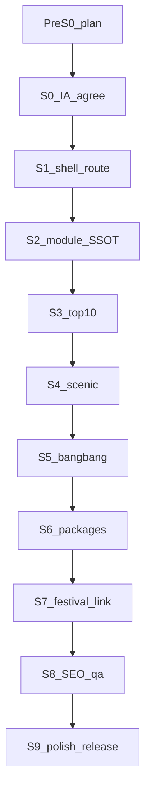

# 한국의 테마여행 — 세션별 실행 플랜

**세션 표기**: `테마여행 #N, {단계}`  
**고정 브랜치 (구현 시작 시)**: `cursor/korea-theme` (짧게 · Preview 호스트 고정)  
**공유 slug (구현 시)**: `/qa/theme-korea` → Preview `/themes/korea`  
**관련 기존 트랙**: [`korea-festival-hub-plan.md`](./korea-festival-hub-plan.md) (`/korea` 축제 · **건드리지 않고 연결만**)  
**Cloud 연속성**: [`cloud-preview-continuity.md`](./cloud-preview-continuity.md) · [`AGENTS.md`](../AGENTS.md)

| 세션 | 상태 | 산출 | 다음 |
|------|------|------|------|
| **Pre-S0** 플랜 저장소 반영 | ✅ 본 파일 | IA·세션표·가드 | S0 제품 합의 |
| **S0** 제품·IA 합의 | ⏳ | 라우트·모듈 우선순위·비범위 | S1 |
| **S1** 셸·라우트·홈 진입 | ⏳ | `/themes/korea` MVP 껍데기 | S2 |
| **S2** 테마 카탈로그 SSOT | ⏳ | `koreaThemeModules` + 타일 UI | S3 |
| **S3** 10대 절경 | ⏳ | curated 10 + 상세/place 연결 | S4 |
| **S4** 명승지 | ⏳ | 큐레이션 목록 + hub/place | S5 |
| **S5** 방방곡곡 | ⏳ | 시도·시군 hub 브라우즈 | S6 |
| **S6** 패키지 상품 | ⏳ | MRT `/pkc` 딥링크 스트립 | S7 |
| **S7** 축제 연결 다듬기 | ⏳ | `/korea` 딥링크·복귀·칩 | S8 |
| **S8** SEO·sitemap·작업로그 | ⏳ | Helmet·sitemap·`/qa/theme-korea` | S9 |
| **S9** 폴리시·릴리스 | ⏳ | 사람 QA → releaseNotes 1회 제안 | main 병합 |

---

## 0. 실행 규칙 (필독)

1. **한 채팅 = 한 세션 표기** (`테마여행 #N, …`). 세션을 합치지 않는다.
2. **읽을 것 (이어하기)**: 본 플랜 **해당 세션 절만** + 일지 「테마여행」최신 절 + `.ai-context` 1.5.1·§4.1 UI 금지 1~2줄. 전반 탐색·`travelSpots.js` 전체 스캔 금지.
3. **`/korea` 축제 트랙과 분리**: 축제 지도·칩·캐시·TourAPI 프록시를 **리팩터/리디자인하지 않음**. 테마 허브는 **링크·복귀·카피**로만 연결.
4. **브랜치**: 구현은 **짧은** `cursor/korea-theme` 한 번 생성 후 재사용. 세션마다 새 `cursor/…-xxxx` 금지. (본 Pre-S0 문서 브랜치 `cursor/korea-theme-plan-4160`은 플랜 전용 · 구현 시작 시 `cursor/korea-theme`로 이관.)
5. **Cloud feature**: 매 턴 최소 검증 PASS → 커밋·push · PR 유지 · 턴 종료에 `/qa/theme-korea` + git Preview URL.
6. **로컬 UI 조율**: 합의된 톤 조율은 커밋 보류 → 사람 QA 후. 「커밋 보류」≠ 리디자인 허가.
7. **UI 임의 변경 금지**: 홈·PlaceCard·`/korea` 기존 비주얼을 뜯지 않음. 테마 허브는 **신규 페이지**이므로 톤은 PlaceCard/`/korea`와 **조화**(색·폰트 난발 금지)하되, 홈을 리디자인하지 않음.
8. **릴리스 노트**: 공개 직전 **1회만** 초안 제안 (`.ai-context` **1.7**). 세션마다 금지.
9. **키 노출 금지**: Tour/MRT 비밀키 `VITE_` 금지. 패키지는 기존 affiliate 빌더만.
10. **오류 루프**: 동일 FAIL 2회 → 중단·보고.



---

## 1. 제품 결론 (권장 IA)

### 1.1 한 줄

**「한국의 테마여행」= 국내 테마 디렉터리(허브 오브 허브).**  
개별 체험(축제 지도·절경 상세·지역 브라우즈)은 **모듈**로 두고, 이미 있는 `/korea` 축제는 **재사용**한다.

### 1.2 라우트

| 경로 | 역할 | 비고 |
|------|------|------|
| **`/themes/korea`** | 테마여행 **랜딩·모듈 타일** | **신설** (본 트랙) |
| **`/korea`** | 축제 지도·달력·테마칩 | **기존 유지** · 테마 허브에서만 진입점 제공 |
| `/place/:slug` | 명소·hub 상세 | 기존 PlaceCard |
| (후속) `/themes/korea/:moduleId` | 모듈 전용 뷰 | S3~S5에서 필요 시. 초기엔 랜딩 내 섹션+쿼리(`?m=top10`)로도 충분 |

**채택 이유**

- `/korea`는 축제 풀맵 UX로 이미 성숙·QA 중 → 덮어쓰면 회귀 폭주.
- 테마 허브는 「무엇을 고를까」디렉터리, 축제는 「언제·어디서 놀까」엔진 — 역할이 다름.
- 홈「국내」버튼은 **S0에서 합의**: (A) `/themes/korea`로 변경 · (B) `/korea` 유지 + 테마 허브 별도 진입 · (C) 둘 다. **권장 = C** (홈에 「테마여행」추가, 기존 「국내/축제」유지) — **S0에서 사람 확정**.

### 1.3 1차 모듈 (무장 아이템)

| id | 라벨 | 데이터 소스 | 1차 UX | 의존 |
|----|------|-------------|--------|------|
| `festivals` | 한국의 축제 | 기존 TourAPI·`/korea` | 타일 → `/korea` (복귀 `returnTo`) | S7에서 다듬기 |
| `top10` | 한국의 10대 절경 | **신규 curated SSOT** (10건 고정) | 번호 리스트 → `/place` 또는 모듈 시트 | S3 |
| `scenic` | 한국의 명승지 | curated + KR hub attractions 필터 | 가로/그리드 → place | S4 |
| `regions` | 방방곡곡 | `koreaAreaCodes` + KR hub(~210) | 시도→시군→hub→place | S5 |
| `packages` | 패키지 상품 | `mrtPackageThemeLinks` + **국내용 타깃 추가** | CTA 스트립 → MRT `/pkc` | S6 |

**2차 후보 (S9 이후 · 지금 구현 금지)**

- 계절·미식·트레킹·섬·온천·세계유산·축제로드(벨트) · 에디터스픽 매거진  
- TourAPI `contentTypeId=12` 라이브 대량 목록 (쿼터·노이즈) — curated 우선 후 검토

### 1.4 비범위 (전 세션 공통)

- `/korea` 축제 지도·칩·캐시·Edge 재작성
- `travelSpots.js` 전체 스캔·국내 travelSpots 대량 신설
- 숙박/맛집 Tour 목록·자동 코스 플래너
- 새 디자인 시스템·홈 리디자인
- 오케스트레이터 다배치 (본 트랙은 **솔로 세션**이 기본; SSOT 대량 시에만 사람 명시)

---

## 2. 정보구조 · UX

### 2.1 첫 화면 (랜딩) — 한 가지 일

**역할**: 테마를 고른다.

| 구역 | 내용 | 가드 |
|------|------|------|
| 헤더 | 브랜드/뒤로(홈) · 짧은 타이틀「한국의 테마여행」 | 통계·일정·주소 블록 **금지**(히어로 예산) |
| 모듈 타일 | 위 1차 5개 (아이콘+라벨+한 줄) | 카드 남발 지양 · 기존 `/korea`·PlaceCard 톤에 맞춤 |
| (접힘) 이번 시즌 힌트 | 축제「지금」1줄 CTA 정도 | 히어로에 목록 넣지 않음 |

모바일: 타일 1열 또는 2열. PC: 2~3열. 기존 사이트 패턴 우선.

### 2.2 모듈 진입 후

| 모듈 | 패턴 |
|------|------|
| 축제 | 전체 전환 `/korea` · 복귀 `/themes/korea` |
| 10대·명승 | 리스트/시트 → `/place/:slug` · `setPlaceReturnTo('/themes/korea')` |
| 방방곡곡 | 시도 칩 → hub 가로 → place (축제 S2 hub 패턴 **재사용 아이디어만**, 코드 복붙 최소화) |
| 패키지 | 외부 MRT (새 탭) · 사이트 이탈 명확 |

### 2.3 홈 진입 (S0 합의 후 S1)

- `HomeUI` 「국내」 옆 또는 LogoPanel/탐색에 **「테마여행」** 링크 추가 (기존 버튼 교체 금지 권장).
- `placeReturnTo` ALLOWED에 `/themes/korea` 추가.

---

## 3. 데이터 · SSOT

### 3.1 신규 (본 트랙)

| 파일 (안) | 역할 |
|-----------|------|
| `scripts/data/korea-theme-modules-overrides.mjs` | 모듈 메타(id·라벨·순서·enabled·href/module) |
| `src/pages/Home/data/koreaThemeModules.json` | generate 산출 |
| `scripts/data/korea-top10-scenic-overrides.mjs` | 10대 절경 고정 목록 (순위·이름·slug/hubId·한줄·좌표 optional) |
| `src/pages/Home/data/koreaTop10Scenic.json` | generate 산출 |
| `scripts/data/korea-scenic-spots-overrides.mjs` | 명승지 curated (초기 12~24) |
| `src/pages/Home/data/koreaScenicSpots.json` | generate 산출 |
| `scripts/generate-korea-theme-*.mjs` · `audit:korea-theme-*` | 생성·검증 |
| `src/pages/KoreaTheme/` (또는 `src/pages/Themes/Korea/`) | 페이지·모듈 뷰 |

**규칙**: JSON spots **직접 편집 금지** → overrides → `generate:*` → `audit:*` (공항·축제 area 패턴과 동일).

### 3.2 재사용 (읽기만)

| 기존 | 용도 |
|------|------|
| `cityAttractionHubs.json` KR ≈210 (`country: 대한민국`) | 방방곡곡·명승 연결 |
| `koreaAreaCodes.json` / `korea-area-code-overrides.mjs` | 시도·시군 |
| `/korea` + festival fetch/cache | 축제 모듈 |
| `mrtPackageThemeLinks.js` · affiliate 빌더 | 패키지 — **국내 타깃 키 추가만** |
| `setPlaceReturnTo` | place 복귀 |
| gallery / PlaceCard | 상세는 기존 |

### 3.3 10대 절경 — 시드 후보 (S0에서 사람 확정)

에이전트가 임의 확정하지 않음. S0에서 아래 후보표 중 **10개·순서** 합의.

| 후보 | 연결 힌트 (hub/명소) |
|------|---------------------|
| 설악산 | 속초 hub |
| 한라산·성산일출봉 | 제주 |
| 부산 해운대·광안대교 야경 | 부산 |
| 경주 불국사·석굴암 | 경주 |
| 남이섬·자라섬 | 가평 권 |
| 순천만 | 순천 |
| 보성 녹차밭 | 보성 |
| 내장산 | 정읍 |
| 주상절리·중문 | 서귀포 |
| 독도·울릉 | 울릉 (데이터 빈약 시 보류) |
| 북한산 | 서울 |
| 한강 야경 | 서울 |
| 안동 하회마을 | 안동 |
| 통영 한려수도 | 통영 |

**가드**: “10대”는 **에디터 큐레이션**이지 공식 국가 지정 목록이 아님 → UI 카피에 「GATEO 선정」등 출처 한 줄 (S3).

### 3.4 패키지

목록 API 없음(기존 결론).  
S6: `MRT_PACKAGE_THEME_TARGETS`에 `korea`/`domestic` 키 추가 — `kind: 'search', q: '제주'|'국내'` 또는 검증된 promotionGroup. **단축 URL 추측 금지** · LIVE 리다이렉트 확인 후 SSOT.

---

## 4. Cloud / 로컬

| | 방침 |
|--|------|
| **플랜·SSOT·짧은 로직** | 로컬/`main` 또는 문서 feature |
| **UI·Preview** | `cursor/korea-theme` · 매 턴 push · `/qa/theme-korea` |
| **축제 `/korea` feature** | `cursor/korea-time-list-16a3` 등과 **브랜치 섞지 않음**. 테마→축제 링크는 경로만 |
| **오케스트레이터** | 기본 비사용. 명승/절경 slug 대량 매핑 시에만 사람 명시 |

---

## 5. 세션별 실행

### Pre-S0 — 플랜 반영 ✅

| | |
|--|--|
| **산출** | 본 파일 · `plans/README.md` 링크 · 일지 한 줄 |
| **금지** | UI 코드·라우트 신설 |
| **다음** | S0 사람 합의 |

---

### S0 — 제품·IA 합의 ⏳

| | |
|--|--|
| **환경** | 대화만 (코드 최소) |
| **사람 결정 체크리스트** | ① 라우트 `/themes/korea` OK? ② 홈 진입 A/B/C ③ 1차 모듈 5개·순서 ④ 10대 후보 10개·순위 ⑤ 패키지 국내 검색어/기획전 방향 ⑥ Preview 브랜치명 `cursor/korea-theme` |
| **산출** | 본 절 표를 ✅로 갱신 · 일지 「테마여행 — S0」 |
| **금지** | 미합의 상태로 S1 UI 착수 · `/korea` 경로 변경 |
| **VERIFY** | 체크리스트 6항 모두 사람 OK |

**제시어**

```
테마여행 #1, S0 IA 합의
@plans/korea-theme-travel-plan.md S0만
라우트·홈진입·모듈순서·10대10곳·패키지방향만 확정. 코드 금지.
일지에 결정표. 다음=S1.
```

---

### S1 — 셸·라우트·홈 진입 ⏳

| | |
|--|--|
| **환경** | Cloud 권장 · `cursor/korea-theme` |
| **산출** | `App.jsx` Route `/themes/korea` · 페이지 셸(헤더·빈 타일 자리·홈 링크) · 홈 진입(S0 합의안) · `placeReturnTo` ALLOWED · Preview 작업로그 · `/qa/theme-korea` + vercel redirect |
| **톤** | `/korea`·PlaceCard와 조화 · **새 디자인 시스템 금지** |
| **금지** | 모듈 데이터 완성 · 축제 코드 수정 · releaseNotes |
| **VERIFY** | `npm run build` · Preview `/themes/korea` 로드 · 홈→진입→뒤로 |

**제시어**

```
테마여행 #2, S1 셸 라우트
@plans/korea-theme-travel-plan.md S1만
브랜치 cursor/korea-theme. /themes/korea 껍데기+홈진입+/qa/theme-korea.
/korea·축제 코드 수정 금지. build PASS 후 매 턴 push.
```

---

### S2 — 테마 카탈로그 SSOT + 타일 ⏳

| | |
|--|--|
| **산출** | modules overrides→json→generate/audit · 랜딩에 5 타일(라벨·한줄·enabled) · 축제 타일만 `/korea` 연결(임시) · 나머지 「준비 중」또는 앵커 |
| **VERIFY** | `audit:korea-theme-modules` (신설) · build · Preview 타일 5 |
| **금지** | top10/명승 본문 데이터 대량 · UI 리디자인 |

**제시어**

```
테마여행 #3, S2 모듈 SSOT
@plans/korea-theme-travel-plan.md S2만
modules SSOT+타일. 축제만 /korea 링크. 다른 모듈 본문 금지.
```

---

### S3 — 한국의 10대 절경 ⏳

| | |
|--|--|
| **선행** | S0에서 10곳·순위 확정 |
| **산출** | top10 overrides→json · 모듈 뷰(번호 1–10) · slug/hub 연결 · place 복귀 · 「GATEO 선정」카피 · smoke: 10건 slug resolve |
| **VERIFY** | `audit:korea-top10-scenic` · smoke(신설) · build · Preview 클릭→place→복귀 |
| **금지** | 11개 이상 확장 · 공식기관 사칭 카피 · `/korea` 수정 |

**제시어**

```
테마여행 #4, S3 10대 절경
@plans/korea-theme-travel-plan.md S3만
S0 확정 10곳만 SSOT+리스트+place. 축제/방방곡곡 금지.
```

---

### S4 — 한국의 명승지 ⏳

| | |
|--|--|
| **산출** | scenic curated 초기 **12~24** (overrides) · 그리드/가로 · hub attraction 또는 place slug · 지역 태그(시도) 선택 필터 최소 |
| **데이터 원칙** | 품질 > 수량. TourAPI 라이브 대량 금지(이 세션) |
| **VERIFY** | audit · smoke(샘플 5 resolve) · build |
| **금지** | travelSpots.js 편집 · gallery FALLBACK 임의 삭제 |

**제시어**

```
테마여행 #5, S4 명승지
@plans/korea-theme-travel-plan.md S4만
curated 12~24 + 필터 최소. TourAPI 라이브 목록 금지.
```

---

### S5 — 방방곡곡 ⏳

| | |
|--|--|
| **산출** | 시도 칩(`koreaAreaCodes`) → 해당 KR hub 목록 → `/place` · 빈 시도 처리 · 축제 areaHub 로직 **읽기 재사용** 가능하나 축제 UI 복제 금지 |
| **VERIFY** | `smoke:korea-area-codes` 회귀 · build · Preview 서울/제주/부산 경로 |
| **금지** | 축제 지도 임베드 · corridor 부활 · hub JSON 직접 대량 편집 |

**제시어**

```
테마여행 #6, S5 방방곡곡
@plans/korea-theme-travel-plan.md S5만
areaCode+KR hub 브라우즈. /korea 지도 코드 수정 금지.
```

---

### S6 — 패키지 상품 ⏳

| | |
|--|--|
| **산출** | 국내 패키지 타깃 SSOT · 랜딩/모듈 CTA · 기존 affiliate(`mylink_id`) 패턴 · 새 탭 |
| **VERIFY** | 링크 LIVE 리다이렉트 수동 1회(사람 또는 에이전트) · build |
| **금지** | 가짜 패키지 카드 목록 API 흉내 · 제휴 키 노출 |

**제시어**

```
테마여행 #7, S6 패키지
@plans/korea-theme-travel-plan.md S6만
MRT 국내 딥링크 SSOT+CTA. 목록 API/가짜카드 금지.
```

---

### S7 — 축제 연결 다듬기 ⏳

| | |
|--|--|
| **산출** | 테마 허브→`/korea` 진입 시 복귀 경로 · (선택) `?from=themes` 배너 한 줄 · 카피 정합 |
| **VERIFY** | themes→korea→뒤로 themes · korea 단독 진입 회귀 |
| **금지** | 축제 칩/지도/필터 로직 변경 · S5 D/E(루트) 착수 |

**제시어**

```
테마여행 #8, S7 축제 연결
@plans/korea-theme-travel-plan.md S7만
복귀·카피만. 축제 기능 회귀 금지.
```

---

### S8 — SEO · sitemap · QA 링크 정리 ⏳

| | |
|--|--|
| **산출** | Helmet title/description · `vite-plugin-sitemap` 경로 · `/qa/theme-korea` 최종 · 작업로그 세션 메타 |
| **VERIFY** | build · 소스에 `/themes/korea` sitemap · Preview OG 기본 |
| **금지** | releaseNotes 파일 직접 수정 |

---

### S9 — 폴리시 · 사람 QA · 릴리스 ⏳

| | |
|--|--|
| **산출** | 모바일/PC QA 체크 통과 · 카피·간격 미세(Cloud면 턴마다 push) · **releaseNotes 초안만 채팅 제안** → 합의 후 반영 · main 병합은 사람 OK 후 |
| **성공 기준** | 아래 §7 |
| **금지** | QA 전 「PROD 완료」 · 2차 모듈 몰래 추가 |

---

## 6. 리스크 · 가드

| 리스크 | 대응 |
|--------|------|
| `/korea`와 라우트/브랜드 혼동 | 카피 구분: 테마여행(디렉터리) vs 축제(일정·지도) |
| 10대 목록 논쟁 | GATEO 선정 · S0 합의 고정 · 세션 중 교체 금지(다음 세션) |
| KR hub 빈약 지역 | 방방곡곡에서 빈 상태 UI · hub 신설은 별 트랙 |
| 패키지 단축 URL 변경 | search/promotionGroup 안정 링크만 |
| Preview 호스트 난립 | `cursor/korea-theme` 고정 |
| 토큰 낭비 | 이어하기는 해당 세션 절만 Read |
| 축제 feature와 충돌 | 브랜치 분리 · 테마는 path 링크만 |

---

## 7. 성공 기준 (MVP)

- [ ] `/themes/korea`에서 1차 모듈 5개가 보이고 각각 진입 가능
- [ ] 축제 → 기존 `/korea` 동작 회귀 없음
- [ ] 10대 절경 10곳 → place(또는 동등 상세) → 테마 허브 복귀
- [ ] 명승 curated ≥12 · 방방곡곡 시도→hub→place 1경로 이상
- [ ] 패키지 CTA가 MRT로 정상 이동(추적 파라미터 유지)
- [ ] `/qa/theme-korea` · 고정 git Preview
- [ ] 키 미노출 · audit/smoke·build PASS
- [ ] 사람 Preview QA OK 전 main 병합·완료 단정 없음

---

## 8. 에이전트 핸드오프 (매 세션 말미 템플릿)

일지 `plans/YYYY-MM-DD-project-log.md`에:

```
## 테마여행 #N, {단계}
- 상태: feature cursor/korea-theme · PR #… · SHA …
- 한 일: …
- VERIFY: …
- 공유: https://www.gateo.kr/qa/theme-korea
- Preview: https://days-git-cursor-korea-theme-….vercel.app/themes/korea
- 다음 세션: S? · 제시어 블록
- 금지 3: …
```

---

## 9. S0 결정 대기표 (사람)

| # | 질문 | 권장 | 결정 |
|---|------|------|------|
| 1 | 랜딩 경로 | `/themes/korea` | ⏳ |
| 2 | 홈 진입 | C: 「테마여행」추가 + 기존 국내/축제 유지 | ⏳ |
| 3 | 모듈 순서 | 축제 · 10대 · 명승 · 방방곡곡 · 패키지 | ⏳ |
| 4 | 10대 10곳·순위 | §3.3 후보에서 선정 | ⏳ |
| 5 | 패키지 | MRT 검색 `국내`/`제주` + 기존 mylink | ⏳ |
| 6 | 구현 브랜치 | `cursor/korea-theme` | ⏳ |
