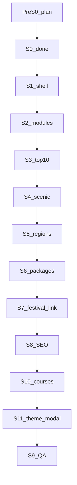
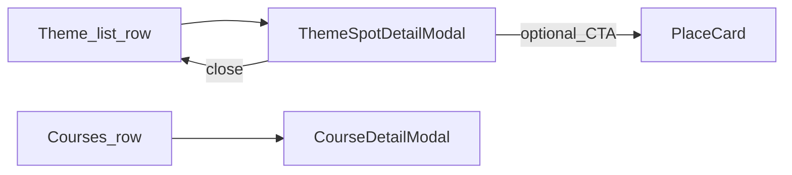

# 한국의 테마여행 — 세션별 실행 플랜

**세션 표기**: `테마여행 #N, {단계}` ([`cloud-preview-continuity.md`](./cloud-preview-continuity.md))  
**고정 브랜치 (구현)**: `cursor/korea-theme`  
**공유 slug (구현 시)**: `/qa/korea-theme` → Preview `/korea/theme`  
**관련 기존 트랙**: [`korea-festival-hub-plan.md`](./korea-festival-hub-plan.md) (`/korea` 축제 · **건드리지 않고 연결만**)  
**Cloud 연속성**: [`cloud-preview-continuity.md`](./cloud-preview-continuity.md) · [`AGENTS.md`](../AGENTS.md)

### 채팅명 복붙 (Cursor 새 채팅 제목)

Cloud 규칙 SSOT: [`cloud-preview-continuity.md`](./cloud-preview-continuity.md) **§1.1** · [`AGENTS.md`](../AGENTS.md) Cloud「채팅명 제시어」.  
형식: **`테마여행 #{N}, {단계}`** — `#N`은 Cloud 세션 순번(플랜 S번호와 별개).  
아래 **한 줄만** 채팅 제목/런칭에 붙여넣기. 본문 첫 메시지 **1행**도 동일 문자열.

| #N | 플랜 | 채팅명 (복붙) | 상태 |
|----|------|---------------|------|
| 1 | Pre-S0·S0 | `테마여행 #1, 플랜·S0 합의` | ✅ |
| 2 | S1 | `테마여행 #2, 셸 라우트` | ✅ |
| 3 | S2 | `테마여행 #3, 모듈 SSOT` | ✅ |
| 4 | S3 | `테마여행 #4, 10대 절경` | ✅ Preview QA |
| 5 | S4 | `테마여행 #5, 명승지` | ✅ Preview QA |
| 6 | (핫픽스) | `테마여행 #6, 뒤로복귀` | ✅ Preview QA |
| 7 | S5 | `테마여행 #7, 방방곡곡` | ✅ Preview QA |
| 8 | S6 | `테마여행 #8, 패키지` | ✅ Preview QA |
| 9 | S7 | `테마여행 #9, 축제 연결` | ⏳ Preview QA |
| 10 | S8 | `테마여행 #10, SEO·QA링크` | ✅ Preview QA |
| 11 | (리서치) | `테마여행 #11, 투어 API` | ✅ |
| 12 | S10 | `테마여행 #12, 여행코스·명승확장` | ⏳ Preview QA |
| 13 | (보강) | `테마여행 #13, 여행코스 보강` | ⏳ Preview QA |
| 14 | (코스 모달·칩) | `테마여행 #14, 코스 상세 모달` 등 | ✅ Preview QA |
| 15 | S11 | `테마여행 #15, 테마 상세 모달` | ⏳ 다음 (플랜 잠금) |
| 16 | S9 | `테마여행 #16, 폴리시·릴리스` | ⏳ |

이어하기·핫픽스만 할 때: `테마여행 #N, {짧은 수정}` (`N` = 그 주제의 **다음** 순번). 세션마다 새 `#1` 금지.

| 세션 | 상태 | 산출 | 다음 |
|------|------|------|------|
| **Pre-S0** 플랜 저장소 반영 | ✅ | IA·세션표·가드 | S0 |
| **S0** 제품·IA 합의 | ✅ 2026-08-03 | 경로·홈·모듈페이지·패키지·브랜치 | S1 |
| **S1** 셸·라우트·홈 진입 | ✅ | `/korea/theme` MVP 껍데기 | S2 |
| **S2** 테마 카탈로그 SSOT | ✅ | modules + 랜딩 타일(`order` 가변) | S3 |
| **S3** 10대 절경 페이지 | ✅ Preview QA | 조사→SSOT→`/korea/theme/top10` | S4 |
| **S4** 명승지 페이지 | ✅ Preview QA | curated 20 → `/korea/theme/scenic` | #6 뒤로복귀 |
| **#6** PlaceCard 뒤로복귀 | ✅ Preview QA | `navigate(returnTo)` · TypeError 가드 | S5 |
| **S5** 방방곡곡 페이지 | ✅ Preview QA | 시도·hub → `/korea/theme/regions` | S6 |
| **S6** 패키지 페이지 | ✅ Preview QA | MRT CTA(제주·홈·경주) → `/korea/theme/packages` | S7 |
| **S7** 축제 연결 다듬기 | ⏳ Preview QA | `/korea?from=theme` · 복귀 한 줄 | S8 |
| **S8** SEO·sitemap·QA | ✅ Preview QA | Helmet·sitemap·`/qa/korea-theme` | S10 |
| **#11** TourAPI 리서치 | ✅ | type 25 코스·12 검증 가능 확인 | S10 |
| **S10** 여행코스·명승 확장 | ⏳ Preview QA | `/korea/theme/courses` · 명승 34 | #13 코스 보강 |
| **#13~#14** 코스 사진·모달·칩 | ✅ Preview QA | 목록↔모달 분리 · 0건 칩 숨김 | S11 |
| **S11** 테마 상세 모달 | ⏳ 플랜 | top10·scenic·regions 클릭→모달(축제/코스 벤치) | S9 |
| **S9** 폴리시·릴리스 | ⏳ | 사람 QA → releaseNotes 1회 제안 | main 병합 |

---

## 0. 실행 규칙 (필독)

1. **한 채팅 = 한 세션 표기** (`테마여행 #N, …`). 세션을 합치지 않는다.
2. **읽을 것 (이어하기)**: 본 플랜 **해당 세션 절만** + 일지 「테마여행」최신 절 + `.ai-context` 1.5.1·§4.1 UI 금지 1~2줄. 전반 탐색·`travelSpots.js` 전체 스캔 금지.
3. **`/korea` 축제 트랙과 분리**: 축제 지도·칩·캐시·TourAPI 프록시를 **리팩터/리디자인하지 않음**. 테마 허브는 **링크·복귀·카피**로만 연결. **경로 `/korea` 자체는 유지**(축제의 자리).
4. **브랜치**: 구현은 **짧은** `cursor/korea-theme` 한 번 생성 후 재사용. 플랜 문서 PR 브랜치(`cursor/korea-theme-plan-4160`)와 구현 브랜치를 섞지 않는다.
5. **Cloud feature**: 매 턴 최소 검증 PASS → 커밋·push · PR 유지 · 턴 종료에 `/qa/korea-theme` + git Preview URL.
6. **로컬 UI 조율**: 합의된 톤 조율은 커밋 보류 → 사람 QA 후. 「커밋 보류」≠ 리디자인 허가.
7. **UI 임의 변경 금지**: 홈·PlaceCard·`/korea` 기존 비주얼을 뜯지 않음. 테마 페이지는 신규이되 톤은 조화.
8. **릴리스 노트**: 공개 직전 **1회만** 초안 제안. 세션마다 금지.
9. **키 노출 금지**: Tour 키 `VITE_` 금지. 패키지는 기존 affiliate 빌더만.
10. **오류 루프**: 동일 FAIL 2회 → 중단·보고.



---

## 1. 제품 결론 (S0 확정)

### 1.1 한 줄

**「한국의 테마여행」= `/korea/theme` 디렉터리 + 테마별 전용 페이지.**  
축제는 기존 `/korea`를 재사용한다.

### 1.2 라우트 (확정)

| 경로 | 역할 |
|------|------|
| **`/korea/theme`** | 테마여행 **랜딩**(모듈 타일) |
| **`/korea/theme/top10`** | 한국의 10대 절경 |
| **`/korea/theme/scenic`** | 한국의 명승지 |
| **`/korea/theme/courses`** | 여행코스 (TourAPI 25) |
| **`/korea/theme/regions`** | 방방곡곡 |
| **`/korea/theme/packages`** | 패키지 상품 |
| **`/korea`** | 한국의 축제 (기존 · **경로 유지**) |
| `/place/:slug` | 명소·hub 상세 |

**라우팅 가드**: `App.jsx`에서 `/korea/theme`·`/korea/theme/:moduleId`를 `/korea`와 **형제 Route**로 등록(더 긴 path 명시). `/korea` 축제 컴포넌트를 테마 셸로 바꾸지 않음.

### 1.3 홈 진입 (확정 = 권장안 C)

- 기존 「국내」→ `/korea`(축제) **유지**
- **「테마여행」** 링크 **추가** → `/korea/theme`
- 기존 버튼 교체·리디자인 금지

### 1.4 모듈 · 순서 (확정 방침)

- 각 테마는 **페이지 수준** (`/korea/theme/...`). 랜딩은 타일만.
- **타일 노출 순서**는 SSOT `order` 필드로 관리 → **나중에 자유롭게 재정렬**(S0에서 최종 순서 고정 안 함).
- 시드 `order`(임시, 변경 OK): `festivals` 10 · `top10` 20 · `scenic` 30 · `courses` 35 · `regions` 40 · `packages` 50.

| id | 라벨 | 경로 | 데이터 |
|----|------|------|--------|
| `festivals` | 한국의 축제 | → `/korea` | 기존 TourAPI·축제 허브 |
| `top10` | 한국의 10대 절경 | `/korea/theme/top10` | curated SSOT · 조사+TourAPI 검증 |
| `scenic` | 한국의 명승지 | `/korea/theme/scenic` | curated + KR hub · TourAPI 12 키워드 검증 후 확장 |
| `courses` | 여행코스 | `/korea/theme/courses` | TourAPI `areaBasedList` contentTypeId=**25** 라이브 |
| `regions` | 방방곡곡 | `/korea/theme/regions` | areaCode + KR hub≈210 |
| `packages` | 패키지 상품 | `/korea/theme/packages` | MRT `/pkc` 딥링크 |

**2차 후보 (S9 이후)**: 계절·미식·트레킹·섬·온천·세계유산·축제로드 · TourAPI 12번 **라이브 대량** 목록(명승 curated 확장은 S10에서 허용).

### 1.5 비범위

- `/korea` 축제 지도·칩·캐시·Edge 재작성
- `travelSpots.js` 전체 스캔
- 숙박/맛집 Tour 목록·자동 코스 플래너
- 새 디자인 시스템·홈 리디자인
- 오케 다배치(기본 솔로 · 사람 명시 시만)

---

## 2. 정보구조 · UX

### 2.1 랜딩 `/korea/theme`

| 구역 | 내용 | 가드 |
|------|------|------|
| 헤더 | 홈·(선택)축제 바로가기 · 타이틀「한국의 테마여행」 | 히어로에 통계·일정·주소 금지 |
| 모듈 타일 | `order` 정렬 · 아이콘+라벨+한 줄 | 카드 남발 지양 · `/korea` 톤 조화 |

### 2.2 테마 페이지 공통

- 뒤로 → `/korea/theme`
- **목록 1차 클릭 = 상세 모달**(S11) — 지구본·`/place` 직행 금지(1차 CTA)
- place는 모달 안 **2차 CTA**만 (`setPlaceReturnTo` + `navigate`) — 예약·갤러리 등 PlaceCard가 필요할 때
- 모바일 1열 / PC는 기존 패턴

### 2.3 홈

- `placeReturnTo` ALLOWED에 `/korea/theme` 및 모듈 path 추가(또는 prefix 허용 검토 — **최소는 exact path 목록**).

### 2.4 테마 상세 모달 (S11 · 제품 피벗) ✅ 방향 잠금 2026-08-04

**한 줄**: 여행코스(`CourseDetailModal`)·축제(`FestivalDetailSheet`)처럼, **테마 목록에서 항목을 누르면 모달 본문에 기본 정보를 모두 나열**한다. 목록 스크롤이 place/지구본으로 끊기지 않게 한다.

| | 현재 (변경 전) | 목표 (S11) |
|--|----------------|------------|
| **10대 절경** `/top10` | 행 클릭 → `/place/:slug` | 행 클릭 → **모달** (SSOT+Tour type12) |
| **명승지** `/scenic` | 행 클릭 → `/place/:slug` | 행 클릭 → **모달** |
| **방방곡곡** `/regions` | 시도 칩=필터 · 명소 행 → `/place` | 칩=필터 유지 · 명소 행 → **모달** |
| **여행코스** `/courses` | 이미 모달 (#14) | **유지** · 크롬 패턴 재사용 |
| **패키지·축제** | 외부/기존 | 비범위 |

**벤치마크 (복사·리팩터 금지 · 패턴만)**

| 참조 | 가져올 것 | 가져오지 말 것 |
|------|-----------|----------------|
| `FestivalDetailSheet` | 모달 본문에 개요·주소·전화·이용·홈페이지·사진 나열 · Esc/배경 닫기 · 위로 | 축제 탭/즐겨찾기/동영상/지도 로직 이식 · `/korea` 코드 수정 |
| `CoursesPage` `CourseDetailModal` | 전면 모달 크롬(사방 패딩·상단 X·하단 위로/닫기) · 목록↔상세 분리 | type25 구간(ol) 강제 · accordion 부활 |

**모달 본문 필드 (명소·명승 공통 · type12 기준)**

| 구역 | 출처 | 비고 |
|------|------|------|
| 제목 · 권역/시도 | SSOT / hub | 즉시 표시 |
| GATEO 한 줄(blurb) | SSOT | contentId 없어도 표시 |
| 히어로·갤러리 | Tour `detailCommon`/`detailImage` · 없으면 플레이스홀더 | https 정규화 |
| 개요 | `detailCommon.overview` | stripHtml |
| 주소 · 전화 · 홈페이지 | common | 전화 `tel:` · 홈페이지 새 탭 |
| 이용·휴무·주차 등 | `detailIntro`(contentTypeId **12**) | 빈 필드 숨김 |
| 부가 설명 | `detailInfo` 행 | 중복 개요 스킵(축제와 동일 휴리스틱 OK) |
| **장소 카드 보기**(2차) | `placeSlug` 있을 때만 | `returnTo` = 현재 모듈 path |

**데이터 전략**

| 모듈 | 1차(즉시) | 2차(LIVE) | contentId 없을 때 |
|------|-----------|-----------|-------------------|
| top10 | rank·name·region·blurb·hub | Tour type12 detail(있으면) | SSOT만 · 「Tour 상세 없음」한 줄 |
| scenic | name·region·blurb·hub | 동일 | SSOT만 · overrides에 contentId 보강은 별 세션 |
| regions | name·kind·hub·nameEn | hub attraction에 contentId 있으면 LIVE · 없으면 SSOT/hub 필드만 | 대량 searchKeyword **금지** |
| courses | (기존) | type25 detail | 유지 |

**공유 컴포넌트 (안)**

- `src/pages/KoreaTheme/ThemeSpotDetailModal.jsx` — 크롬은 Courses 모달과 동일 계열
- `src/utils/fetchTourApiAttractionDetail.js` (또는 courses 파일 옆) — `detailCommon`+`detailIntro(12)`+`detailInfo`+`detailImage` 병렬 · 축제 `festivalDetail` 액션 **재사용 가능하면** 읽기만, `/korea` UI 수정 금지
- top10/scenic/regions는 `selectedId` + open/close만 · Place 직행 `openSpot` 제거(1차)

**가드**

- 지구본 홈·`navigate('/')`를 목록 클릭에 연결 **금지**
- PlaceCard 1차 진입 **금지** (2차 CTA만)
- `FestivalDetailSheet`·축제 칩/지도 **리팩터 금지**
- Tour 키 `VITE_` 금지 · 라이브 대량 목록 UI 금지
- UI 임의 리디자인 금지 — 기존 stone/amber 톤·코스 모달 크롬 유지
- `#6` returnTo 가드는 **2차 CTA**용으로 유지



---

## 3. 데이터 · SSOT

### 3.1 신규

| 파일 (안) | 역할 |
|-----------|------|
| `scripts/data/korea-theme-modules-overrides.mjs` | id·라벨·`order`·enabled·path |
| `src/pages/Home/data/koreaThemeModules.json` | generate |
| `scripts/data/korea-top10-scenic-overrides.mjs` | 순위·이름·hubId/attraction·한줄·tour contentId optional |
| `src/pages/Home/data/koreaTop10Scenic.json` | generate |
| `scripts/data/korea-scenic-spots-overrides.mjs` | 명승 12~40 (S10: 34) |
| `src/pages/Home/data/koreaScenicSpots.json` | generate |
| `scripts/data/korea-theme-package-targets-overrides.mjs` (또는 `mrtPackageThemeLinks` 확장) | 국내 MRT CTA |
| `src/pages/KoreaTheme/` | 랜딩 + 모듈 페이지 |
| `generate` / `audit:korea-theme-*` / smoke | 검증 |

JSON **직접 편집 금지** → overrides → generate → audit.

### 3.2 재사용 (읽기만)

| 기존 | 용도 |
|------|------|
| KR hub (`country: 대한민국`) ≈210 | regions·scenic·top10 연결 |
| `koreaAreaCodes` | 방방곡곡 |
| `/korea` festival stack | 축제 |
| `mrtPackageLinks` / `mrtPackageThemeLinks` | 패키지 mylink |
| PlaceCard·gallery | 상세 |

### 3.3 10대 절경 — 선정 방법 (S0 방침)

**공식 「국가 지정 10대 절경」단일 목록은 없음.**  
근거 혼합으로 GATEO curated 10을 만든다.

| 단계 | 작업 |
|------|------|
| A | 웹: 문체부·관광공사 **한국관광 100선**(2025–26) 자연·경관 축 + 언론「10대 비경」언급처 |
| B | TourAPI: `searchKeyword`/`detailCommon`(기존 proxy)로 후보명 검색 · `contentid`·좌표·이미지 확인 |
| C | 로컬 hub: `cityAttractionHubs` KR attraction exact/부분 매칭 → `/place` 연결 |
| D | 권역 균형(제주·강원·전라·경상·수도권 등) · 10개 고정 |
| E | UI 카피: **「GATEO 선정」** · 공식기관 사칭 금지 |

#### S3 착수 시드 초안 (사람 조정 OK · S3에서 확정)

hub 매칭 확인됨(2026-08-03):

| 순위(안) | 이름 | hub 힌트 |
|----------|------|----------|
| 1 | 한라산국립공원 | `jeju` > 한라산국립공원 |
| 2 | 성산일출봉 | `seogwipo` > 성산일출봉 |
| 3 | 설악산 | `sokcho` > 설악산 권금성 |
| 4 | 순천만습지·국가정원 | `suncheon` |
| 5 | 주상절리대 | `seogwipo` > 주상절리대 |
| 6 | 해운대·광안 야경 | `busan`/`suyeong` |
| 7 | 불국사·석굴암 일대 | `gyeongju` > 불국사 |
| 8 | 내장산국립공원 | `jeongeup` |
| 9 | 보성녹차밭 | `boseong` |
| 10 | 통영·한려 경관 | `tongyeong` |

**교체 후보**: 울릉 태하 해안(`ulleung`) · 마이산(`jinan`) · 정동심곡(허브 미매칭 → TourAPI/정착지 보강 후).

### 3.4 패키지 — MRT 제안 (S0 · S6에서 SSOT화)

목록 API 없음. **안정 딥링크 = `/pkc/search?q=`** (+ 기존 `mylink_id`·`utm_source=mktpartner`).

| 우선 | CTA 라벨(안) | 타깃 | LIVE 메모 (2026-08-03) |
|------|--------------|------|------------------------|
| **P0** | 제주 패키지 | `kind:search` `q=제주` | `/pkc/search?q=제주` — 제주 에어텔·패키지 다수 확인 |
| **P1** | 패키지 홈 | `kind:home` `/pkc` | 칩「올인원제주여행」등 **UI 칩은 휘발** → SSOT에 칩명 의존 금지 |
| **P2** | 경주 패키지 | `q=경주` | 검색 페이지 존재 · 상품 수 변동 → S6에서 건수 재확인 |
| **보류** | `q=부산` | — | **출발지=부산 해외패키지**가 섞임 · 국내 목적지 CTA로 부적합 |
| **선택** | 시즌 기획전 | `https://www.myrealtrip.com/promotions/…` | 티켓/액티비티 중심인 경우 많음 · **패키지 모듈과 혼동 금지**. 넣으려면 `expires` 필드+일지 |

**권장 S6 SSOT 키**

```js
// mrtPackageThemeLinks 확장 예
koreaJeju: { kind: 'search', q: '제주', ctaLabel: '제주 패키지' },
koreaHome: { kind: 'home', ctaLabel: 'MRT 패키지 둘러보기' },
koreaGyeongju: { kind: 'search', q: '경주', ctaLabel: '경주 패키지' }, // P2 · VERIFY 후 enabled
```

**금지**: 단축 URL 추측 · 가짜 상품 카드 목록 · `q=부산`을 국내 목적지처럼 표기.

---

## 4. Cloud / 로컬

| | 방침 |
|--|------|
| **UI·Preview** | `cursor/korea-theme` · 매 턴 push · `/qa/korea-theme` |
| **축제 feature** | `cursor/korea-time-list-16a3` 등과 **브랜치 분리** |
| **오케** | 기본 비사용 |

---

## 5. 세션별 실행

### Pre-S0 ✅ · S0 ✅

**S0 결정표**

| # | 질문 | 결정 |
|---|------|------|
| 1 | 랜딩 경로 | **`/korea/theme`** (+ 테마별 하위 path) |
| 2 | 홈 진입 | **C** — 「테마여행」추가 · 기존 국내/축제 유지 |
| 3 | 모듈 순서 | **차후 `order`로 조정** · 각 테마=페이지 |
| 4 | 10대 | **웹+TourAPI+hub**로 S3에서 확정 · §3.3 시드 초안 |
| 5 | 패키지 | **MRT** · §3.4 P0/P1/P2 제안 |
| 6 | 구현 브랜치 | **`cursor/korea-theme`** |

---

### S1 — 셸·라우트·홈 진입 ✅

| | |
|--|--|
| **환경** | Cloud · `cursor/korea-theme` |
| **산출** | Route `/korea/theme` · 셸(헤더·타일 자리) · 홈「테마여행」링크 · `placeReturnTo` · 작업로그 · `/qa/korea-theme`+vercel redirect |
| **금지** | 축제 `/korea` 로직 수정 · 모듈 본문 · releaseNotes |
| **VERIFY** | `npm run build` · Preview `/korea/theme` · 홈→진입→뒤로 |

**채팅명**: `테마여행 #2, 셸 라우트`  
**첫 메시지**

```
테마여행 #2, 셸 라우트
@plans/korea-theme-travel-plan.md S1만
브랜치 cursor/korea-theme. /korea/theme 껍데기+홈「테마여행」+/qa/korea-theme.
축제 /korea 코드 수정 금지. build PASS 후 매 턴 push.
```

---

### S2 — 모듈 SSOT + 랜딩 타일 ✅

| | |
|--|--|
| **산출** | modules overrides(`order`)→json→audit · 타일 5 · 축제→`/korea` · 나머지→각 path(빈 페이지 OK) |
| **VERIFY** | `audit:korea-theme-modules` · build |
| **금지** | top10 본문 대량 · UI 리디자인 |

**채팅명**: `테마여행 #3, 모듈 SSOT`  
**첫 메시지**

```
테마여행 #3, 모듈 SSOT
@plans/korea-theme-travel-plan.md S2만
modules+타일+order. 축제=/korea. 다른 테마는 빈 페이지 라우트만.
```

---

### S3 — 10대 절경 페이지 ✅ Preview QA

| | |
|--|--|
| **산출** | §3.3 A–E 조사 · hub exact 10 · overrides→json · `/korea/theme/top10` · place 복귀 · 「GATEO 선정」 |
| **VERIFY** | `audit:korea-top10-scenic` · `smoke:korea-top10-scenic` · build · Preview |
| **금지** | 공식기관 사칭 · 축제 코드 수정 · 11개+ |
| **확정 10** | 한라산국립공원 · 성산일출봉 · 설악산(권금성) · 순천만습지 · 주상절리대 · 해운대·광안 · 불국사·석굴암 · 내장산국립공원 · 보성녹차밭 · 통영·한려(케이블카) |
| **후속** | PlaceCard←목록 복귀 → `#6` · **상세 모달은 S11로 피벗**(§2.4) |

**채팅명**: `테마여행 #4, 10대 절경`  
**첫 메시지**

```
테마여행 #4, 10대 절경
@plans/korea-theme-travel-plan.md S3·§3.3만
웹+TourAPI+hub로 10 확정→/korea/theme/top10. 시드 초안 조정 OK.
```

---

### S4 — 명승지 페이지 ✅ Preview QA

| | |
|--|--|
| **산출** | curated 20 · `/korea/theme/scenic` · 권역 필터 |
| **원칙** | 품질>수량 · TourAPI 라이브 대량 목록 금지 |
| **VERIFY** | `audit:korea-scenic-spots` · `smoke:korea-scenic-spots` · build |
| **S4 직후** | `#6 뒤로복귀` ✅ |

---

### #6 — PlaceCard 뒤로복귀 ✅ Preview QA

| | |
|--|--|
| **산출** | PlaceChatPanel·`leavePlaceCard` → `navigate(returnTo)` · `isKoreaPlaceReturnPath` 가드 |
| **원인** | 테마→place 직후 `prevPath` 미기록 시 `.startsWith` TypeError로 뒤로 버튼 실패 |
| **VERIFY** | `npm run build` · Preview top10/scenic→place→뒤로 |
| **금지** | 축제 `/korea` 필터 로직 수정 · (당시) 절경 전용 상세 — **철회 → S11** |

**채팅명**: `테마여행 #6, 뒤로복귀`

---

### S5 — 방방곡곡 페이지 ✅ Preview QA

| | |
|--|--|
| **산출** | `/korea/theme/regions` · areaCode→KR hub→place · 시도 칩 |
| **VERIFY** | `smoke:korea-area-codes` · `smoke:korea-theme-regions` · build |
| **금지** | 축제 지도 임베드 · hub JSON 직접 대량 편집 |

**채팅명**: `테마여행 #7, 방방곡곡`

---

### S6 — 패키지 페이지 ⏳ Preview QA

| | |
|--|--|
| **산출** | `/korea/theme/packages` · §3.4 P0+P1+P2 · `koreaJeju`/`koreaHome`/`koreaGyeongju` · 새 탭 |
| **VERIFY** | `smoke:mrt-package` · 제주·경주 LIVE 200 · mylink · build |
| **금지** | 가짜 카드 목록 · `q=부산` 국내 목적지 오표기 |

**채팅명**: `테마여행 #8, 패키지`  
**첫 메시지**

```
테마여행 #8, 패키지
@plans/korea-theme-travel-plan.md S6·§3.4만
MRT 제주 search+pkc 홈 CTA. 목록 API·q=부산 국내표기 금지.
```

---

### S7 — 축제 연결 다듬기 ⏳ Preview QA

| | |
|--|--|
| **산출** | 테마→`/korea?from=theme` · 헤더「← 테마여행으로」복귀 · 단독 `/korea` 무변화 |
| **VERIFY** | theme↔korea 왕복 · korea 단독 회귀 |
| **금지** | 축제 칩/지도/필터 로직 변경 |

**채팅명**: `테마여행 #9, 축제 연결`  
**첫 메시지**

```
테마여행 #9, 축제 연결
@plans/korea-theme-travel-plan.md S7만
복귀·카피만. 축제 칩/지도/필터 로직 변경 금지.
```

---

### S8 — SEO · sitemap · QA ✅ Preview QA

Helmet · sitemap에 `/korea/theme` 및 하위 · `/qa/korea-theme` 최종.

**채팅명**: `테마여행 #10, SEO·QA링크`  
**첫 메시지**

```
테마여행 #10, SEO·QA링크
@plans/korea-theme-travel-plan.md S8만
Helmet·sitemap·/qa/korea-theme. releaseNotes 파일 수정 금지.
```

---

### S10 — 여행코스 · 명승 확장 ⏳ Preview QA

| | |
|--|--|
| **산출** | 모듈 `courses` · `/korea/theme/courses` (TourAPI 25 라이브) · 명승 curated 34 · proxy 코스 필드 · smoke |
| **VERIFY** | `audit:korea-theme-modules` · `audit/smoke:korea-scenic-spots` · `smoke:korea-theme-courses`(+LIVE) · build |
| **주의** | 서울·제주 type25 등록 수 적음 · Edge proxy 코스 필드 배포됨(2026-08-04) |
| **금지** | 축제 `/korea` 로직 수정 · 12번 라이브 대량 목록 UI · releaseNotes 무단 반영 |

**채팅명**: `테마여행 #12, 여행코스·명승확장`

---

### #13 — 여행코스 사진 보강 ⏳ Preview QA

| | |
|--|--|
| **산출** | 코스 목록 썸네일 확대 · 펼침 히어로·갤러리·구간 `subdetailimg` · smoke LIVE 구간사진 |
| **VERIFY** | `smoke:korea-theme-courses`(+LIVE) · build |
| **주의** | TourAPI type25 **동영상 필드 없음** · YouTube 추정 검색은 범위 밖 |
| **금지** | 축제 로직 변경 · releaseNotes 무단 · 세션마다 새 Preview 브랜치 |

**채팅명**: `테마여행 #13, 여행코스 보강`

---

### S11 — 테마 상세 모달 ⏳ 플랜 잠금 (구현 = #15)

| | |
|--|--|
| **환경** | Cloud · 고정 `cursor/korea-theme` · PR #58 |
| **제품** | §2.4 — 목록 1차=모달 · Place=2차 CTA · 축제/코스 벤치 · 지구본 직행 금지 |
| **산출** | `ThemeSpotDetailModal` · attraction detail fetch(type12) · Top10/Scenic/Regions 클릭 연결 · 안내 카피(「장소 카드로」→「눌러 상세」) · smoke 최소 |
| **VERIFY** | `npm run build` · (가능 시) smoke: contentId 있는 top10 1건 LIVE detail · Preview top10/scenic/regions |
| **금지** | `/korea` 축제 로직 수정 · Place 1차 복귀 · 라이브 대량 목록 · releaseNotes 무단 · 새 Preview 브랜치 |
| **후속** | contentId 없는 명승·regions 보강은 별 세션(SSOT만으로도 모달 성립) · 폴리시=#16 |

**구현 순서 (한 세션 #15 권장 · 길면 A→B 분할)**

| 단계 | 작업 | Done |
|------|------|------|
| A | 공유 모달 크롬(코스와 동일) + SSOT 필드만 렌더 | top10 클릭→모달·Esc 닫기 |
| B | Tour type12 detail fetch + 개요/주소/이용/사진 | contentId 있는 항목 LIVE |
| C | scenic·regions 동일 연결 · 2차「장소 카드」CTA | place returnTo 유지 |
| D | 카피·작업로그·smoke · push | Preview QA 링크 |

**채팅명**: `테마여행 #15, 테마 상세 모달`  
**첫 메시지**

```
테마여행 #15, 테마 상세 모달
@plans/korea-theme-travel-plan.md S11·§2.4만
브랜치 cursor/korea-theme. top10·scenic·regions 목록→모달(축제/코스 벤치).
Place 1차 금지·2차 CTA만. /korea 축제 코드 수정 금지. build PASS 후 매 턴 push.
```

---

### S9 — 폴리시 · QA · 릴리스 ⏳

사람 Preview OK → releaseNotes **초안만 제안** → 합의 후 반영 · main 병합.

**채팅명**: `테마여행 #16, 폴리시·릴리스`  
**첫 메시지**

```
테마여행 #16, 폴리시·릴리스
@plans/korea-theme-travel-plan.md S9·§7만
Preview QA·폴리시. releaseNotes는 초안만 채팅 제안(합의 전 파일 금지).
```

---

## 6. 리스크 · 가드

| 리스크 | 대응 |
|--------|------|
| `/korea` vs `/korea/theme` 혼동 | 카피: 테마여행(디렉터리) / 축제(일정·지도) |
| RR 라우트 충돌 | theme path를 명시 Route로 등록 |
| 10대 논쟁 | GATEO 선정 · S3 확정 후 세션 중 교체 금지 |
| MRT `q=부산` 오해 | 국내 CTA에서 제외 |
| Preview 난립 | `cursor/korea-theme` 고정 |
| 축제 feature 충돌 | 브랜치 분리 · path 링크만 |
| PlaceCard←theme 목록 복귀 | `#6` ✅ · **S11 이후 1차는 모달** · place는 2차 CTA+returnTo |
| contentId 공백 | 모달은 SSOT로 성립 · LIVE는 있을 때만 · 대량 키워드 검색 금지 |
| 모달 3중 구현 | `ThemeSpotDetailModal` 1개 공유 · Courses 모달은 type25 전용 유지 OK |

---

## 7. 성공 기준 (MVP)

- [ ] `/korea/theme`에서 모듈 타일 → 각 테마 페이지(또는 축제 `/korea`) 진입
- [ ] `/korea` 축제 회귀 없음
- [x] 10대 10곳 → place → 테마 복귀 (`#6` · 레거시 경로 · Preview QA)
- [ ] **S11**: top10·scenic·regions 목록 → **상세 모달**(개요·기본정보) · Place는 2차
- [ ] 명승 ≥12 (목표 30+) · 여행코스 type25 모달 · 방방곡곡 시도 칩→명소 목록
- [ ] 패키지 MRT(제주 등) + mylink
- [x] `/qa/korea-theme` · 고정 Preview (S1·S8 최종 · sitemap/Helmet)
- [ ] audit/smoke/build PASS · 키 미노출
- [ ] 사람 QA 전 완료·main 병합 단정 없음

---

## 8. 핸드오프 템플릿

```
## 테마여행 #N, {단계}
- 상태: feature cursor/korea-theme · PR #… · SHA …
- 한 일: …
- VERIFY: …
- 공유: https://www.gateo.kr/qa/korea-theme
- Preview: https://days-git-cursor-korea-theme-….vercel.app/korea/theme
- 다음: S? · 제시어
- 금지 3: …
```

---

## 9. S0 결정표 (잠금)

| # | 질문 | 결정 | 상태 |
|---|------|------|------|
| 1 | 랜딩 경로 | `/korea/theme` (+ `/korea/theme/{top10,scenic,regions,packages}`) | ✅ |
| 2 | 홈 진입 | C: 「테마여행」추가 + 기존 국내/축제 유지 | ✅ |
| 3 | 모듈 순서 | `order`로 차후 조정 · 테마=페이지 | ✅ |
| 4 | 10대 | 웹+TourAPI+hub · S3 확정 · §3.3 시드 | ✅ 방법 / ✅ 최종10 (Preview QA) |
| 5 | 패키지 | MRT §3.4 P0 제주·P1 홈·P2 경주 | ✅ 방향 |
| 6 | 브랜치 | `cursor/korea-theme` | ✅ |
