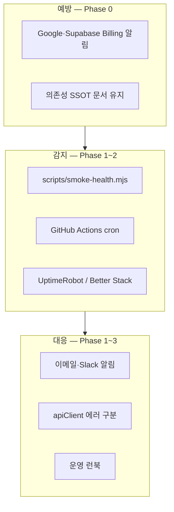

# gateo.kr 사이트 점검·헬스 모니터링 계획 (2026-06-06)

**맥락**: [`.ai-context.md`](../.ai-context.md) · **계기**: Gemini API 선불 전환·크레딧 소진(429)으로 MOONi·PlaceCard AI 채팅 전면 중단 — 앱 코드는 정상, **외부 API·결제** 장애가 사용자-facing 「AI 서버 통신 실패」로만 노출됨.

**목표**: 운영 중 **외부 의존성 장애를 조기 감지**하고, 수동 탭·버튼 점검을 **자동 스모크 + 알림**으로 대체한다.

---

## 현재 운영 상태 (2026-06-08)

**GHA 2종 ✅** — Smoke 6h + E2E 1일 · **UptimeRobot 생략**(운영자 결정) · Gemini 선불 **자동 충전** 설정.

| 워크플로 | cron | 확인 |
|----------|------|------|
| [Smoke Health](../.github/workflows/smoke-health.yml) | `0 */6 * * *` | P0·P1 Pass |
| [E2E Health](../.github/workflows/e2e-health.yml) | `0 9 * * *` UTC | home·place·mooni Pass (수동 ~1m) |

**Smoke Probe**: P0 gateo.kr HTML · Supabase · gemini-proxy(429→fail) · P1 `/place/bali` · sitemap.

**E2E**: 지구본/map · PlaceCard 발리 · MOONi 1턴(응답 또는 S3 에러 문구).

**로컬**: `npm run smoke:health` · `npm run test:e2e` (`.env.local` — smoke만).

**알림**: GitHub Actions 실패 → Watch **All Activity**.

**운영자 체크리스트**: [`site-health-operator-next-steps.md`](site-health-operator-next-steps.md)

---

## 1. 현재 상태

| 항목 | 상태 |
|------|------|
| E2E / Playwright | **없음** |
| CI (GitHub Actions) | **없음** |
| 헬스체크 스크립트 | **없음** (`npm run build` + `verify-globe-engine-build.mjs`만) |
| 업타임 외부 ping | **없음** |
| Vercel Analytics | 페이지 조회만 — **API 장애 미감지** |
| AI 에러 UX | 429·401·500 모두 동일 문구 — [`apiClient.js`](../src/pages/Home/lib/apiClient.js) |

**수동 QA**: 운영자가 홈·PlaceCard·MOONi·플래너 등을 직접 클릭 — 신규 기능 QA에는 유효하나 **유료 API 소진**은 사전에 잡기 어렵다.

---

## 2. 외부 의존성 SSOT (점검 대상)

| # | 서비스 | gateo.kr 용도 | 실패 시 증상 | 알림 설정 위치 |
|---|--------|---------------|--------------|----------------|
| D1 | **Google Gemini** (`GEMINI_API_KEY`) | MOONi·PlaceCard AI·위키/툴킷 Edge·로그북 AI | AI 전면 「통신 실패」·429 | [Google AI Studio](https://ai.studio/projects) · Cloud Billing Budget |
| D2 | **Supabase** (DB·Auth·Storage·Edge) | 데이터·로그인·`gemini-proxy` 등 | 로그인·저장·AI 프록시 실패 | Supabase Dashboard → Usage / Logs |
| D3 | **Vercel** | 호스팅·배포 | 사이트 5xx·빌드 실패 | Vercel Notifications |
| D4 | **Mapbox** (`VITE_MAPBOX_TOKEN`) | 홈 지구본·지도 | 지구본 blank·401 | Mapbox Account → Statistics |
| D5 | **Unsplash** (`VITE_UNSPLASH_ACCESS_KEY`) | PlaceCard 갤러리 1순위 | 갤러리 빈 화면·폴백 | Unsplash Developers |
| D6 | **Pexels** (`VITE_PEXELS_API_KEY`) | 갤러리 Fallback | Unsplash 실패 시 2차 | Pexels API |
| D7 | **Travelpayouts / Trip.com / Klook / 12Go / MRT** | 제휴 링크·배너 | 예약 CTA URL 깨짐 (앱은 살아 있음) | 각 파트너 콘솔 (월 1회 수동) |

**Secrets 위치**

- 클라이언트: `.env.local` / Vercel Environment Variables (`VITE_*`)
- 서버: Supabase → Project Settings → Edge Functions → **Secrets** (`GEMINI_API_KEY` 등)
- `.env.local` **`=` 뒤 공백 금지** — JWT `Invalid JWT`(401) 원인 (2026-06-06 수정 사례)

---

## 3. 목표 아키텍처



---

## 4. 구현 단계 (Phase 0 → 3)

### Phase 0 — 결제·쿼터 알림 (코드 없음, 당일)

**담당**: 운영자(사람) · **공수**: 1~2시간

| # | 작업 | 완료 기준 |
|---|------|-----------|
| 0-1 | Google Cloud / AI Studio **Budget** 알림 (50%·80%·100%) | 이메일 수신 확인 |
| 0-2 | Gemini **선불 크레딧** 잔액 주 1회 확인 습관 (또는 Studio 알림) | 캘린더 리마인더 |
| 0-3 | Supabase Usage 알림·Edge Function 로그 북마크 | Dashboard 링크 고정 |
| 0-4 | Vercel Deploy·Error 알림 ON | 배포 실패 메일 수신 |
| 0-5 | Mapbox monthly cap 확인 | Statistics 페이지 |

**수용**: D1 크레딧 소진 시 **24시간 이내** 운영자가 알림을 받는다 (Google 측 알림 정책 한계는 별도 — Phase 1로 보완).

---

### Phase 1 — API 스모크 스크립트 + 스케줄 (핵심)

**공수**: 반나절 · **우선순위**: **P0**

#### 1-A. `scripts/smoke-health.mjs` (신규)

환경 변수 (CI·로컬 공통):

| 변수 | 필수 | 용도 |
|------|------|------|
| `VITE_SUPABASE_URL` | ✅ | Supabase REST·Functions base |
| `VITE_SUPABASE_ANON_KEY` | ✅ | Functions invoke (앞뒤 trim) |
| `SMOKE_SITE_URL` | 선택 | 기본 `https://gateo.kr` |
| `SMOKE_SKIP_GEMINI` | 선택 | `1`이면 AI probe 생략 (빌드-only CI) |
| `SMOKE_GEMINI_PROBE` | 선택 | `1`이면 **실제 Gemini 1토큰 호출** (비용·쿼터 소모 — cron 4~6회/일 권장) |

**Probe 목록**

| ID | 이름 | 방법 | Pass | Fail 코드 |
|----|------|------|------|-----------|
| P0-1 | **Site HTML** | `GET ${SMOKE_SITE_URL}/` | status 200, `<title>` 또는 `#root` 존재 | 네트워크·5xx |
| P0-2 | **Supabase REST** | `GET ${SUPABASE_URL}/rest/v1/` + anon headers | 200 또는 401 (서버 alive) | timeout·5xx |
| P0-3 | **gemini-proxy** | `POST .../functions/v1/gemini-proxy` body `{ modelId, parts:[{text:"ping"}] }` | `success:true` **또는** body에 `429`/`RESOURCE_EXHAUSTED` → **경고(warn)** 로 분류 | 401 JWT·500 기타·timeout |
| P1-1 | **PlaceCard SSR shell** | `GET /place/bali` (또는 고정 slug) | 200 | 404·5xx |
| P1-2 | **Sitemap** | `GET /sitemap.xml` | 200, `urlset` | missing |

**Exit code**

- `0` — 모든 P0 Pass (P0-3 warn 허용 — 크레딧 부족은 warn이지만 cron 알림 대상)
- `1` — P0 Fail 1개 이상

**출력 형식** (JSON 한 줄 + human summary):

```json
{ "ok": false, "checks": [{ "id": "P0-3", "status": "warn", "detail": "429 RESOURCE_EXHAUSTED" }] }
```

**구현 메모**

- Node 18+ native `fetch` 사용 (추가 dep 없음)
- anon key: `process.env.VITE_SUPABASE_ANON_KEY?.trim()`
- Gemini probe는 **최소 parts** — 비용 최소화
- 429 → `warn` (서비스 degraded) vs 401 → `fail` (설정 오류)

#### 1-B. `package.json` scripts

```json
"smoke:health": "node scripts/smoke-health.mjs",
"smoke:health:ci": "node scripts/smoke-health.mjs"
```

#### 1-C. GitHub Actions `.github/workflows/smoke-health.yml` (신규)

| 항목 | 값 |
|------|-----|
| trigger | `schedule: cron '0 */6 * * *'` (6시간) + `workflow_dispatch` |
| secrets | `VITE_SUPABASE_URL`, `VITE_SUPABASE_ANON_KEY` (Repository secrets) |
| env | `SMOKE_SITE_URL=https://gateo.kr`, `SMOKE_GEMINI_PROBE=1` |
| on failure | GitHub 이메일 (기본) — 추후 Slack webhook |

**주의**: anon key는 **Repository secret**에 공백 없이 저장. Production Vercel env와 **동일 값** 사용.

**GitHub Secrets 등록 (S2 — 운영자 1회)**

1. GitHub 저장소 → **Settings** → **Secrets and variables** → **Actions** → **New repository secret**
2. 아래 2개 추가 (값은 Vercel Production Environment와 동일):

| Secret name | 값 |
|-------------|-----|
| `VITE_SUPABASE_URL` | `https://phdjnbfitvmrguqzverm.supabase.co` |
| `VITE_SUPABASE_ANON_KEY` | anon JWT (**=` 뒤 공백 없음**) |

3. **Actions** 탭 → **Smoke Health** → **Run workflow** 로 수동 1회 Pass 확인
4. 실패 시 GitHub 계정 이메일로 알림 (저장소 Watch → All Activity 권장)

워크플로: [`.github/workflows/smoke-health.yml`](../.github/workflows/smoke-health.yml) · CI는 `SMOKE_FAIL_ON_WARN=1` — Gemini 429(warn)도 **실패 처리**해 이메일 알림.

#### 1-D. UptimeRobot (또는 Better Stack) — 외부 ping

| Monitor | URL | 간격 |
|---------|-----|------|
| M1 | `https://gateo.kr/` | 5분 |
| M2 | `https://gateo.kr/place/bali` | 15분 |
| M3 | (선택) GitHub Actions badge / status page | — |

Gemini 직접 ping은 **Actions 스크립트**가 담당 (UptimeRobot은 HTTP surface만).

**Phase 1 완료 기준**

- [x] `npm run smoke:health` 로컬 Pass — 2026-06-06
- [x] GitHub Actions 수동·cron Pass — 2026-06-08 (`8affb1a` CI supabase-js 의존성 제거 후)
- [x] 크레딧 0 → P0-3 warn + `SMOKE_FAIL_ON_WARN=1` exit 1 (CI 알림)
- [x] UptimeRobot — **생략** (Smoke+E2E로 충분, 2026-06-08)

---

### Phase 2 — Playwright E2E (핵심 사용자 경로)

**공수**: 1~2일 · **우선순위**: P1

#### 2-A. 도구

```bash
npm install -D @playwright/test
npx playwright install chromium
```

#### 2-B. 시나리오 (최소 세트)

| ID | 파일 | 시나리오 | Assert |
|----|------|----------|--------|
| E2E-1 | `e2e/home.spec.js` | `/` 로드 | 지구본 canvas 또는 map container visible |
| E2E-2 | `e2e/place.spec.js` | `/place/bali` | PlaceCard 제목·탭 visible |
| E2E-3 | `e2e/mooni.spec.js` | MOONi FAB → 채팅 1턴 | **모델 응답** 또는 **429/통신 실패 메시지** 중 하나 (완전 무응답 = fail) |

**CI**: `workflow_dispatch` + **배포 후** (`repository_dispatch` 또는 Vercel deploy hook 연동은 Phase 3).

**환경**: Playwright는 **production URL** 대상 (`SMOKE_SITE_URL`). MOONi E2E는 AI 비용 발생 — **하루 1~2회** cron 권장.

#### 2-C. scripts

```json
"test:e2e": "playwright test",
"test:e2e:ui": "playwright test --ui"
```

**Phase 2 완료 기준**

- [x] 로컬 `npm run test:e2e` Pass (gateo.kr) — 2026-06-08
- [x] 실패 시 스크린샷·trace 아티팩트 — [`.github/workflows/e2e-health.yml`](../.github/workflows/e2e-health.yml)

---

### Phase 3 — UX·런북·배포 연동

**공수**: 반나절~1일 · **우선순위**: P2

#### 3-A. `apiClient.js` 에러 구분

| upstream | 사용자 메시지 (안) |
|----------|-------------------|
| 401 / Invalid JWT | 「설정 오류 — 관리자에게 문의」 (dev only 상세) |
| 429 / RESOURCE_EXHAUSTED | 「AI 사용량 한도에 도달했습니다. 잠시 후 다시 시도해 주세요.」 |
| 503 / timeout | 「AI 서버가 일시적으로 바쁩니다.」 |
| 기타 | 기존 「통신 실패」 유지 |

`supabase.functions.invoke` error / `data.success === false` / `data.error` 문자열 파싱.

#### 3-B. 운영 런북 (`plans/site-health-runbook.md` — Phase 3에서 분리 가능)

| 증상 | 1차 확인 | 조치 |
|------|----------|------|
| MOONi 「통신 실패」 | `npm run smoke:health` P0-3 | Gemini 크레딧·`GEMINI_API_KEY` |
| 전체 401 | anon key 공백·Vercel env | key trim·재배포 |
| 지구본 blank | Mapbox token·quota | Mapbox dashboard |
| 갤러리 only | Unsplash/Pexels | 키·rate limit |

#### 3-C. 배포 파이프라인

- Vercel **Production deploy success** → GitHub `workflow_dispatch` smoke (선택)
- `npm run build`는 기존 유지 — **배포 후 smoke**가 실제 장애 감지

---

## 5. 수동 QA 체크리스트 (축소版)

자동화 후에도 **기능 변경·릴리스 직전** 5~10분 수동 확인.

| # | 항목 | 자동 대체 |
|---|------|-----------|
| 1 | 홈·지구본 | E2E-1 |
| 2 | `/place/bali` 카드 | E2E-2 |
| 3 | MOONi 1턴 | E2E-3 + P0-3 |
| 4 | 로그인 (변경 시만) | 수동 |
| 5 | 플래너 CTA·페리 링크 (데이터 변경 시) | 수동 |
| 6 | 모바일 `<lg` TourMobileBar (UI 변경 시) | 수동 |

---

## 6. AI 구현 세션 분할 (권장)

한 세션에 Phase 전체 금지 — 아래 순서로 PR 분리.

| 세션 | 범위 | 산출물 |
|------|------|--------|
| **S1** | Phase 1-A~B | `scripts/smoke-health.mjs`, `npm run smoke:health` | **✅ 2026-06-06** |
| **S2** | Phase 1-C | `.github/workflows/smoke-health.yml`, secrets 안내 | **✅ 2026-06-08** GHA Pass |
| **S3** | Phase 3-A | `apiClient.js` 에러 구분 + ChatModal error role | **✅ 2026-06-08** |
| **S4** | Phase 2 | Playwright 3 spec + `playwright.config.js` | **✅ 2026-06-08** |
| **S5** | Phase 3-B · Phase 0 | `site-health-runbook.md` · Billing 알림 체크리스트 | 선택 |

**다음 세션 제시어 (S3 — AI 에러 UX)**

```
@plans/site-health-monitoring-plan.md S3 구현.
apiClient.fetchProxyGemini — 401·429·503·기타 에러 메시지 구분.
ChatModal·usePlaceChat 등 error 표시 연동. 사용자-facing 문구는 계획서 3-A 표 준수.
```

**다음 세션 제시어 (S4 — Playwright, S3 다음 또는 병렬)**

```
@plans/site-health-monitoring-plan.md Phase 2(S4) 구현.
Playwright e2e/home·place·mooni 3 spec. production URL. MOONi cron은 1~2회/일 권장.
```

**운영자만 (코드 없음)**

```
Phase 0: Google AI Studio Budget 알림 · UptimeRobot gateo.kr + /place/bali
@plans/site-health-monitoring-plan.md Phase 0·1-D 체크리스트 진행.
```

---

## 7. 비용·빈도 가이드

| Probe | Gemini 비용 | 권장 빈도 |
|-------|-------------|-----------|
| P0-3 gemini-proxy | ~1 flash-lite call | 6시간 × 4회/일 |
| E2E-3 MOONi | ~1 full chat turn | 1~2회/일 |
| UptimeRobot M1 | 없음 | 5분 |

크레딧紧张 시: `SMOKE_GEMINI_PROBE=0` + **Billing 알림(Phase 0)**에 의존.

---

## 8. 완료 정의 (전 Phase)

- [x] Phase 0 (핵심): Gemini 선불 **자동 충전** — **2026-06-08** (Budget 등 나머지 선택)
- [x] Phase 1 core: smoke + GHA cron + secrets — **2026-06-08**
- [x] Phase 1 UptimeRobot — **생략** (2026-06-08)
- [x] Phase 2: Playwright P0 3시나리오 (S4) — **2026-06-08**
- [x] Phase 3-A: AI 에러 메시지 구분 — **2026-06-08** (S3)
- [ ] Phase 3-B: 운영 런북 (S5)
- [x] `.ai-context` 6절·`plans/README.md` 링크
- [ ] (선택) `releaseNotes.js` — 사용자 합의 후

---

## 9. 참고 — 기존 빌드 검증

[`scripts/verify-globe-engine-build.mjs`](../scripts/verify-globe-engine-build.mjs)는 **번들 회귀**(모바일 legacy globe)만 검사 — **런타임·API 헬스와 별개**. smoke-health와 **병행**한다.

**Edge 배포**: [`gemini-proxy`](../supabase/functions/gemini-proxy/index.ts) — `.ai-context` 3절: project ref 일치 후 `npx supabase functions deploy gemini-proxy --project-ref phdjnbfitvmrguqzverm --no-verify-jwt` (JWT 정책 변경 시 재점검).
