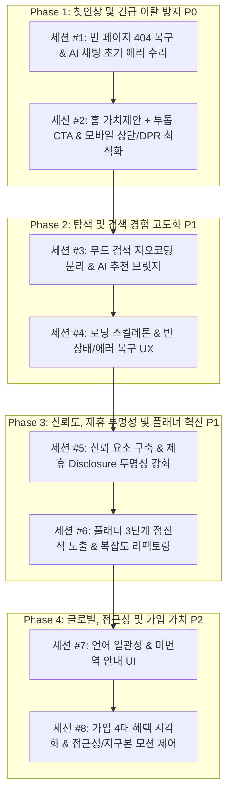

# gateo.kr 방문자 활성화 및 사이트 체질 개선 종합 계획 (2026-09-13)

**문서 위치**: `plans/visitor-growth-activation-plan.md`  
**맥락**: [`.ai-context.md`](../.ai-context.md) · [`plans/feature-handoff-index.md`](./feature-handoff-index.md) · [`plans/docs-on-main-workflow.md`](./docs-on-main-workflow.md)  
**기반 분석**: 그록봇(Grok) 진단 12대 문제점 및 서브에이전트 3기 심층 코드베이스 실사 결과

---

## 0. 사이트 정체성 진단 및 핵심 요약

### gateo.kr의 본질적 가치
gateo.kr은 **"3D 인터랙티브 지구본과 AI 도슨트(MOONi)를 결합하여, 전 세계의 숨겨진 파라다이스와 한국의 명승·축제를 발견하고 항공·숙소·교통 플래너까지 원스톱으로 연결하는 차세대 여행 탐색 플랫폼"**입니다.

### 방문자가 늘지 않고 이탈하는 근본적 병목 (현재 실태)
1. **목적 불명 첫인상**: 첫 진입 시 검은 우주 배경의 3D 지구본만 회전하고 있어 사이트의 목적을 추측해야 함(한 줄 가치제안 및 시작 유도 CTA 부재).
2. **다운된 사이트로 오인**: `/about`, `/pricing`, `/product` 접속 시 라우터 미매칭으로 완전한 검은 암흑 화면(Blank pitch-black) 노출.
3. **첫 인터랙션 실패**: 장소를 고르지 않은 채 하단 "AI와 여행 대화" 클릭 시 내부 로직 오류로 `Invalid destination name.` 붉은 에러 즉시 발생.
4. **검색 기대 배신**: `quiet beaches`, `따뜻한 휴양지` 등 무드 검색 시 Mapbox 지오코딩이 가로채 엉뚱한 해외 도로명이나 국내 식당 상호 핀으로 줌인.
5. **언어 및 브랜딩 이탈**: EN 모드임에도 한국어 본문 다수 노출 및 네비게이션 영문 하드코딩.
6. **모바일 차단**: 390px 화면에서 검색 텍스트 잘림, 로그인 버튼 완전 은닉, 고해상도 Retina 모바일 발열/배터리 누수.
7. **신뢰 및 투명성 결여**: 로고를 클릭해 스크롤해야만 보이는 약관/출처, 제휴 광고와 순수 유틸리티 구분이 모호한 플래너 CTA.
8. **인지 과부하 (Cognitive Overload)**: 플래너 진입 시 복잡도 90/100 표기와 함께 25~30개의 제휴 배너/버튼이 단일 스크롤에 쏟아져 피로감 유발.

---

## 1. 12대 개선점 현황 정밀 진단 매트릭스

| # | 항목 | 현재 상태 및 원인 코드 위치 | 영향도 / 우선순위 | 해결 핵심 요약 |
|---|---|---|---|---|
| **1** | **홈 가치제안 + CTA** | `HomeUI.jsx` 상단/하단 분산. 헤드라인 부재, 모바일 하단 CTA 완전 은닉 | **P0 (최상)** | 검색바 상단 중앙 히어로 가치제안 + `[여행지 탐색]`, `[MOONi 추천]` 투톱 CTA |
| **2** | **빈 페이지 복구** | `App.jsx` 내 `/about`, `/pricing`, `/product` 및 와일드카드 404 라우트 완전 누락 | **P0 (최상)** | `App.jsx` 404 폴백, `AboutPage` 신설(`footerData.js` 활용), `/pricing`·`/product` 리다이렉트 |
| **3** | **AI 채팅 초기 오류** | `HomeUI.jsx` 655행 `onOpenChat()` 호출 시 `selectedLocation` 누락 -> `'New Session'` -> `placeChatIntro.js`에서 유효성 에러 throw | **P0 (최상)** | 장소 미선택 시 `'MOONi'` 기본 바인딩, 유효성 가드, 범용 탐색 질문 칩 4종 제공 |
| **4** | **무드 검색 vs 지오코딩** | `useHomeHandlers.js` 1140행. `MOOD_HINT_KEYWORDS` 미흡으로 지오코딩이 앞서 실행되어 도로/상호 오탐 | **P1 (상)** | 무드/의도 정규식 확장, 지오코딩 사전 스킵 후 AI 무드 큐레이션 연결, 드롭다운 내 "MOONi에게 물어보기" 카드 |
| **5** | **언어 일관성** | `PlaceCardExpanded.jsx` 118행 raw `location.desc` 참조, `toolkitPlaceIdResolve.js` 한글 폴백, `HomeUI.jsx` 영문 하드코딩 | **P2 (중)** | `getLocalizedPlaceDesc` 연결, 네비 `t()` 적용, DB 미번역 안내 배너 |
| **6** | **모바일 CTA & 반응형** | `HomeUI.jsx` 314행 로고+토글로 검색폭 140px 축소(텍스트 잘림), 로그인 숨김, Mapbox Retina 3x DPR 렌더링 부하 | **P1 (상)** | 모바일 플레이스홀더 단축, 모바일 헤더 로그인 아이콘 노출, Mapbox `pixelRatio` 최대 2 제한 |
| **7** | **신뢰 요소** | 전역 푸터 부재, `LogoPanel.jsx` 로고 클릭 드로어에만 은닉, TourAPI/Open-Meteo 출처 누락 | **P2 (중)** | 서브페이지/전역 최소 푸터 바 신설, `mapboxAttribution.js` 데이터 출처 보강 |
| **8** | **제휴 Disclosure** | `PreTravelChecklist.jsx` 거대 CTA 3개(항공/숙소/픽업)에 광고 표기 누락, 종합 안내가 플래너 최하단에 매몰 | **P1 (상)** | 체크리스트 버튼 `[AD/제휴]` 인라인 명시, 플래너 상단으로 `hybridNotice` 승격 |
| **9** | **플래너 복잡도** | `(복잡도 90/100)` 직결 노출, 11개 섹션 25~30개 버튼이 단일 스크롤에 전개되어 과부하 | **P1 (상)** | 3단계 점진적 노출(1.필수 비자·항공·숙소 -> 2.이동·유심 -> 3.투어·패스), 중복 CTA 통합, 복잡도 문구 완화 |
| **10** | **로딩/빈 상태 UX** | `/korea` 행 이미지 `onError` 누락(엑박), `/blog/curation` 브라우저 `alert()` 후 초기화 | **P2 (중)** | 축제 이미지 `onError` 그라데이션 폴백, 축제 리스트 스켈레톤, 큐레이션 인라인 에러 및 재시도 버튼 |
| **11** | **가입 전 혜택** | `Login.jsx` 혜택 안내 전무, `SignUp.jsx` "일보 작성" 레거시 노출, 버킷리스트/필명 가치 단절 | **P2 (중)** | 인증 폼 좌측/상단에 4대 핵심 혜택(버킷리스트, 작가필명, AI맞춤추천, 플래너저장) 시각화 |
| **12** | **접근성 & 모션** | `Trash2` 등 무속성 아이콘 버튼, 9px 저대비 텍스트, 3D 지구본 `prefers-reduced-motion` 미연동 및 일시정지 부재 | **P2 (중)** | 아이콘 `aria-label` 부여, 텍스트 명도대비(7:1) 개선, 3D 지구본 자전 일시정지 토글 및 감속 연동 |

---

## 2. 4단계(Phase) · 8세션 종합 이행 로드맵

전체 작업을 위험도, 의존성, 사용자 이탈 방지 긴급도에 따라 **4대 단계(Phase), 8개 세션(Session)**으로 체계화합니다.  
각 세션은 독립적으로 완결될 수 있도록 파일 경로, 수정 명세, 검증 기준이 완비되어 있습니다.



---

## 3. 세션별 상세 실행 계획 (Session Work Breakdown)

---

### Phase 1: 첫인상 및 긴급 이탈 방지 (P0)

#### [세션 1] 빈 페이지(404) 복구 & AI 채팅 초기 오류 수리
- **세션 식별자**: `방문자 개선 #1, 404 복구 및 AI채팅 초기화`
- **담당 항목**: 항목 2 (빈 페이지 복구), 항목 3 (AI 채팅 초기 오류)
- **예상 분량**: 보통 (Medium, ~1.5h)
- **고정 브랜치**: `cursor/visitor-growth-1f90` (신규 생성 시 규칙 준수)
- **대상 파일**:
  - `/workspace/src/App.jsx`
  - `/workspace/src/pages/About/AboutPage.jsx` (신규)
  - `/workspace/src/pages/Home/components/HomeUI.jsx`
  - `/workspace/src/pages/Home/index.jsx`
  - `/workspace/src/pages/Home/hooks/useHomeHandlers.js`
  - `/workspace/src/pages/Home/components/ChatModal.jsx`
  - `/workspace/src/pages/Home/lib/placeChatIntro.js`
  - `/workspace/src/pages/Home/lib/mooniQuickReplies.js`

- **상세 구현 작업 명세**:
  1. **라우팅 복구 (`App.jsx`)**:
     - `AboutPage.jsx` 신설: `src/pages/Home/data/footerData.js`의 `FOOTER_CONTENT.about` 텍스트를 활용하여 다크 테마 일관성을 가진 깔끔한 About 페이지 구현.
     - 라우트 등록:
       ```jsx
       <Route path="/about" element={<AboutPage />} />
       <Route path="/pricing" element={<Navigate to="/about" replace />} />
       <Route path="/product" element={<Navigate to="/explore" replace />} />
       <Route path="*" element={<Navigate to="/" replace />} />
       ```
     - 이제 잘못된 경로로 접근해도 검은 빈 화면 대신 안전하게 안내/리다이렉트 처리됨.
  2. **AI 채팅 진입 파라미터 정규화 (`HomeUI.jsx`, `index.jsx`, `useHomeHandlers.js`)**:
     - `HomeUI.jsx` 655행: 하단 "AI와 여행 플랜 짜기" 버튼 클릭 시 장소 미선택이면 명시적으로 `'MOONi'`를 넘김.
     - `index.jsx` 1522행: `onOpenChat={(p) => handleStartChat(selectedLocation?.name || 'MOONi', p)}`
     - `useHomeHandlers.js`: `dest === 'MOONi'`일 때 `isMooniRequest = true`, `isMooniUi = true`로 분기 보장.
  3. **인트로 유효성 가드 (`placeChatIntro.js`, `ChatModal.jsx`)**:
     - `placeIntroTarget`이 없거나 `'MOONi'`, `'New Session'`일 때 `generatePlaceChatIntroWithAi` 비동기 호출을 건너뛰고 기본 환영 상태로 유지.
     - 에러 문자열(`Invalid destination name.`)이 붉은 텍스트로 노출되지 않도록 차단.
  4. **범용 탐색 질문 칩(General Discovery Chips) 도입 (`mooniQuickReplies.js`, `ChatModal.jsx`)**:
     - 장소가 바인딩되지 않은 상태에서도 4가지 기본 추천 질문 칩 제공:
       - `[🌴 따뜻한 휴양지 추천해줘]`
       - `[✨ 2박 3일 힐링 코스]`
       - `[✈️ 비행시간 5시간 이내 여행지]`
       - `[👨‍👩‍👧 가족과 함께 가기 좋은 곳]`
     - 칩 클릭 시 `handleSend(text, PERSONA_TYPES.INSPIRER)`로 직결되어 즉시 유의미한 추천 대화 개시.

- **안전 가드 및 주의사항**:
  - `App.jsx` 수정 시 기존 `/place/:slug`, `/explore`, `/korea/**` 등의 라우트 순서를 건드리지 않고 와일드카드 `path="*"`는 반드시 맨 끝에 배치.
  - `placeChatIntro.js`의 SSOT 검증 로직은 유지하되 빈 상태 호출만 방어.
- **검증 커맨드**:
  ```bash
  npm run build
  # 브라우저 검증: /about, /pricing, /product, /non-exist-page 접속 테스트
  # 홈에서 장소 미선택 상태로 하단 "AI와 여행 플랜 짜기" 클릭 시 정상 환영 멘트 및 칩 노출 확인
  ```

---

#### [세션 2] 홈 가치제안 + 투톱 CTA 및 모바일 상단/DPR 최적화
- **세션 식별자**: `방문자 개선 #2, 홈 가치제안 및 모바일 뷰포트`
- **담당 항목**: 항목 1 (홈 가치제안 + CTA), 항목 6 (모바일 CTA & 반응형)
- **예상 분량**: 보통 (Medium, ~1.5h)
- **고정 브랜치**: `cursor/visitor-growth-1f90`
- **대상 파일**:
  - `/workspace/src/pages/Home/components/HomeUI.jsx`
  - `/workspace/src/pages/Home/components/HomeGlobeMapbox.jsx`
  - `/workspace/src/i18n/locales/ko.json`, `en.json`

- **상세 구현 작업 명세**:
  1. **홈 중앙 가치제안 히어로 모듈 신설 (`HomeUI.jsx`)**:
     - 검색바 상단/내부 영역에 세련된 다크 글래스모피즘 헤드라인 추가:
       - **헤드라인**: `"3D 지구본과 AI로 만나는 다음 여행지"` (EN: `"Discover Your Next Destination with 3D Globe & AI"`)
       - **서브헤드라인**: `"전 세계 숨은 파라다이스와 한국의 명승을 탐색하고 플랜을 세워보세요"`
     - **투톱 CTA 버튼 그룹 배치**:
       - `[ 🗺️ 여행지 탐색 ]`: 클릭 시 `/explore` 탐색 모달 오픈
       - `[ 🤖 MOONi에게 추천받기 ]`: 클릭 시 AI 도슨트 대화 오픈 (`onOpenChat('MOONi')`)
     - **포인터 이벤트 가드**: 컨테이너는 `pointer-events-none`, 버튼에만 `pointer-events-auto`를 주어 3D 지구본 터치/드래그 간섭 제로 보장.
  2. **모바일 390px 상단 최적화 (`HomeUI.jsx`)**:
     - 모바일 화면에서 검색바 플레이스홀더를 간결화:
       - 기존 `"지금 기분, 느낌으로 검색해 보세요"`(19자) -> 모바일 축약 `"여행지 검색..."`(7자)
       - `layout.search.placeholderMobile` i18n 키 추가.
     - 모바일 상단 우측(로고 맞은편)에 컴팩트한 `Login/User` 원형 아이콘과 `AI Chat` 미니 뱃지 버튼 배치하여 로고를 열지 않고도 1-탭 접근 가능하도록 개선.
  3. **모바일 WebGL DPR 제한 및 성능 최적화 (`HomeGlobeMapbox.jsx`)**:
     - Retina 디스플레이 모바일 기기에서의 과열/배터리 소모 방지:
       ```javascript
       pixelRatio={Math.min(typeof window !== 'undefined' ? window.devicePixelRatio : 1, 2)}
       ```
     - 모바일 3x 렌더링을 2x로 클램핑하여 렌더링 연산량을 40% 이상 절감.

- **안전 가드 및 주의사항**:
  - `.ai-context.md` §4.1 5: 기존 다크 테마 톤과 폰트, 한국어 `break-keep` 스타일 철저 계승.
  - 3D 지구본이 회전할 때 버튼 뒤편으로 지나가는 지형과 글자가 겹쳐도 가독성이 유지되도록 `bg-black/60 backdrop-blur-md` 컨테이너 확보.
- **검증 커맨드**:
  ```bash
  npm run build
  # 390px 뷰포트(iPhone 12/13/14 크기)에서 검색바 텍스트 잘림 여부 및 버튼 터치 테스트
  ```

---

### Phase 2: 탐색 및 검색 경험 고도화 (P1)

#### [세션 3] 무드 검색 지오코딩 분리 & AI 추천 브릿지
- **세션 식별자**: `방문자 개선 #3, 무드검색 분리 및 AI추천 브릿지`
- **담당 항목**: 항목 4 (무드 검색 vs 장소 검색 분리)
- **예상 분량**: 보통~큼 (Medium-Large, ~2h)
- **고정 브랜치**: `cursor/visitor-growth-1f90`
- **대상 파일**:
  - `/workspace/src/pages/Home/hooks/useHomeHandlers.js`
  - `/workspace/src/pages/Home/lib/searchSuggestions.js`
  - `/workspace/src/pages/Home/components/SearchDiscovery/SearchSuggestionList.jsx`
  - `/workspace/src/pages/Home/components/SearchDiscoveryModal.jsx`

- **상세 구현 작업 명세**:
  1. **무드/의도(Intent) 쿼리 감지 엔진 강화 (`useHomeHandlers.js`)**:
     - `MOOD_HINT_KEYWORDS`를 감성 단어뿐 아니라 **분위기/스타일 형용사 + 여행 명사 결합 패턴**으로 확장:
       - 영문: `quiet`, `peaceful`, `romantic`, `warm`, `sunny`, `relaxing`, `cozy`, `tropical`, `beaches`, `islands`, `getaway`
       - 한글: `따뜻한`, `조용한`, `한적한`, `가성비`, `낭만적인`, `휴양지`, `바다`, `섬`, `힐링`, `아이와`, `가족과`
     - `shouldSkipGeocodeForMood(query)` 함수가 위 결합 패턴을 정확히 감지하여 Mapbox Geocoding을 사전에 우회하고 **AI 무드 큐레이션 파이프라인(`treatAsMoodQuery`)으로 직결**하도록 수정.
  2. **지오코딩 오탐 필터링**:
     - Mapbox 지오코딩 결과가 도로명(`address`, `street`) 또는 단순 상호명(`poi`)인 경우, 질의어가 지명 형식이 아니면 단독 핀 이동을 차단하고 테마/AI 추천 후보로 안전 폴백.
  3. **검색 드롭다운 내 "MOONi에게 물어보기" 추천 카드 신설 (`SearchSuggestionList.jsx`)**:
     - 사용자가 검색어를 입력하면 드롭다운 최상단 또는 하단에 항상 다음과 같은 인터랙티브 AI 카드 노출:
       - `[ ✨ MOONi에게 "${query}" 여행지 추천받기 ]`
     - 클릭 시 `handleStartChat('MOONi', { text: `${query} 여행지 추천해줘` })`로 연결하여 검색에서 대화형 탐색으로의 매끄러운 전환 유도.

- **안전 가드 및 주의사항**:
  - 기존의 도시 허브(`cityAttractionHubs.json`) 및 정착지(`mapboxSettlementPlaces.json`)의 exact 일치 우선순위는 그대로 보존. 지명 검색에는 영향이 없어야 함.
- **검증 커맨드**:
  ```bash
  npm run build
  # 검색창에 "quiet beaches", "따뜻한 휴양지", "조용한 바다" 입력 시 엉뚱한 건물 핀으로 가지 않고 AI 무드 추천 카드가 정상 동작하는지 검증
  ```

---

#### [세션 4] 로딩 스켈레톤 & 빈 상태/에러 복구 UX
- **세션 식별자**: `방문자 개선 #4, 로딩스켈레톤 및 에러복구 UX`
- **담당 항목**: 항목 10 (로딩/빈 상태 UX)
- **예상 분량**: 보통 (Medium, ~1.5h)
- **고정 브랜치**: `cursor/visitor-growth-1f90`
- **대상 파일**:
  - `/workspace/src/pages/Korea/index.jsx`
  - `/workspace/src/pages/DailyReport/hooks/useLogbookAI.js`
  - `/workspace/src/pages/DailyReport/components/CurationHub.jsx`
  - `/workspace/src/components/PlaceCard/hooks/usePlaceGallery.js`

- **상세 구현 작업 명세**:
  1. **국내 축제(`/korea`) 이미지 및 스켈레톤 보강 (`Korea/index.jsx`)**:
     - `FestivalRow` 내 이미지 렌더링에 `onError` 핸들러 추가: TourAPI 이미지 만료/깨짐 시 엑박 대신 세련된 지역 엠블럼/그라데이션 플레이스홀더 표시.
     - 데이터 로딩 시 4~6개의 축제 행 스켈레톤(`animate-pulse`) UI 제공.
     - 검색/필터 결과가 없을 때 단순 텍스트 대신 `[필터 초기화]` 액션 버튼 제공.
  2. **AI 큐레이션(`/blog/curation`) 네이티브 `alert()` 제거 및 에러 복구 (`useLogbookAI.js`, `CurationHub.jsx`)**:
     - AI 호출 실패 시 브라우저 팝업 `alert()` 호출을 전면 제거.
     - 상태에 `error` 및 `errorMessage`를 분리하고, 인라인 에러 카드와 함께 `[다시 시도하기]` 버튼 제공.
     - 로딩 중 결과 카드 형태의 펄스 스켈레톤 뷰 제공.
  3. **장소 갤러리 네트워크 안내 (`usePlaceGallery.js`)**:
     - 모든 소스(DB/TourAPI/스톡) 실패 시 네트워크 재시도 안내 버튼 노출.

- **안전 가드 및 주의사항**:
  - 축제 리스트 렌더링 성능에 영향을 주지 않도록 스켈레톤은 경량 SVG/CSS로만 구현.
- **검증 커맨드**:
  ```bash
  npm run build
  # /korea 페이지 로딩 및 필터 초기화 테스트, /blog/curation 로딩/에러 UI 동작 확인
  ```

---

### Phase 3: 신뢰도, 제휴 투명성 및 플래너 혁신 (P1)

#### [세션 5] 신뢰 요소 구축 & 제휴 Disclosure 투명성 강화
- **세션 식별자**: `방문자 개선 #5, 신뢰요소 및 제휴투명성 강화`
- **담당 항목**: 항목 7 (신뢰 요소), 항목 8 (제휴 disclosure)
- **예상 분량**: 보통 (Medium, ~1.5h)
- **고정 브랜치**: `cursor/visitor-growth-1f90`
- **대상 파일**:
  - `/workspace/src/shared/layout/MainLayout.jsx`
  - `/workspace/src/data/mapboxAttribution.js`
  - `/workspace/src/shared/components/MapboxCreditsPanel.jsx`
  - `/workspace/src/components/PlaceCard/tabs/planner/components/PreTravelChecklist.jsx`
  - `/workspace/src/components/PlaceCard/tabs/PlannerTab.jsx`
  - `/workspace/src/components/PlaceCard/common/WhiteLabelWidget.jsx`

- **상세 구현 작업 명세**:
  1. **전역 신뢰 링크 바 신설 (`MainLayout.jsx`)**:
     - 화면 우하단 또는 메인 레이아웃 하단에 3D 뷰를 방해하지 않는 반투명 슬림 링크 바 추가:
       - `[ About | 이용약관 | 개인정보처리방침 | 출처(Credits) | 문의 ]`
     - 클릭 시 `FooterModal`의 해당 탭이 즉시 열리도록 전역 이벤트 연동.
  2. **데이터 출처(Credits) 보강 (`mapboxAttribution.js`, `MapboxCreditsPanel.jsx`)**:
     - 핵심 데이터 소스 명시 추가:
       - 한국관광공사 TourAPI 4.0 (공공누리 제1유형)
       - Open-Meteo (실시간 기상 데이터)
       - Unsplash & Pexels (고해상도 라이선스 미디어)
       - Trip.com, Klook, GetYourGuide, MyRealTrip (여행 제휴 파트너)
  3. **체크리스트 메인 CTA에 제휴 고지 결합 (`PreTravelChecklist.jsx`, `WhiteLabelWidget.jsx`)**:
     - 거대 버튼 3종("항공권 검색", "호텔/숙소 예약", "공항 픽업 예약") 내부에 `[AD]` 또는 `[제휴]` 태그를 인라인으로 부착.
     - 사용자가 플랫폼 내 자체 기능으로 오인하지 않고, 신뢰할 수 있는 제휴 예약 서비스임을 인지하도록 개선.
  4. **플래너 상단 안내 배너 승격 (`PlannerTab.jsx`)**:
     - 플래너 최하단에 매몰되어 있던 `hybridNotice`(객관적 공공 정보 + 파트너사 제휴 연결 안내)를 플래너 헤더 바로 아래로 승격 배치하여 공정위/FTC의 "사전 인접 고지" 요건 충족.

- **안전 가드 및 주의사항**:
  - 광고 표시 문구가 사용자의 클릭을 방해하지 않으면서도 법적 기준을 충족하도록 절제된 뱃지 스타일(`text-[10px] opacity-75`) 적용.
- **검증 커맨드**:
  ```bash
  npm run build
  # 플래너 탭 및 전역 레이아웃에서 출처 및 제휴 뱃지 노출 확인
  ```

---

#### [세션 6] 플래너 3단계 점진적 노출(Progressive Disclosure) & 복잡도 리팩토링
- **세션 식별자**: `방문자 개선 #6, 플래너 3단계 점진적 노출`
- **담당 항목**: 항목 9 (플래너 복잡도)
- **예상 분량**: 큼 (Large, ~2.5h)
- **고정 브랜치**: `cursor/visitor-growth-1f90`
- **대상 파일**:
  - `/workspace/src/components/PlaceCard/tabs/PlannerTab.jsx`
  - `/workspace/src/components/PlaceCard/tabs/planner/components/PreTravelChecklist.jsx`
  - `/workspace/src/components/PlaceCard/tabs/planner/components/JourneyTimeline.jsx`
  - `/workspace/src/i18n/locales/ko.json`, `en.json`

- **상세 구현 작업 명세**:
  1. **복잡도 점수 표기 완화 (`PlannerTab.jsx`)**:
     - `(복잡도 90/100)` 같은 위압적인 텍스트 대신 친절한 배려형 뱃지로 변경:
       - 예: `[ ✈️ 환승·국내선 이동 안내 포함 ]` 또는 `[ 🧭 여행 난이도: 상세 안내 ]`
       - 툴팁을 통해 왜 이 여행지가 꼼꼼한 준비가 필요한지 안내.
  2. **3단계 점진적 노출(Progressive Disclosure) 탭/스텝 구조 도입**:
     - 25~30개의 위젯/배너가 한 번에 펼쳐진 구조를 3단계 스텝으로 재구성:
       - **Step 1. 필수 관문 (Essential)**: 비자 규정 + 필수 체크리스트 + 항공권/숙소 표준 예약 블록.
       - **Step 2. 이동 및 통신 (Transfer & Connectivity)**: 공항 픽업/페리 + 유심 1종 선택(Airalo vs Holafly 비교 탭 적용).
       - **Step 3. 현지 즐기기 (Activities & Tips)**: 투어 액티비티 위젯 + 교통 패스 + 필수 앱/치안 팁.
  3. **중복 CTA 제거 및 단일화**:
     - 상단 배너, 체크리스트 내부 CTA, 툴킷 카드로 3중 분산된 항공권/숙소 링크를 하나의 표준화된 '메인 예약 카드'로 통합.

- **안전 가드 및 주의사항**:
  - 기존 제휴 링크 파라미터(`mylink_id`, IATA 코드 등)가 누락되지 않도록 기존 resolver 함수들을 100% 재사용.
- **검증 커맨드**:
  ```bash
  npm run build
  # 보라보라(bora-bora) 플래너 페이지 진입 시 3단계 스텝 네비게이션 동작 및 버튼 과밀도 해소 확인
  ```

---

### Phase 4: 글로벌, 접근성 및 가입 가치 (P2)

#### [세션 7] 언어 일관성 & 미번역 안내 UI
- **세션 식별자**: `방문자 개선 #7, 다국어 일관성 및 번역배너`
- **담당 항목**: 항목 5 (언어 일관성)
- **예상 분량**: 보통 (Medium, ~1.5h)
- **고정 브랜치**: `cursor/visitor-growth-1f90`
- **대상 파일**:
  - `/workspace/src/components/PlaceCard/modes/PlaceCardExpanded.jsx`
  - `/workspace/src/pages/Home/components/HomeUI.jsx`
  - `/workspace/src/i18n/locales/ko.json`, `en.json`
  - `/workspace/src/components/PlaceCard/common/magazineLocale.js`

- **상세 구현 작업 명세**:
  1. **PlaceCardExpanded 내 설명/태그 로컬라이징 연동**:
     - raw `location.desc` 직접 참조를 중단하고 `getLocalizedPlaceDesc(location, locale)` 호출로 교체.
     - 국가명 및 카테고리 태그(`location.country`, `location.keywords`)의 다국어 번역 키 매핑 적용.
  2. **헤더/네비게이션 하드코딩 문자열 제거 (`HomeUI.jsx`)**:
     - `LOGIN`, `LOGOUT`, `LOGBOOK` 문자열을 `t('layout.nav.login')`, `t('layout.nav.logout')`, `t('layout.nav.logbook')`로 교체하여 한글/영문 토글 시 완벽하게 동기화.
  3. **DB 미번역 데이터에 대한 언어 가이드 배너 제공**:
     - 영문 DB 데이터(`essential_guide_en`)가 없어 한글로 폴백될 때 본문 상단에 단정한 영문 안내 칩 배치:
       - `"ℹ️ Detailed guide is currently provided in Korean."`

- **안전 가드 및 주의사항**:
  - `ko.json` 및 `en.json`의 JSON 문법 깨짐 방지.
- **검증 커맨드**:
  ```bash
  npm run build
  # EN 언어 모드 전환 후 홈 네비게이션 및 여행지 상세 모달에서의 한/영 일관성 검증
  ```

---

#### [세션 8] 가입 4대 혜택 시각화 & 접근성/지구본 모션 제어
- **세션 식별자**: `방문자 개선 #8, 가입혜택 시각화 및 접근성 보강`
- **담당 항목**: 항목 11 (가입 전 혜택 안내), 항목 12 (접근성 및 모션)
- **예상 분량**: 보통 (Medium, ~2h)
- **고정 브랜치**: `cursor/visitor-growth-1f90`
- **대상 파일**:
  - `/workspace/src/shared/Auth/Login.jsx`
  - `/workspace/src/shared/Auth/SignUp.jsx`
  - `/workspace/src/pages/Home/components/HomeUI.jsx`
  - `/workspace/src/pages/Home/components/LogoPanel.jsx`
  - `/workspace/src/pages/Home/components/HomeGlobeMapbox.jsx`

- **상세 구현 작업 명세**:
  1. **회원가입 4대 핵심 혜택 시각화 (`Login.jsx`, `SignUp.jsx`)**:
     - `SignUp.jsx`의 구시대적 카피 `"나만의 일보 작성"`을 `"나만의 여행 스케치와 로그북을 시작해보세요"`로 전면 개편.
     - 폼 좌측(데스크톱) 또는 상단(모바일)에 4대 핵심 혜택 카드 블록 추가:
       - 🌟 **나만의 버킷리스트**: 전 세계 숨은 명소 50곳 실시간 동기화
       - ✍️ **작가 필명 & 여행 스케치**: 사진과 위치를 남기는 3D 로그북
       - 🤖 **AI 맞춤 도슨트**: 취향 분석 기반 1:1 파라다이스 추천
       - 📋 **스마트 플래너**: 비자·항공·숙소·교통 원클릭 보관함
  2. **아이콘 버튼 `aria-label` 웹 접근성 보강**:
     - `HomeUI.jsx` 내 `Trash2`, 테마 토글, Zen 모드 토글, 핀 토글 버튼에 다국어 `aria-label` 부여.
     - GATEO 로고에 `role="button"` 및 `tabIndex={0}` 부여하여 키보드 탭 네비게이션 지원.
  3. **명도 대비 개선**:
     - `LogoPanel.jsx` 푸터 텍스트 색상을 `text-gray-500` -> `text-gray-300`으로 올려 WCAG AA (4.5:1 이상) 명도 대비 확보.
  4. **3D 지구본 모션 접근성(Reduced Motion) 및 일시정지 연동 (`HomeGlobeMapbox.jsx`, `HomeUI.jsx`)**:
     - `HomeGlobeMapbox.jsx`의 자전 루프에 `prefers-reduced-motion: reduce` 감지 연동: 전정기관 장애인이나 3D 멀미 사용자의 브라우저에서는 기본 자동 회전 차단.
     - 상단 컨트롤 바에 자전 일시정지/재생(Play/Pause) 토글 버튼을 추가하여 사용자가 지구본을 멈추고 편안하게 탐색할 수 있는 선택권 보장.

- **안전 가드 및 주의사항**:
  - 3D 지구본 회전 정지 시 카메라 좌표나 포커스가 튀지 않도록 현재 각도에서 부드럽게 고정.
- **검증 커맨드**:
  ```bash
  npm run build
  # /auth/login 및 /auth/signup 페이지에서 혜택 카드 확인
  # 키보드 Tab 키를 이용한 상단 네비게이션 접근성 및 지구본 일시정지 버튼 동작 검증
  ```

---

## 4. 세션별 핸드오프 및 실행 체크리스트

모든 세션 종료 시 다음 규칙을 100% 준수해야 합니다:
1. **코드 vs 문서 분리 (`plans/docs-on-main-workflow.md`)**:
   - `src/` 로직/UI 작업은 고정 feature 브랜치(`cursor/visitor-growth-1f90`)에서 커밋 및 push.
   - `plans/**` 및 `feature-handoff-index.md`는 `main` 브랜치에만 커밋 및 `origin/main` push.
2. **최소 검증 게이트**:
   - `npm run build` PASS 필수.
3. **세션 표기 일치**:
   - 커밋 메시지, 일지, PR 제목에 `방문자 개선 #{N}, {단계}` 일관되게 표기.
4. **Vercel Preview 공유**:
   - PR 생성 후 `/qa/visitor-growth` (또는 지정 Preview URL)와 함께 사람 Preview QA 체크리스트 1~3줄 제시.

---

## 5. 차기 세션을 위한 표준 제시어 블록 (Next Session Prompt)

다음 작업 세션을 즉시 시작할 수 있도록 1단계 제시어를 제공합니다.

```
방문자 개선 #1, 404 복구 및 AI채팅 초기화
@plans/feature-handoff-index.md
@plans/2026-09-13-project-log.md
@plans/visitor-growth-activation-plan.md
브랜치 cursor/visitor-growth-1f90 · Preview /qa/visitor-growth
금지: UI 임의 리디자인 · feature에 plans/** 커밋 · 검증 없이 main push
작업:
1. App.jsx 내 /about 페이지 신설 및 /pricing, /product 리다이렉트, 404 폴백 라우트 추가
2. HomeUI.jsx/index.jsx에서 장소 미선택 시 'MOONi' 바인딩하여 Invalid destination name 에러 차단
3. mooniQuickReplies.js에 범용 탐색 질문 칩 4종 추가
검증: npm run build PASS
```
