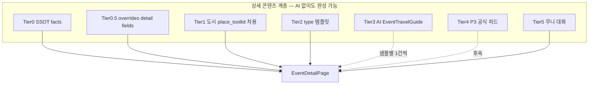
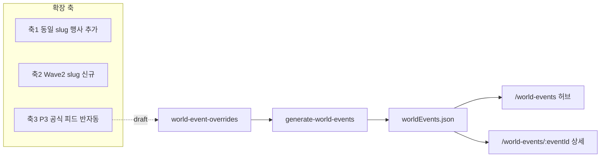

# 축제 상세·행사 맞춤 플래너 UX (v2)

**상태 (2026-08-26)**: P2 MVP는 **`main` 반영 완료** (`d4fbca71`). v2는 **`cursor/world-events-efa3`에서 additive** · Wave1 15건 상세·TripWindow 개선 후 **세션 #18** main 병합.

**세션 번호 (핸드오프 SSOT)**  
- Cloud 채팅 **`#12`** = 다음 구현(Phase B · edinburgh).  
- 본문 표의 `#11`~`#18` = v2 **내부 단계** (main 일지 **#11=PR #150 병합 완료**와 별개).  
- PR **#152** (v2 draft) · 브랜치 `cursor/world-events-efa3` 고정.

## AskQuestion 도구

**에이전트가 켤 수 있는 옵션은 없습니다.** AskQuestion은 Cursor Cloud Agent 런타임에 **도구 목록으로 노출되는지**에 따라 달라지며, 이번 VM 세션에는 `AskQuestion`이 포함되어 있지 않습니다. 예전 플랜에서 쓰였다면 **다른 에이전트 모드/버전**이었을 가능성이 큽니다.

**대안 (플랜·세션 중)**:
- 선택지가 2~3개면 본문에 번호 목록으로 제시 → 사용자가 채팅으로 답변
- [`plans/world-events-sample-log.md`](plans/world-events-sample-log.md) (신규)에 샘플별 결정·피드백 누적
- 세션 종료 시 **§1.2 다음 제시어** 코드펜스로 핀 3개

---

## 현재 문제 (확인됨)

[`tripWindowFromEvent`](src/shared/tripWindow.js)는 행사 전체 span → MRT/항공 CTA에 그대로 전달 → 장기 행사 **20~30박** 문제.

현재 P2는 **카드 + 플래너 딥링크**까지. 사용자 피드백: **상세 페이지·페이지 내 계획·현실적 일정** 필요.

**v2 main 병합 게이트 (#18)**: 15건 상세 URL · in-page 위젯 · sample-log · §6.1 QA. (P2·PR #150은 이미 `main`.)

---

## 전략 전환 (v2 핵심)

| v1 (이전) | v2 (이번) |
|-----------|-----------|
| AI Edge 일괄 pregen 15건 | **샘플 1건씩** 생성→파싱→스키마/프롬프트 조정 |
| AI 가이드 = 상세의 중심 | **상세 페이지 = 중심** · AI = 보강층(Tier 3) |
| Phase C를 한 번에 | Phase B에서 **15건 상세 URL** 먼저 (정적만으로도) |



---

## Wave1 15건 샘플 목록 (SSOT)

[`scripts/data/world-event-overrides.mjs`](scripts/data/world-event-overrides.mjs) — **상세 URL = `/world-events/{id}`**

| # | eventId | slug | type | 비고 (프리셋·AI 난이도) |
|---|---------|------|------|-------------------------|
| 1 | `edinburgh-fringe-2026` | edinburgh | festival | **파일럿** · 장기(25일) |
| 2 | `munich-oktoberfest-2026` | munich | festival | 장기 · 숙소 키워드 중요 |
| 3 | `vienna-staatsoper-season-2026` | vienna | season | 시즌형 Q6 |
| 4 | `amsterdam-kings-day-2027` | amsterdam | festival | 단기 |
| 5 | `tokyo-sakura-season-2027` | tokyo | season | 시즌·날짜 TBD성 |
| 6 | `kyoto-gion-matsuri-2027` | kyoto | festival | 단기 피크 |
| 7 | `bangkok-songkran-2027` | bangkok | festival | 중기 |
| 8 | `bali-galungan-season-2026` | bali | season | 종교 시즌 |
| 9 | `rio-carnival-2027` | rio-de-janeiro | festival | 단기 피크 |
| 10 | `new-york-thanksgiving-season-2026` | new-york | season | 시즌 윈도 |
| 11 | `iceland-midnight-sun-2027` | iceland | season | 자연·장시즌 |
| 12 | `sydney-vivid-2027` | sydney | festival | 중기 |
| 13 | `prague-spring-festival-2027` | prague | season | 문화 시즌 |
| 14 | `marrakech-rose-festival-2027` | marrakech | festival | 단기 |
| 15 | `hanoi-tet-2027` | hanoi | season | 연휴 윈도 |

**샘플 루프 규칙** (1 Cloud 세션 = **최대 1~2 eventId**):
1. 해당 건 **Tier0~2 상세** 렌더 완료
2. TripWindow 프리셋·in-page 숙소/항공 연결
3. (선택) Tier3 AI 1회 생성 → **원문 JSON + 파싱 UI 스크린/로그** → audit
4. 프롬프트/스키마 수정은 **다음 샘플에 반영** (이전 샘플 일괄 재생성 금지, 필요 시 수동 1건만)
5. [`plans/world-events-sample-log.md`](plans/world-events-sample-log.md)에 5~10줄 기록

---

## AI 외 — 현실적인 상세 페이지 완성 방법 (검토 결과)

| Tier | 방법 | 데이터 소스 | AI 필요 | 15건 적용 |
|------|------|-------------|---------|-----------|
| **0** | **SSOT facts 블록** | `worldEvents.json` 기존 필드 | 없음 | 즉시 전건 |
| **0.5** | **수동 detail overrides** | `world-event-overrides.mjs` 확장: `detailOverview`, `stayAreas[]`, `highlights[]`, `heroImage` | 없음 | 샘플마다 1~3문단 추가 |
| **1** | **도시 플래너 차용** | `place_toolkit.essential_guide` (slug) — 항공 IATA·일반 숙소 조언 | 없음 | slug 12개 중 toolkit 있는 도시만; 「도시 일반」라벨 필수 |
| **2** | **type 템플릿** | `festival` / `season` / `opera` 별 고정 UX 카피 + `bookingHints` 슬롯 | 없음 | 전건 |
| **3** | **AI EventTravelGuide** | Edge `update-event-travel-guide` | 있음 | **샘플 1건씩** |
| **4** | **공식 피드** | P3-a ICS/RSS (munich, edinburgh, sydney 후보) | fetch만 | 후속 |
| **5** | **무니 대화** | `MooniBoundChatHost` + event facts seed | 대화 시 | 상세 FAB |
| **KR** | **TourAPI 상세** | `FestivalDetailSheet` 데이터 — intro/program/photos/nearby | 없음 | 국내 Phase E |

**권장 믹스 (MVP)**:
- **상세 골격**: Tier 0 + 0.5 + 2 → Preview에서 「완성된 페이지」체감
- **실행(숙소·항공)**: TripWindow 프리셋 + EventStayStrip (Tier 0만으로도 동작)
- **맞춤 조언**: Tier 1(있으면) + Tier 3(AI, 샘플 검증 후)
- **장기 행사**: AI 없이도 Tier 0.5에 `recommendedNights: 3` 같은 **수동 숫자** 가능

**AI 일괄 pregen 15건 — v2에서 폐기.**

---

## 설계 원칙

| 원칙 | 내용 |
|------|------|
| **상세 먼저** | `/world-events/:eventId`가 허브 카드의 **주 진입** · AI 없이도 읽을거리+일정+숙소 |
| **행사 기간 ≠ 숙박** | span = 선택 범위 · CTA = 사용자 TripWindow만 |
| **샘플 주도** | 15건 표 순서 · 건별 QA · 프롬pt/파싱은 **에든버러→…→하노이** 순 점진 |
| **사실 기반 AI** | Tier3 입력 = Tier0 JSON만 · hallucination audit |
| **브랜치 고정** | `cursor/world-events-efa3` · `/qa/world-events` |

---

## 목표 UX (에든버러 — Tier 0~2만으로도 동작)

```
/world-events/edinburgh-fringe-2026
├─ Hero: SSOT + (0.5) detailOverview + 공식 링크
├─ Highlights / bookingHints (0.5)
├─ 「내 여행 일정」: heuristic 프리셋 + 캘린더 (Phase A)
├─ 숙소 탐색 (EventStayStrip, 선택 일정)
├─ 항공 (선택 일정)
├─ (Tier1) 에딘버러 도시 플래너 발췌 — 「도시 일반」
├─ (Tier3) 행사 맞춤 플래너 — AI 생성 후에만 표시
├─ 무니 FAB
└─ 보조: /place/edinburgh
```

---

## Phase A — TripWindow (1세션, 샘플 #1과 병행 가능)

[`src/shared/tripWindow.js`](src/shared/tripWindow.js):
- `tripWindowPresetsFromEvent(event)` — >7일 → 개막 3박 / 중순 주말 2박 / 막바지 3박
- `clampTripWindowToEvent`
- CTA 기본 max nights **7~10** (행사 span cap과 분리)

허브·PlaceCard: MRT/플래너 직링크 → **상세 URL** 우선.

**VERIFY**: `smoke:trip-window-from-festival` (edinburgh 장기 케이스) · `build`

---

## Phase B — 상세 페이지 셸 + Tier 0~2 (2~3세션, 15건 라우트)

### B-1. 라우트·lookup

- `/world-events/:eventId` — [`worldEvents.js`](src/utils/worldEvents.js) `getWorldEventById`
- 허브 카드 클릭 → 상세 (CTA 정리)

### B-2. `EventDetailPage` + `EventDetailStaticPanel`

- Tier 0: title, dates, venue, recurrenceNote, sourceUrl, type badge
- Tier 0.5: overrides 확장 필드 (없으면 bookingHints만)
- Tier 2: type별 intro 템플릿 1단락

### B-3. Overrides 스키마 확장 (generate·audit 동기)

[`scripts/lib/world-event-schema.mjs`](scripts/lib/world-event-schema.mjs) optional:
- `detailOverview?: string`
- `highlights?: string[]`
- `stayAreas?: { name, mrtKeyword, note }[]`
- `recommendedNights?: number`

### B-4. 샘플 루프 (Phase B+)

**세션당 1~2건** — 표 #1~#15 순:
- 라우트 200 · SEO · Preview 링크
- Tier 0.5 수동 1~3문단 (에이전트+사람 QA)
- [`world-events-sample-log.md`](plans/world-events-sample-log.md) append

**완료 기준 (15건)**: 모든 eventId URL 접근 · 정적 패널 non-empty · 허브↔상세 왕복

---

## Phase C — AI 가이드 (샘플 1건씩, 일괄 금지)

### C-0. 인프라 (1세션, 샘플 #1 전)

- `EventTravelGuide` 스키마 v0.1 · `audit-event-travel-guide.mjs`
- Edge `update-event-travel-guide` · `event_travel_guide` 테이블
- `EventTravelGuidePanel` — **dev 모드**: raw JSON + parsed sections 나란히 (Preview QA용)

### C-1. 샘플 #1 `edinburgh-fringe-2026`

1. Tier0 facts JSON → Edge invoke **1건**
2. audit PASS/FAIL 로그 저장
3. UI 파싱 결과 사람 확인 → 스키마/프롬프트 v0.2
4. sample-log에 「환각/누락/프리셋 품질」기록

**백로그 (수정 보류 · #22 PROD QA)** — Tier3 패널이 Tier0~2 정적 본문과 **주제·문장이 겹쳐 보일 수 있음**(에든버러 확인). Wave1은 AI=보강층 원칙 유지 · fixture·프롬pt는 **Tier0에 없는 액션·시나리오·예매 타이밍** 위주로 차별화 검토(Wave2+ 또는 C-2 iterate). **지금 UI/카피 변경 없음**.

### C-2. 샘플 #2~#15

- **이전 샘플에서 고친 프롬pt만** 사용 · 재생성은 해당 1건만
- season vs festival vs 장기/단기별 패턴을 log에 태깅
- 15건 끝나면 스키마 v1.0 freeze

**VERIFY**: `audit:event-travel-guide` · 건별 smoke fixture · Edge deploy는 Secrets 있을 때

---

## Phase D — in-page 위젯 (상세에 순차 부착)

**#1 edinburgh에서 먼저**, 이후 샘플 루프에 포함:

- `StayRangeCalendar` + 프리셋 (Phase A)
- `EventStayStrip` ← [`GlobeStayStrip`](src/pages/Home/components/GlobeStayStrip.jsx) 분리
- Trip.com 항공 — **선택 checkIn/checkOut만**
- [`MooniBoundChatHost`](src/pages/Home/components/MooniBoundChatHost.jsx) — event seed

Tier1: slug에 toolkit 있으면 「도시 일반 정보」접이식 (AI와 구분 라벨)

---

## Phase E — 국내 + 다건 (15건 해외 후)

- `/korea/festival/:contentId` — TourAPI = Tier0 풍부 버전
- `festivalPersonalStore` 다건 TripWindow (Q9)

---

## 세션 로드맵 (v2)

| 세션 | 표기 | 산출 |
|------|------|------|
| **#10** | TripWindow 프리셋 + 허브→상세 링크 | Phase A |
| **#11** | 상세 셸 + Tier0~2 · **샘플 #1 edinburgh** | Phase B + B+ |
| **#12** | AI 인프라 + **샘플 #1 AI** 검증 | Phase C-0, C-1 |
| **#13~#14** | **샘플 #2~#8** 상세 + (건별) AI | B+ + C |
| **#15~#16** | **샘플 #9~#15** + in-page 위젯 전건 | B+ + C + D |
| **#17** | 국내 승격·다건 전초 | Phase E |
| **#18** | 15건 통합 QA → PR #150 병합 | QA |

PR #150: **#18까지 draft** · main 병합은 **Wave1 15건 상세 MVP** 사람 QA OK 후.

---

## Phase F — 상세 완성 후 「세계의 행사」리스트 확장 (#19~)

Wave1(#18 병합) 이후 **리스트를 늘리는 작업**은 UI를 새로 만들기보다 **SSOT 파이프라인 + 상세 템플릿 재사용**이 중심입니다. 상세 페이지(`EventDetailPage`)·TripWindow·EventStayStrip은 **코드 변경 없이** 새 `eventId`만 추가해도 동작해야 합니다.

### F-0. 확장 전 게이트 (Wave1 → Wave2)

| # | 게이트 | 통과 조건 |
|---|--------|-----------|
| G1 | **상세 템플릿 freeze** | 15건 URL · Tier0~2 · in-page 위젯 · smoke PASS |
| G2 | **AI 스키마 freeze** | `EventTravelGuide` v1.0 · sample-log에 season/festival/장기 패턴 기록 |
| G3 | **운영 절차** | [`world-events-management.md`](plans/world-events-management.md) §2·§8(신규) 확장 체크리스트 |
| G4 | **main 병합** | PR #150 · PROD 배포 · `/world-events` 허브 회귀 smoke |

**Wave2 착수 = G1~G4 이후.** 병합 전에 Wave2 데이터를 main에 넣지 않음.

### F-1. 확장의 세 가지 축 (우선순위)



| 순위 | 축 | 예 | 난이도 | 상세 페이지 |
|------|-----|-----|--------|-------------|
| **1** | **동일 slug 2건째 행사** | vienna 오페라 시즌 + 크리스마스 콘서트 | 낮음 | 템플릿 자동 · Tier0.5만 수동 |
| **2** | **Wave2 slug** | `singapore`, `dubai`, `barcelona`, `istanbul` ([`world-events-qa-index`](plans/world-events-qa-index.md) Q3) | 중간 | travelSpots 선행 · PlaceCard accordion |
| **3** | **P3-a 공식 피드** | munich/edinburgh/sydney ICS·RSS | 높음 | 피드→draft→사람 검수→overrides |

**권장 순서**: 축1로 **허브 카드 수·지역 칩 밀도**를 올린 뒤 → 축2로 **새 도시** → 축3로 **갱신 자동화**.

### F-2. Wave2 배치 운영 (오케스트레이터 아님 · 소배치)

| | Wave1 (완료 목표) | Wave2 (확장) |
|--|------------------|--------------|
| **규모** | 15 eventId · 12 slug | **+8~12 eventId** · **+4 slug** (Q3 후보) |
| **세션** | 1~2 eventId/세션 (품질) | **2~4 eventId/세션** (템플릿 freeze 후) |
| **상세** | 샘플마다 UX·AI iterate | **Tier0+0.5 필수** · Tier3 AI는 **신규 건만** 필요 시 |
| **VERIFY** | 건별 sample-log | 배치 끝 `audit:world-events` + 허브 region smoke |

**Wave2 후보 slug (Q3 백로그, 합의 후 확정)**:
`singapore`, `dubai`, `barcelona`, `istanbul` (+ 필요 시 `los-angeles`, `paris` 등 travelSpots 있는 도시만)

**1건 추가 표준 절차** ([`world-events-management.md`](plans/world-events-management.md) §2 확장):

1. `travelSpots` / `travelSpots-list.json`에 slug 존재 확인  
2. `world-event-overrides.mjs` — WorldEvent 필드 + **Tier0.5** (`detailOverview`, `stayAreas`, `recommendedNights`)  
3. slug가 새 지역이면 [`worldEventHubRegions.js`](src/pages/WorldEvents/worldEventHubRegions.js) 칩 매핑  
4. `npm run generate:world-events` → `audit:world-events` PASS  
5. Preview: `/world-events/{eventId}` 상세 · 허브 카드 · `/place/{slug}` accordion  
6. (선택) Tier3 AI 1회 — Wave1에서 freeze한 프롬pt v1.0  
7. `world-events-sample-log.md` 또는 **Wave2 로그**(`plans/world-events-wave2-log.md`) 1줄

### F-3. 허브 `/world-events` UI 확장 (데이터 늘 때)

코드 변경은 **데이터 20건+ 또는 UX 불편 시**만. 우선순위:

| 기능 | 시점 | 비고 |
|------|------|------|
| 카드 → 상세 URL (이미 Phase B) | Wave1 | 플래너 직링크 없음 |
| **slug당 다건** — 카드에 「N개 행사」뱃지 | Wave2 축1 | `getWorldEventsForSlug` count |
| **시작일 정렬** · 지난 행사 dim | Wave2 | `worldEvents.js` sort |
| 검색(도시명·행사명) | 30건+ | 클라 필터로 시작 |
| 6번째 지역 칩 | slug 5칩으로 안 될 때만 | Q3 지역 재편 |
| `/events` 국내+해외 통합 | **P3-c · 보류** | Q4 B |

### F-4. 콘텐츠 공급 방식 (확장 단계별)

| 단계 | Wave1 (#11~#18) | Wave2 (#19~) | Wave3+ |
|------|-----------------|--------------|--------|
| **상세 본문** | Tier0.5 수동 + sample iterate | Tier0.5 **짧게** (3~5문장) | P3 피드 draft + 검수 |
| **AI 가이드** | 1건씩 프롬pt 조정 | **v1.0 고정** · 신규만 | 피드+AI 하이브리드 |
| **갱신** | 연 1회 수동 | 연간 id·날짜 갱신 §4 | 피드 stale 알림 |
| **국내** | Phase E TourAPI 상세 | `/korea`는 TourAPI **자동 확장** (별 SSOT 불요) | 동일 |

**국내 vs 해외**: `/korea` 리스트는 TourAPI rolling window로 **자동 확장**; 해외 `/world-events`만 overrides 큐레이션. 확장 작업의 **주력은 해외 SSOT**.

### F-5. 세션 로드맵 (Wave2 예시)

| 세션 | 표기 | 산출 |
|------|------|------|
| **#19** | Wave2 기획 · singapore+dubai 2건 | overrides · Tier0.5 · 허브 QA |
| **#20** | barcelona+istanbul 2건 | 동일 |
| **#21** | 축1 — vienna/munich 2번째 행사 | slug 다건 UI 뱃지 |
| **#22** | (선택) P3-a POC 1건 — edinburgh ICS | §5.1 · draft→overrides |
| **#23** | Wave2 통합 QA · PROD | `smoke:world-events` · 릴리스 노트 1회 검토 |

브랜치: Wave1 병합 후 **`cursor/world-events-wave2`** 새 feature 또는 **동일 브랜치 재개** — Mapbox Preview URL 정책에 따라 사람과 합의.

### F-6. 하지 않을 것 (확장 단계)

- Wave2를 Wave1처럼 **15건 일괄 AI pregen**  
- `worldEvents.json` 직편집  
- slug 없는 도시 행사 추가  
- 영문 UI (Q10) · Ticketmaster (P3-b) · `/events` 통합 허브 (P3-c) — **별 주제 세션**

### F-0.5. Wave 1.5 차별화 (**Wave2 데이터 전** · Cloud #23~#29)

**결정 (2026-08-27)**: PROD QA 피드백(본문 vs AI 중복·차별성 부족) → **singapore·dubai 데이터 추가 전** 상세 UX·콘텐츠 역할 분리.

| 단계 | 세션 | 산출 |
|------|------|------|
| **D1** | **#23** | Tier0.5 vs Tier3 **역할 분리** · AI 패널 suppress · fixture edinburgh·munich·bali |
| **D1 QA** | **#24** | Preview·PROD **파일럿 3건** 사람 QA · PROD AI 없음 · Preview v0.2 확인 |
| **D2** | **#25** | 행사 액션 칩 · **무니 행사 시드·칩** |
| **D3** | **#26** | heroImage·YouTube · Google·네이버 검색 · `cityAttractionHubs` 브릿지 |
| **D4** | **#27** | EventStayStrip 확장 · stayAreas→MRT · 파일럿 3건 회귀 |
| **D5** | **#28** | **실행·어필리에이트 체류** — Klook 렌터카 · GYG/MRT 패키지 투어 · shop 칩(사롱 등) · bali pilot — **구현 완료** `c6e38c1c` |
| **D5-b** | **#29** | **본문 중심 UX** — 바로가기·실행 스트립 제거 · 인라인 무니 용어 모달 · 맥락형 어필리에이트 · 히어로 갤러리 · bali pilot |
| **Wave2 데이터** | **#30** | singapore·dubai overrides — **D5-b·파일럿 OK 후만** |

**D5 배경 (2026-08-28)**: 발리 QA — 렌터카·기사 투어·사롱·셀endang 안내는 있으나 **실행 링크 부재** → 외부 검색 이탈. **신규 계획서 금지** — 본 절·overrides·기존 컴포넌트만 확장.

**D5 재사용 SSOT** (해외 발리 기준):

| 니즈 | 기존 자산 | 비고 |
|------|-----------|------|
| 렌터카 | `getKlookRentalUrlByLocation` · 플래너 `ToolkitCard` | 발리 city_id 없으면 검색 URL 폴백 |
| 투어 | `GetYourGuideActivitiesWidget` · `GlobeTourStrip` | `locationRules` `bali` 등록 |
| 패키지 | `canShowMrtPackageStrip` · `buildMrtPkcUrlForLocation` | 발리 PKC 키워드 매칭 |
| 숙소 | `EventStayStrip` (D4) | stayAreas→MRT 완료 |
| 사롱·용품 | `actionChips` kind `shop` 확장 | 큐레이션 외부 링크( Maps/Klook 검색 ) |
| 플래너 브릿지 | `buildPlacePlannerPathFromEvent` | `/place/{slug}/planner?fromEvent=…` |
| MRT TNA 목록 | `MrtTnaActivitiesWidget` | **국내 전용** — 발리 D5에 **미사용** |

**D5 산출 (#28 — 완료)**:

1. `EventExecutionStrip` — `EventStayStrip` 패턴 · Klook CTA · GYG 컴팩트 카드 · PKC 더보기
2. `actionChips` kind `rental` \| `tour` \| `shop` — [`world-event-schema.mjs`](scripts/lib/world-event-schema.mjs)
3. bali pilot overrides + smoke

**D5-b 배경 (#29 Preview QA 피드백, 2026-08-28)**: D5 구현 후 발리 QA — 상단 **현재 행사 바로가기**(`EventActionChips`)·**실행·예약**(`EventExecutionStrip`)이 본문 맥락과 중복·흐름 단절. 목표: **행사 정보 읽기 → 궁금한 용어 즉시 설명 → 필요 시 자연스러운 실행 링크** (외부 검색 이탈 최소화).

**D5-b 결정 (사용자 #29)**:

| 제거·변경 | 대체 |
|-----------|------|
| `EventActionChips` (갈룽안 안내·우붓 사원 지도·펜져 검색·사롱 등) | 본문 `glossaryTerms` 클릭 → **무니 모달** (채팅 패널 아님) |
| `EventExecutionStrip` (Klook 배너·GYG 위젯·PKC) | 하이라이트별 `highlightContextLinks` 인라인 텍스트 링크 |
| 히어로 1장 | `heroImages[]` + 썸네일 갤러리 |
| Google `hl=en` 하드코딩 | [`worldEventOutboundLinks.js`](src/utils/worldEventOutboundLinks.js) locale SSOT |

**D5-b 산출 (#29 구현)**:

1. **스키마** ([`world-event-schema.mjs`](scripts/lib/world-event-schema.mjs) · bali overrides만):
   - `glossaryTerms[]` — `{ id, termKo, termEn, promptKo, promptEn, searchQueryKo, searchQueryEn, referenceUrl? }`
   - `heroImages[]` — `heroImage` 하위호환 유지
   - `highlightContextLinks[]` — `{ highlightIndex, links: [{ id, labelKo, labelEn, kind, href? }] }` · kind=`rental|tour|shop`
2. **UI** (`src/pages/WorldEvents/`):
   - `EventRichText` — overview·highlights 용어 버튼 래핑 (긴 term 우선)
   - `EventTermExplainModal` — gemini-proxy 단답 · 모달 하단 Google·referenceUrl · 스크롤 위치 유지
   - `EventDetailHero` — 썸네일 갤러리 ([`FestivalDetailSheet`](src/pages/Korea/FestivalDetailSheet.jsx) 패턴 축소)
   - `EventDetailStaticPanel` — 하이라이트 하위 인라인 링크
   - `EventDetailPage` — `EventExecutionStrip` 제거 · `EventActionChips`는 `glossaryTerms` 있으면 숨김
3. **캐시 (2단계)**:
   - 1단계(필수): gemini-proxy + [`buildWorldEventMooniSeed`](src/utils/worldEventChips.js)
   - 2단계(선택): `event_term_glossary_cache` 테이블 + Edge `explain-event-term` — [`event_travel_guide`](supabase/migrations/20260826120000_event_travel_guide.sql) 패턴
4. **발리 glossary 후보**: galungan · kuningan · penjor · ceremonial-dress(사례 복장) · sarong(사롱)
5. **발리 highlightContextLinks**: index 0 → 사롱/복장 · index 2 → 렌터카·기사 투어 ([`getKlookRentalUrlByLocation`](src/utils/affiliate.js) 등 D5 SSOT 재사용, **배너·위젯 금지**)
6. **파일럿 3건 패턴화**: D5-b-2 (#31 예정) — bali OK 후 edinburgh·munich

**D5-b VERIFY**: `npm run generate:world-events` · `smoke:world-events-detail`(bali glossary·heroImages·contextLinks assert) · `build` · Preview `/world-events/bali-galungan-season-2026`

**에이전트 SSOT**: 본 절 **F-0.5 D5·D5-b만** 따름. Cursor Plan 아티팩트(`wave1_5_d5_b_*.plan.md`)는 **참고용** — 충돌 시 **본 문서 우선**.

**고정 브랜치**: `cursor/world-events-wave2` · Preview `www.gateo.kr/qa/world-events`  
**파일럿 3건**: `edinburgh-fringe-2026` · `munich-oktoberfest-2026` · `bali-galungan-season-2026`  
**gateo 차별화**: TripWindow 실행 + 명소 허브 + 행사 맥락 무니 + **제휴 실행 체류** — 「행사 정보만 나열」지양.

**docs-on-main**: 코드=feature · 핸드오프=main — [`docs-on-main-workflow.md`](plans/docs-on-main-workflow.md). **Plan 아티팩트만 있고 `plans/` 미반영 시 구 계획으로 작업 금지** — 착수 전 본 절·index **#N 제시어**가 `origin/main`에 있어야 함. **별도 `*-plan.md` 신규 생성 금지**.

표준 제시어 전체: 본 문서 **「표준 제시어」#23~#29** · 다세션 플랜 작성 규칙 [`cloud-preview-continuity.md`](plans/cloud-preview-continuity.md) **§1.3**.

---

## 문서

- 신규 [`plans/world-events-sample-log.md`](plans/world-events-sample-log.md) — 15건 표 + 건별 QA·프롬pt 버전
- [`world-events-management.md`](plans/world-events-management.md) §6.1 · **§8 Wave2 확장** — 상세 URL·프리셋·추가 체크리스트
- [`world-events-sample-log.md`](plans/world-events-sample-log.md) — Wave1 15건
- [`world-events-wave2-log.md`](plans/world-events-wave2-log.md) — Wave2 배치 (Phase F 착수 시 생성)
- [`feature-handoff-index.md`](plans/feature-handoff-index.md) — 「15건 샘플 루프 · 병합 보류」→ 병합 후 「Wave2 배치」

---

## 리스크·가드

| 리스크 | 대응 |
|--------|------|
| AI만 믿고 상세 지연 | **Tier 0~2 먼저** — AI 없이 Preview 가능 |
| 15건 일괄 AI 품질 저하 | **1건씩** · sample-log |
| Edge/DB 없음 | Tier0~2 + EventStayStrip만으로 QA |
| UI 난발 | 기존 톤 유지 · dev JSON 패널은 Preview only |

---

## 확정 선택 (사용자 피드백 반영)

1. **AI pregen 15건 폐기** → 샘플 1건씩 iterate  
2. **상세 페이지 비중 상향** — 15건 URL + Tier0~2가 1차 완성 목표  
3. **콘텐츠**: SSOT overrides + type 템플릿 + (선택) 도시 toolkit + (후속) AI  
4. **AskQuestion**: 런타임 미제공 — 채팅·sample-log로 대체

---

## 표준 제시어 (Cloud 세션 #10~)

[`cloud-preview-continuity.md`](plans/cloud-preview-continuity.md) **§1.2** 준수. **채팅명 = 1행 = 문자 단위 동일.**

### 계획서가 제시어에 포함되나?

| 문서 | 제시어 핀 | 비고 |
|------|-----------|------|
| [`feature-handoff-index.md`](plans/feature-handoff-index.md) | **2행 고정** | 브랜치·PR·다음 제시어 |
| [`2026-08-26-project-log.md`](plans/2026-08-26-project-log.md) | **3행** | 최신 일지 |
| **[`world-events-detail-ux-plan.md`](plans/world-events-detail-ux-plan.md)** | **4행** | **본 v2 계획서** — Phase·세션·제시어 SSOT |
| [`world-events-management.md`](plans/world-events-management.md) | *(4행 대체 안 함)* | 운영·audit — `작업:` 줄 또는 필요 시 추가 Read |
| [`world-events-plan.md`](plans/world-events-plan.md) §10 | **#10~#18 Read 금지 혼동** | 구 로드맵(#11=P3 피드) — **신 번호는 detail-ux-plan 따름** |
| `festival_detail_ux_*.plan.md` (아티팩트) | **제시어에 없음** | repo 미반영 — **#10 첫 커밋**으로 `plans/world-events-detail-ux-plan.md` 생성 |

**#10 세션 첫 작업**: 아티팩트 본문 → `plans/world-events-detail-ux-plan.md` 커밋·push → 이후 모든 제시어 4행에 `@` 연결.

---

### main 병합은 v2 #18만 (P2는 이미 main)

| 사실 | 내용 |
|------|------|
| P2 · PR #150 | **`main` 반영 완료** (`d4fbca71`) |
| v2 델타 | `cursor/world-events-efa3` · PR **#152** |
| main 병합 | **v2 #18** 통합 QA 후 사람 OK |

```text
#9~#11  P2 MVP + PR #150 → main ✅
#12~#17  cursor/world-events-efa3 — v2 additive only
#18      사람 Preview QA OK → PR #152 → main 병합
```

**에이전트 금지**: #12~#17 중간에 `gh pr merge` · `origin/main` push · 「병합 완료」단정.

---

### 세션 번호 대조 (구 vs 신)

| 구 `world-events-plan` §10 | 신 `world-events-detail-ux-plan` |
|----------------------------|----------------------------------|
| #9 통합 smoke | #9 ✅ 완료 |
| #10 P1.5 즐겨찾기 (선택) | **#10 TripWindow 프리셋** |
| #11 P3-a 피드 (선택) | **#11 상세 셸 · edinburgh** ← main 병합 **아님** |
| — | #12~#17 상세·AI·위젯·국내 |
| — | **#18 Wave1 QA · main 병합** |
| — | #19~ Wave2 (구 #11 P3는 **#22 후보**로 연기) |

### 맥락 고정 — 에이전트가 길을 잃지 않게

| 규칙 | 내용 |
|------|------|
| **브랜치 먼저** | Read·grep **전에** `git checkout cursor/world-events-efa3` (#18 병합 전 **고정**) |
| **Read 순서** | ① index 행 → ② 일지 → ③ **`world-events-detail-ux-plan.md` 해당 #N** → ④ sample-log |
| **Read 금지** | `.ai-context` 전문 · `travelSpots.js` 전체 · 광역 grep · **`world-events-plan.md` §10 구 로드맵만으로 #N 추론** · Wave2 until #18 |
| **주제·브랜치 고정** | 주제=`세계행사 일정` · `#N` **리셋 금지** · 세션마다 새 `cursor/…-xxxx` **금지** |
| **제시어 변경 시** | 브랜치·PR·Preview URL만 index 행과 **동기** — 임의 슬러그(`국내축제-S2` 등) **금지** |
| **세션 종료** | index 행 · 일지 2~5줄 · **다음 제시어 블록** → docs는 **main 동기화** 권장 |

**공통 Preview · VERIFY**

- Preview: `https://www.gateo.kr/qa/world-events`
- git Preview: `cursor/world-events-efa3` · PR **#150**
- push 전: 해당 Phase `VERIFY` + `npm run build`

**공통 금지 (6행 — 세션별 추가 금지와 합침)**

`금지: 새 feature 브랜치 · worldEvents.json 직편집 · UI 리디자인 · #18 전 Wave2·main 병합`

---

### Wave1 15건 샘플 eventId (핀용)

| # | eventId | 세션 |
|---|---------|------|
| 1 | `edinburgh-fringe-2026` | #11, #12 |
| 2 | `munich-oktoberfest-2026` | #13 |
| 3 | `vienna-staatsoper-season-2026` | #13 |
| 4 | `amsterdam-kings-day-2027` | #13 |
| 5 | `tokyo-sakura-season-2027` | #14 |
| 6 | `kyoto-gion-matsuri-2027` | #14 |
| 7 | `bangkok-songkran-2027` | #14 |
| 8 | `bali-galungan-season-2026` | #14 |
| 9 | `rio-carnival-2027` | #15 |
| 10 | `new-york-thanksgiving-season-2026` | #15 |
| 11 | `iceland-midnight-sun-2027` | #15 |
| 12 | `sydney-vivid-2027` | #15 |
| 13 | `prague-spring-festival-2027` | #16 |
| 14 | `marrakech-rose-festival-2027` | #16 |
| 15 | `hanoi-tet-2027` | #16 |

---

### #10 — TripWindow 프리셋

```
세계행사 일정 #10, TripWindow 프리셋
@plans/feature-handoff-index.md
@plans/2026-08-26-project-log.md
@plans/world-events-detail-ux-plan.md
브랜치 cursor/world-events-efa3 · PR #150 · www.gateo.kr/qa/world-events
금지: 새 feature 브랜치 · worldEvents.json 직편집 · UI 리디자인 · #18 전 Wave2·main 병합
작업: detail-ux-plan §#10 · plans/world-events-detail-ux-plan.md 최초 커밋 · Phase A
```

---

### #11 — 상세 셸 + 샘플 #1 에든버러

```
세계행사 일정 #11, 상세 셸 · 샘플1 edinburgh
@plans/feature-handoff-index.md
@plans/2026-08-26-project-log.md
@plans/world-events-detail-ux-plan.md
브랜치 cursor/world-events-efa3 · PR #150 · /world-events/edinburgh-fringe-2026
금지: 새 feature 브랜치 · worldEvents.json 직편집 · UI 리디자인 · AI 일괄 15건
작업: Phase B · EventDetailPage · Tier0~2 · sample-log #1 · 허브 카드→상세
```

---

### #12 — AI 인프라 + 샘플 #1 AI

```
세계행사 일정 #12, AI 가이드 · 샘플1 edinburgh
@plans/feature-handoff-index.md
@plans/2026-08-26-project-log.md
@plans/world-events-detail-ux-plan.md
브랜치 cursor/world-events-efa3 · PR #150 · /world-events/edinburgh-fringe-2026
금지: 새 feature 브랜치 · worldEvents.json 직편집 · UI 리디자인 · 15건 일괄 AI pregen
작업: Phase C-0~1 · update-event-travel-guide · edinburgh 1건만 · sample-log AI v0.1
```

---

### #13 — 샘플 #2~#4 (munich · vienna · amsterdam)

```
세계행사 일정 #13, 샘플2~4 상세 Tier0.5
@plans/feature-handoff-index.md
@plans/2026-08-26-project-log.md
@plans/world-events-detail-ux-plan.md
브랜치 cursor/world-events-efa3 · PR #150 · /world-events/munich-oktoberfest-2026
금지: 새 feature 브랜치 · worldEvents.json 직편집 · UI 리디자인 · 이전 샘플 일괄 AI 재생성
작업: sample #2 munich #3 vienna #4 amsterdam · overrides Tier0.5 · sample-log · (선택) AI 건별
```

---

### #14 — 샘플 #5~#8 (tokyo · kyoto · bangkok · bali)

```
세계행사 일정 #14, 샘플5~8 상세 Tier0.5
@plans/feature-handoff-index.md
@plans/2026-08-26-project-log.md
@plans/world-events-detail-ux-plan.md
브랜치 cursor/world-events-efa3 · PR #150 · /world-events/tokyo-sakura-season-2027
금지: 새 feature 브랜치 · worldEvents.json 직편집 · UI 리디자인 · 프롬pt v0.1 되돌리기
작업: sample #5~#8 · season/festival 혼합 · sample-log · AI는 v0.2+ 고정 프롬pt만
```

---

### #15 — 샘플 #9~#12 + in-page 위젯

```
세계행사 일정 #15, 샘플9~12 · in-page 숙소항공
@plans/feature-handoff-index.md
@plans/2026-08-26-project-log.md
@plans/world-events-detail-ux-plan.md
브랜치 cursor/world-events-efa3 · PR #150 · /world-events/rio-carnival-2027
금지: 새 feature 브랜치 · worldEvents.json 직편집 · UI 리디자인 · 행사 전체 span CTA
작업: Phase D · EventStayStrip · StayRangeCalendar · sample #9~#12 · edinburgh 위젯 회귀
```

---

### #16 — 샘플 #13~#15 · 위젯 전건

```
세계행사 일정 #16, 샘플13~15 · 위젯 마감
@plans/feature-handoff-index.md
@plans/2026-08-26-project-log.md
@plans/world-events-detail-ux-plan.md
브랜치 cursor/world-events-efa3 · PR #150 · /world-events/hanoi-tet-2027
금지: 새 feature 브랜치 · worldEvents.json 직편집 · UI 리디자인 · Wave2 overrides
작업: sample #13 prague #14 marrakech #15 hanoi · 15 URL 전건 smoke · Mooni FAB
```

---

### #17 — 국내 상세 + 다건 전초

```
세계행사 일정 #17, 국내 축제 상세 · 다건 전초
@plans/feature-handoff-index.md
@plans/2026-08-26-project-log.md
@plans/world-events-detail-ux-plan.md
브랜치 cursor/world-events-efa3 · PR #150 · /korea · /korea/festival/:contentId
금지: 새 feature 브랜치 · worldEvents.json 직편집 · UI 리디자인 · TourAPI SSOT JSON 저장
작업: Phase E · FestivalDetailSheet→page · festivalPersonalStore · TripWindow 프리셋 국내
```

---

### #18 — Wave1 통합 QA · 병합 준비

```
세계행사 일정 #18, Wave1 통합 QA
@plans/feature-handoff-index.md
@plans/2026-08-26-project-log.md
@plans/world-events-detail-ux-plan.md
브랜치 cursor/world-events-efa3 · PR #150 · www.gateo.kr/qa/world-events
금지: 새 feature 브랜치 · Wave2 데이터 · main 병합(사람 OK 전) · releaseNotes 무단
작업: smoke:world-events · 15 상세 URL · management §6.1 QA · sample-log · PR #150 draft
```

---

### #23~#29 — Wave 1.5 차별화 + Wave2 데이터 (G1~G4·파일럿 **후**)

> **세션 번호**: Cloud 채팅 `#23`~`#29` = 본 블록. 구 F-5 표의 `#19`~`#23`(Wave2만)은 **#29~#32으로 연기** — Wave 1.5가 끼어듦.

**#23** Wave1.5 D1 · AI·정적 분리 — **완료** PR #154

**#24** D1 Preview QA — index **다음 제시어** SSOT

```
세계행사 일정 #24, Wave1.5 D1 Preview QA
@plans/feature-handoff-index.md
@plans/2026-08-27-project-log.md
@plans/world-events-detail-ux-plan.md
브랜치 cursor/world-events-wave2 · PR #154 · www.gateo.kr/qa/world-events · /world-events/edinburgh-fringe-2026
금지: D2 구현 · 새 feature 브랜치 · Wave1 브랜치 · worldEvents.json 직편집 · feature에 plans 커밋 · Wave2 overrides
작업: Preview·PROD QA — PROD AI 패널 없음 · Preview pilot 3건 AI v0.2 · 정적 Tier0~0.5 분리 · non-pilot AI 없음 · §6.1.1
```

**#25** D2 · 무니 행사칩 — `#24` QA OK 후 · QA `/world-events/munich-oktoberfest-2026` · 작업=D2

**#26** D3 · 미디어·명소 — QA `/world-events/bali-galungan-season-2026` · 작업=D3

**#27** D4 · 숙소·파일럿 회귀 — **완료** · QA edinburgh·munich·bali 3건

**#28** D5 · 실행·어필리에이트 — QA `/world-events/bali-galungan-season-2026` · 작업=D5

```
세계행사 일정 #28, Wave1.5 D5 실행·어필리에이트
@plans/feature-handoff-index.md
@plans/2026-08-27-project-log.md
@plans/world-events-detail-ux-plan.md
@plans/world-events-sample-log.md
브랜치 cursor/world-events-wave2 · PR #154 · www.gateo.kr/qa/world-events · /world-events/bali-galungan-season-2026
금지: Wave2 overrides · worldEvents.json 직편집 · feature에 plans 커밋 · UI 리디자인 · 신규 plans/*-plan.md
작업: D5 EventExecutionStrip · Klook·GYG·PKC · shop actionChips(사롱) · bali pilot smoke · build
```

**#29** D5-b · 본문 중심 UX — QA `/world-events/bali-galungan-season-2026` · 작업=D5-b (본 절 **D5-b 산출**)

```
세계행사 일정 #29, Wave1.5 D5-b 본문 UX
@plans/feature-handoff-index.md
@plans/2026-08-27-project-log.md
@plans/world-events-detail-ux-plan.md
@plans/world-events-sample-log.md
브랜치 cursor/world-events-wave2 · PR #154 · www.gateo.kr/qa/world-events · /world-events/bali-galungan-season-2026
금지: Wave2 overrides · worldEvents.json 직편집 · feature에 plans 커밋 · UI 리디자인 · 신규 plans/*-plan.md
작업: D5-b glossary 모달·인라인 링크·히어로 갤러리·EventExecutionStrip 제거 · bali pilot → OK 시 #30 Wave2
```

**#30** Wave2 singapore·dubai — **#29 D5-b·파일럿 OK 후** · overrides 2건

**#31~#33** (Wave2 후속): barcelona·istanbul · 축1 vienna/munich · D5-b 파일럿 3건 확장 · 통합 PROD QA — index 갱신 시 F-5 표 참고.

> index **다음 제시어** = **#29 D5-b 블록**. 착수 전 **별도 계획서·Plan 아티팩트 생성 금지** — [`world-events-detail-ux-plan.md`](./world-events-detail-ux-plan.md) **F-0.5 D5-b**만 Read.

---

### 세션 종료 시 갱신 체크 (에이전트)

1. [`feature-handoff-index.md`](plans/feature-handoff-index.md) — **다음 제시어** = 위 표 **다음 #N** 블록 7줄 통째  
2. [`2026-08-27-project-log.md`](plans/2026-08-27-project-log.md) — 2~5줄 (세션 표기 · SHA · D단계)  
3. [`world-events-sample-log.md`](plans/world-events-sample-log.md) — 샘플 세션(#11~#16) 건별 append  
4. **`main` docs-only push** → feature `merge origin/main` → `audit:docs-handoff-sync` PASS  

**다음 세션 사람용**: 턴 종료 메시지에 **「다음 채팅명」** 으로 위 블록 **7줄 코드펜스** 통째 복붙.

---

## 9. 핸드오프 (Wave 1.5 — main SSOT)

| | |
|--|--|
| **상태** | **#30 D5-b Preview QA** — glossary·히어로·썸네일 수정 — PR [#154](https://github.com/catgeot/Days/pull/154) |
| **브랜치** | `cursor/world-events-wave2` · tip `61770f65` |
| **main** | Wave1 PR #153 merged · D5-b bali pilot |
| **플랜** | 본 문서 **Phase F-0.5 D5-b** · 표준 제시어 **#23~#31** |
| **Preview** | `https://www.gateo.kr/qa/world-events` |
| **VERIFY** | D1~D5-b 단계별 smoke/audit · `build` |

**다음 제시어** (#30 재QA):

```
세계행사 일정 #30, Wave1.5 D5-b Preview 재QA
@plans/feature-handoff-index.md
@plans/2026-08-27-project-log.md
@plans/world-events-detail-ux-plan.md
@plans/world-events-sample-log.md
브랜치 cursor/world-events-wave2 · PR #154 · www.gateo.kr/qa/world-events · /world-events/bali-galungan-season-2026
금지: Wave2 overrides · worldEvents.json 직편집 · feature에 plans 커밋 · UI 리디자인 · 신규 plans/*-plan.md
작업: bali glossary·히어로·summary 재QA → OK 시 #31 Wave2 singapore·dubai
```
