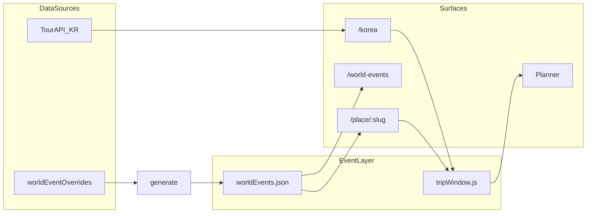
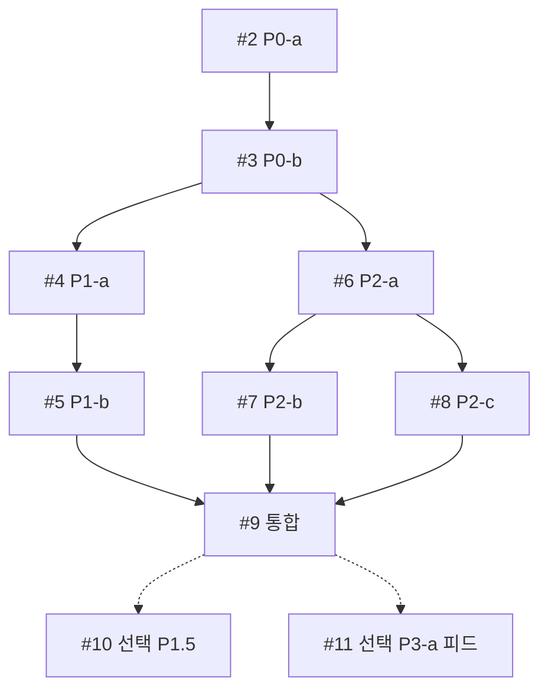
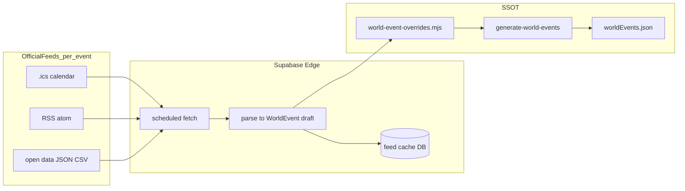

# 세계 축제·행사 기반 여행 일정 — 마스터 플랜

**세션 표기**: `세계행사 일정 #2, P0-a — 스키마·generate·audit`  
**브랜치**: `cursor/world-events-efa3`  
**상태**: 🚀 **구현 착수** — Q&A 확정 · 세션 #2부터 코드  
**관련**: [`korea-festival-hub-plan.md`](./korea-festival-hub-plan.md) · [`travel-spots-management.md`](./travel-spots-management.md) · [`world-events-qa-index.md`](./world-events-qa-index.md)

| Phase | 내용 | 상태 |
|-------|------|------|
| **P0** | 공통 Event 스키마 · generate/audit · `tripWindow` | ✅ P0-b 완료 · P1 대기 |
| **P1** | 국내 `/korea` ↔ 숙소·플래너·항공 날짜 브리지 | 세션 #4–#5 |
| **P2** | 해외 SSOT · PlaceCard · `/world-events` | 세션 #6–#8 |
| **P3** | **공식 피드(ICS/RSS) POC** · 통합 `/events` · 기타 API | 세션 #9 이후 · **§5.1** |

---

## 0. 목표 (한 줄)

**축제·공연·시즌 행사 일정에 맞춰 숙소·항공·플래너 날짜를 조율**할 수 있는 데이터·UX 토대를 만든다.

- 국내: 기존 TourAPI `/korea` **확장** (데이터 80% 있음)
- 해외: `travelSpots` slug에 **큐레이션 Event** 연결 (비엔나 오페라·아이슬란드 백야 등)
- 공통: `TripWindow`로 `YYYYMMDD` ↔ `YYYY-MM-DD` 브리지

---

## 1. 현재 갭

| 영역 | 있음 | 없음 |
|------|------|------|
| **국내** | [`/korea`](../src/pages/Korea/index.jsx) — TourAPI 축제·달력·지도·상세·MRT 링크 | 축제 날짜 → 숙소/항공 기본일, 플래너 딥링크 |
| **해외** | [`travelSpots.js`](../src/pages/Home/data/travelSpots.js) slug·공항·숙소 제휴 | 행사 일정 SSOT |
| **날짜** | 축제 `YYYYMMDD` / 숙소·항공 `YYYY-MM-DD` | 공통 모델·정규화·쿼리 전달 |



---

## 2. Phase 0 — 공통 Event 레이어 (토대)

### 2.1 `WorldEvent` 스키마 (초안 · Q&A로 확정)

| 필드 | 설명 | 확정 |
|------|------|------|
| `id` | 안정 ID (`vienna-staatsoper-2026-winter`) | 초안 |
| `slug` | `travelSpots` slug 또는 국내 hub | 초안 |
| `hubId` | 국내 `cityAttractionHubs` id (선택) | 초안 |
| `type` | `festival` \| `opera` \| `concert` \| `season` \| `heritage` | **Q1** |
| `title` / `titleEn` | 표시명 | 초안 |
| `startDate` / `endDate` | `YYYY-MM-DD` | 초안 |
| `recurrence` | `annual` \| `fixed` \| `tbd` + `recurrenceNote` | **Q2** |
| `venue` | 장소명·좌표(선택) | 초안 |
| `source` | `tourapi` \| `curated` \| `official_url` | 초안 |
| `sourceUrl` | 공식 일정·티켓 | 초안 |
| `bookingHints` | 숙소 키워드·항공 시즌 메모 | 초안 |
| `priority` | 노출 순위 | 초안 |

### 2.2 SSOT 파일 (공항·페리와 동일 패턴)

```
scripts/data/world-event-overrides.mjs   # 수동 입력
scripts/generate-world-events.mjs
src/pages/Home/data/worldEvents.json     # 직접 편집 금지
scripts/audit-world-events.mjs
src/shared/tripWindow.js                 # 날짜 브리지
```

- `package.json`: `generate:world-events`, `audit:world-events`
- 국내 TourAPI: **런타임 어댑터**로 `WorldEvent` 변환 (JSON 중복 최소)

### 2.3 `TripWindow` (날짜 브리지)

```js
tripWindowFromEvent({ startDate, endDate }, { bufferDays: 1, minNights: 2 })
// → { checkIn, checkOut, source: 'event', eventId }
```

소비처: `FestivalDetailSheet` · PlaceCard 플래너 · MRT/Trip.com 위젯 쿼리

---

## 3. Phase 1 — 국내 MVP

| 작업 | 파일 |
|------|------|
| 상세시트 CTA — 축제 날짜로 숙소·투어 | [`FestivalDetailSheet.jsx`](../src/pages/Korea/FestivalDetailSheet.jsx) |
| 플래너 딥링크 | `/place/{hubSlug}/planner?checkIn=&checkOut=&fromEvent=` |
| 달력 → 기간 일정 | [`FestivalCalendar.jsx`](../src/pages/Korea/FestivalCalendar.jsx) |
| 즐겨찾기 다건 합집합 날짜 | [`festivalPersonalStore.js`](../src/pages/Korea/festivalPersonalStore.js) — **Q9** 확정 후 |
| 항공 위젯 날짜 전달 | 기존 항공 검색 위젯 쿼리 (**Q8 B**) |

검증: `smoke:korea-festival-*` + `smoke:trip-window-from-festival` (신규)

---

## 4. Phase 2 — 해외 큐레이션 파일럿

TourAPI 해외 미지원 → **핵심 행사만 수동 SSOT** (Q2 **C** 하이브리드).

### 4.1 지역별 MVP slug (Q3 제안 — 승인 대기)

상세·합의: [`world-events-qa-index.md`](./world-events-qa-index.md) Q3 표.

| 지역 칩 | slug (Wave 1) | 대표 행사 |
|---------|---------------|-----------|
| 유럽 | `vienna`, `munich`, `edinburgh`, `amsterdam` | 오페라 시즌 · 옥토버페스트 · 프린지 · 킹스데이 |
| 아시아·태평양 | `tokyo`, `kyoto`, `bangkok`, `bali` | 벚꽃 · 기온마츠리 · 송크란 · 갈룽안 시즌 |
| 아메리카 | `rio-de-janeiro`, `new-york` | 카니발 · 시즌 행사 |
| 오세아니아·자연 | `iceland`, `sydney` | 백야 · 비비드 시드니 |
| 소규모·니치 | `prague`, `marrakech`, `hanoi` | 도시·문화 시즌 축제 |

- Wave 1: slug **12** · SSOT **12~15건** · i18n **한국어 우선** (Q10)
- Q6 **A+C**: `type: season` 기간 + `sourceUrl` (개별 공연 수동 N건은 안 함)

### 4.2 UI (Q7 **B + 해외 페이지**)

| 표면 | 역할 |
|------|------|
| **PlaceCard** | 접이식 「이 도시의 행사」+ TripWindow CTA |
| **`/world-events`** | 지역 칩 · 행사 카드 그리드 · PlaceCard·플래너 링크 (`/korea`와 대칭, 가칭) |
| **`/korea`** | 국내 TourAPI만 (해외 탭 없음) |

라우트·P2 동시: Q13 **확정** (`/world-events`).

---

## 10. 세션 로드맵 (1세션 = 1 Cloud 채팅 · 1커밋·push)

**규칙**: 한 세션 = **한 표 행**만. 범위 넘기지 않음. 턴 종료 시 VERIFY PASS → 커밋·push → 일지 2~5줄.

| # | 세션 표기 (채팅명 1행) | 작업 | 주요 산출물 | VERIFY · 사람 QA |
|---|------------------------|------|-------------|------------------|
| **1** | `세계행사 일정 #1, Q&A` | 범위·파일럿·Q&A | 플랜·qa-index | ✅ 완료 |
| **2** | `세계행사 일정 #2, P0-a — 스키마·generate·audit` | WorldEvent SSOT 골격 | `world-event-overrides.mjs` 스켈레톤 · `generate-world-events.mjs` · `audit-world-events.mjs` · `worldEvents.json` · npm scripts | `audit:world-events` PASS · `build` |
| **3** | `세계행사 일정 #3, P0-b — tripWindow` | 날짜 브리지 | `src/shared/tripWindow.js` · TourAPI→WorldEvent 어댑터 초안 · `smoke:trip-window-from-festival` | smoke PASS · `build` |
| **4** | `세계행사 일정 #4, P1-a — 축제→숙소` | 국내 단일 축제 CTA | `FestivalDetailSheet` MRT/Trip 숙소 URL에 `checkIn`/`checkOut` | `smoke:korea-festival-*` 확장 · `build` |
| **5** | `세계행사 일정 #5, P1-b — 플래너·항공` | 딥링크·항공 날짜 | 플래너 `?checkIn&checkOut&fromEvent` · 항공 위젯 날짜 전달 (Q8 B) | smoke · `build` · QA: `/korea` 축제 1건 |
| **6** | `세계행사 일정 #6, P2-a — SSOT Wave1` | 해외 12건 overrides | `world-event-overrides.mjs` 유럽·아시아·아메리카·오세아니아·니치 | `generate:world-events` · `audit:world-events` PASS |
| **7** | `세계행사 일정 #7, P2-b — PlaceCard 행사` | 도시 카드 섹션 | PlaceCard 「이 도시의 행사」접이식 + TripWindow CTA | `build` · QA: `/place/vienna` |
| **8** | `세계행사 일정 #8, P2-c — /world-events 허브` | 해외 허브 페이지 | 라우트 `/world-events` · 지역 칩 5 · 카드 그리드 · `/qa/world-events` | `build` · Preview · QA: `/world-events` |
| **9** | `세계행사 일정 #9, 통합 smoke·핸드오프` | 마감 검증 | smoke 묶음 · 운영 가이드 보강 · 작업 로그 | ✅ `smoke:world-events` · `build` PASS · 사람 QA |
| **10** | _(선택)_ `… #10, P1.5 — 즐겨찾기 다건` | Q9 B 후속 | `festivalPersonalStore` 합집합 TripWindow CTA | smoke · QA |
| **11** | _(선택·P3)_ `… #11, P3-a — 공식 피드 POC` | ICS/RSS 1~2건 Edge fetch | §5.1 — **착수 시 세부 논의** | smoke · audit |

### 세션 의존 관계



### 세션별 금지·주의

| # | 하지 말 것 |
|---|------------|
| 2–3 | PlaceCard·`/korea` UI 손대기 |
| 4–5 | 해외 overrides 대량 입력 |
| 6 | UI 라우트 추가 (데이터만) |
| 7–8 | `worldEvents.json` 직편집 · UI 리디자인 |
| 9 | 범위 확장(Wave2·EN·`/events` 통합) |
| 11 | P3 착수 전 §5.1 미확정 항목 임의 구현 |

### 사람 QA (Q12)

| 시점 | 경로 | 확인 |
|------|------|------|
| #5 후 | `/korea` → 축제 상세 | 숙소·플래너·항공 링크에 행사 맞춤 날짜 |
| #7 후 | `/place/vienna` | 「이 도시의 행사」+ CTA |
| #8 후 | `/world-events` | 지역 칩 · 카드 → PlaceCard·플래너 |
| #9 | `www.gateo.kr/qa/world-events` | Preview git URL 동일 브랜치 |

---

## 5. Phase 3 — 선택 (세션 #9 이후)

**우선순위 (합의 2026-08-25)**: 해외 데이터 **반자동 보강**으로 **공식 ICS/RSS/open data** POC를 P3 **1순위 후보**로 포함. 상세 스펙·피드 URL·merge 정책은 **P3 착수 세션에서 논의** (지금은 방향만 잠금).

| 순위 | 항목 | 비고 |
|------|------|------|
| **P3-a** | **공식 피드 POC** — ICS · RSS · open data (축제별) | §5.1 · 현실적 자동화 대안 |
| P3-b | Ticketmaster 등 상용 Events API POC | 비용·약관·커버리지 검토 후 |
| P3-c | `/events` 글로벌 통합 허브 (국내+해외 한 화면) | Q4에서 P2 이후로 연기 |
| 기타 | [`korea-festival-hub-plan.md`](./korea-festival-hub-plan.md) D·E · 영문(Q10) · Wave2 · Q9 P1.5(#10) | 필요 시 병행 |

### 5.1 공식 피드 POC (P3-a) — 방향만 · 구현 시 세부 논의

**왜 포함하는가**: TourAPI급 해외 단일 API는 없음. 대형 축제·공연장은 **공식 `.ics` / RSS / JSON** 을 제공하는 경우가 많아, 수동 overrides보다 **갱신 부담을 줄이는 현실적 절충**이 될 수 있음 (Q2 **C** 하이브리드의 자동화 축).

**개략 아키텍처** (확정 아님 — P3 세션에서 조정):



| 확정 (방향) | 구현 시 논의 (미정) |
|-------------|---------------------|
| 피드 종류 우선순위: **ICS → RSS → open data** | 축제별 실제 URL·라이선스 |
| **1~2건 POC**로 시작 (Wave1 중 피드 있는 후보) | 후보: `munich` · `edinburgh` · `sydney` 등 |
| 출력은 기존 **`WorldEvent`** · `generate` · `audit` 파이프 유지 | Edge cron 주기 · stale 정책 |
| 수동 overrides와 **병행** (피드=초안, 사람 검수 가능) | 자동 merge vs 검수 큐 vs overrides만 반영 |
| P2 Wave1 **수동 SSOT는 그대로** 선행 (#6) | 피드 성공 시 overrides 갱신 주기 축소 여부 |

**P3-a 성공 기준 (초안)**: 공식 피드 **1종 이상** fetch → `WorldEvent` 변환 → `audit:world-events` PASS → Preview에서 해당 행사 날짜·CTA 확인.

**금지 (P3 착수 전)**: P0–P2 범위에서 Edge 피드·크론 선구현 · 스크래핑 · `worldEvents.json` 직편집.

### 5.2 기타 P3

- Ticketmaster Discovery 등 상용 API — P3-b, 약관·지역 커버리지 확인 후
- [`korea-festival-hub-plan.md`](./korea-festival-hub-plan.md) Phase D·E(축제로드·시트 예약) 연동

---

## 6. 기술·운영 가드

| 항목 | 방침 |
|------|------|
| 브랜치 | 본 주제 = `cursor/world-events-efa3` 고정 · 세션마다 새 브랜치 금지 |
| UI | §4.1 — 기존 비주얼 유지, CTA·섹션만 |
| 검증 | `smoke:world-events` + `build` |
| 릴리스 노트 | 공개 시 1회만 제안 |
| 운영 | [`world-events-management.md`](./world-events-management.md) |

---

## 7. 열린 질문 (Q&A로 확정)

**답변은 [`world-events-qa-index.md`](./world-events-qa-index.md)에 누적.** 플랜 본문은 합의 후 갱신.

| ID | 질문 | 선택지 | 상태 |
|----|------|--------|------|
| **Q1** | 1차 범위 우선순위? | A / B / **C** | ✅ C |
| **Q2** | 해외 데이터 전략? | A / B / **C** | ✅ C |
| **Q3** | 파일럿 slug·지역 MVP? | 12 slug Wave 1 | ✅ |
| **Q4** | `/events` 글로벌 허브? | A / **B** / C | ✅ B |
| **Q5** | `TripWindow` 기본 버퍼? | 버퍼 1/1 · 2박 | ✅ 기본값 |
| **Q6** | 오페라·시즌 행사? | **A+C** / B | ✅ A+C |
| **Q7** | 국내·해외 UI? | **B + `/world-events`** | ✅ |
| **Q8** | P1 항공? | A / **B** / C | ✅ B |
| **Q9** | 즐겨찾기 다건 TripWindow? | A / **B** / C | ✅ B (P1.5) |
| **Q10** | 영문 UI? | **KO MVP 후** | ✅ |
| **Q11** | Preview `/qa/…`? | `/qa/world-events` @ #8 | ✅ |
| **Q12** | 1차 사람 QA? | `/korea` + `/place/vienna` + `/world-events` | ✅ |
| **Q13** | 해외 페이지? | **`/world-events` · P2** | ✅ |
| **Q14** | P3 해외 자동 보강 | **공식 ICS/RSS/open data POC 포함** (§5.1) · 상세는 P3 착수 시 | ✅ |

### Q&A

**전 항목 확정** — 상세 [`world-events-qa-index.md`](./world-events-qa-index.md). 구현은 §10 세션 로드맵 순서.

---

## 8. 성공 기준

| Phase | 완료 조건 |
|-------|-----------|
| **P0** | generate/audit PASS · `tripWindow` 단위 검증 |
| **P1** | `/korea` 축제 상세 → MRT URL에 맞춤 날짜 · 플래너 딥링크 |
| **P2** | 12 slug · PlaceCard + `/world-events` 지역 허브 + TripWindow CTA |
| **P3** | **P3-a** 공식 피드 1종+ → `WorldEvent` · audit PASS · Preview QA (§5.1) |

---

## 9. 핸드오프

**인덱스**: [`feature-handoff-index.md`](./feature-handoff-index.md)

**다음 제시어** (사람 Preview QA · PR #150 병합):

```
세계행사 일정 #9, 사람 Preview QA
@plans/feature-handoff-index.md
@plans/world-events-management.md §6.1
브랜치 cursor/world-events-efa3 · PR #150
www.gateo.kr/qa/world-events · /korea · /place/vienna
```

**읽을 것**: [`world-events-management.md`](./world-events-management.md) **§6.1 QA 체크리스트**

**VERIFY**: `smoke:world-events` · `build` PASS · 사람 QA `/world-events` · `/place/vienna` · `/korea`
