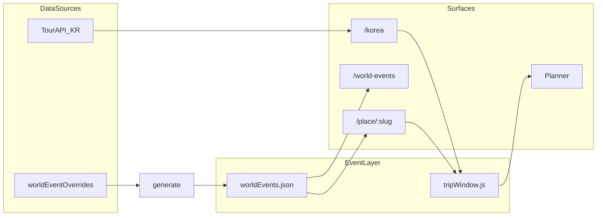

# 세계 축제·행사 기반 여행 일정 — 마스터 플랜

**세션 표기**: `세계행사 일정 #1, Q&A — 범위·파일럿 확정`  
**브랜치**: `cursor/world-events-efa3`  
**상태**: 📋 **Q&A 1차 반영** — Q3·Q9·Q13 확정 후 P0 착수  
**관련**: [`korea-festival-hub-plan.md`](./korea-festival-hub-plan.md) · [`travel-spots-management.md`](./travel-spots-management.md) · [`world-events-qa-index.md`](./world-events-qa-index.md)

| Phase | 내용 | 상태 |
|-------|------|------|
| **P0** | 공통 Event 스키마 · generate/audit · `tripWindow` | ⏳ Q&A 후 착수 |
| **P1** | 국내 `/korea` ↔ 숙소·플래너 날짜 브리지 | 대기 |
| **P2** | 해외 큐레이션 · PlaceCard · **`/world-events` 지역 허브** | Q3 승인 후 |
| **P3** | 글로벌 통합 `/events` · 외부 피드 POC | 선택 |

---

## 0. 목표 (한 줄)

**축제·공연·시즌 행사 일정에 맞춰 숙소·항공·플래너 날짜를 조율**할 수 있는 데이터·UX 토대를 만든다.

- 국내: 기존 TourAPI `/korea` **확장** (데이터 80% 있음)
- 해외: `travelSpots` slug에 **큐레이션 Event** 연결 (비엔나 오페라·아이슬란드 백야 등)
- 공통: `TripWindow`로 `YYYYMMDD` ↔ `YYYY-MM-DD` 브리지

---

## 1. 현재 갭

| 영역 | 있음 | 없음 |
|------|------|------|
| **국내** | [`/korea`](../src/pages/Korea/index.jsx) — TourAPI 축제·달력·지도·상세·MRT 링크 | 축제 날짜 → 숙소/항공 기본일, 플래너 딥링크 |
| **해외** | [`travelSpots.js`](../src/pages/Home/data/travelSpots.js) slug·공항·숙소 제휴 | 행사 일정 SSOT |
| **날짜** | 축제 `YYYYMMDD` / 숙소·항공 `YYYY-MM-DD` | 공통 모델·정규화·쿼리 전달 |



---

## 2. Phase 0 — 공통 Event 레이어 (토대)

### 2.1 `WorldEvent` 스키마 (초안 · Q&A로 확정)

| 필드 | 설명 | 확정 |
|------|------|------|
| `id` | 안정 ID (`vienna-staatsoper-2026-winter`) | 초안 |
| `slug` | `travelSpots` slug 또는 국내 hub | 초안 |
| `hubId` | 국내 `cityAttractionHubs` id (선택) | 초안 |
| `type` | `festival` \| `opera` \| `concert` \| `season` \| `heritage` | **Q1** |
| `title` / `titleEn` | 표시명 | 초안 |
| `startDate` / `endDate` | `YYYY-MM-DD` | 초안 |
| `recurrence` | `annual` \| `fixed` \| `tbd` + `recurrenceNote` | **Q2** |
| `venue` | 장소명·좌표(선택) | 초안 |
| `source` | `tourapi` \| `curated` \| `official_url` | 초안 |
| `sourceUrl` | 공식 일정·티켓 | 초안 |
| `bookingHints` | 숙소 키워드·항공 시즌 메모 | 초안 |
| `priority` | 노출 순위 | 초안 |

### 2.2 SSOT 파일 (공항·페리와 동일 패턴)

```
scripts/data/world-event-overrides.mjs   # 수동 입력
scripts/generate-world-events.mjs
src/pages/Home/data/worldEvents.json     # 직접 편집 금지
scripts/audit-world-events.mjs
src/shared/tripWindow.js                 # 날짜 브리지
```

- `package.json`: `generate:world-events`, `audit:world-events`
- 국내 TourAPI: **런타임 어댑터**로 `WorldEvent` 변환 (JSON 중복 최소)

### 2.3 `TripWindow` (날짜 브리지)

```js
tripWindowFromEvent({ startDate, endDate }, { bufferDays: 1, minNights: 2 })
// → { checkIn, checkOut, source: 'event', eventId }
```

소비처: `FestivalDetailSheet` · PlaceCard 플래너 · MRT/Trip.com 위젯 쿼리

---

## 3. Phase 1 — 국내 MVP

| 작업 | 파일 |
|------|------|
| 상세시트 CTA — 축제 날짜로 숙소·투어 | [`FestivalDetailSheet.jsx`](../src/pages/Korea/FestivalDetailSheet.jsx) |
| 플래너 딥링크 | `/place/{hubSlug}/planner?checkIn=&checkOut=&fromEvent=` |
| 달력 → 기간 일정 | [`FestivalCalendar.jsx`](../src/pages/Korea/FestivalCalendar.jsx) |
| 즐겨찾기 다건 합집합 날짜 | [`festivalPersonalStore.js`](../src/pages/Korea/festivalPersonalStore.js) — **Q9** 확정 후 |
| 항공 위젯 날짜 전달 | 기존 항공 검색 위젯 쿼리 (**Q8 B**) |

검증: `smoke:korea-festival-*` + `smoke:trip-window-from-festival` (신규)

---

## 4. Phase 2 — 해외 큐레이션 파일럿

TourAPI 해외 미지원 → **핵심 행사만 수동 SSOT** (Q2 **C** 하이브리드).

### 4.1 지역별 MVP slug (Q3 제안 — 승인 대기)

상세·합의: [`world-events-qa-index.md`](./world-events-qa-index.md) Q3 표.

| 지역 칩 | slug (Wave 1) | 대표 행사 |
|---------|---------------|-----------|
| 유럽 | `vienna`, `munich`, `edinburgh`, `amsterdam` | 오페라 시즌 · 옥토버페스트 · 프린지 · 킹스데이 |
| 아시아·태평양 | `tokyo`, `kyoto`, `bangkok`, `bali` | 벚꽃 · 기온마츠리 · 송크란 · 갈룽안 시즌 |
| 아메리카 | `rio-de-janeiro`, `new-york` | 카니발 · 시즌 행사 |
| 오세아니아·자연 | `iceland`, `sydney` | 백야 · 비비드 시드니 |
| 소규모·니치 | `prague`, `marrakech`, `hanoi` | 도시·문화 시즌 축제 |

- Wave 1: slug **12** · SSOT **12~15건** · i18n **한국어 우선** (Q10)
- Q6 **A+C**: `type: season` 기간 + `sourceUrl` (개별 공연 수동 N건은 안 함)

### 4.2 UI (Q7 **B + 해외 페이지**)

| 표면 | 역할 |
|------|------|
| **PlaceCard** | 접이식 「이 도시의 행사」+ TripWindow CTA |
| **`/world-events`** | 지역 칩 · 행사 카드 그리드 · PlaceCard·플래너 링크 (`/korea`와 대칭, 가칭) |
| **`/korea`** | 국내 TourAPI만 (해외 탭 없음) |

라우트명·P2 동시 착수: Q&A **Q13**.

---

## 5. Phase 3 — 선택

- `/events` 글로벌 허브 (**Q4**)
- 공식 ICS/RSS · Ticketmaster 등 Edge 피드 POC
- [`korea-festival-hub-plan.md`](./korea-festival-hub-plan.md) Phase D·E(축제로드·시트 예약) 연동

---

## 6. 기술·운영 가드

| 항목 | 방침 |
|------|------|
| 브랜치 | 본 주제 = `cursor/world-events-efa3` 고정 · 세션마다 새 브랜치 금지 |
| UI | §4.1 — 기존 비주얼 유지, CTA·섹션만 |
| 검증 | `audit:world-events` + `build` + domain smoke |
| 릴리스 노트 | 공개 시 1회만 제안 |
| 운영 | [`world-events-management.md`](./world-events-management.md) |

---

## 7. 열린 질문 (Q&A로 확정)

**답변은 [`world-events-qa-index.md`](./world-events-qa-index.md)에 누적.** 플랜 본문은 합의 후 갱신.

| ID | 질문 | 선택지 | 상태 |
|----|------|--------|------|
| **Q1** | 1차 범위 우선순위? | A / B / **C** | ✅ C |
| **Q2** | 해외 데이터 전략? | A / B / **C** | ✅ C |
| **Q3** | 파일럿 slug·지역 MVP? | §4.1 제안 12 slug | ⏳ 승인 대기 |
| **Q4** | `/events` 글로벌 허브? | A / **B** / C | ✅ B |
| **Q5** | `TripWindow` 기본 버퍼? | 버퍼 1/1 · 2박 | ✅ 기본값 |
| **Q6** | 오페라·시즌 행사? | **A+C** / B | ✅ A+C |
| **Q7** | 국내·해외 UI? | **B + `/world-events`** | ✅ (Q13 라우트) |
| **Q8** | P1 항공? | A / **B** / C | ✅ B |
| **Q9** | 즐겨찾기 다건 TripWindow? | A / B / C | ⏳ |
| **Q10** | 영문 UI? | **KO MVP 후** | ✅ |
| **Q13** | 해외 페이지 라우트·시기? | `/world-events` · P2 | ⏳ |

### Q&A 진행 방법

1. 채팅에서 **Q번호 + 답** (예: `Q1: C`, `Q3: vienna, iceland, munich`)
2. 에이전트가 `world-events-qa-index.md` 갱신 + 본 플랜 §7·해당 Phase 반영
3. **모든 Q1–Q4 확정** 후 Phase 0 코드 착수
4. 세션 종료 시 일지 2~5줄 + `feature-handoff-index` 갱신

---

## 8. 성공 기준

| Phase | 완료 조건 |
|-------|-----------|
| **P0** | generate/audit PASS · `tripWindow` 단위 검증 |
| **P1** | `/korea` 축제 상세 → MRT URL에 맞춤 날짜 · 플래너 딥링크 |
| **P2** | 12 slug · PlaceCard + `/world-events` 지역 허브 + TripWindow CTA |
| **P3** | (선택) 통합 `/events` 또는 피드 1종 POC |

---

## 9. 핸드오프

**인덱스**: [`feature-handoff-index.md`](./feature-handoff-index.md)

**다음 제시어** (Q&A 이어하기):

```
세계행사 일정 #2, Q&A — Q3·Q9 확정
@plans/feature-handoff-index.md
@plans/world-events-plan.md
@plans/world-events-qa-index.md
브랜치 cursor/world-events-efa3 · PR #150
Q3 Wave1 승인/수정 · Q9 A/B/C · Q13 /world-events OK?
금지: UI 리디자인 · spots JSON 직편집 · Q3 확정 전 P0 착수
```

**읽을 것 (이어하기)**:

1. [`world-events-qa-index.md`](./world-events-qa-index.md) 확정·열린 표
2. Q3 §4.1 · Q9 설명 · Q13만 대화
3. Q3+Q9 확정 후 Phase 0 착수 합의

**VERIFY (코드 착수 후)**: `audit:world-events` · `build`
